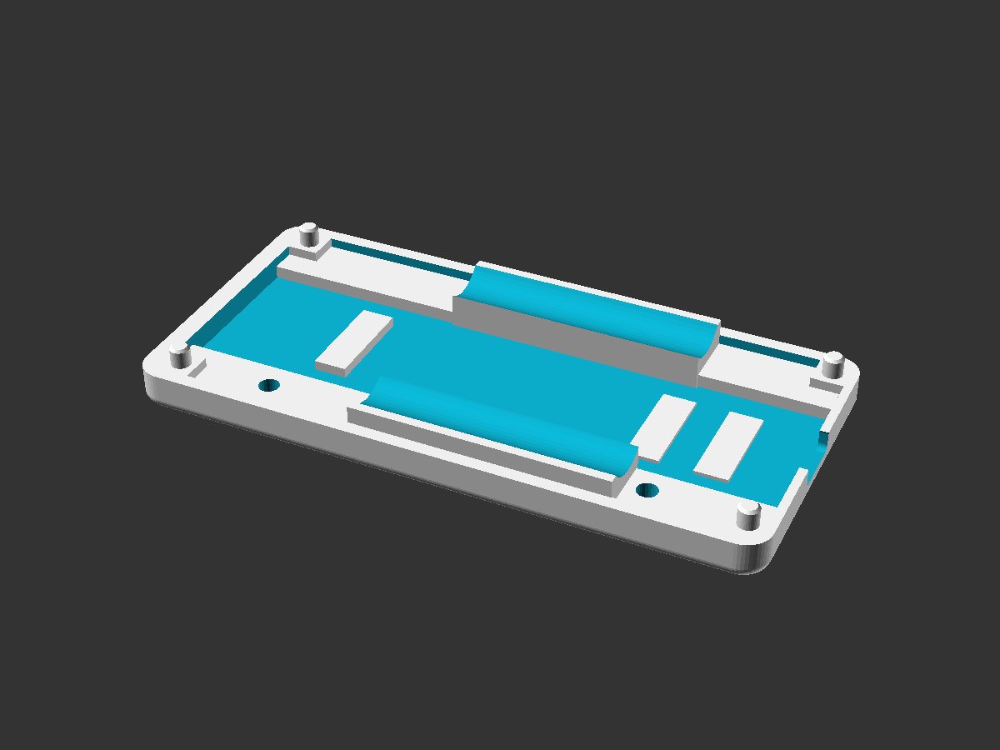
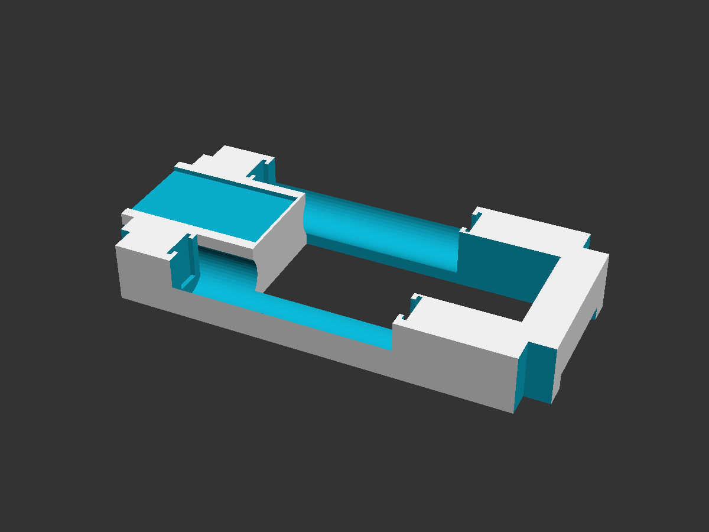
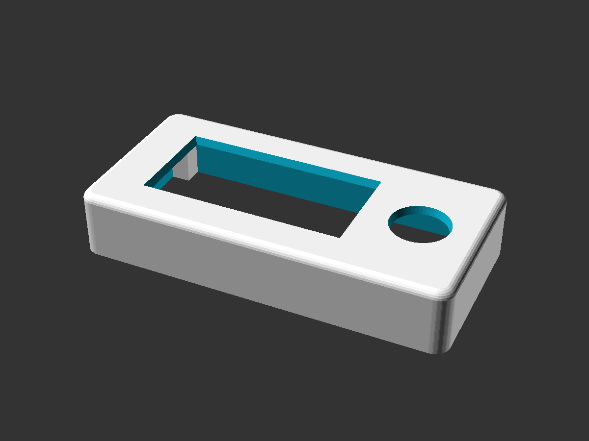
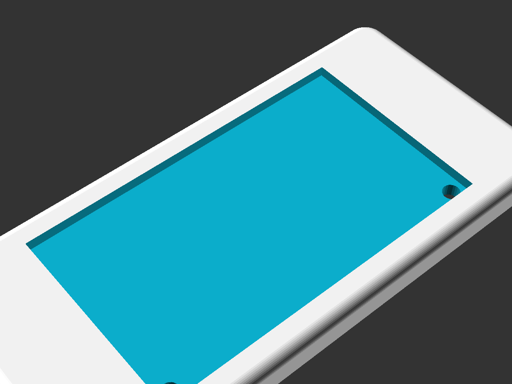
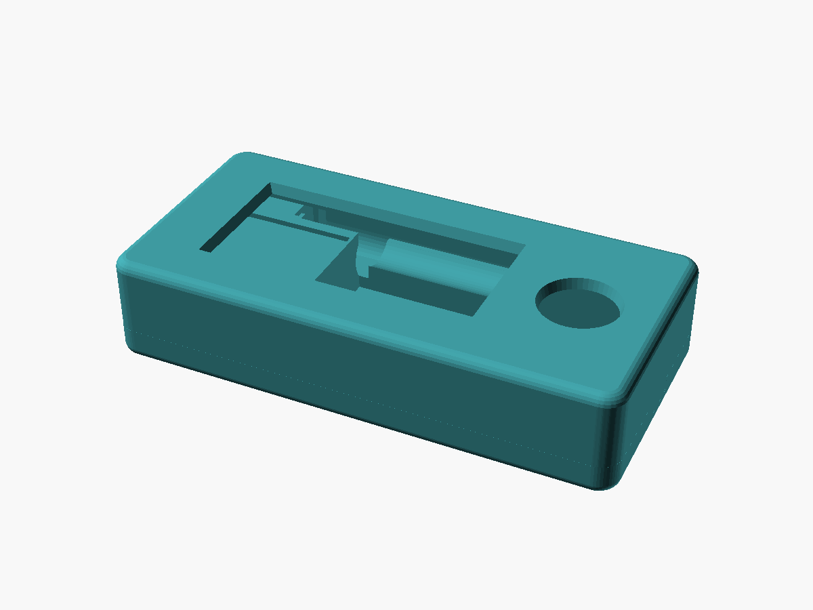
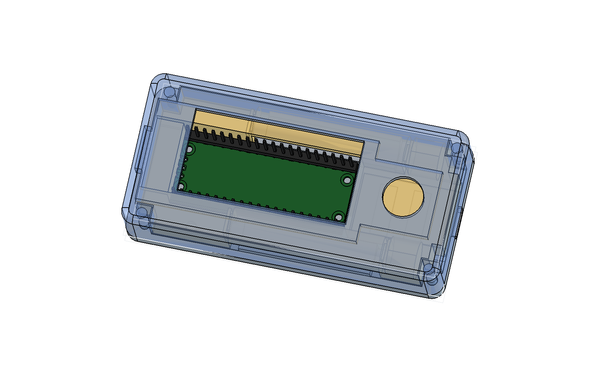
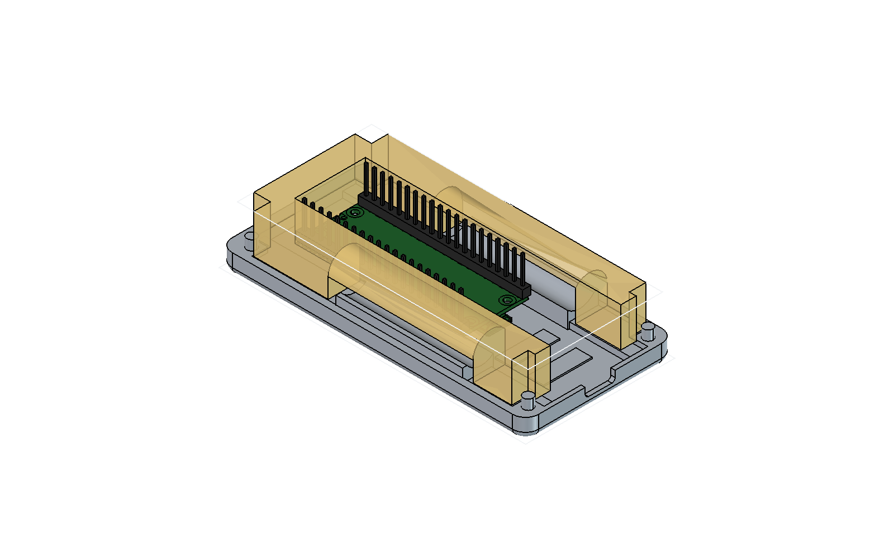
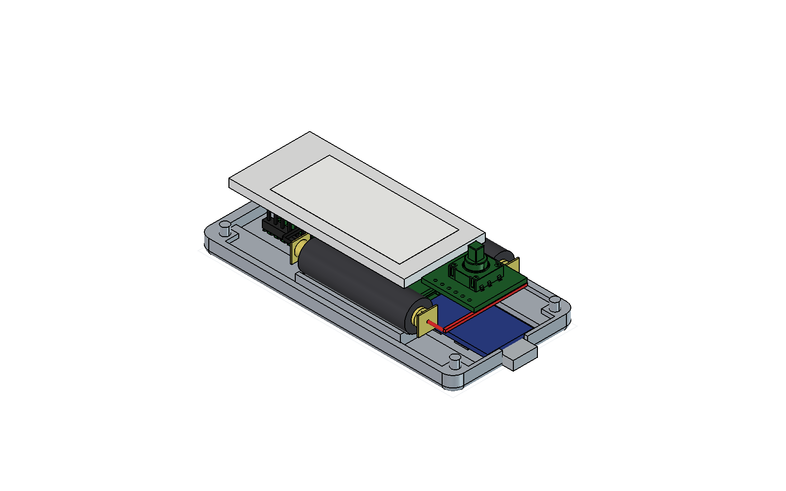
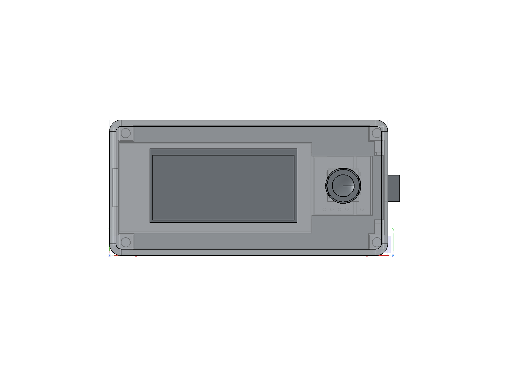
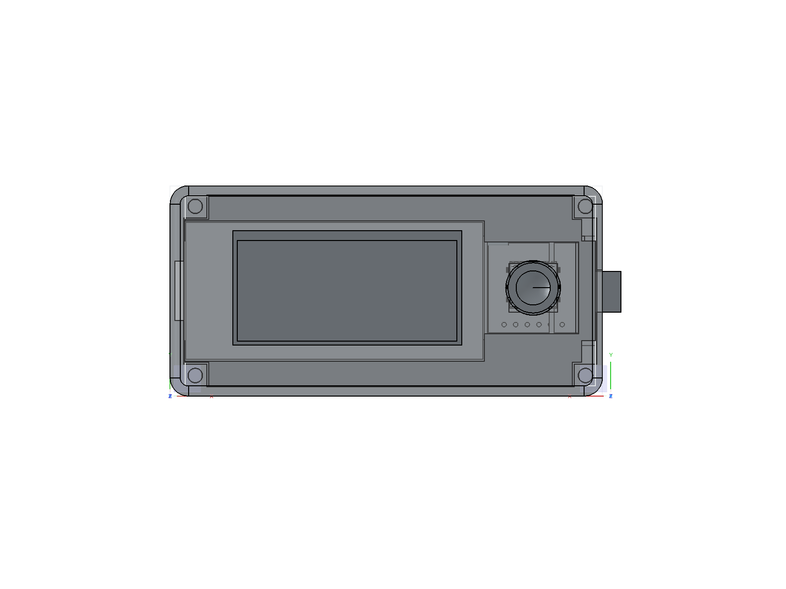

# Dilder

A Tamagotchi-inspired virtual pet built on a Raspberry Pi Pico W with an e-ink display, battery pack, and 3D-printed case — developed entirely in the open as a learning platform, blog series, and YouTube companion project.

The goal isn't just to build a thing — it's to show *how* the thing gets built, from the very first idea to a finished handheld device. Every prompt, every design decision, every dead end is documented so anyone can follow along, learn, and build their own.

---

## How It Started — Meet Jamal

  
   
  <em>Jamal. The plush octopus who started it all.</em>

This project didn't start with a schematic or a product spec. It started in a TEDi — a German dollar store — where my wife Emma and I found a giant plush octopus grinning up from a discount bin. We bought him on the spot, and on the walk home we started giving him a personality: laid-back, opinionated, a little sassy, suspiciously wise for a boneless creature. By the time we got home, he had a name — **Jamal** — and he'd claimed the armchair like he'd been paying rent.

The question asked itself: *what if we could actually bring him to life?* Not literally — but as a tiny digital companion. A pocket-sized octopus with moods, opinions, and an attitude problem, living on an e-ink screen and judging your life choices in ALL CAPS.

That's how Dilder was born. Not from an engineering roadmap, but from a stuffed animal and two people who couldn't stop anthropomorphizing it on a walk home.

---

## Enclosure — Rev 2 Mk2

The 3D-printed enclosure is a three-part design: base plate with solar panel recess, AAA battery cradle insert, and top cover with display window and joystick cutout. Designed in OpenSCAD (parametric source) and FreeCAD (visual PartDesign).

### Individual Parts

  
  

  <em>Left: Base plate with cradle pocket, corner pillars, battery rail troughs, and USB-C cutout. Right: AAA battery cradle with dual bays, clip slots, and TP4056 indent.</em>

  
  

  <em>Left: Top cover with display window, joystick hole, and bullnose edge. Right: Base plate bottom showing solar panel recess and wire holes.</em>

### Assembled

  
   
  <em>All three parts stacked in their mated positions.</em>

### Full Assembly with Electronics

The FreeCAD macro now imports the official Raspberry Pi Pico 2 STEP file (mechanically identical to the Pico 2 W) and adds procedural 2×20 pin headers. It also builds three more peripherals from datasheet dimensions — two AAA Li-Ion cells in the cradle bays, a TP4056 USB-C charge module in the connecting block indent, and a Waveshare 2.13" e-paper display in the top cover's screen inlay. The Pico is mounted upside-down with its component-side face flush against the cradle's mating plane, headers extending up into the PicoNest cavity.

  
   
  <em>Top cover rendered translucent so the Pico 2 W board, headers, and cradle are all visible.</em>

  
  

  <em>Left: top cover hidden so the cradle and Pico are exposed. Right: cradle hidden so the Pico's seating on the base plate is visible — header pin tips reach the level where the cradle would clip in.</em>

See the [FreeCAD macro reference](website/docs/docs/hardware/freecad-mk2-macro.md) for a full walkthrough of how the macro is structured.

### Joystick Thumbpiece

A printable snap cap that fits over the K1-1506SN-01 5-way switch peg. Single disc, 11 mm OD (= cover hole − 1 mm) so it nests inside the cover's joystick cutout with 0.5 mm radial clearance for directional swing. Concave thumb dish on top, rectangular snap socket on the bottom centered on the actuator (the SW1 stick is offset +0.68 mm in Y from the cover hole on the production PCB layout — disc reads visually centered, socket lands on the peg). Built parametrically in `dilder_rev2_mk2.FCMacro` as a separate `Thumbpiece` Body — drop `thumb_sock_x/y` from 3.3 to ~3.15 in the spreadsheet to convert friction-fit to interference snap-fit.

  
   
  <em>Top-down view of the assembled prototype — display window on the left, joystick with the new thumbpiece on the right.</em>

  
  

  <em>Left: joystick area in context. Right: thumbpiece nested in the cover cutout with the cover dialed to 85% transparency for clarity.</em>

See the [thumbpiece design write-up](website/docs/blog/posts/joystick-thumbpiece-snap-cap.md) for the geometry walkthrough — including the dish-vs-socket constraint that almost ruined the first cut.

---

## What This Project Is

- **A virtual pet device** — a pocket-sized, low-power companion with personality, needs, and interactions displayed on an e-ink screen
- **A build series** — a step-by-step guide covering hardware, software, 3D printing, and project planning
- **A transparency experiment** — the entire development process is captured in real time, including AI-assisted prompts, iteration, and mistakes

---

## Hardware

### Phase 1 — Pico W Prototype (current)

| Component | Details |
|-----------|---------|
| Board | Raspberry Pi Pico W (or Pico WH with pre-soldered headers) |
| Display | [Waveshare Pico-ePaper-2.13](https://www.waveshare.com/pico-epaper-2.13.htm) — 250x122px, black & white, SPI1, SSD1680 driver, Pico-native 40-pin plug-in module |
| Power | USB micro-B (development); battery TBD |
| Input | 5x 6x6mm tactile push buttons (3 nav + 2 action) via GPIO |

### Future — Pi Zero Upgrade

| Component | Details |
|-----------|---------|
| Board | Raspberry Pi Zero WH (W or 2 W, pre-soldered headers) |
| Power | LiPo battery + Adafruit PowerBoost 500C |
| Enclosure | 3D-printed case (STL files provided) |

> The Pico W is the starting platform — it's what we have on hand, it's cheap, and it's excellent for prototyping the display and input system. The Pi Zero upgrade comes later when we need Linux, networking features, or more compute.

---

## Phases

Each phase maps to a section of the blog/YouTube series and can be followed independently.

### Phase 0 — Project Planning & Documentation ✓

- [x] Create repository and project structure
- [x] Define project intent and scope
- [x] Begin prompt progression log ([PromptProgression.md](PromptProgression.md))
- [x] Outline full phase roadmap
- [x] Create pixel art concepts for e-ink display (octopus character with 16 emotional states)
- [x] Define enclosure concept and prototype dimensions

### Phase 1 — Hardware Selection & Setup (Pico W) ✓

- [x] Finalize component list with links/part numbers ([hardware-research.md](docs/hardware-research.md))
- [x] Set up Docker-based C SDK cross-compilation toolchain
- [x] Wire e-ink display to Pico W via jumper wires (SPI)
- [x] Flash and run "Hello, Dilder!" on the e-ink display — proof of life
- [x] Build DevTool GUI — display emulator, serial monitor, firmware flash, asset manager, GPIO reference, connection utility, documentation ([tools/devtool/](tools/devtool/))
- [x] Add Programs tab with animated octopus preview, firmware size estimation, and deploy
- [x] Build IMG-receiver firmware — stream images from PC to Pico display via USB serial ([dev-setup/img-receiver/](dev-setup/img-receiver/))
- [x] Build standalone deploy — runtime-rendered animation, runs without PC
- [ ] Wire and test button inputs (GPIO)
- [ ] Battery power prototype

### Phase 2 — Firmware Foundation (C on Pico W)
> *You are here*

- [x] Runtime rendering engine — draw octopus mathematically (no pre-baked frames)
- [x] Animation system — 4-frame mouth cycle with per-mood expression sequences
- [x] Body transform system — dx/dy offset, x_expand, per-row sine wobble
- [x] Custom body shapes for Fat (wider dome, thick tentacles) and Lazy (tentacles draped right)
- [x] 16 emotional states with unique eyes, pupils, eyebrows, eyelids, mouths, and body animations
- [x] 17 standalone firmware programs (16 emotions + mood selector with all 823 quotes)
- [x] Date/time clock header from RTC
- [x] C-faithful preview renderer for verifying firmware matches DevTool
- [x] Keyboard-to-Pico input mapping plan ([docs/keyboard-to-pico-input.md](docs/keyboard-to-pico-input.md))
- [x] Implement serial command input for interactive mood control
- [x] Wire and test GPIO joystick input (DollaTek 5-way, GP2–GP6)
- [x] Joystick Mood Selector firmware with on-screen input indicator
- [ ] **Custom PCB design (in progress)** — switched MCU from RP2040 to ESP32-S3-WROOM-1-N16R8 (WiFi+BLE, 16MB flash, 8MB PSRAM). 4-layer board (45x80mm, 30 components) in KiCad, ready for routing. Target fab: JLCPCB. Sensors: LIS2DH12TR (accelerometer), AHT20 (temperature/humidity), BH1750FVI-TR (ambient light) on shared I2C bus.
- [ ] Battery power (LiPo on VSYS) — InnCraft 1000mAh acquired
- [ ] Build game loop with state machine (idle, interact, sleep)

### Phase 3 — Pet Logic & Gameplay

- [ ] Define pet stats (hunger, happiness, energy, health, etc.)
- [ ] Implement stat decay over time
- [ ] Build interaction system — feed, play, sleep, clean
- [x] Pet mood / expressions based on emotional states (16 implemented)
- [x] Animation frames for e-ink (idle expressions, body movement per mood)
- [ ] Emotional state transitions triggered by interactions and stats
- [ ] Add death/game-over state and reset/new-pet flow

### Phase 4 — UI & Menus

- [ ] Design menu system for e-ink (optimized for minimal refreshes)
- [ ] Build status bar — icons for stats, clock, battery level
- [ ] Add screen transitions between menu, pet view, and interactions
- [ ] Implement settings screen (contrast, name pet, reset)

### Phase 5 — Pi Zero Migration

- [ ] Port MicroPython firmware to CPython on Pi Zero
- [ ] Set up headless Raspberry Pi OS
- [ ] Adapt display driver for Pi Zero SPI + Waveshare HAT
- [ ] Adapt input handler for Pi Zero GPIO
- [ ] Validate all Phase 2-4 functionality on Pi Zero

### Phase 6 — 3D-Printed Case & Power
> *In progress alongside Phase 2*

- [x] Design enclosure in OpenSCAD — parametric 3-part design (base plate, AAA cradle, top cover)
- [x] Account for display cutout, joystick access, USB-C charging port, solar panel recess
- [x] Translate to FreeCAD PartDesign — full parametric model with 90+ parameter spreadsheet
- [x] Battery cradle with clip slots for Swpeet AAA contact plates (parallel wiring)
- [x] Solar panel wire through-holes in base plate
- [x] Print prototypes and iterate on fit (Rev 2 Mk2 current)
- [ ] Implement battery power (dual 10440 or single 3000mAh LiPo via TP4056)
- [ ] Implement sleep/wake cycle to conserve battery
- [x] Publish STL/3MF files and build instructions ([hardware-design/freecad-mk2/](hardware-design/freecad-mk2/))

### Phase 7 — Extras & Community

- [ ] Add sound (piezo buzzer for beeps/alerts)
- [ ] Explore connectivity — Bluetooth/Wi-Fi pet interactions?
- [ ] Mini-games
- [ ] Seasonal/event-based pet outfits or moods
- [ ] Publish a "build your own" kit guide
- [ ] Community gallery — show off your Dilder

---

## Content & Documentation

| Resource | Description |
|----------|-------------|
| [PromptProgression.md](PromptProgression.md) | Every AI prompt used in development (104+), timestamped with token counts and file changes |
| [docs/hardware-research.md](docs/hardware-research.md) | Component research, materials list, GPIO pinout, and enclosure concepts |
| [Emotion States](https://dilder.dev/docs/software/emotion-states/) | All 16 emotional states with rendered previews and animation strips |
| [docs/keyboard-to-pico-input.md](docs/keyboard-to-pico-input.md) | Input mapping plan for interactive octopus control |
| [Blog](https://dilder.dev/blog/) | Build journal — 8 posts covering planning through body animations |
| YouTube (TBD) | Video walkthroughs for each phase |

---

## Follow Along

This project is built in the open. Star/watch this repo to follow progress. Each phase will have a corresponding blog post and video.

---

## License

TBD

---

*Built with patience, a Pico W, and an unreasonable fondness for a plush octopus named Jamal.*
