# PCB Assembly & Board Prototyping — Pricing, Providers, and Open-Source Reference Designs

> Comprehensive research on manufacturing the Dilder custom PCB: provider comparison, assembly pricing breakdown, cost estimates, and open-source hardware designs that can serve as reference or starting points.

**Board spec:** ESP32-S3-WROOM-1-N16R8, 4-layer, 45x80mm, ~27 components, SPI e-ink display, 5-way joystick, MPU-6050 IMU, TP4056 LiPo charger, USB-C.

---

## Table of Contents

- [Visual BOM — Component Gallery](#visual-bom--component-gallery)

1. [Provider Comparison](#1-provider-comparison)
2. [JLCPCB — Detailed Pricing Breakdown](#2-jlcpcb--detailed-pricing-breakdown)
3. [PCBWay — Detailed Pricing Breakdown](#3-pcbway--detailed-pricing-breakdown)
4. [OSH Park — Detailed Pricing Breakdown](#4-osh-park--detailed-pricing-breakdown)
5. [Aisler — Detailed Pricing Breakdown](#5-aisler--detailed-pricing-breakdown)
6. [Seeed Studio Fusion — Detailed Pricing Breakdown](#6-seeed-studio-fusion--detailed-pricing-breakdown)
7. [Cost Estimates for the Dilder Board](#7-cost-estimates-for-the-dilder-board)
8. [Open-Source Reference Designs](#8-open-source-reference-designs)
9. [Recommended Manufacturing Path](#9-recommended-manufacturing-path)
10. [Sources](#10-sources)

---

## Visual BOM — Component Gallery

Every component on the Dilder board, with LCSC part numbers and per-unit pricing at qty 5. Images sourced from [LCSC](https://www.lcsc.com/).

### Core MCU

<figure>
  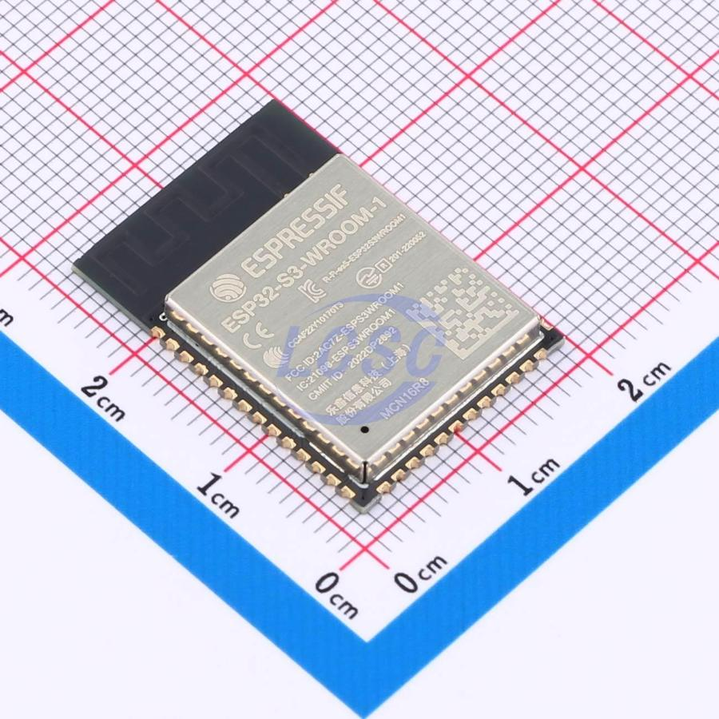
  <figcaption><strong>U1 — ESP32-S3-WROOM-1-N16R8</strong> Dual-core Xtensa LX7 @ 240MHz, 512KB SRAM, 16MB flash, 8MB PSRAM, WiFi + BLE 5.0 18×25.5mm module · <a href="https://www.lcsc.com/product-detail/C2913202.html">LCSC C2913202</a> · <strong>~$2.80</strong></figcaption>
</figure>

### Power Management

<table>
<tr>
<td align="center" width="25%">
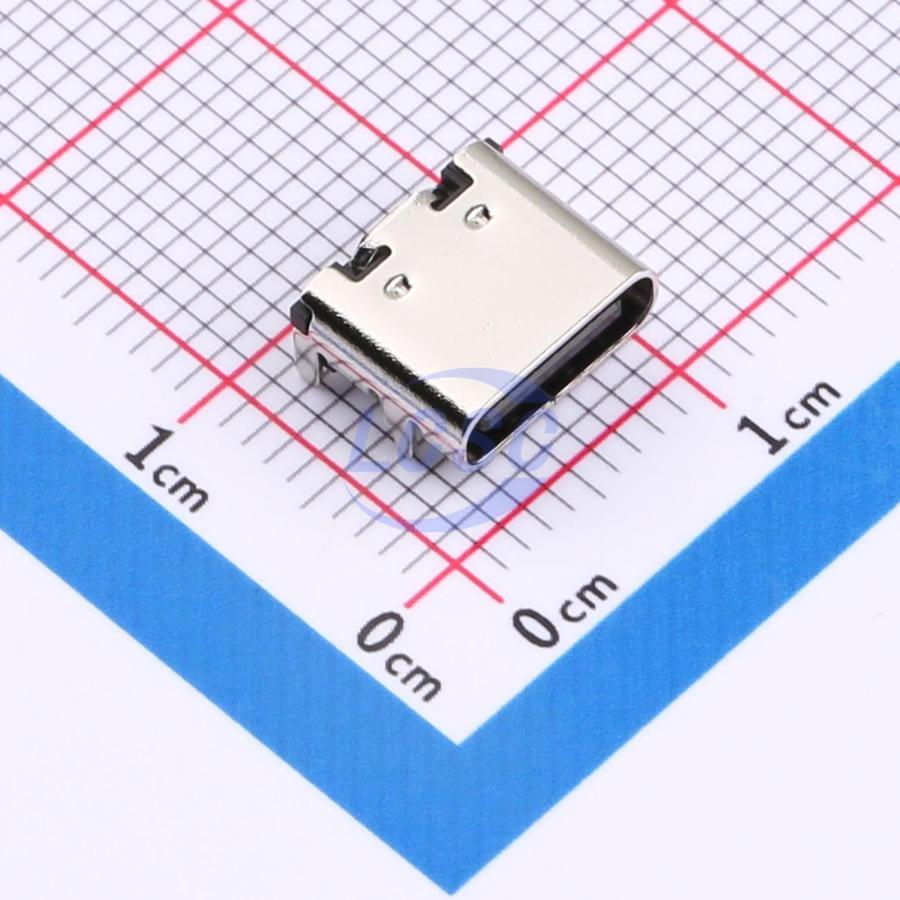 
<strong>J1 — USB-C 16-pin</strong> 
Programming + charging input 
<a href="https://www.lcsc.com/product-detail/C2765186.html">C2765186</a> · <strong>$0.10</strong>
</td>
<td align="center" width="25%">
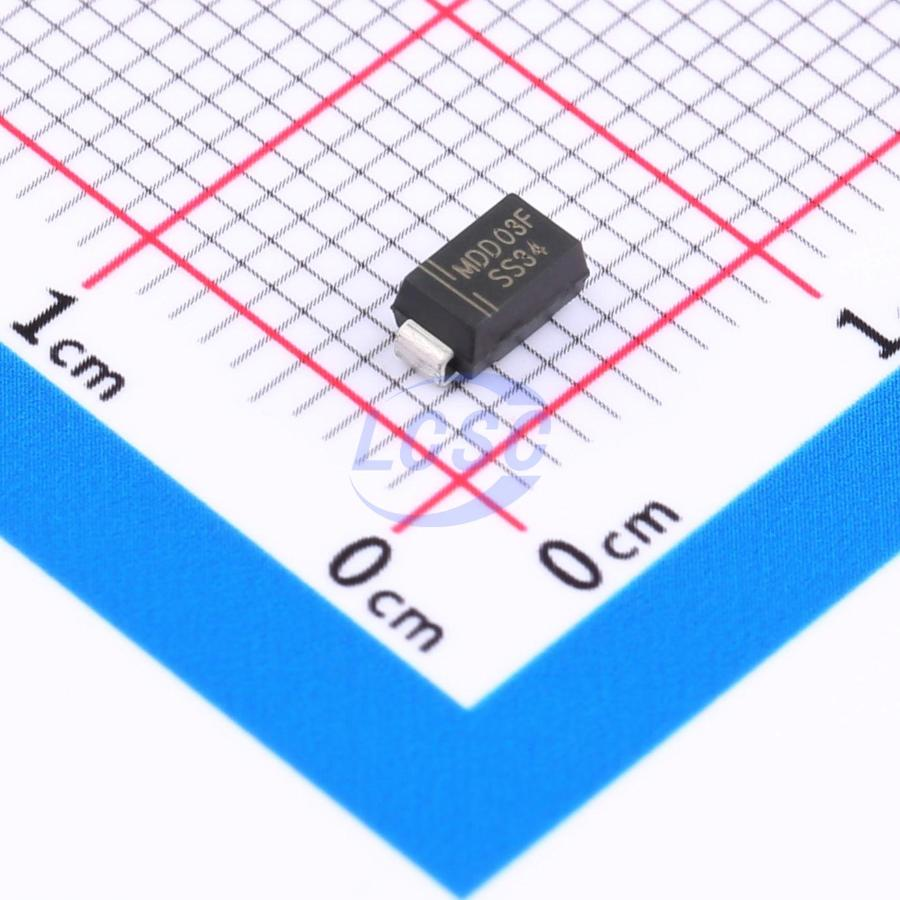 
<strong>D1 — SS34 Schottky</strong> 
USB/battery path selection (SMA) 
<a href="https://www.lcsc.com/product-detail/C8678.html">C8678</a> · <strong>$0.03</strong>
</td>
<td align="center" width="25%">
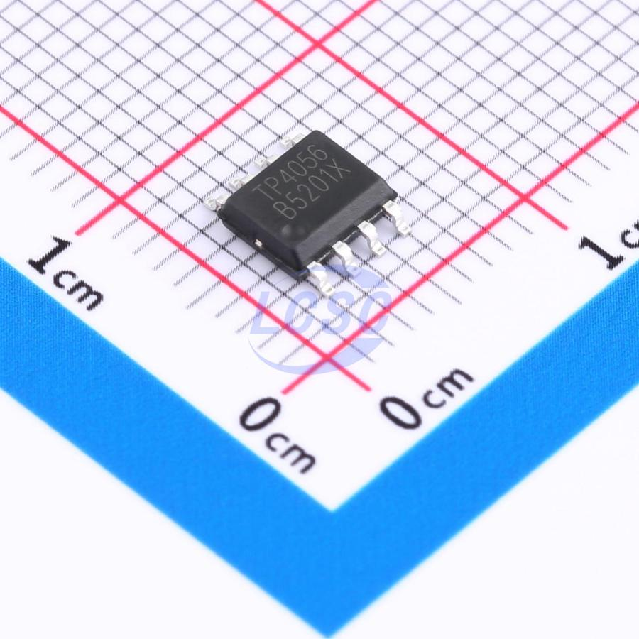 
<strong>U2 — TP4056</strong> 
1A LiPo charger IC (ESOP-8) 
<a href="https://www.lcsc.com/product-detail/C382139.html">C382139</a> · <strong>$0.07</strong>
</td>
<td align="center" width="25%">
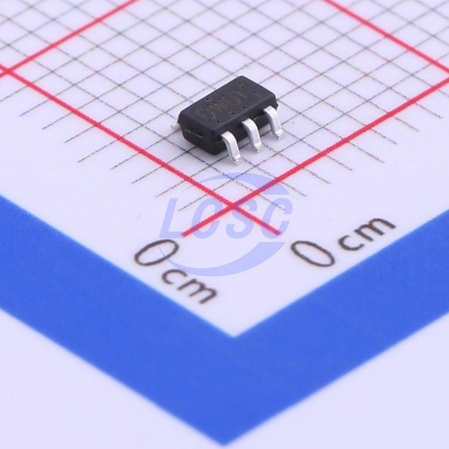 
<strong>U3 — DW01A</strong> 
Battery over-discharge/charge protection (SOT-23) 
<a href="https://www.lcsc.com/product-detail/C351410.html">C351410</a> · <strong>$0.05</strong>
</td>
</tr>
<tr>
<td align="center">
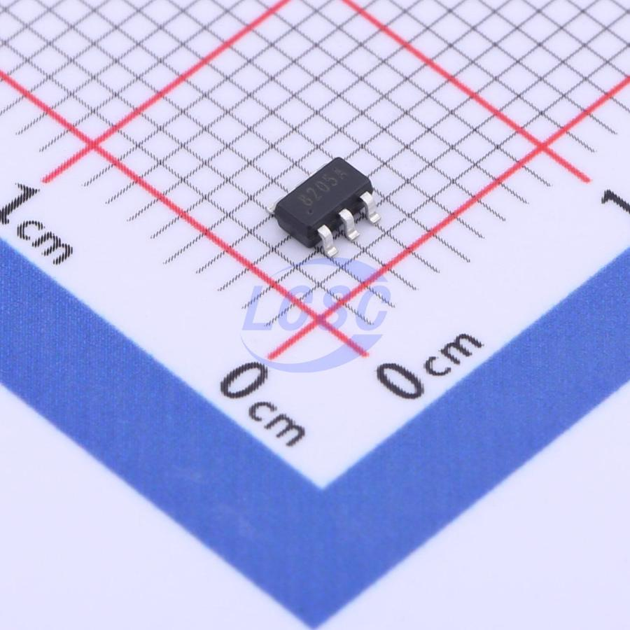 
<strong>Q1 — FS8205A</strong> 
Dual MOSFET for protection (SOT-23-6) 
<a href="https://www.lcsc.com/product-detail/C908265.html">C908265</a> · <strong>$0.05</strong>
</td>
<td align="center">
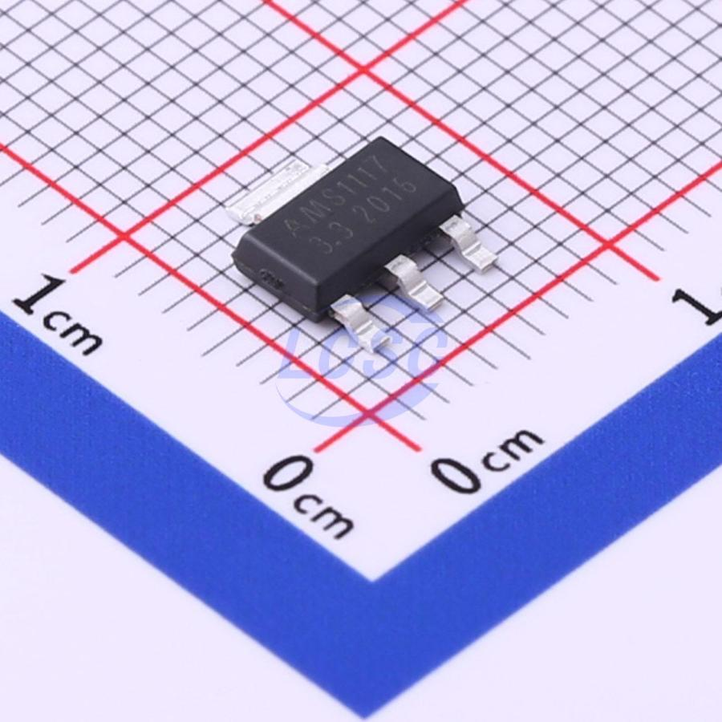 
<strong>U4 — AMS1117-3.3</strong> 
1A LDO regulator, 3.3V (SOT-223) 
<a href="https://www.lcsc.com/product-detail/C6186.html">C6186</a> · <strong>$0.05</strong>
</td>
<td align="center">
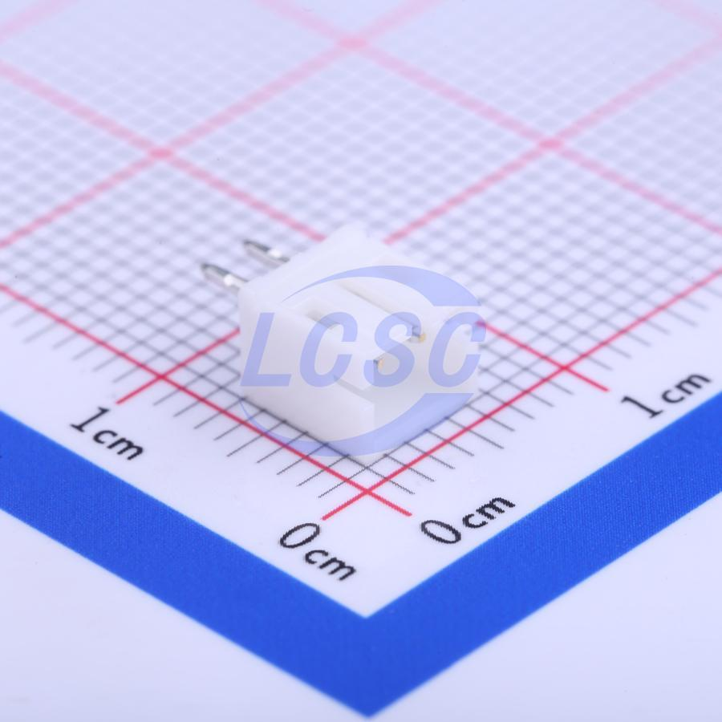 
<strong>J2 — JST PH 2.0mm 2-pin</strong> 
LiPo battery connector (SMD) 
<a href="https://www.lcsc.com/product-detail/C131337.html">C131337</a> · <strong>$0.03</strong>
</td>
<td align="center"></td>
</tr>
</table>

### Input

<figure>
  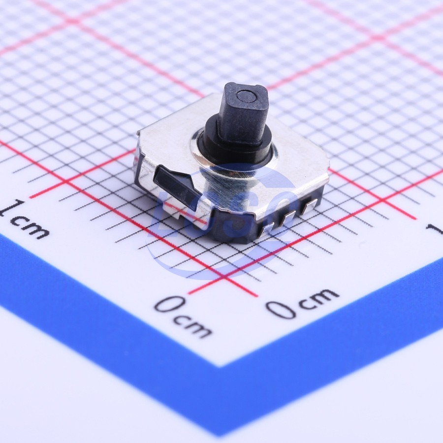
  <figcaption><strong>SW1 — SKRHABE010 (Alps Alpine)</strong> 5-way SMD joystick: UP/DOWN/LEFT/RIGHT + center push, 7.4×7.5×1.8mm <a href="https://www.lcsc.com/product-detail/C139794.html">LCSC C139794</a> · <strong>$0.38</strong></figcaption>
</figure>

### Sensors

<figure>
  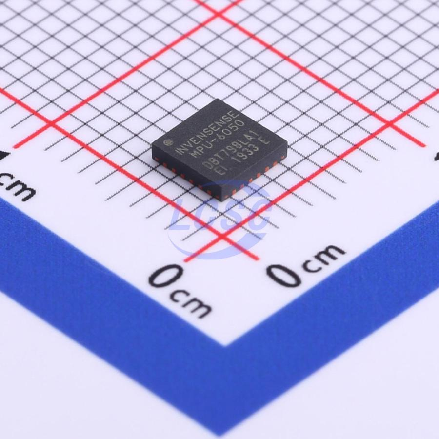
  <figcaption><strong>U5 — MPU-6050</strong> 6-axis accelerometer + gyroscope, I2C @ 0x68, QFN-24 (4×4mm), 3.3V <a href="https://www.lcsc.com/product-detail/C24112.html">LCSC C24112</a> · <strong>$6.88</strong></figcaption>
</figure>

### Status LEDs

<table>
<tr>
<td align="center" width="50%">
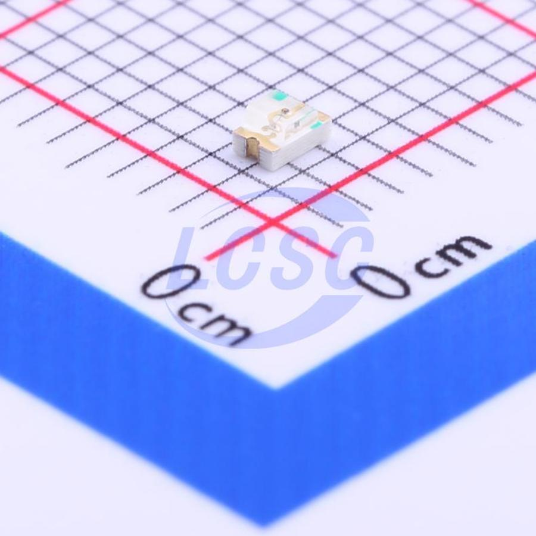 
<strong>D2 — Red LED (0805)</strong> 
Charging indicator (from TP4056 CHRG) 
<a href="https://www.lcsc.com/product-detail/C84256.html">C84256</a> · <strong>$0.01</strong>
</td>
<td align="center" width="50%">
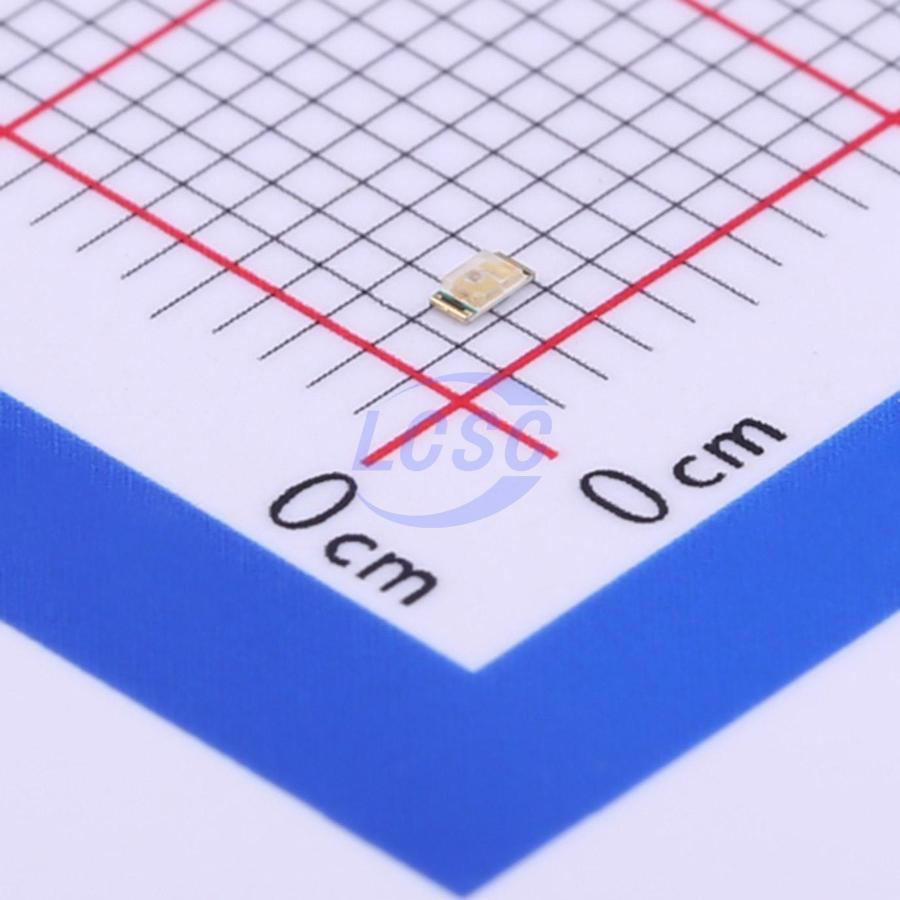 
<strong>D3 — Green LED (0603)</strong> 
Charge complete indicator (from TP4056 STDBY) 
<a href="https://www.lcsc.com/product-detail/C72043.html">C72043</a> · <strong>$0.01</strong>
</td>
</tr>
</table>

### Passives (Not Pictured — Standard 0402 SMD)

| Ref | Value | Purpose | LCSC # | Price |
|-----|-------|---------|--------|-------|
| R1 | 1.2kΩ | TP4056 charge current (~1A) | C25752 | $0.001 |
| R2, R3 | 1kΩ | LED current limiting | C25585 | $0.001 |
| R4, R5 | 10kΩ | I2C pull-ups (MPU-6050) | C25744 | $0.001 |
| R6, R7 | 27Ω | USB D+/D- series resistors | — | $0.001 |
| R8, R9 | 5.1kΩ | USB-C CC pins to GND | — | $0.001 |
| R10 | 10kΩ | Pull-up/config | — | $0.001 |
| C1, C2 | 15pF | Crystal load caps (if needed) | — | $0.002 |
| C3–C9 | 100nF / 10µF | Decoupling + bulk filtering | C14663 / C19702 | $0.002–0.01 |

---

## 1. Provider Comparison

| Provider | Location | PCB Lead Time | Assembly? | Min Order | Best For |
|----------|----------|---------------|-----------|-----------|----------|
| **JLCPCB** | Shenzhen, China | 2-5 days | Yes (SMT) | 5 boards | Budget prototypes, integrated parts library |
| **PCBWay** | Shenzhen, China | 3-5 days | Yes (SMT + THT) | 5 boards | Higher quality, advanced features |
| **OSH Park** | Oregon, USA | 9-14 days | No | 3 boards | US-based, premium finish, no assembly |
| **Aisler** | Netherlands, EU | 5-7 days | Yes (SMT) | 3 boards | EU-based, no customs/VAT hassle for EU |
| **Seeed Studio Fusion** | Shenzhen, China | 5-7 days | Yes (SMT) | 5 boards | Budget, integrated with Seeed ecosystem |

---

## 2. JLCPCB — Detailed Pricing Breakdown

**Source:** [JLCPCB Assembly Pricing](https://jlcpcb.com/help/article/pcb-assembly-price) | [Component Pickup Pricing](https://jlcpcb.com/help/article/components-pickup-pricing) | [PCBA Cost Breakdown](https://jlcpcb.com/blog/pcba-cost-breakdown)

### PCB Fabrication

| Spec | Price (5 boards) |
|------|-------------------|
| 2-layer, 100x100mm | ~$2 |
| 4-layer, 100x100mm | ~$8-12 |
| 4-layer, 45x80mm (Dilder size) | ~$8-15 |
| Surface finish | HASL (free), ENIG (+$6-8) |
| Solder mask | Green (free), other colors +$2-5 |

### Assembly Fees

| Line Item | Economic PCBA | Standard PCBA |
|-----------|--------------|---------------|
| **Setup fee** | $8.00 | $25 (single-side) / $50 (double-side) |
| **Stencil** | $1.50 | $7.86 (single-side) |
| **Per solder joint** | $0.0016 | $0.0016 (1-50k joints) |
| **Hand-solder labor** | $3.50/order | $3.50/order |
| **Panel fee** | $7.81/panel | $7.81/panel |

### Component Handling Fees

| Component Type | Fee | Notes |
|----------------|-----|-------|
| **Basic** | **Free** | Common passives (0402/0603 R, C), common ICs — already loaded on pick-and-place machines |
| **Extended** | **$3.00 per unique part type** | Less common parts that require feeder changes. Charged per part *type*, not per unit. |
| **Component cost** | At-cost from LCSC | JLCPCB sources from their own warehouse (LCSC); prices shown in their parts library |

### Key Notes

- JLCPCB has the largest integrated parts library (~400k parts on LCSC)
- "Economic PCBA" supports single-side SMT only, 1-layer stencil
- Basic parts inventory changes — check current stock before finalizing BOM
- $8 setup + $1.50 stencil = **$9.50 minimum** before any components

---

## 3. PCBWay — Detailed Pricing Breakdown

**Source:** [PCBWay SMT Assembly](https://www.pcbway.com/pcb-assembly.html) | [PCBWay Assembly FAQ](https://www.pcbway.com/helpcenter/pcb_assembly_ordering/Assembly_cost_will_be_showed_after_submit_order_is_components_cost_included_.html)

### PCB Fabrication

| Spec | Price (5 boards) |
|------|-------------------|
| 2-layer, 100x100mm | ~$5 |
| 4-layer, 100x100mm | ~$20-30 |
| 4-layer, 45x80mm (Dilder size) | ~$15-25 |
| Min order | 5 boards |

### Assembly Fees

| Line Item | Cost |
|-----------|------|
| **Per solder joint** | ~$0.002 |
| **Per component** | ~$0.05-$0.50 (varies by component type) |
| **Assembly fee (prototype, 5 boards)** | ~$29-50 (estimated, BOM-dependent) |
| **Stencil** | Included in assembly fee |

### Key Notes

- Assembly pricing is quote-based — upload BOM + Gerbers to get exact price
- Components sourced from DigiKey, Mouser, LCSC, or customer-supplied
- Supports SMT + through-hole in the same order (JLCPCB does not)
- Slightly higher quality reputation for complex boards
- Assembly cost shown *after* order submission, does not include component cost

---

## 4. OSH Park — Detailed Pricing Breakdown

**Source:** [OSH Park Pricing](https://oshpark.com/) | [4-Layer Service](https://docs.oshpark.com/services/four-layer/)

### PCB Fabrication Only (No Assembly)

| Service | Price | Lead Time | Boards Included |
|---------|-------|-----------|-----------------|
| **2-layer prototype** | $5/in² | 9-14 days | 3 copies |
| **2-layer Super Swift** | $10/in² | ~5 days | 3 copies |
| **4-layer prototype** | $15/in² | 9-14 days | 3 copies |
| **4-layer Super Swift** | $20/in² | 5-6 days | 3 copies |
| **4-layer Medium Run** | $2/in² | — | 100 in² minimum |

### Cost for Dilder Board (45x80mm = ~5.6 in²)

| Service | 3 boards |
|---------|----------|
| 4-layer prototype | **~$84** |
| 4-layer Super Swift | **~$112** |

### Key Notes

- **No assembly service** — fabrication only, you solder yourself
- Premium finish: FR408 substrate, purple solder mask, ENIG (gold) finish
- All boards come in sets of 3
- US-based, no customs for US customers
- Significantly more expensive per board than Chinese fabs
- Best for: premium prototypes where quality matters more than cost

---

## 5. Aisler — Detailed Pricing Breakdown

**Source:** [Aisler Pricing](https://community.aisler.net/t/our-simple-pricing/102) | [Aisler Assembly](https://aisler.net/en/products/assembly)

### PCB Fabrication

| Spec | Price (3 boards) |
|------|-------------------|
| 2-layer | ~€5-10 |
| 4-layer | ~€15-25 |
| 6-layer | Quote-based |

### Assembly Fees

| Line Item | Cost |
|-----------|------|
| **Setup fee** | €75.00 |
| **Per unique part type** | €4.50 |
| **Per component placed** | €0.05 |
| **Board area handling** | Additional (area-based) |

### Cost Estimate for Dilder (10 boards, 27 components, ~5 unique passive types + 5 ICs)

| Line Item | Cost |
|-----------|------|
| Setup | €75.00 |
| 10 unique part types × €4.50 | €45.00 |
| 27 components × 10 boards × €0.05 | €13.50 |
| **Assembly subtotal** | **~€133.50** |

### Key Notes

- **EU-based** (Netherlands) — no customs, no import VAT for EU buyers
- Significantly more expensive assembly than Chinese providers
- Excellent for EU customers who want to avoid customs delays and surprise import fees
- Supports KiCad and LibrePCB project upload directly
- Smaller parts library than JLCPCB

---

## 6. Seeed Studio Fusion — Detailed Pricing Breakdown

**Source:** [Seeed Fusion PCB](https://www.seeedstudio.com/fusion_pcb.html) | [Seeed Fusion Assembly](https://www.seeedstudio.com/pcb-assembly.html) | [PCBA Pricing Explained](https://www.seeedstudio.com/blog/2018/03/30/seeed-pcba-series-4-pcb-assembly-pricing-explained/)

### PCB Fabrication

| Spec | Price (5-10 boards) |
|------|---------------------|
| 2-layer, 100x100mm, 10 boards | $4.90 |
| 4-layer, 100x100mm, 5 boards | ~$39.90 |
| 4-layer, 45x80mm (Dilder size) | ~$20-35 |

### Assembly Fees

| Line Item | Cost |
|-----------|------|
| **Setup + stencil** | Included in assembly quote |
| **Per component** | Quote-based (uses DigiKey/Mouser pricing) |
| **Assembly labor** | Component-count dependent |
| **Free assembly promo** | Often offers free assembly for 5 PCBs (check current promos) |

### Key Notes

- Smart quoting system links to DigiKey and Mouser for real-time component pricing
- Frequently runs promotions (free assembly for 5 boards with component purchase)
- Components sourced from major distributors (not a captive warehouse like JLCPCB/LCSC)
- Good middle ground between JLCPCB pricing and PCBWay quality
- Supports Open Parts Library (OPL) with pre-stocked common components

---

## 7. Cost Estimates for the Dilder Board

### Board Spec Summary

- **MCU:** ESP32-S3-WROOM-1-N16R8 (~$2.80 on LCSC)
- **Board:** 4-layer, 45x80mm, 1.6mm thick, HASL finish
- **Components:** ~27 unique parts (resistors, caps, ICs, connectors, LEDs, joystick)
- **Assembly:** Single-side SMT
- **Quantity:** 5 boards

### Estimated BOM Cost Per Board

| Category | Est. Cost |
|----------|-----------|
| ESP32-S3-WROOM-1-N16R8 | $2.80 |
| Power (TP4056, DW01A, FS8205A, AMS1117-3.3, SS34 diode) | $0.28 |
| Input (SKRHABE010 Alps joystick) | $0.38 |
| Sensors (MPU-6050) | $6.88 |
| Connectors (USB-C, JST PH 2-pin, 8-pin header) | $0.30 |
| Passives (10x resistors, 9x caps, 2x LEDs) | $0.50 |
| **Total BOM per board** | **~$11.14** |

### Total Order Estimates (5 Assembled Boards)

| Provider | PCB Fab | Assembly | Components | Shipping (DE) | **Total** | **Per Board** |
|----------|---------|----------|------------|---------------|-----------|---------------|
| **JLCPCB** | ~$10 | ~$15 | ~$56 | ~$15-20 (DHL) | **~$96-101** | **~$19-20** |
| **PCBWay** | ~$20 | ~$35 | ~$56 | ~$15-20 | **~$126-131** | **~$25-26** |
| **Aisler** (EU) | ~€20 | ~€134 | ~€50 | ~€5-10 | **~€209-214** | **~€42-43** |
| **Seeed Fusion** | ~$30 | ~$25 | ~$56 | ~$15-20 | **~$126-131** | **~$25-26** |
| **OSH Park** (fab only) | ~$84 | N/A (DIY) | ~$56 (self-source) | ~$10 | **~$150** | **~$50** (+ your soldering time) |

> **Notes:**
>
> - JLCPCB estimate assumes ~5 extended parts ($15 in feeder fees) + $9.50 setup/stencil + ~$0.50 solder joints. The rest is component cost at LCSC prices.
> - Aisler's €75 setup fee dominates the cost for small batches. More competitive at 20+ boards.
> - OSH Park is fab-only — you'd need to hand-solder or use a separate assembly service.
> - All shipping estimates are for Germany (DHL Express from China, ~5-7 days).
> - Import VAT (19% DE) applies to China orders. Aisler (EU) has no import VAT.
> - Component prices based on LCSC qty-5 pricing as of April 2026.

### Break-Even: When Does Aisler Beat China?

Aisler's €75 setup fee makes it expensive for small batches, but there's no import VAT or customs delay. For a German buyer:

| Qty | JLCPCB (incl. 19% VAT + DHL) | Aisler (EU, no VAT) |
|-----|-------------------------------|---------------------|
| 5 | ~€108 | ~€214 |
| 10 | ~€175 | ~€240 |
| 20 | ~€310 | ~€295 |
| 50 | ~€700 | ~€565 |

Aisler becomes competitive at **~20 boards** when factoring in import VAT and customs risk.

---

## 8. Open-Source Reference Designs

These open-source hardware projects share significant overlap with the Dilder's requirements and can serve as reference designs, component validation, or starting points for schematic/layout work.

### 8.1 Ducky Board (ESP32-S3 + e-Paper + Battery)

**The closest match to the Dilder board.**

| Attribute | Details |
|-----------|---------|
| **MCU** | ESP32-S3 |
| **Display** | GDEM0154Z91 (1.52" e-ink, 3-color, Good Display) |
| **Battery** | Li-Ion single-cell charger with status LEDs |
| **USB** | USB-C for power and programming |
| **Design tool** | KiCad 9 |
| **Files available** | Schematic (.kicad_sch), PCB layout (.kicad_pcb), Gerber files, PDF exports |
| **License** | GPL-3.0 |
| **GitHub** | [MakersFunDuck/Ducky-board-ESP32-S3-with-1.52-inch-e-paper-display](https://github.com/MakersFunDuck/Ducky-board-ESP32-S3-with-1.52-inch-e-paper-display) |

**Relevance to Dilder:** Same MCU family, same display technology, same battery charging architecture. The schematic for the ESP32-S3 power sequencing, USB-C implementation, and LiPo charging circuit can be directly referenced. Component footprints and LCSC part numbers are manufacturing-optimized.

### 8.2 OpenTama (Tamagotchi Reference Design)

**Purpose-built virtual pet PCB with JLCPCB assembly in mind.**

| Attribute | Details |
|-----------|---------|
| **MCU** | STM32L072 (ARM Cortex-M0+) |
| **Display** | SPI SSD1306 OLED or SPI UC1701x LCD |
| **Battery** | 1000mAh Li-Po/Li-Ion (40x30x12mm) |
| **Input** | 3 tactile buttons |
| **Design tool** | KiCad |
| **Files available** | Full KiCad project (schematic + PCB), JLCPCB LCSC part numbers included |
| **License** | CERN-OHL-S v2 (open hardware) |
| **GitHub** | [Sparkr-tech/opentama](https://github.com/Sparkr-tech/opentama) |

**Relevance to Dilder:** Same product category (virtual pet), same target fab (JLCPCB), same battery spec (1000mAh LiPo). All components placed on one side for JLCPCB assembly. LCSC part numbers pre-assigned. Different MCU (STM32 vs ESP32-S3) but the power management, button input, and display interface circuits are directly applicable. The CERN-OHL-S v2 license explicitly permits derivative works.

### 8.3 TamaFi V2 (ESP32-S3 Virtual Pet)

**A WiFi-enabled virtual pet with custom PCB.**

| Attribute | Details |
|-----------|---------|
| **MCU** | ESP32-S3 module |
| **Display** | 1.3-1.54" TFT ST7789 (240x240, full color) |
| **Battery** | TP4056 single-cell LiPo charger, USB-C |
| **Input** | 6 tactile buttons |
| **Audio** | PWM buzzer |
| **Lighting** | 4x WS2812-2020 addressable RGB LEDs |
| **Files available** | PCB layouts and schematics in repo (format unspecified) |
| **License** | MIT |
| **GitHub** | [cifertech/TamaFi](https://github.com/cifertech/TamaFi) |

**Relevance to Dilder:** Same MCU (ESP32-S3), same battery charging (TP4056), same product category (virtual pet). Uses TFT instead of e-ink, but the power management, button debouncing, and WiFi/BLE integration are directly relevant. MIT license allows any use.

### 8.4 PocketMage PDA (ESP32-S3 + e-Ink Handheld)

**A handheld e-ink PDA with the exact same MCU and similar form factor.**

| Attribute | Details |
|-----------|---------|
| **MCU** | ESP32-S3-WROOM-1-N16R8 (16MB flash, 8MB PSRAM) — **identical to Dilder** |
| **Display** | 3.1" e-ink (GDEQ031T10, 320x240px) + 256x32 OLED secondary |
| **Battery** | 1200mAh LiPo with JST connector |
| **Storage** | MicroSD (up to 2TB) |
| **Input** | Keyboard matrix (TCA8418 IC) |
| **Design tool** | KiCad (planned release) |
| **Files available** | Firmware only (hardware files planned for future release) |
| **License** | Apache-2.0 |
| **GitHub** | [ashtf8/PocketMage_PDA](https://github.com/ashtf8/PocketMage_PDA) |

**Relevance to Dilder:** Uses the exact same ESP32-S3-WROOM-1-N16R8 module with e-ink display. Firmware demonstrates SPI e-ink driving from ESP32-S3, which will be directly useful when porting from RP2040. Hardware files not yet released but the firmware architecture is a valuable reference for the ESP32-S3 migration.

### 8.5 AeonLabs ESP32-S3 PCB Template

**A bare ESP32-S3 PCB template for KiCad with manufacturing files.**

| Attribute | Details |
|-----------|---------|
| **MCU** | ESP32-S3 |
| **Purpose** | Minimal reference design / starting template |
| **Design tool** | KiCad |
| **Files available** | Schematic, PCB layout, KiCad project |
| **License** | MIT |
| **GitHub** | [aeonSolutions/AeonLabs-pcb-template-esp32-s3](https://github.com/aeonSolutions/AeonLabs-pcb-template-esp32-s3) |

**Relevance to Dilder:** Minimal ESP32-S3 reference circuit — useful for validating power supply design, crystal selection, and antenna keepout zones without the complexity of a full application board.

### 8.6 PicoTop (RP2040 Custom Desktop)

**Already analyzed in the Dilder PCB research document.**

| Attribute | Details |
|-----------|---------|
| **MCU** | RP2040 (custom board, not a Pico module) |
| **Purpose** | Custom RP2040 desktop computer |
| **Design tool** | KiCad |
| **Files available** | Full KiCad project + Gerbers |
| **GitHub** | [7west/PicoTop](https://github.com/7west/PicoTop) |

**Relevance to Dilder:** Previously analyzed as the inspiration for the custom PCB initiative. Demonstrates full RP2040 custom board design from schematic through manufacturing. The manufacturing pipeline documentation (JLCPCB ordering, BOM preparation) was the basis for Dilder's PCB research document.

---

## 9. Recommended Manufacturing Path

### For Dilder v1 Prototype (5 boards)

**JLCPCB** is the clear winner for the first prototype run:

1. **Lowest cost:** ~$96-101 for 5 fully assembled boards ($19-20/board)
2. **Integrated workflow:** KiCad → JLCPCB Tools plugin → Gerber + BOM/CPL export → upload → order
3. **Parts availability:** All Dilder BOM components are in-stock on LCSC with assigned part numbers
4. **Speed:** 2-5 day fab + 3-5 day assembly + 5-7 day DHL to Germany = **~10-17 days total**
5. **Community:** Largest hobbyist user base, most troubleshooting resources available

### Ordering Checklist

1. [ ] Complete interactive routing in KiCad (traces on F.Cu and B.Cu, via stitching for ground plane)
2. [ ] Run DRC (Design Rule Check) with JLCPCB constraints (5mil trace/space, 0.3mm via drill)
3. [ ] Export Gerbers via JLCPCB Tools plugin
4. [ ] Export BOM + CPL (Component Placement List) via JLCPCB Tools plugin
5. [ ] Upload to JLCPCB, verify 3D preview
6. [ ] Confirm all components show "In Stock" on LCSC
7. [ ] Select "Economic PCBA" for single-side SMT
8. [ ] Review order, pay, wait ~2 weeks

### For Production (20+ boards)

Consider **Aisler** if selling within the EU (no import hassle for customers), or stay with **JLCPCB** for global distribution.

---

## 10. Sources

### Provider Pricing

- [JLCPCB Assembly Pricing](https://jlcpcb.com/help/article/pcb-assembly-price) — setup fees, per-joint costs, stencil charges
- [JLCPCB Component Pickup Pricing](https://jlcpcb.com/help/article/components-pickup-pricing) — 30% markup formula, $30 minimum
- [JLCPCB PCBA Cost Breakdown](https://jlcpcb.com/blog/pcba-cost-breakdown) — full cost analysis with examples
- [JLCPCB Assembly FAQ](https://jlcpcb.com/help/article/pcb-assembly-faqs) — basic vs extended parts, feeder fees
- [PCBWay SMT Assembly](https://www.pcbway.com/pcb-assembly.html) — service overview and capabilities
- [PCBWay Assembly FAQ](https://www.pcbway.com/helpcenter/pcb_assembly_ordering/Assembly_cost_will_be_showed_after_submit_order_is_components_cost_included_.html) — pricing structure
- [OSH Park 4-Layer Service](https://docs.oshpark.com/services/four-layer/) — $15/in² for 3 copies
- [OSH Park Fabrication Services](https://docs.oshpark.com/services/) — all service tiers
- [Aisler Pricing](https://community.aisler.net/t/our-simple-pricing/102) — setup fee, per-part, per-placement
- [Aisler Assembly](https://aisler.net/en/products/assembly) — EU-based assembly service
- [Seeed Fusion PCB](https://www.seeedstudio.com/fusion_pcb.html) — fabrication pricing
- [Seeed Fusion Assembly](https://www.seeedstudio.com/pcb-assembly.html) — assembly service
- [Seeed PCBA Pricing Explained](https://www.seeedstudio.com/blog/2018/03/30/seeed-pcba-series-4-pcb-assembly-pricing-explained/) — cost structure breakdown

### Comparison & Analysis

- [JLCPCB vs PCBWay Comparison](https://www.fr4pcb.tech/blog/detail/jlcpcb-vs-pcbway-which-offers-better-prototype-assembly-services/) — detailed feature comparison
- [Hobby PCB Manufacturer Comparison (Hackaday)](https://hackaday.com/2023/10/13/an-in-depth-comparison-of-hobby-pcb-manufacturers/) — independent testing
- [PCB Assembly Cost Guide 2025 (RayPCB)](https://www.raypcb.com/what-affect-pcb-assembly-cost/) — industry pricing overview

### Open-Source Hardware Designs

- [Ducky Board — ESP32-S3 + e-Paper (GPL-3.0)](https://github.com/MakersFunDuck/Ducky-board-ESP32-S3-with-1.52-inch-e-paper-display)
- [OpenTama — Virtual Pet Reference Design (CERN-OHL-S v2)](https://github.com/Sparkr-tech/opentama)
- [TamaFi V2 — ESP32-S3 Virtual Pet (MIT)](https://github.com/cifertech/TamaFi)
- [PocketMage PDA — ESP32-S3 e-Ink Handheld (Apache-2.0)](https://github.com/ashtf8/PocketMage_PDA)
- [AeonLabs ESP32-S3 PCB Template (MIT)](https://github.com/aeonSolutions/AeonLabs-pcb-template-esp32-s3)
- [PicoTop — RP2040 Custom Board](https://github.com/7west/PicoTop)
- [OpenTama Blog Post (design notes)](http://blog.rona.fr/post/2022/04/21/OpenTama-an-open-source-reference-design-for-MCUGotchi)
- [TamaFi V2 Hackaday.io](https://hackaday.io/project/204612-tamafi-v2-a-virtual-pet-that-evolved-beyond-logic)

---

*Document version: 1.0 — 2026-04-15*
