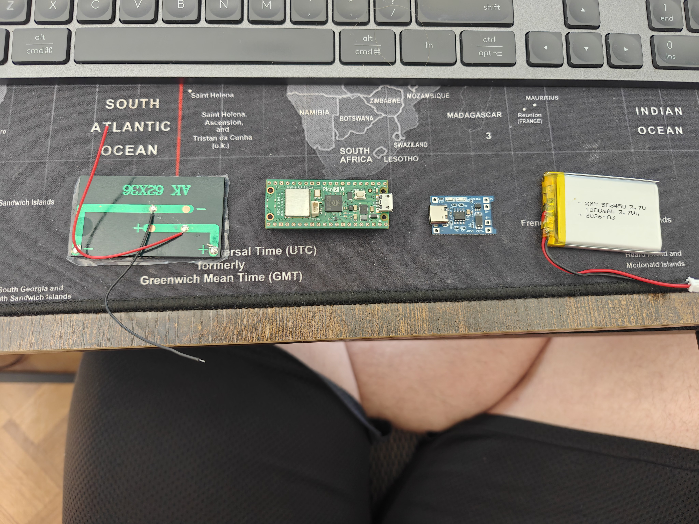

# Solar Charging Research — Dilder (Pico W + ESP32-S3)

Feasibility study for powering and charging the Dilder via a small solar panel, TP4056 USB charger module, and 1000mAh LiPo battery — covering both the **Pico W breadboard prototype** and the **ESP32-S3 custom PCB**.

**Date:** 2026-04-24

---

## 1. Component Inventory (from photos)

Four components were photographed and identified:

### 1.1 Solar Panel — AK 62x36mm



| Attribute | Value |
|-----------|-------|
| **Label** | AK 62X36 |
| **Dimensions** | ~62 x 36 mm |
| **Wires** | Red (+) and black (-), bare tinned ends |
| **Estimated voltage** | 5–6V open circuit (typical for panels this size) |
| **Estimated current** | 80–150mA peak (direct sunlight) |
| **Estimated power** | ~0.4–0.8W peak |
| **Type** | Polycrystalline or amorphous thin-film |

**Notes:** This is a small hobby-grade solar cell. The "AK" branding and 62x36 dimensions match common mini panels sold for IoT/Arduino projects on AliExpress and Amazon. These panels typically produce 5–6V open circuit and 80–150mA short-circuit current in direct sunlight, dropping significantly in overcast or indoor conditions.

### 1.2 Raspberry Pi Pico W (or Pico 2 W)

| Attribute | Value |
|-----------|-------|
| **MCU** | RP2040 (or RP2350 if Pico 2 W) |
| **Wireless** | 2.4GHz WiFi + Bluetooth |
| **Power input** | USB (5V via VBUS) or 1.8–5.5V via VSYS pin 39 |
| **Active current** | ~28mA (WiFi off), ~80mA (WiFi on) |
| **Deep sleep current** | ~1.0mA |
| **Tamagotchi avg** | ~5.5mA (10 min active / 50 min sleep per hour) |

### 1.3 TP4056 USB-C Charger Module (blue PCB)

| Attribute | Value |
|-----------|-------|
| **Chip** | TP4056 (linear Li-Ion charger) |
| **Protection** | DW01A + FS8205A (over-discharge, over-charge, short-circuit) |
| **Input** | USB-C 5V (also accepts 4.5–8V on IN+/IN- pads) |
| **Charge current** | ~1A default (set by R_prog resistor, typically 1.2kΩ) |
| **Charge voltage** | 4.2V (single-cell LiPo) |
| **Output** | OUT+/OUT- (protected) and BAT+/BAT- (direct) |
| **LEDs** | Red = charging, Blue/Green = complete |
| **Size** | ~25 x 15 mm |
| **Cost** | ~€1.50 |

### 1.4 LiPo Battery — XMY 503450

| Attribute | Value |
|-----------|-------|
| **Label** | XMY 503450 |
| **Nominal voltage** | 3.7V |
| **Full charge** | 4.2V |
| **Cutoff voltage** | 3.0V |
| **Capacity** | 1000mAh (3.7Wh) |
| **Dimensions** | ~50 x 34 x 5 mm |
| **Wires** | Red (+) and black (-), JST or bare leads |
| **Date code** | 2026-03 |

---

## 2. The Question

> Can the solar panel charge the LiPo battery through the TP4056 module while simultaneously powering the Pico W?

**Short answer: Yes. This is a well-established and widely used configuration.**

---

## 3. How It Works — System Architecture

```
                        ┌─────────────────┐
   SUNLIGHT             │   Solar Panel   │
      ☀                 │   AK 62x36      │
                        │   ~5V, 100mA    │
                        └───┬─────────┬───┘
                            │ RED (+) │ BLACK (-)
                            ▼         ▼
                        ┌─────────────────┐
   USB-C (alt source)──►│    TP4056       │
                        │  Charger Module │
                        │  (4.2V CC/CV)   │
                        └──┬────┬────┬──┬─┘
                           │    │    │  │
                     BAT+  │    │    │  │ BAT-
                           ▼    │    │  ▼
                        ┌───────┴────┴────┐
                        │   LiPo Battery  │
                        │   1000mAh 3.7V  │
                        └─────────────────┘
                           │              │
                     OUT+  │              │ OUT-
                           ▼              ▼
                        ┌─────────────────┐
                        │   Pico W        │
                        │   VSYS (pin 39) │
                        │   GND  (pin 38) │
                        └─────────────────┘
```

**Data flow:**
1. Solar panel produces ~5V when illuminated
2. TP4056 accepts this on IN+/IN- pads (same pads as USB power internally)
3. TP4056 charges the LiPo using CC/CV algorithm (constant current up to 4.2V, then taper)
4. TP4056 OUT+ delivers protected battery voltage (3.0–4.2V) to Pico W VSYS
5. Pico W runs from battery voltage via its onboard buck-boost regulator (RT6150)

---

## 4. Feasibility Analysis

### 4.1 Voltage Compatibility

| Connection | Source voltage | Acceptable range | Verdict |
|------------|--------------|-----------------|---------|
| Solar → TP4056 IN | ~5–6V OC, ~4.5–5V loaded | 4.5–8V | **PASS** |
| TP4056 OUT → Pico VSYS | 3.0–4.2V (battery) | 1.8–5.5V | **PASS** |

All voltage levels are within spec. No regulators or level shifters needed.

### 4.2 Current Budget

| Parameter | Value |
|-----------|-------|
| Solar panel output (direct sun) | ~80–150mA |
| Pico W consumption (Tamagotchi avg) | ~5.5mA |
| TP4056 charge current (default, 1A max) | limited by solar input |
| Net charge current | solar output − Pico draw |

**Key insight:** The TP4056 will automatically limit its charge current to whatever the solar panel can supply. With ~100mA from the panel and ~5.5mA drawn by the Pico, roughly **~95mA** goes to charging the battery. At this rate, a full charge from empty takes approximately **10–11 hours of direct sunlight**.

### 4.3 Charge Current Consideration (R_prog)

The default TP4056 charge current is set to ~1A by a 1.2kΩ R_prog resistor. Since the solar panel can only supply ~100mA, the TP4056 will never reach this limit — it will simply charge at whatever current is available. This is safe behavior.

However, for optimal MPPT-like behavior with a small panel, you can **optionally** replace R_prog with a higher value to set a lower programmed charge current. This prevents the TP4056 from trying to draw more current than the panel can provide, which would cause voltage sag:

| R_prog (kΩ) | Programmed charge current (mA) |
|-------------|-------------------------------|
| 1.2 | 1000 (default) |
| 5 | 240 |
| 10 | 120 |
| 20 | 60 |

**Recommendation:** Replace R_prog with a **10kΩ** resistor to set the charge current to ~120mA, closely matching the solar panel's capability. This prevents deep voltage sag and keeps the TP4056 in a stable charging state.

### 4.4 Load Sharing (Simultaneous Charge + Use)

The TP4056 with DW01A protection has **partial load sharing**. This means:

- The Pico W can run from the battery while it charges
- There may be a brief power interruption when the charger transitions from "charging" to "done" (the red LED turns off and blue/green turns on)
- For the Dilder's use case (Tamagotchi with sleep cycles), this momentary glitch is negligible — a deep-sleep cycle would mask it entirely

**Verdict: Acceptable for this project.**

### 4.5 Solar Panel Behavior in Low Light

| Condition | Estimated output | Effect |
|-----------|-----------------|--------|
| Direct sunlight | 80–150mA @ ~5V | Full charging, ~95mA net to battery |
| Bright overcast | 30–60mA @ ~4V | Slow charging or break-even with Pico draw |
| Heavy overcast | 5–15mA @ ~3V | Not enough to charge; below TP4056 threshold |
| Indoor (near window) | 1–10mA @ ~2V | No charging; battery drains normally |
| Night / dark | 0mA | No charging; battery drains normally |

**Important:** This small panel is an **outdoor/window supplement**, not a primary power source. Indoor charging is negligible.

---

## 5. Wiring Plan

### 5.1 Connections

| From | To | Wire |
|------|-----|------|
| Solar panel RED (+) | TP4056 **IN+** pad | Solder or screw terminal |
| Solar panel BLACK (-) | TP4056 **IN-** pad | Solder or screw terminal |
| LiPo RED (+) | TP4056 **BAT+** pad | Solder |
| LiPo BLACK (-) | TP4056 **BAT-** pad | Solder |
| TP4056 **OUT+** | Pico W **VSYS** (pin 39) | Jumper wire to breadboard |
| TP4056 **OUT-** | Pico W **GND** (pin 38) | Jumper wire to breadboard |

### 5.2 Wiring Diagram (ASCII)

```
  SOLAR PANEL (AK 62x36)           TP4056 MODULE              PICO W
  ┌──────────────┐            ┌───────────────────┐      ┌──────────────┐
  │              │            │                   │      │              │
  │  (+) RED  ───┼──────────►─┤ IN+          OUT+ ├──►───┤ VSYS (pin39) │
  │              │            │                   │      │              │
  │  (-) BLK  ───┼──────────►─┤ IN-          OUT- ├──►───┤ GND  (pin38) │
  │              │            │                   │      │              │
  └──────────────┘            │  BAT+     BAT-    │      └──────────────┘
                              │   ▲         ▲     │
                              └───┼─────────┼─────┘
                                  │         │
                              ┌───┴─────────┴───┐
                              │   LiPo BATTERY  │
                              │   (+)RED (-)BLK │
                              │   1000mAh 3.7V  │
                              └─────────────────┘
```

### 5.3 Optional: Blocking Diode

Adding a **1N5817 Schottky diode** in series between the solar panel (+) and TP4056 IN+ prevents reverse current flowing from the battery back through the solar panel at night. The voltage drop is only ~0.3V.

```
Solar (+) ──►|── TP4056 IN+
           1N5817
```

**Note:** Many TP4056 modules already include internal reverse-polarity protection. Check your specific module — if it has a diode on the input, you can skip this.

### 5.4 Optional: USB Charging Coexistence

The TP4056 module has a USB-C port. You can still charge via USB when solar is unavailable. The module handles input source selection automatically — whichever provides higher voltage will dominate. This means:

- **Outdoors:** Solar charges the battery
- **Indoors/desk:** Plug in USB-C to charge

Both paths go through the same TP4056 charge controller.

---

## 6. Battery Life Impact

### 6.1 Without Solar (baseline from battery-wiring.md)

| Mode | Avg current | Battery life |
|------|------------|-------------|
| Always active (WiFi off) | 28mA | ~35 hours |
| Tamagotchi (10min/50min) | 5.5mA | ~6.8 days |
| Aggressive sleep (5min/55min) | 3.3mA | ~12.6 days |

### 6.2 With Solar (outdoor, direct sunlight ~6hrs/day)

Assuming 6 hours of usable sunlight per day at ~100mA average:

| Parameter | Value |
|-----------|-------|
| Daily solar input | 100mA x 6h = **600mAh** |
| Daily Pico consumption (Tamagotchi) | 5.5mA x 24h = **132mAh** |
| Daily net gain | **+468mAh** |
| Battery capacity | 1000mAh |

**In 6+ hours of daily sun, the solar panel produces ~4.5x the energy the Dilder consumes.** The battery would stay permanently topped up, and the Dilder could theoretically run indefinitely in sunny conditions.

### 6.3 With Solar (mixed/overcast, ~3hrs usable sun)

| Parameter | Value |
|-----------|-------|
| Daily solar input | 50mA x 3h = **150mAh** |
| Daily Pico consumption (Tamagotchi) | 5.5mA x 24h = **132mAh** |
| Daily net gain | **+18mAh** (barely break-even) |

In overcast conditions, solar roughly breaks even with consumption. The battery would slowly drain over multi-day overcast periods.

---

## 7. Risks and Mitigations

| Risk | Severity | Mitigation |
|------|----------|------------|
| Solar voltage sag below TP4056 minimum (4.5V) | Medium | Replace R_prog to 10kΩ to reduce charge current demand |
| Reverse current at night (battery → panel) | Low | Add 1N5817 Schottky diode; many TP4056 boards already handle this |
| TP4056 overheating in direct sun | Low | TP4056 has thermal regulation; at 100mA charge rate, negligible heat |
| Battery over-discharge if cloudy for days | Medium | DW01A cuts off at ~2.9V; firmware can trigger deep sleep at 3.3V |
| Load-sharing glitch on charge-complete transition | Low | Tamagotchi sleep cycles mask any sub-second dropout |
| Rain/moisture on solar panel wiring | Medium | Conformal coat solder joints; route wires through enclosure grommet |
| Solar panel physically too large for enclosure | Medium | 62x36mm panel; verify fit against enclosure dimensions or mount externally |

---

## 8. Bill of Materials

| Component | Already have? | Estimated cost |
|-----------|:------------:|----------------|
| Solar panel AK 62x36 (~5V) | Yes | ~€2–4 |
| TP4056 USB-C charger module | Yes | ~€1.50 |
| LiPo battery 503450 1000mAh | Yes | ~€5–8 |
| Pico W / Pico 2 W | Yes | ~€6–8 |
| 1N5817 Schottky diode (optional) | No | ~€0.10 |
| 10kΩ resistor for R_prog (optional) | No | ~€0.05 |
| **Total additional cost** | | **€0.00 – €0.15** |

You already have all four primary components. The optional diode and resistor are near-zero cost.

---

## 9. Step-by-Step Implementation Plan

### Phase A — Bench Test (breadboard, no soldering)

1. **Verify solar panel voltage.** Use a multimeter in direct sunlight. Confirm 5–6V open circuit and 80–150mA short circuit.
2. **Connect solar → TP4056.** Solder or clip solar wires to TP4056 IN+/IN- pads.
3. **Connect battery → TP4056.** Solder battery wires to BAT+/BAT-.
4. **Test charging.** Place panel in sunlight. Red LED on TP4056 should illuminate (charging). Monitor battery voltage with multimeter — should rise toward 4.2V.
5. **Connect TP4056 OUT → Pico W VSYS/GND.** Wire OUT+ to pin 39, OUT- to pin 38.
6. **Power on Pico.** Confirm it boots and runs firmware from battery.
7. **Test simultaneous charge + operation.** Run the Pico from battery while solar charges. Verify no resets or glitches.

### Phase B — R_prog Optimization (optional)

8. **Identify R_prog on TP4056.** It's the small SMD resistor near the TP4056 chip, typically labeled 122 (1.2kΩ).
9. **Replace with 10kΩ.** Desolder and replace to set charge current to ~120mA. This matches the solar panel's output capacity.
10. **Re-test charging.** Confirm stable charging with no voltage sag.

### Phase C — Enclosure Integration

11. **Mount solar panel.** Options: external mount on top of enclosure lid, or behind a transparent window.
12. **Route wires.** Drill/design a grommet hole for solar wires entering the enclosure.
13. **Secure TP4056 inside enclosure.** Double-sided tape or designed mount point.
14. **Add blocking diode** (optional) between solar panel and TP4056 IN+.
15. **Final integration test.** Full day outdoor test: verify charge cycle, monitor battery voltage via firmware (GPIO29/ADC3), confirm Dilder runs overnight on stored charge.

### Phase D — Firmware Support

16. **Battery monitoring.** Already documented in `battery-wiring.md` — read ADC3 (GPIO29) for VSYS/3 voltage.
17. **USB/solar detection.** GPIO24 goes HIGH when VBUS is present. When solar provides sufficient voltage through TP4056, this can be used to detect charging state.
18. **Low-battery deep sleep.** If battery voltage drops below 3.3V, enter deep sleep to prevent over-discharge.
19. **Solar status display.** Optionally show a sun/charging icon on the e-ink display when solar power is detected.

---

## 10. Conclusion (Pico W)

**This is entirely feasible with the components you already have.** The wiring is straightforward (6 connections), requires no additional ICs or boost converters, and follows the same TP4056 Option B architecture already documented in `battery-wiring.md`. The only difference is that the solar panel replaces (or supplements) USB as the power source feeding the TP4056 IN+/IN- pads.

In direct sunlight, the solar panel produces roughly **4.5x** the energy the Dilder consumes in Tamagotchi mode, meaning the battery stays topped up indefinitely. Even in mixed conditions, solar significantly extends battery life.

**Recommendation:** Proceed with Phase A bench testing. All components are on hand and the risk is negligible.

---
---

# Part 2 — Solar Charging on the ESP32-S3 Custom PCB

The Dilder v0.3 custom PCB already has the TP4056, DW01A, FS8205A, and AMS1117-3.3 LDO **designed into the board**. This section analyses whether the same AK 62x36 solar panel can be integrated into the custom PCB power chain.

---

## 11. ESP32-S3 Custom PCB — Existing Power Architecture

The custom board's power chain is already designed as:

```
USB-C (5V)
    │
    ▼
SS34 Schottky Diode (reverse polarity protection)
    │
    ▼
TP4056 (ESOP-8, C382139)  ◄── On-board charge IC
    │
    ├── BAT+/BAT- ◄──► LiPo 1000mAh (JST PH 2-pin)
    │
    ▼
DW01A + FS8205A (over-discharge / over-charge / short-circuit protection)
    │
    ▼
AMS1117-3.3 LDO (SOT-223, C6186)
    │
    ▼
3.3V Rail ──► ESP32-S3 + LIS2DH12 + AHT20 + BH1750 + e-Paper + LEDs
```

**Key difference from Pico W setup:** The Pico W has its own onboard RT6150 buck-boost regulator that accepts 1.8–5.5V on VSYS. The ESP32-S3 custom board uses an AMS1117-3.3 LDO that requires a **minimum ~3.6V input** to reliably output 3.3V (due to ~0.3V dropout at low current). This means the battery voltage matters more.

---

## 12. Can the Solar Panel Feed the ESP32-S3 PCB?

### 12.1 The Answer: Yes — Two Options

**Option 1 — Solar wires to USB-C port (zero PCB changes)**

Simply plug or wire the solar panel into the USB-C port's VBUS/GND pins. The existing SS34 diode and TP4056 handle everything. No PCB modification needed.

```
Solar Panel (+) ──► USB-C VBUS (via cable or adapter)
Solar Panel (-) ──► USB-C GND
```

**Pros:** No hardware changes, fully reversible, USB-C cable acts as weatherproof strain relief.
**Cons:** Occupies the USB-C port (can't charge from USB while solar is connected unless using a Y-splitter).

**Option 2 — Dedicated solar input pads on PCB (requires schematic change)**

Add a second input path to the TP4056 with its own Schottky diode, allowing solar and USB-C to coexist:

```
                ┌─── SS34 ◄── USB-C VBUS
                │
TP4056 VIN ◄────┤
                │
                └─── SS34 ◄── Solar Panel (+)    ◄── NEW: 2-pin header + diode
                                                      on PCB
```

Both sources are OR'd through individual Schottky diodes — whichever has higher voltage wins. No conflict, no switching logic needed.

**Pros:** USB-C and solar work simultaneously, automatic source selection.
**Cons:** Requires 1 additional SS34 diode + 2-pin header on the PCB (trivial BOM addition).

### 12.2 Voltage Compatibility

| Connection | Source voltage | Acceptable range | Verdict |
|------------|--------------|-----------------|---------|
| Solar → TP4056 VIN (via SS34) | ~5V loaded (~4.7V after diode) | 4.5–8V | **PASS** |
| TP4056 → Battery | 4.2V charge target | 3.0–4.2V | **PASS** |
| Battery → AMS1117 input | 3.0–4.2V | >3.6V for 3.3V out | **PASS** (see caveat below) |
| AMS1117 → ESP32-S3 | 3.3V | 3.0–3.6V | **PASS** |

**Caveat — AMS1117 dropout:** The AMS1117-3.3 has a typical dropout of 1.2V at high current but only ~0.3V at the ESP32-S3's average draw (~37mA). At 3.7V nominal battery, the LDO outputs 3.3V comfortably. At 3.3V (nearly depleted battery), output drops to ~3.0V — still within ESP32-S3 minimum operating voltage (3.0V), but marginal. The DW01A cuts off at ~2.9V, so the system shuts down before reaching unsafe territory.

### 12.3 Current Budget (ESP32-S3)

| Parameter | Value |
|-----------|-------|
| Solar panel output (direct sun) | ~80–150mA |
| ESP32-S3 active (no WiFi, display, sensors) | ~37mA |
| ESP32-S3 deep sleep | ~10µA |
| ESP32-S3 Tamagotchi avg (10min/50min cycle) | ~5.5mA |
| ESP32-S3 WiFi TX peak (10ms bursts) | ~500mA |
| Net charge current (Tamagotchi mode) | ~95mA |

The ESP32-S3 in Tamagotchi mode draws a similar average (~5.5mA) to the Pico W, because the dominant factor is deep-sleep duty cycle, not active power. The solar energy surplus remains roughly **4.5x** in sunny conditions.

**WiFi burst caveat:** The ESP32-S3 can draw up to 500mA during WiFi TX bursts. The solar panel cannot supply this — the battery absorbs these peaks. This is normal and expected. The TP4056 charges between bursts.

---

## 13. ESP32-S3 Solar Energy Budget

### 13.1 Daily Budget (same battery, same panel)

| Condition | Solar input/day | ESP32-S3 draw/day | Net |
|-----------|----------------|-------------------|-----|
| Direct sun, 6hrs | 600mAh | 132mAh (Tamagotchi) | **+468mAh** (indefinite) |
| Mixed/overcast, 3hrs | 150mAh | 132mAh | **+18mAh** (break-even) |
| Indoor / window | ~10mAh | 132mAh | **-122mAh** (~8 day drain) |
| WiFi-heavy (30min/day) | 600mAh | 360mAh | **+240mAh** (still surplus) |

### 13.2 Worst Case — Heavy WiFi + Overcast

| Parameter | Value |
|-----------|-------|
| Daily solar input | 150mAh (3hrs weak sun) |
| Daily draw (WiFi 30min + Tamagotchi rest) | 360mAh |
| Daily deficit | -210mAh |
| Battery runtime without sun | ~2.8 days |

Even in the worst case, solar extends battery life significantly vs no solar at all.

---

## 14. PCB Design Changes for Solar Input (Option 2)

If you want to add a dedicated solar input to the v0.3 PCB, the changes are minimal:

### 14.1 Schematic Addition

```
          ┌──────────────────────────────────────────┐
          │            EXISTING PCB                   │
          │                                           │
  J_SOLAR │   ┌───────┐         ┌──────────┐         │
  (2-pin  │   │ D_SOL │         │          │         │
  header) │   │ SS34  │         │  TP4056  │         │
  (+) ────┼──►┤ A   K ├────┬───►┤ VIN      │         │
          │   │       │    │    │          │         │
          │   └───────┘    │    │          │         │
          │                │    │          │         │
          │   ┌───────┐    │    │          │         │
          │   │ D_USB │    │    │          │         │
  USB-C   │   │ SS34  │    │    │          │         │
  VBUS ───┼──►┤ A   K ├────┘    │          │         │
          │   │       │         │          │         │
          │   └───────┘         └──────────┘         │
          │                                           │
  GND ────┼───────────────────── GND                  │
          └──────────────────────────────────────────┘
```

### 14.2 BOM Addition

| Component | LCSC | Package | Qty | Cost |
|-----------|------|---------|-----|------|
| SS34 Schottky diode (solar path) | C8678 | SMA | 1 | €0.03 |
| 2-pin header (solar connector) | — | 2.54mm pitch or JST PH 2-pin | 1 | €0.05 |

**Total added cost per board: ~€0.08**

### 14.3 PCB Layout Considerations

- Place the solar header **near the USB-C connector** (bottom edge of the board) to share the ground path
- The SS34 diode is SMA package (4.3 x 2.6mm) — easily fits near the existing SS34 for USB
- Route from solar header → new SS34 cathode → existing TP4056 VIN net
- Add a silkscreen label: `SOLAR +/-` or `☀ IN`
- Consider a 2-pin JST PH connector (same as battery connector) for easy plug/unplug

### 14.4 Enclosure Considerations

The current enclosure target is **88 x 34 x 19mm**. The solar panel is **62 x 36mm** — wider than the enclosure by 2mm.

| Mounting option | Feasibility |
|----------------|-------------|
| **Top-mount (panel on lid)** | Panel overhangs by 1mm each side — possible with trim or slightly wider lid |
| **Strap-on (external clip)** | Panel clips to outside of case, wires routed through grommet hole |
| **Separate panel (tethered)** | Panel on a short cable, placed in sun while device is in pocket/shade |
| **Larger panel integrated into lid** | Redesign lid to 66 x 40mm to accommodate panel + margin |

**Recommendation:** Start with the **tethered** approach (short cable from solar header to panel). This is the most flexible and doesn't require enclosure redesign. Later, if a larger enclosure variant is designed, the panel can be integrated into the lid.

---

## 15. ESP32-S3 Firmware Support for Solar

The ESP32-S3 has more capability than the Pico W for solar monitoring:

### 15.1 Battery Voltage Monitoring

Add a voltage divider on an ADC-capable GPIO to read battery voltage:

```
VBAT ──┤ R1 (100kΩ) ├──┬── GPIO1 (ADC1_CH0)
                       │
                       ├── R2 (100kΩ) ──► GND
                       │
                       └── 100nF cap ──► GND (filter noise)
```

Divider ratio: 2:1 → at 4.2V battery, ADC reads 2.1V (within ESP32-S3 ADC range 0–3.3V).

**Note:** This voltage divider may already be planned for the custom PCB — check `pcb-design-plan.md` for ADC assignments.

### 15.2 Charge Status Monitoring

The TP4056 has two status pins:

| TP4056 Pin | State | Meaning |
|------------|-------|---------|
| CHRG (pin 7) | LOW | Charging in progress |
| STDBY (pin 6) | LOW | Charge complete / standby |
| Both HIGH | — | No input power / error |

Connect these to two GPIOs (with pull-ups) to detect:
- **Solar charging active** (CHRG LOW) → show sun icon on e-ink
- **Battery full** (STDBY LOW) → show full battery icon
- **No solar / night** (both HIGH) → show battery percentage only

### 15.3 Smart Sleep with Solar Awareness

```
if solar_charging:
    # Battery is gaining charge — can afford longer active periods
    active_window = 15 minutes
    sleep_window = 45 minutes
else:
    # Battery only — conserve power
    active_window = 5 minutes
    sleep_window = 55 minutes
```

This adaptive duty cycle extends battery life in dark conditions while making the Dilder more responsive when solar power is available.

---

## 16. Comparison: Pico W vs ESP32-S3 Solar Integration

| Aspect | Pico W (breadboard) | ESP32-S3 (custom PCB) |
|--------|--------------------|-----------------------|
| **TP4056 location** | External module (blue PCB) | On-board IC (ESOP-8) |
| **Wiring** | 6 hand-wired connections | PCB traces (2 wires for solar header only) |
| **Voltage regulator** | Onboard RT6150 buck-boost (1.8–5.5V) | Onboard AMS1117 LDO (>3.6V input) |
| **Low-battery margin** | Excellent (runs down to 1.8V) | Good (runs to ~3.0V ESP32 minimum) |
| **Solar input method** | Wire to TP4056 IN+/IN- pads | Option 1: USB-C port, Option 2: dedicated header |
| **Dual source (USB+solar)** | Requires external wiring | Option 2 gives automatic OR-diode selection |
| **Active power draw** | ~28mA (WiFi off) | ~37mA (WiFi off) |
| **Deep sleep draw** | ~1.0mA | ~10µA (10x better) |
| **Tamagotchi average** | ~5.5mA | ~5.5mA (similar — sleep dominates) |
| **WiFi peak draw** | ~80mA | ~500mA (needs battery buffer) |
| **Battery monitoring** | GPIO29/ADC3 (built-in divider) | Needs voltage divider on ADC GPIO |
| **Charge status pins** | LEDs only (visual) | Can wire CHRG/STDBY to GPIOs |
| **PCB change needed** | None (external module) | 1 diode + 1 header (Option 2) |
| **Enclosure fit** | N/A (breadboard prototype) | Panel slightly wider than case — tether recommended |
| **Solar verdict** | **Fully feasible** | **Fully feasible** |

---

## 17. Overall Conclusion

### Pico W (breadboard prototype)
**Fully feasible today.** Wire the solar panel to the TP4056 module's IN+/IN- pads. Six connections, zero additional ICs, components already on hand. Proceed to bench testing immediately.

### ESP32-S3 (custom PCB)
**Fully feasible with minimal design changes.** The existing power architecture (TP4056 → DW01A → AMS1117) already supports solar input — the solar panel is electrically identical to USB from the TP4056's perspective.

- **Option 1 (zero changes):** Feed solar through the USB-C port. Works immediately on the v0.3 board.
- **Option 2 (recommended for v0.4):** Add a dedicated 2-pin solar header and second SS34 Schottky diode. Cost: €0.08/board. Allows simultaneous USB + solar charging.

**Energy budget is favorable on both platforms.** In Tamagotchi mode (~5.5mA average), the AK 62x36 panel produces roughly **4.5x** the daily energy requirement in 6 hours of sun. The Dilder can run indefinitely in sunny outdoor conditions on either board.

**Recommended next steps:**

1. **Now:** Bench test solar → TP4056 → battery → Pico W (Phase A from Section 9)
2. **v0.3 PCB:** Test solar through USB-C port (Option 1, no PCB changes)
3. **v0.4 PCB:** Add dedicated solar header + OR-diode to schematic (Option 2)
4. **Firmware:** Add CHRG/STDBY GPIO monitoring + adaptive sleep duty cycle

---

## References

- [Dilder Battery Wiring Guide](../website/docs/docs/hardware/battery-wiring.md) — existing TP4056 wiring documentation
- [Dilder ESP32-S3 PCB Research](esp32-s3-pcb-research.md) — full custom PCB design documentation
- [Dilder Custom PCB Design Research](custom-pcb-design-research.md) — PCB fabrication pipeline
- [Dilder BOM](../hardware-design/BOM.md) — full bill of materials (31 components)
- [Dilder PCB Design Plan](../hardware-design/pcb-design-plan.md) — schematic + layout strategy
- [TP4056 Datasheet](https://www.analog.com/media/en/technical-documentation/data-sheets/TP4056.pdf) — charge controller specs
- [AMS1117-3.3 Datasheet](https://www.lcsc.com/datasheet/lcsc_datasheet_2304140030_AMS-AMS1117-3-3_C6186.pdf) — LDO regulator
- [ESP32-S3 Datasheet](https://www.espressif.com/sites/default/files/documentation/esp32-s3_datasheet_en.pdf) — MCU power specs
- [Pico W Datasheet](https://datasheets.raspberrypi.com/picow/pico-w-datasheet.pdf) — VSYS power input specs
- [DW01A Datasheet](https://datasheet.lcsc.com/szlcsc/DW01A_C181059.pdf) — battery protection IC
- [Olimex ESP32-S3-DevKit-LiPo](../hardware-design/examples/04-olimex-s3-devkit-lipo/) — reference design with LiPo charging
