# Historical SCAD Archive — README

A dated, append-only snapshot of every SCAD file in the Rev 2 enclosure family. Each file records what the part was at a specific point in time; together they read as a chronological design history.

## Table of Contents

- [Filename procedure](#filename-procedure)
- [How to use this archive](#how-to-use-this-archive)
- [2026-04-24 21:10 — Live 3-piece originals (44 mm Y)](#2026-04-24-2110--live-3-piece-originals-44-mm-y)
  - [`top-cover-windowed-v1__no-rails-blind-bores`](#top-cover-windowed-v1__no-rails-blind-bores)
  - [`top-cover-windowed-screen-inlay-v1__3mm-fpc-divet`](#top-cover-windowed-screen-inlay-v1__3mm-fpc-divet)
  - [`top-cover-windowed-screen-inlay-v1-2mm__2mm-fpc-divet`](#top-cover-windowed-screen-inlay-v1-2mm__2mm-fpc-divet)
  - [`base-v1__1000mAh-flat-cell-44y`](#base-v1__1000mah-flat-cell-44y)
  - [`middle-platform-v1__44y-with-pedestal`](#middle-platform-v1__44y-with-pedestal)
- [2026-04-24 21:24 — Dual-10440 / 2-piece alteration fork (46 mm Y)](#2026-04-24-2124--dual-10440--2-piece-alteration-fork-46-mm-y)
  - [`top-cover-windowed-v1__alteration-fork`](#top-cover-windowed-v1__alteration-fork)
  - [`top-cover-windowed-screen-inlay-pico2-v2-2mm__pico2-board-46y`](#top-cover-windowed-screen-inlay-pico2-v2-2mm__pico2-board-46y)
  - [`top-cover-windowed-screen-inlay-v2-46y__dual-10440-46y`](#top-cover-windowed-screen-inlay-v2-46y__dual-10440-46y)
  - [`top-cover-windowed-screen-inlay-v3-2piece__no-mid-platform-46y`](#top-cover-windowed-screen-inlay-v3-2piece__no-mid-platform-46y)
  - [`base-v2-thin-dual-10440__46y-flanking-cells`](#base-v2-thin-dual-10440__46y-flanking-cells)
  - [`base-v3-2piece__absorbs-mid-platform-46y`](#base-v3-2piece__absorbs-mid-platform-46y)
  - [`base-v4-2piece-open__slot-load-batteries-46y`](#base-v4-2piece-open__slot-load-batteries-46y)
  - [`middle-platform-v2-46y__46y-pedestal-variant`](#middle-platform-v2-46y__46y-pedestal-variant)
- [2026-04-24 23:33 — AAA cradle insert](#2026-04-24-2333--aaa-cradle-insert)
  - [`aaa-cradle-insert-v1__2x-aaa-pico-nest-46y`](#aaa-cradle-insert-v1__2x-aaa-pico-nest-46y)
- [2026-04-25 00:35 — Base plate](#2026-04-25-0035--base-plate)
  - [`base-plate-v1__snap-pegs-46y`](#base-plate-v1__snap-pegs-46y)

---

## Filename procedure

Every snapshot in this folder follows one rule:

```
<YYYY-MM-DD>_<HHMM>_<original-filename>__<short-descriptor>.scad
```

Three fixed components, separated by single underscores, then a **double-underscore** before the short descriptor.

| Token | Format | Source |
|---|---|---|
| `<YYYY-MM-DD>` | ISO-8601 date | the moment the SCAD was last meaningfully edited |
| `<HHMM>` | 24-hour wallclock | same moment |
| `<original-filename>` | exact filename used in the live SCAD tree | from `hardware-design/scad Parts/Rev 2 extended with joystick/` (or its `04-24-designs-alterations/` subfolder) |
| `<short-descriptor>` | kebab-case, ≤ 4 words | written by hand to capture what makes this snapshot distinct from siblings (e.g. `__3mm-fpc-divet`, `__46y-flanking-cells`) |

The double underscore separates the file's machine identity (date + original name) from the human-readable descriptor — it's the single token a `cut -d__ -f1` can split on if you need to programmatically pair sibling files.

Renders live alongside in `renders/`, named identically minus the `.scad` extension and with `.png`. Both files always travel together — if you delete one, delete the other.

**Append-only.** If a part is edited again later, copy the new state into this folder with a fresh date+time prefix. Don't overwrite an existing snapshot — that loses history.

---

## How to use this archive

| Need | Action |
|---|---|
| See what changed between two snapshots | `diff` two files in this folder |
| Recover a working part from a date | Copy the file out of this folder, drop the `<date>_<time>_` prefix and the `__<descriptor>` suffix from the filename, paste it into the live SCAD tree |
| Add a new snapshot | After a meaningful change, copy the SCAD here with a new `<YYYY-MM-DD>_<HHMM>_<original>__<descriptor>.scad` name; render the iso into `renders/<same-name>.png`; add a section in this README under the right date heading |
| Verify the archive matches reality | `for f in *.scad; do openscad -o /tmp/x.stl "$f"; done` — every file should still render |

The chronological prefix is intentional: filenames sort newest-last, so `ls -1` reads as a top-down design history. Renders directory mirrors the same ordering.

---

## 2026-04-24 21:10 — Live 3-piece originals (44 mm Y)

These are the parent-folder "live" files that the first batch of Rev 2 prints came from. Outer footprint **91.5 × 44** (the original Rev 2 width before the dual-10440 redesign moved to 46 mm).

### `top-cover-windowed-v1__no-rails-blind-bores`

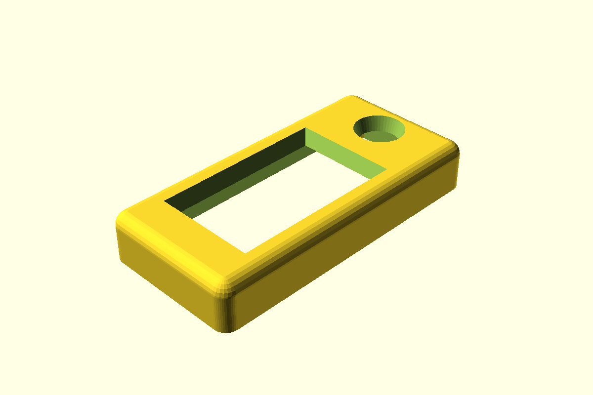

- **What it is**: top cover with curved bullnose, display viewing window, joystick through-hole. No retention rails or lips inside — a separate retention plate (not in this folder) holds the display from below.
- **Footprint**: 91.5 × 44 × 14.5 mm. Cover-local Z = 0 at mating bottom.
- **Houses**: 1× Waveshare 2.13" raw e-paper module, 1× joystick shaft (12 mm hole, tapers to 15 mm at the bullnose top).
- **Mates with**: `middle-platform-v1` below, then `base-v1` underneath.
- **Distinguishing features**: 4 corner pillars run full-height up through the face plate; M3 clearance bores are blind from below (capped at face-plate bottom) so no holes are visible on the front face. Window length 48 × depth 27, shifted +X by 3 mm toward the joystick to give a thicker bezel on the battery side.

### `top-cover-windowed-screen-inlay-v1__3mm-fpc-divet`

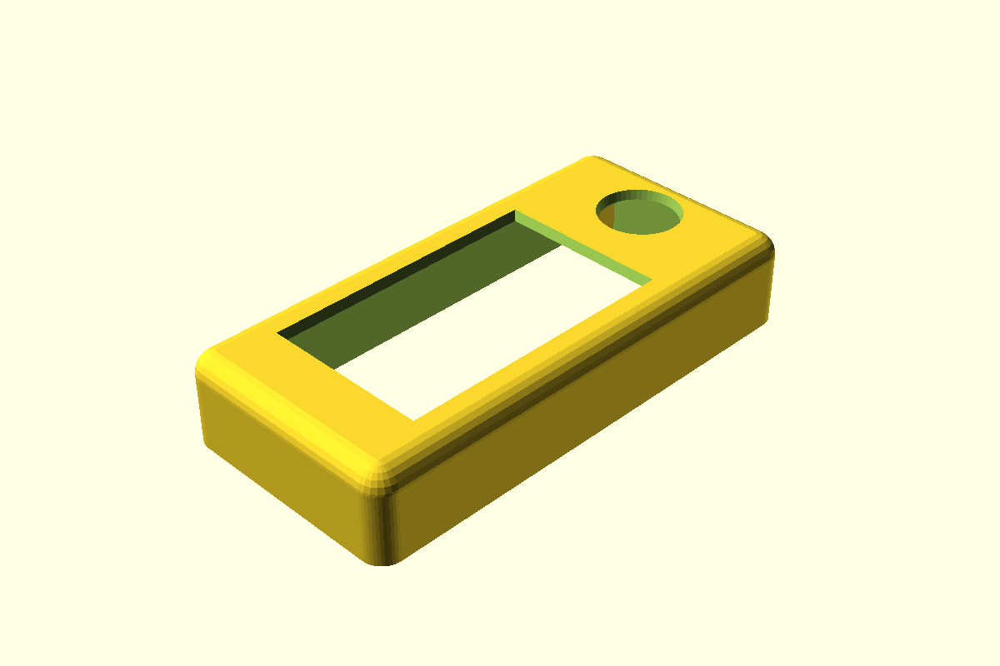

- **What it is**: variant of `top-cover-windowed-v1` with a Waveshare-sized recess carved 3 mm up into the face-plate underside, plus a 20 × 20 mm joystick-PCB pocket and 4 blind M3 mount bores at the +X end.
- **Footprint**: same as v1 (91.5 × 44 × 14.7 after 0.5 → 0.7 mm face-plate thickness bump).
- **Houses**: same display + 1× custom joystick PCB (20 × 20 mm, with 15 × 15 mm M3 hole pattern; the joystick component sits 0.65 mm +X of the PCB center).
- **Mates with**: `middle-platform-v1` + `base-v1`.
- **Distinguishing features**: 3 mm screen inlay recess + **3 mm**-deep FPC ribbon divet on the -X wall (thins it from 3 mm to 1 mm in a 13 mm-wide Y band so the display's FPC can exit toward the battery end).

### `top-cover-windowed-screen-inlay-v1-2mm__2mm-fpc-divet`

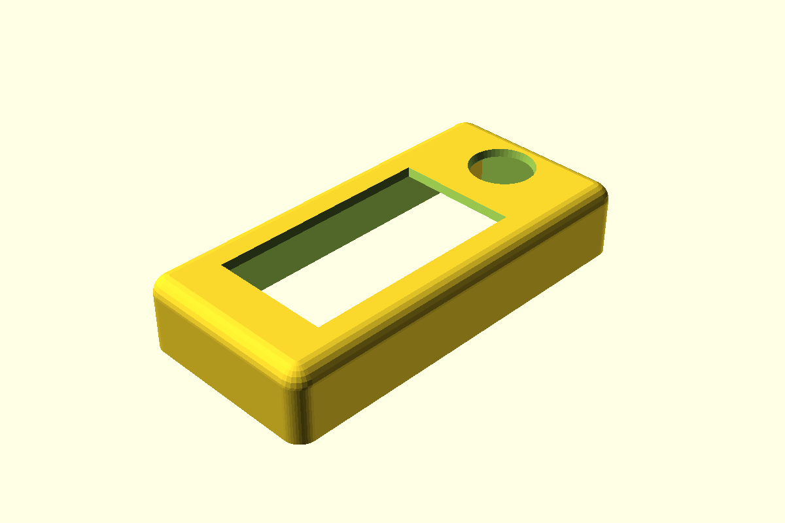

- **What it is**: same as the `v1` inlay variant, but the FPC ribbon divet is 2 mm deep below the face-plate bottom instead of 3 mm. Print both, compare flush fit, commit to a final divet depth.
- **Footprint**: identical to `v1` inlay.
- **Houses**: identical.
- **Mates with**: identical.
- **Distinguishing features**: only `fpc_ribbon_divet_z_extend_below_inlay_mm` differs (2 vs 3).

### `base-v1__1000mAh-flat-cell-44y`

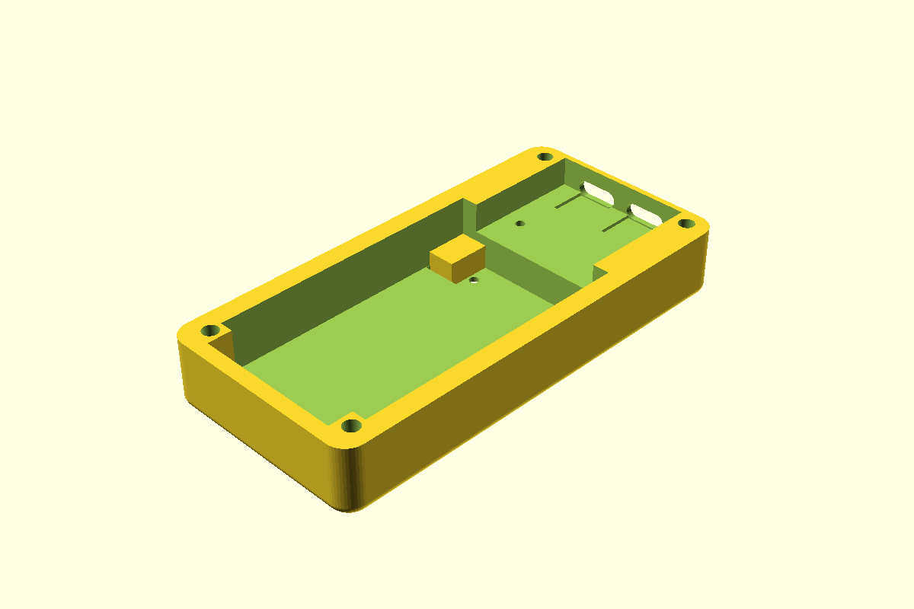

- **What it is**: bottom shell of the original 3-piece Rev 2 enclosure. ESP32 dev board on overhang shelf at the +X half, 1000 mAh flat Li-Po cell on the -X half, two USB-C cutouts on the +X end wall.
- **Footprint**: 91.5 × 44 × 14, curved bottom fillet.
- **Houses**: 1× 1000 mAh flat Li-Po (52 × 35 mm footprint), 1× ESP32-S3 dev board (mounted component-side DOWN on the +X shelf), 2× USB-C panel-mount.
- **Mates with**: `middle-platform-v1` above.
- **Distinguishing features**: -Y-edge battery-floor pit (10 × 35.5 × 2 mm) for a battery-side connector; battery-stop pillars on the -X face of the divider; 4 corner pillars with M3 through-bolts; BOOT/RST paperclip holes through the floor under the ESP32.

### `middle-platform-v1__44y-with-pedestal`


- **What it is**: mid-stack platform — 8 mm shell with a solid -X internal pedestal that pokes 5 mm above the shell top to support the display from below.
- **Footprint**: 91.5 × 44 × 8 (shell) + 5 mm pedestal at -X interior — top-of-pedestal at Z = 13 globally.
- **Houses**: no electronics directly. Provides display-edge support pedestal on the battery half + open chamber on the ESP32 half.
- **Mates with**: `base-v1` below, `top-cover-windowed-v1` (or inlay siblings) above.
- **Distinguishing features**: thicker ±Y long walls (8 mm) than base/cover (2 mm) for stiffness; corner pillars use base-v1's 2 mm wall reference for screw-pattern alignment, not this file's 8 mm.

---

## 2026-04-24 21:24 — Dual-10440 / 2-piece alteration fork (46 mm Y)

Files in `04-24-designs-alterations/` representing a redesign session: outer width grew from 44 → **46 mm** to flank a centered Pico W with two 10440 Li-ion cells; later iterations dropped the middle platform entirely.

### `top-cover-windowed-v1__alteration-fork`

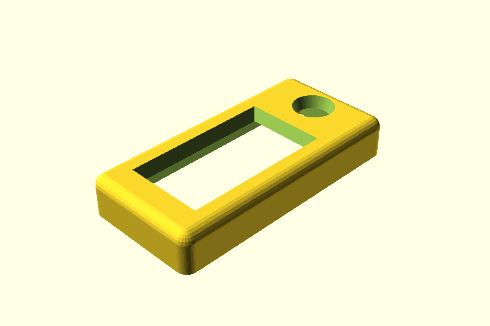

- **What it is**: copy of the live `top-cover-windowed-v1` parked in the alterations folder for experimental tweaks. Functionally identical to its parent at the time of fork.
- **Footprint**: 91.5 × 44 × 14.5.
- **Houses / Mates with**: same as the live `top-cover-windowed-v1`.
- **Distinguishing features**: this is the diverged copy in the alterations folder; the parent-folder version is the canonical "live" file.

### `top-cover-windowed-screen-inlay-pico2-v2-2mm__pico2-board-46y`


- **What it is**: variant of the v2-46y inlay cover sized for the **Raspberry Pi Pico 2** instead of the Pico W (slightly different board outline; same length, different connector layout).
- **Footprint**: 91.5 × 46 × 14.5.
- **Houses**: 1× Pi Pico 2, 1× Waveshare 2.13", 2× 10440 cells.
- **Mates with**: `base-v3-2piece` / `base-v4-2piece-open` (or a Pico-2-specific base).
- **Distinguishing features**: same outer geometry as the v2-46y inlay cover; only inner pocket dimensions and Pico cutout differ to suit the Pico 2 footprint.

### `top-cover-windowed-screen-inlay-v2-46y__dual-10440-46y`

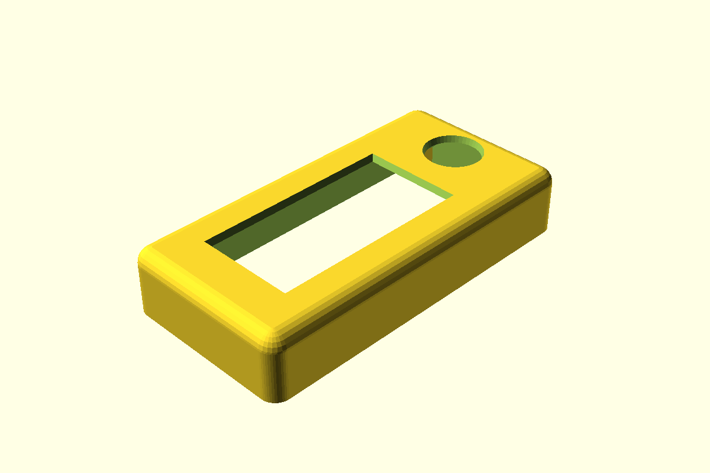

- **What it is**: the inlay cover redesigned for the dual-10440 case (46 mm Y instead of 44).
- **Footprint**: 91.5 × 46 × 14.5.
- **Houses**: 1× Waveshare 2.13", 1× custom joystick PCB. Cells/Pico are in the base, not the cover.
- **Mates with**: `base-v2-thin-dual-10440` + `middle-platform-v2-46y` (3-piece dual-10440 variant).
- **Distinguishing features**: same inlay/divet/joystick-pocket pattern as the v1 inlay, but at 46 mm Y. All Y-dependent positions shifted +1 mm to recenter on the new Y centerline (Y=23 instead of 22).

### `top-cover-windowed-screen-inlay-v3-2piece__no-mid-platform-46y`

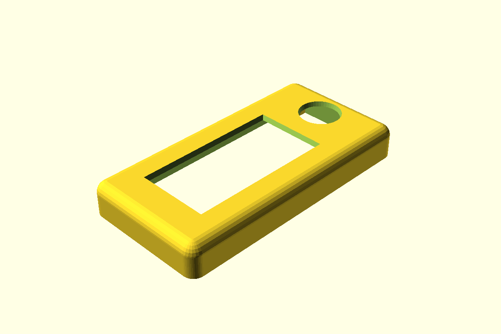

- **What it is**: cover for the **2-piece** dual-10440 design. The middle-platform pedestal is removed because the base now extends up to perform the same role.
- **Footprint**: 91.5 × 46 × **11.7** (shorter than the 3-piece covers — face-plate sits at Z=7 instead of Z=10 because there's no 5 mm pedestal-protrusion reservation below).
- **Houses**: same as v2-46y; positions shifted because the cover is shallower.
- **Mates with**: `base-v3-2piece` OR `base-v4-2piece-open` directly (no middle-platform).
- **Distinguishing features**: `middle_platform_pedestal_protrusion_into_cover_z_mm = 0` — display PCB sits directly on the base's top rim at global Z = 14. The mount-bore positions for the joystick PCB are commented out pending a final retention scheme.

### `base-v2-thin-dual-10440__46y-flanking-cells`

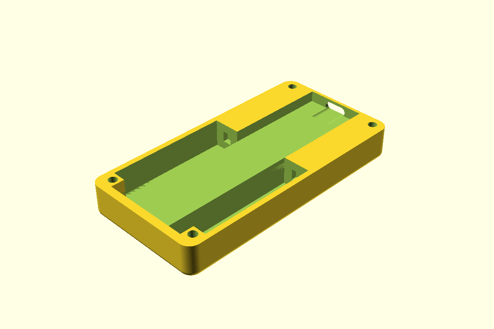

- **What it is**: redesigned base for two flanking 10440 cells with a Pico W down the centerline.
- **Footprint**: 91.5 × 46 × 12 (lower than base-v1; 10440s lay on their side).
- **Houses**: 2× 10440 Li-ion (10 × 44 mm each, ~700 mAh combined), 1× Raspberry Pi Pico W, 2× cell spring contacts at each cell's ±X end.
- **Mates with**: `middle-platform-v2-46y` + a v2-46y top cover.
- **Distinguishing features**: 10440 cells in dedicated ±Y bays at z = 2 → 12, ceiling at z = 12 traps the cells. Charge plan: existing TP4056 with R_prog ≈ 3.4 kΩ for 350 mA CC.

### `base-v3-2piece__absorbs-mid-platform-46y`

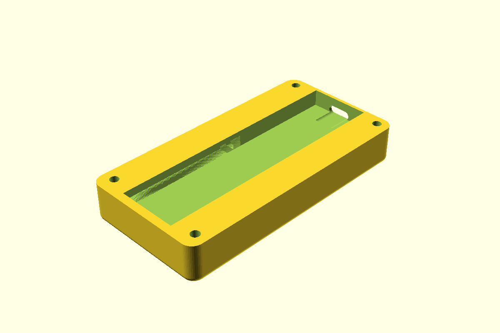

- **What it is**: 2-piece variant of base-v2 that grows in Z from 12 → **14** to absorb the middle-platform's display-support role. Stack collapses to base + cover.
- **Footprint**: 91.5 × 46 × 14.
- **Houses**: same as base-v2; ±Y rim above z = 12 also acts as the display-edge support ledge previously provided by the middle platform.
- **Mates with**: `top-cover-windowed-screen-inlay-v3-2piece` (only the v3 cover — the v2-46y cover assumes a middle platform underneath).
- **Distinguishing features**: cell bay ceiling stays at z = 12 (cells stay trapped at z = 10 above the 2 mm floor plate); the 12 → 14 mm growth is pure rim material above the cells. Pico W chamber centered in Y (12.1 → 33.9), shelf top at z = 8, extends to case top at z = 14.

### `base-v4-2piece-open__slot-load-batteries-46y`

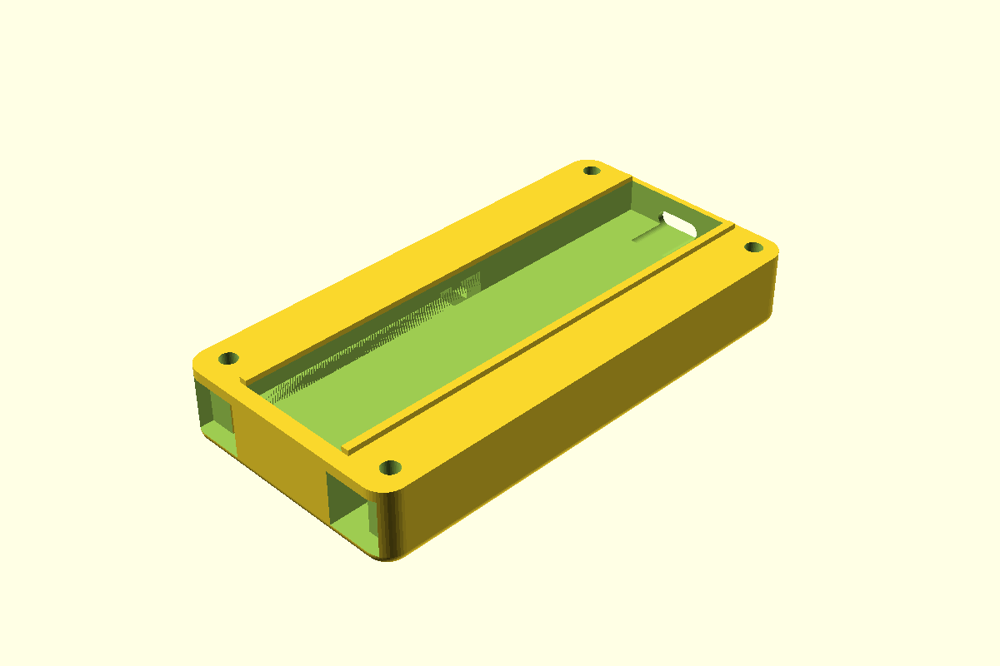

- **What it is**: base-v3-2piece with two through-wall slots cut into the -X end wall, one per cell bay, so cells can be loaded from outside instead of being trapped inside a sealed bay. Optional snap-on door clip closes the slots.
- **Footprint**: same as base-v3 — 91.5 × 46 × 14.
- **Houses**: same.
- **Mates with**: same — `top-cover-windowed-screen-inlay-v3-2piece`.
- **Distinguishing features**: -X wall slots match each cell's Y × Z cross section; cell slides in axially and is pressed against a +X stop by a -X spring contact. Two raised lips along the +Y/-Y inner edge of the Pico chamber stick 1 mm above z = 14 so they engage the cover's interior cavity for alignment.

### `middle-platform-v2-46y__46y-pedestal-variant`

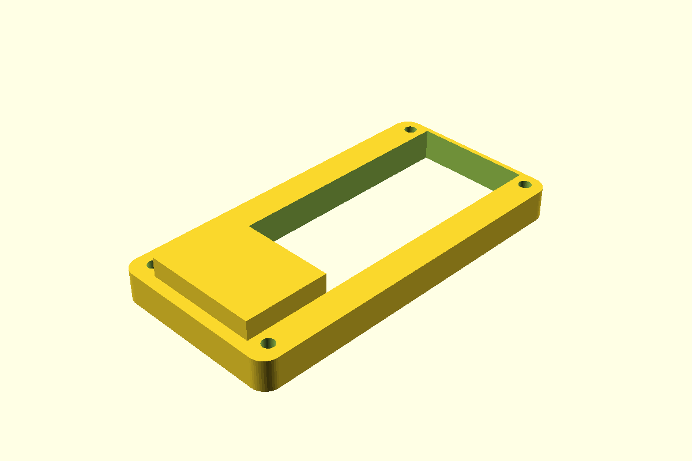

- **What it is**: 46 mm Y version of `middle-platform-v1` — same pedestal architecture, wider for the dual-10440 redesign.
- **Footprint**: 91.5 × 46 × 8 + 5 mm pedestal poking above on the -X interior.
- **Houses**: structural; no electronics directly.
- **Mates with**: `base-v2-thin-dual-10440` below, `top-cover-windowed-screen-inlay-v2-46y` (or pico2 variant) above.
- **Distinguishing features**: 46 mm Y; pillar positions still anchor at the 2 mm base-wall reference, not the 8 mm long-wall.

---

## 2026-04-24 23:33 — AAA cradle insert

### `aaa-cradle-insert-v1__2x-aaa-pico-nest-46y`

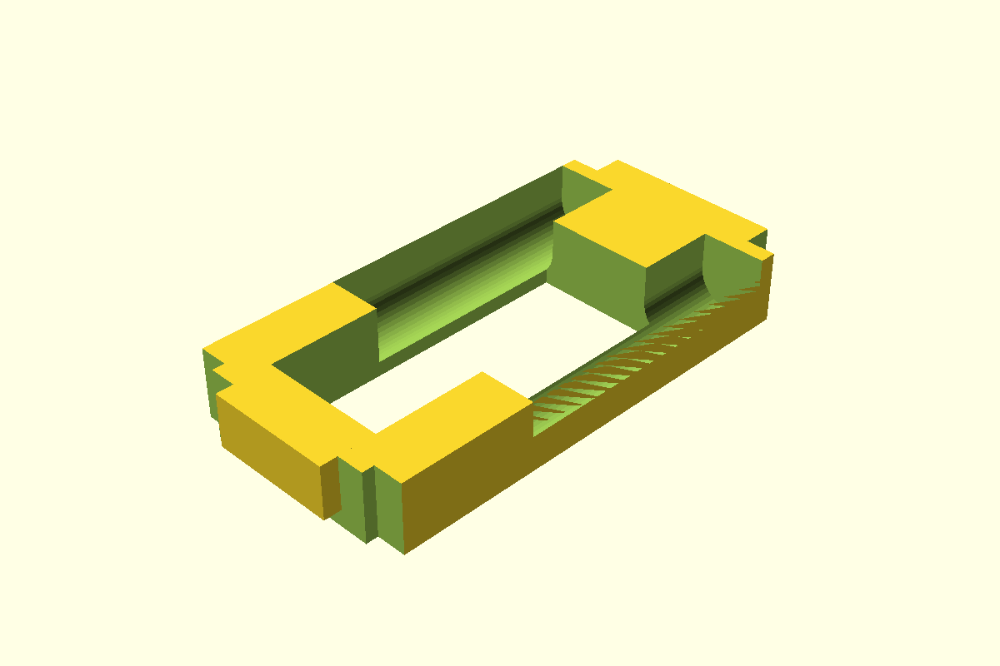

- **What it is**: drop-in plug shaped like the negative space of `top-cover-windowed-screen-inlay-v3-2piece`'s interior. Holds two AAAs at the cover's ±Y long edges, with a Pico-W-sized through-cut down the middle Y stripe and an FPC ribbon gap at the -X end.
- **Footprint**: 86.7 × 41.4 × 12.1.
- **Houses**: 2× AAA cells (10.5 × 44.5 mm each, ~1200 mAh per pair alkaline), 1× Pico W (nests in the central cutout, sits against the back of the Waveshare).
- **Mates with**: `top-cover-windowed-screen-inlay-v3-2piece` above + `base-plate-v1` below.
- **Distinguishing features**: cells lay along X; each bay's top half is cut away above the cell equator so the cell drops in from above instead of sliding in end-on. Connecting block at X=3.3 → 12.8, Z=-2.1 → 7 fills the Pico nest's -X end with solid material, leaving a 3 mm cable pass-through underneath the block.

---

## 2026-04-25 00:35 — Base plate

### `base-plate-v1__snap-pegs-46y`

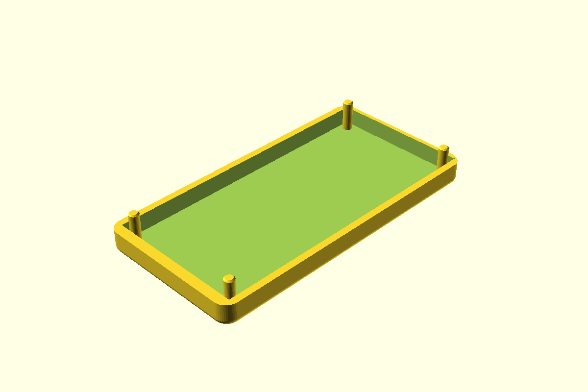

- **What it is**: shallow tray that closes the bottom of the AAA-cradle / v3-2piece-cover stack. Has 4 snap pegs at the cover's screw-bore positions and a recessed pocket that receives the cradle's bottom 5.1 mm.
- **Footprint**: 91.5 × 46 × 7, curved bottom fillet matching base-v3-2piece's outer profile.
- **Houses**: structural — no electronics directly. Provides bottom retention and snap-fit alignment to the cover.
- **Mates with**: `aaa-cradle-insert-v1` (drops into pocket) + `top-cover-windowed-screen-inlay-v3-2piece` (pegs slip into cover's blind M3 bores).
- **Distinguishing features**: 4 pegs ⌀ 3.0 mm, 9.3 mm long total, rise from the **pocket floor** (Z = 1.7) up through 4 mm above the plate top. Chamfered 0.4 mm tips guide each peg into the cover's 3.2 mm M3 bore. Pocket 5.3 mm deep with 0.2 mm slop so the cradle settles cleanly. Outer sides print flush with the cover above (both are 91.5 × 46 with 4 mm corner radius).
