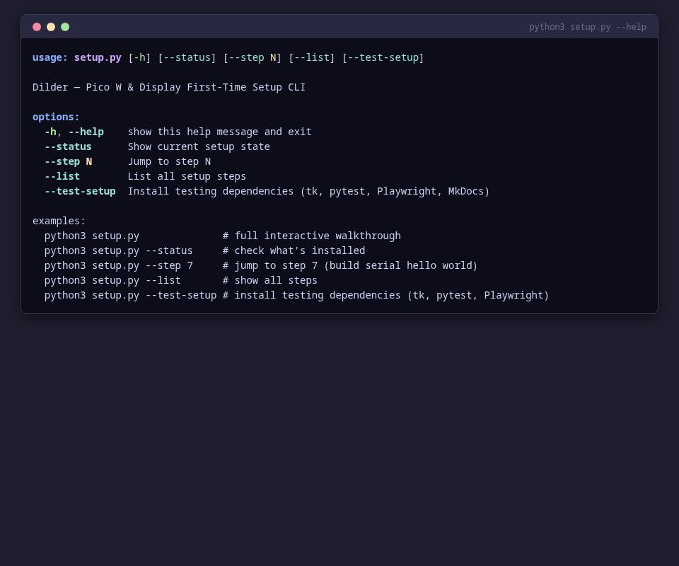
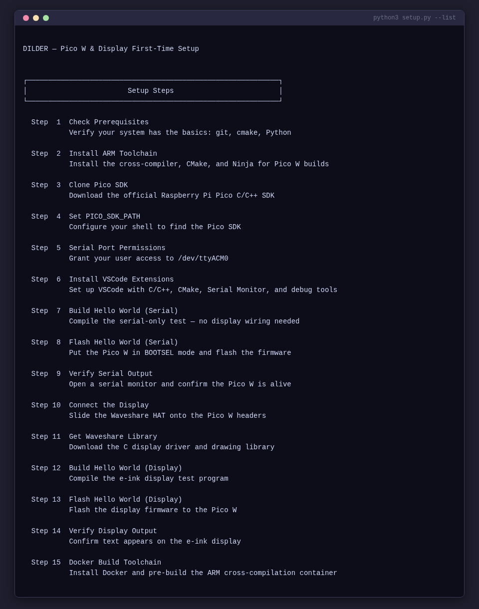
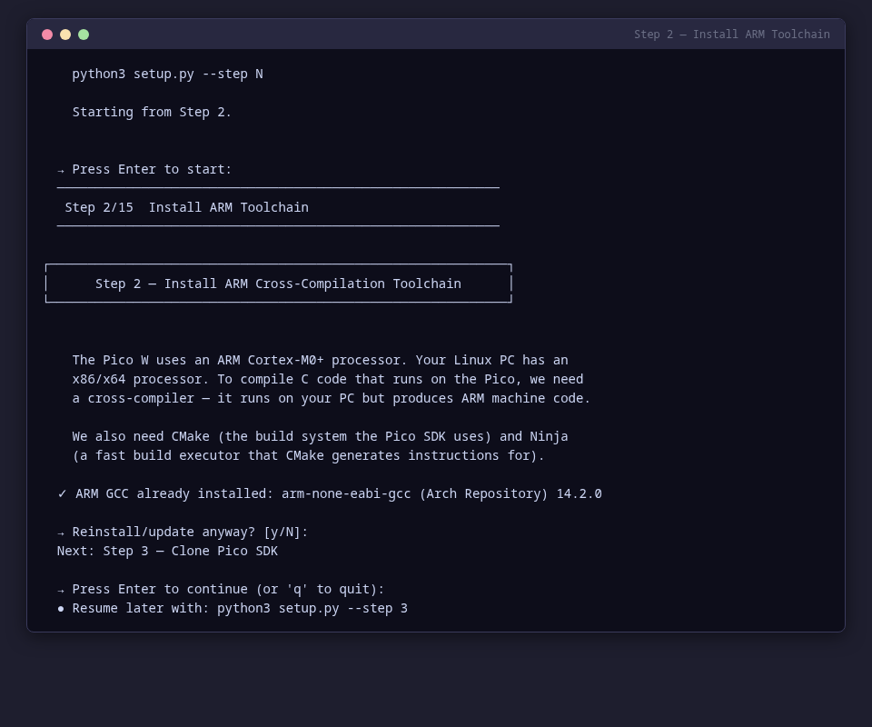
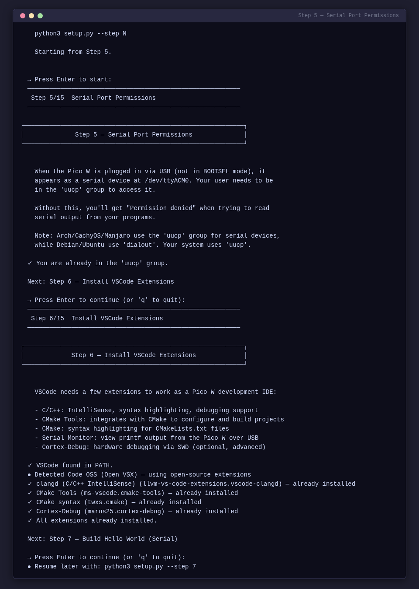
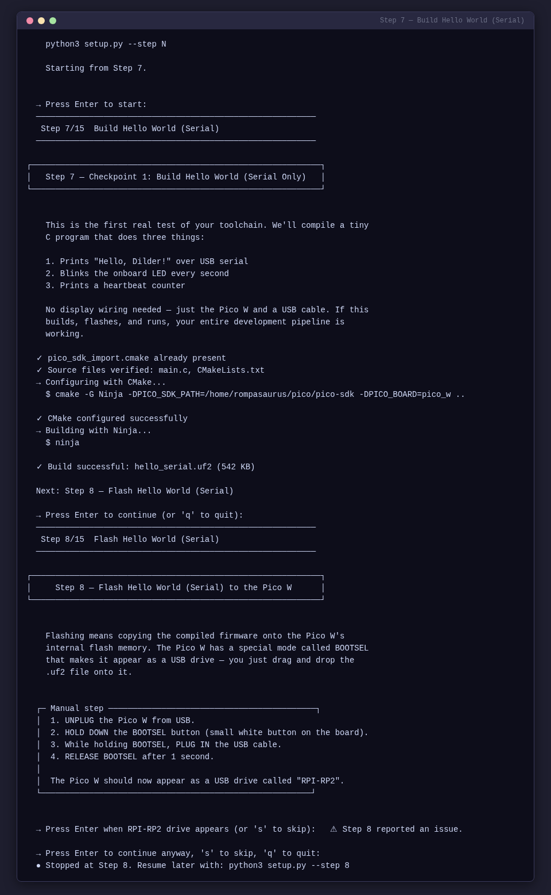
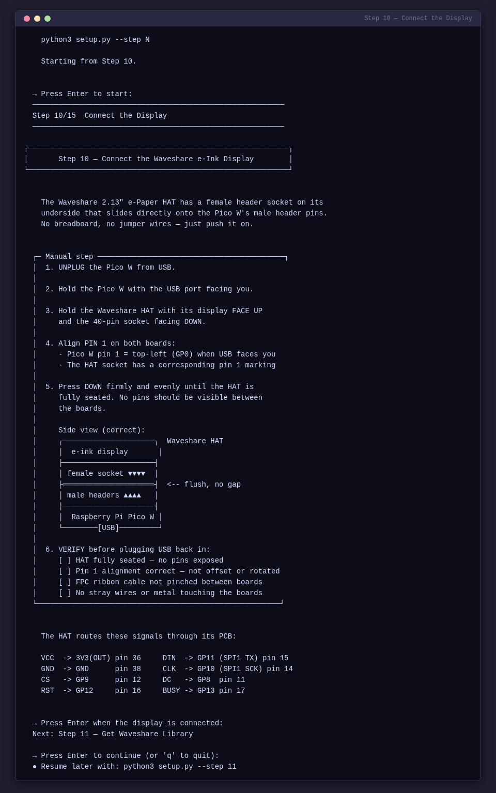
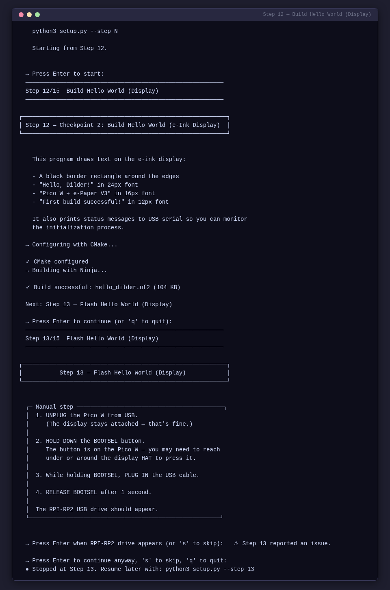
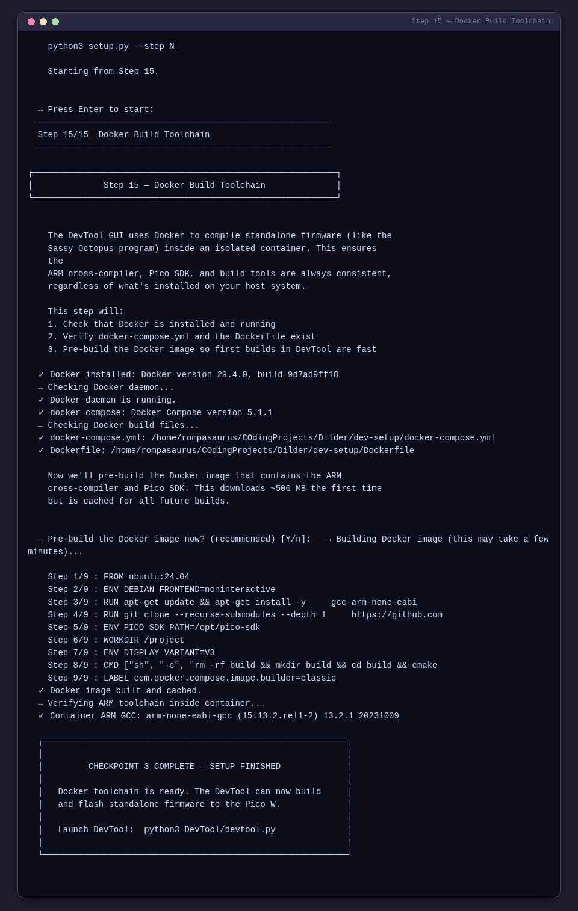
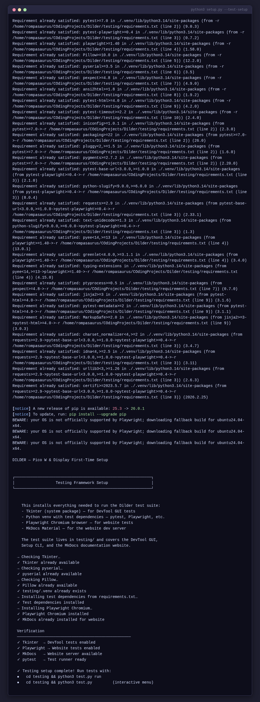

# Setup CLI User Guide

> Auto-generated from 19 test screenshots.
> Re-run the test suite to update: `pytest setup_cli/ -m screenshot`

---

## Cli

### Setup Cli Help Rendered

The setup.py help output showing all available flags and usage examples.

### Setup Cli List Rendered

The step list output showing all 15 setup steps with their status.

### Setup Cli Status Rendered

The environment status output showing installed tools, SDK paths, Docker, and testing framework.

### Setup Cli Step 01

Step 1 — Check Prerequisites: verifies git, cmake, Python, Tkinter, and pyserial are installed.

### Setup Cli Step 02

Step 2 — Install ARM Toolchain: installs arm-none-eabi-gcc, cmake, and ninja via the distro package manager.

### Setup Cli Step 03

Step 3 — Clone Pico SDK: downloads the official pico-sdk with all submodules.

### Setup Cli Step 04

Step 4 — Set PICO_SDK_PATH: appends the SDK path export to your shell rc file.

### Setup Cli Step 05

Step 5 — Serial Port Permissions: adds user to the uucp/dialout serial group.

### Setup Cli Step 06

Step 6 — Install VSCode Extensions: installs C/C++, CMake Tools, and Cortex-Debug extensions.

### Setup Cli Step 07

Step 7 — Build Hello World (Serial): CMake configure and Ninja build for the serial test firmware.

### Setup Cli Step 08

Step 8 — Flash Hello World (Serial): BOOTSEL detection and UF2 firmware flash.

### Setup Cli Step 09

Step 9 — Verify Serial Output: confirms the Pico W is alive via serial monitor.

### Setup Cli Step 10

Step 10 — Connect the Display: step-by-step HAT attachment instructions with ASCII diagrams.

### Setup Cli Step 11

Step 11 — Get Waveshare Library: downloads the C display driver and font files.

### Setup Cli Step 12

Step 12 — Build Hello World (Display): CMake + Ninja build for the display firmware.

### Setup Cli Step 13

Step 13 — Flash Hello World (Display): BOOTSEL detection and display firmware flash.

### Setup Cli Step 14

Step 14 — Verify Display Output: confirms text appears on the e-ink display.

### Setup Cli Step 15

Step 15 — Docker Build Toolchain: installs Docker and pre-builds the ARM cross-compilation container.

### Setup Cli Test Setup Rendered

The --test-setup output showing testing framework installation progress.

