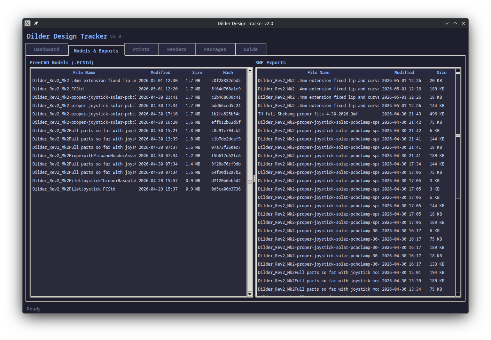
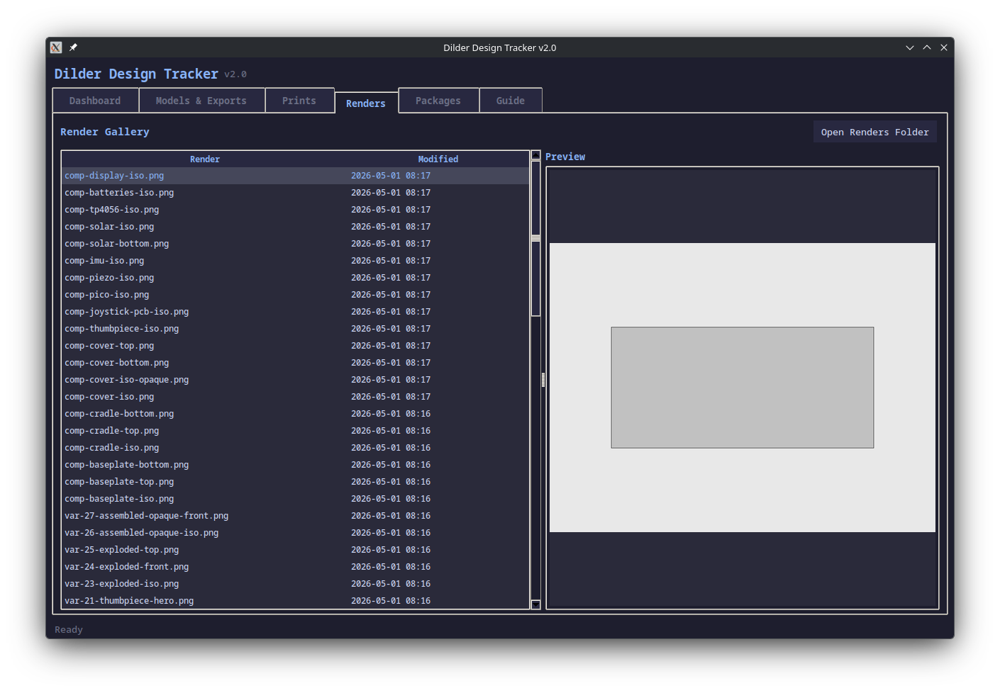
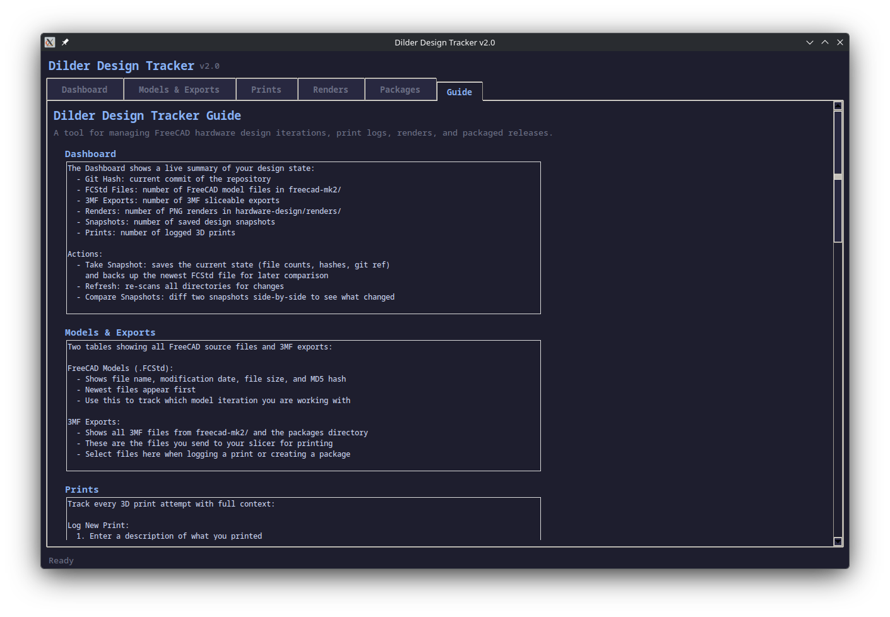

# Dilder Design Tracker v2.0

Version history, print log, render gallery, and print-package management for
FreeCAD hardware iterations. Tracks every design snapshot, 3D print attempt,
and bundles related files into packages for easy archival.

## Screenshots

### Dashboard


Live summary of the project: git hash, file counts, snapshot/print timeline.
Take snapshots, compare states, and monitor design evolution at a glance.

### Models & Exports


Side-by-side tables of all FreeCAD `.FCStd` model files (with hashes for
change detection) and all `.3mf` slicer-ready exports.

### Renders


Gallery of all render PNGs from `hardware-design/renders/`. Click any render
to see a live image preview. Open the folder in your file manager.

### Guide


Built-in reference guide covering every tab, the design-print-review
workflow, naming conventions, and CLI commands.

## Quick Start

```bash
# Launch the GUI (default)
python3 tools/design-tracker/design-tracker.py

# Or use the CLI
python3 tools/design-tracker/design-tracker.py --cli
```

## Features

### Dashboard Tab
- **Current State**: git hash, FCStd count, 3MF count, render count,
  snapshot count, print count
- **Timeline**: merged chronological view of snapshots, prints, and packages
  with color coding (green = snapshot, magenta = print, orange = package)
- **Take Snapshot**: saves file counts, hashes, git ref, and backs up the
  newest FCStd file to `.design-tracker/snapshots/`
- **Compare Snapshots**: diff two snapshots side-by-side showing count
  deltas, hash changes, added/removed renders

### Models & Exports Tab
- **FreeCAD Models**: all `.FCStd` files sorted by modification date with
  file name, date, size, and MD5 hash
- **3MF Exports**: all `.3mf` files from `freecad-mk2/` and the packages
  directory, sorted by date

### Prints Tab
- **Log New Print**: record what you printed with:
  - Description, result (success/partial/failed), notes
  - 3MF file selection from scan
  - Camera photo attachment (PNG/JPG)
- **Attach Photo**: add camera pictures to existing print entries
- **Print Details**: click any row to see full metadata, files, notes,
  and attached photo paths

### Renders Tab
- **Gallery list**: all render PNGs from `hardware-design/renders/`
  sorted by modification date
- **Live preview**: click any render to see it in the preview pane
  (requires Pillow for image display)
- **Open Renders Folder**: launch system file manager

### Packages Tab
- **Create Package**: bundle files into a tracked folder containing:
  - A FreeCAD model file (frozen copy)
  - Selected 3MF exports
  - `renders/` subfolder with selected render images
  - `photos/` subfolder with camera pictures of physical prints
  - `CHANGES.md` with changelog, metadata, git hash, and file manifest
- **Link to snapshot/print**: connect a package to a specific snapshot
  and/or print entry for traceability
- **Package Contents**: click any row to view the `CHANGES.md`
- Packages stored in `.design-tracker/packages/`

### Guide Tab
- Built-in reference covering every tab and feature
- Recommended design-print-review workflow
- File naming conventions
- CLI command reference

## Walkthrough: Design-Print-Review Cycle

### 1. Make changes in FreeCAD
Edit the macro (`dilder_rev2_mk2.FCMacro`), run it in FreeCAD to rebuild
the model, and save the `.FCStd` file.

### 2. Take a Snapshot
Open the Dashboard tab and click **Take Snapshot**. Enter a description
like "widened USB cutout by 0.2mm". This saves:
- Current file counts and hashes
- Git commit reference
- A backup copy of the newest FCStd file

### 3. Export 3MF files
In FreeCAD, export each body (BasePlate, AAACradle, TopCover) as `.3mf`
files for your slicer. These appear automatically in the Models & Exports tab.

### 4. Print and log the result
Slice and print your parts. Then open the **Prints** tab and click
**Log New Print**:
- Describe what you printed ("AAACradle with widened USB cutout")
- Select which 3MF files were used from the list
- Set the result: `success`, `partial`, or `failed`
- Add notes about print settings, issues, or observations

### 5. Attach camera photos
After the print finishes, take photos of the physical parts. Back in the
Prints tab, select your print entry and click **Attach Photo to Print**.
Browse to select your camera photos (PNG/JPG). These are tracked by path
in the print record.

### 6. Create a package
Open the **Packages** tab and click **Create Package** to bundle everything:
- Name it (e.g., "Rev2 Mk2 -- widened USB 0.2mm + extended 0.4mm")
- Link it to the snapshot you took in step 2
- Link it to the print you logged in step 4
- Select the FCStd file used
- Select the 3MF files that were printed
- Add renders from the renders gallery
- Add camera photos of the physical print
- Write a changelog describing what changed and why

This creates a self-contained folder with all artifacts and a `CHANGES.md`
manifest for future reference.

### 7. Commit to git
When satisfied with the iteration, commit your changes.

## CLI Commands

```bash
python3 design-tracker.py               # launch GUI (default)
python3 design-tracker.py --cli         # interactive terminal menu
python3 design-tracker.py snap "msg"    # quick snapshot
python3 design-tracker.py log           # show timeline
python3 design-tracker.py status        # current design state
python3 design-tracker.py diff 1 2      # compare snapshots 1 and 2
python3 design-tracker.py naming        # naming convention guide
```

## File Structure

```
tools/design-tracker/
  design-tracker.py          # main script (GUI + CLI)
  README.md                  # this file
  screenshots/               # GUI screenshots for docs
  .design-tracker/
    history.json             # all snapshots, prints, packages
    snapshots/
      snap-0001/             # FCStd backup from snapshot 1
      snap-0002/             # FCStd backup from snapshot 2
    packages/
      pkg-0001_2026-05-01_1430_widened-usb/
        Dilder_Rev2_Mk2.FCStd
        *.3mf
        renders/             # selected render PNGs
        photos/              # camera pictures of prints
        CHANGES.md           # changelog + file manifest
```

## Dependencies

- Python 3.8+
- tkinter (standard library)
- Pillow (`pip install Pillow`) -- for render image previews

## Theme

Catppuccin Mocha dark theme matching the DesignTool companion app.
