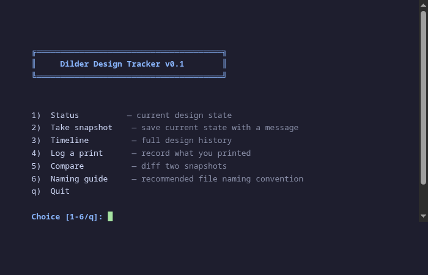
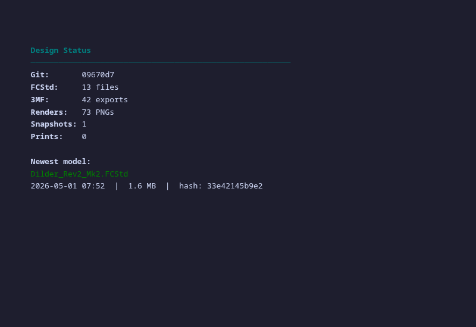

# How to Stop Drowning in FreeCAD Files (and a Tool to Help)

After two weeks of daily CAD iterations, I had 13 FCStd files with names like *"Dilder_Rev2_Mk2Full parts so far with joystick model with battery assembly even closer joystick and pit refined and cradle curvature fixed pcbjoystick anchor.FCStd"*. I couldn't tell which one I'd actually printed, what changed between versions, or which iteration had that one tweak that worked really well three days ago.

Sound familiar? Here's how I fixed it.

<!-- more -->

## The Mess

Every FreeCAD "Save As" creates a new file. You name it something descriptive in the moment, but three saves later you've got filenames that wrap across two terminal lines. You print one, tweak something, print again, and within a day you've lost track of which physical print came from which file.

Git helps with the macro (it's just Python text), but FCStd files are binary ZIP archives — git can't diff them, so every commit is a full copy with no visibility into what actually changed.

## The Workflow That Works

After a lot of trial and error, here's what actually keeps things manageable:

### Name files like commits, not like diary entries

**Pattern:** `Dilder_Rev2_Mk2-<what-changed>-<DD-MM-YYYY-HHMM>.FCStd`

Keep the change description to 2-4 words. Date and time at the end so files sort chronologically. No spaces — hyphens only.

Good: `Dilder_Rev2_Mk2-widened-inlay-01-05-2026-0930.FCStd`

Bad: `Dilder_Rev2_Mk2Full parts so far with joystick model with battery assembly even closer joystick and pit refined and cradle curvature fixed pcbjoystick anchor.FCStd`

### Snapshot before you print

Before sending anything to the slicer, take a snapshot. It's a 2-second command that records the current state — which files exist, their checksums, how many renders you have, and a backup copy of the newest FCStd. When you're trying to figure out "which version was that print from?" a week later, the snapshot timeline answers instantly.

### Log the print result

Did it fit? Was the tolerance too tight? Did the bridging fail on the battery rail? Log it while it's fresh. A week later you won't remember whether the 20mm pit or the 23mm pit was the one that rattled.

### Render after each milestone

The [Build & Render Tool](../../docs/tools/build-render-tool.md) generates 40+ images in one run. These are your visual diff — flip between two sets of renders and you can *see* what changed, even in areas you didn't think you modified.

## The Design Tracker

I built a small CLI tool that ties all of this together.

<div class="grid" markdown>

<figure markdown="span">
  { width="420" loading=lazy }
  <figcaption>Interactive menu — status, snapshot, timeline, print log, compare, naming guide</figcaption>
</figure>

<figure markdown="span">
  { width="420" loading=lazy }
  <figcaption>Status — shows your current design state at a glance</figcaption>
</figure>

</div>

**What it does:**

- **Status** — how many models, exports, renders you have right now
- **Snapshot** — bookmark the current state with a description (backs up the newest FCStd)
- **Timeline** — chronological history of every snapshot and print
- **Print log** — record what you printed, which files, and how it turned out
- **Compare** — diff any two snapshots to see what changed (file counts, hashes, renders)
- **Naming guide** — the convention printed right in the terminal so you don't have to look it up

It's not trying to replace git — it's the layer on top that tracks the *physical* side of hardware iteration. Git knows your code changed; the Design Tracker knows that change got printed, the print came out 0.2mm too tight, and you fixed it in the next snapshot.

## Speed Tips

Things that actually made the iteration cycle faster:

1. **One macro, many saves.** The parametric macro is the source of truth. FreeCAD files are just rendered snapshots. If you lose them all, re-run the macro and you're back.

2. **Render before you context-switch.** It takes 2 minutes. You'll thank yourself tomorrow when you can't remember what the model looked like before you changed the anchor pad.

3. **Print in batches, not per-change.** Resist the urge to print after every tweak. Get the model right on screen, *then* print. Each failed print costs 45 minutes and 10g of filament.

4. **Name the prints.** Sharpie on the bottom of each print with the snapshot number. Physical parts don't have git hashes on them.

```bash
# The whole cycle in 4 commands
python3 design-tracker.py snap "widened inlay for V3 board"
./build_and_render.sh    # pick model, render
python3 design-tracker.py print
git add -A && git commit -m "widened inlay" && git push
```

[Design Tracker docs :material-arrow-right:](../../docs/tools/design-tracker.md){ .md-button }

[Build & Render Tool docs :material-arrow-right:](../../docs/tools/build-render-tool.md){ .md-button }
