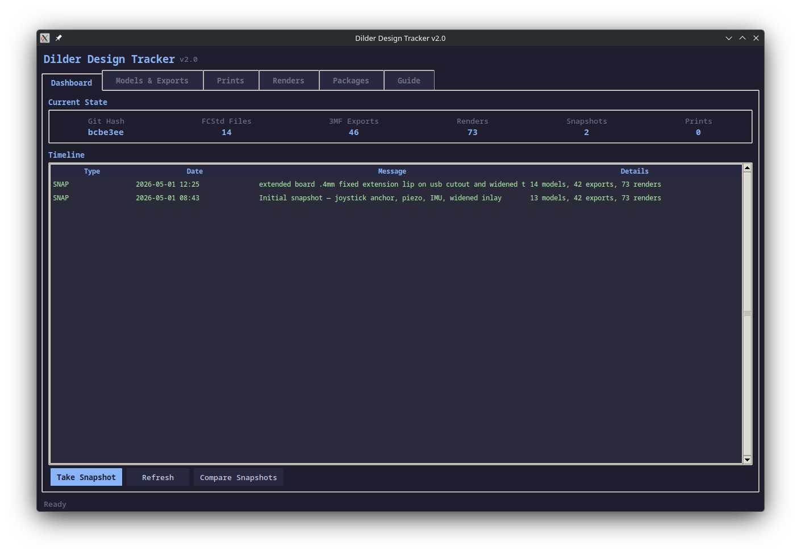

# Design Tracker v2.0 — From CLI to Full GUI with Print Packages

The Design Tracker started as a simple CLI menu for taking snapshots and logging prints. After a few weeks of daily use, the friction was clear: switching between terminal commands to check render images, flipping to a file manager to find the right 3MF, and trying to remember which camera photo went with which print. So I rebuilt it as a full Tkinter GUI with six tabs, a render gallery, camera photo attachment, and a package system that bundles everything together.

<!-- more -->

## What Changed

The original v1.0 was a 7-option terminal menu: status, snapshot, timeline, print log, compare, naming guide, quit. It worked, but every action was text-based and there was no way to *see* anything — no render previews, no side-by-side file tables, no photo management.

v2.0 keeps the full CLI (accessible via `--cli`) but defaults to a GUI with six tabs:

<figure markdown="span">
  { loading=lazy }
  <figcaption>Dashboard — live stats, merged timeline, snapshot/compare actions</figcaption>
</figure>

## The Six Tabs

### Dashboard
Live summary of the project state: git hash, file counts for FCStd/3MF/renders/snapshots/prints. The timeline merges all events (snapshots in green, prints in magenta, packages in orange) into a single chronological view. Take snapshots and compare them without leaving the tab.

### Models & Exports
<figure markdown="span">
  { loading=lazy }
  <figcaption>Side-by-side tables of every FCStd model and 3MF export</figcaption>
</figure>

Two side-by-side tables showing every FreeCAD model (with hashes for change detection) and every 3MF export. Sorted by modification date so the newest iterations are always at the top. The hash column is the key insight — two files with different names but the same hash are identical.

### Prints
Log every print attempt with description, result (success/partial/failed), notes, 3MF file selection, and camera photo attachment. Click any row to see the full detail: files used, notes, git hash, and paths to attached photos.

### Renders
<figure markdown="span">
  { loading=lazy }
  <figcaption>Gallery with live image preview — no more switching to a file manager</figcaption>
</figure>

This was the biggest quality-of-life win. Instead of opening a file manager to browse `hardware-design/renders/`, the Renders tab lists all 73+ PNGs with a live preview pane. Click any render to see it. This is especially useful when deciding which renders to include in a package.

### Packages
The new centerpiece. A package bundles a FreeCAD model, 3MF exports, render images, camera photos, and a changelog into a single tracked folder. Each package gets linked to a snapshot and/or print entry, so you can trace exactly what design state produced which physical print.

The folder structure is self-contained:
```
pkg-0001_2026-05-01_1430_widened-usb/
  Dilder_Rev2_Mk2.FCStd
  Dilder_Rev2_Mk2-BasePlate.3mf
  renders/
    assembled.png
    comp-cradle-iso.png
  photos/
    IMG_20260501_143022.jpg
  CHANGES.md
```

### Guide
Built-in reference covering every tab, the design-print-review workflow, naming conventions, and CLI commands. Scrollable, always accessible, no need to open the README separately.

## The Workflow

The tool is designed around a cycle:

1. Make changes in FreeCAD
2. Take a Snapshot (Dashboard)
3. Export 3MF files
4. Print and log the result (Prints)
5. Take camera photos of the physical print
6. Attach photos to the print entry
7. Create a Package linking everything together
8. Commit to git

Each step feeds into the next, and the Package at the end captures the complete state of that iteration — the design file, the sliced exports, the rendered views, the physical photos, and a written changelog.

## Theme

Same Catppuccin Mocha dark theme as the [DesignTool](../../docs/tools/designtool.md), so both tools feel like parts of the same suite.

## Still CLI-Friendly

Everything still works from the terminal:

```bash
python3 design-tracker.py               # GUI (default)
python3 design-tracker.py --cli         # terminal menu
python3 design-tracker.py snap "msg"    # quick snapshot
python3 design-tracker.py status        # current state
```

The CLI is useful for quick snapshots in the middle of a work session when you don't want to context-switch to a GUI window.

[Design Tracker docs :material-arrow-right:](../../docs/tools/design-tracker.md){ .md-button }
