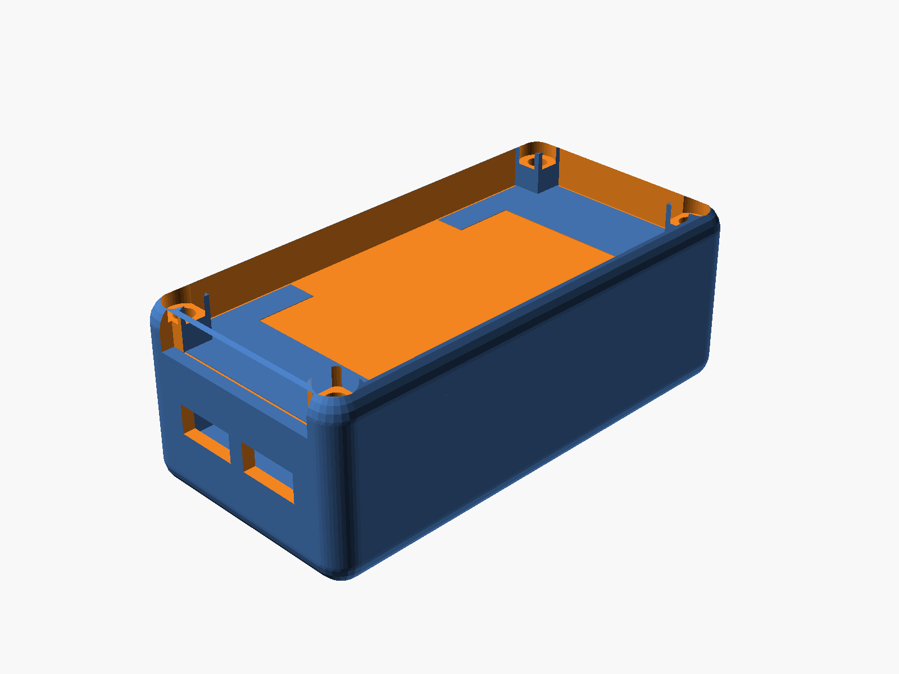
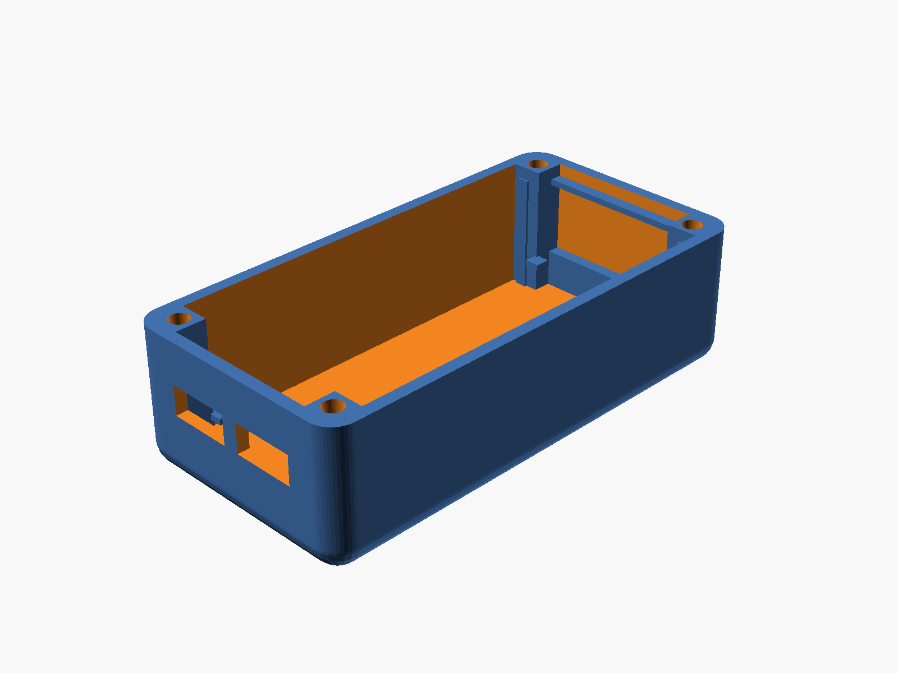
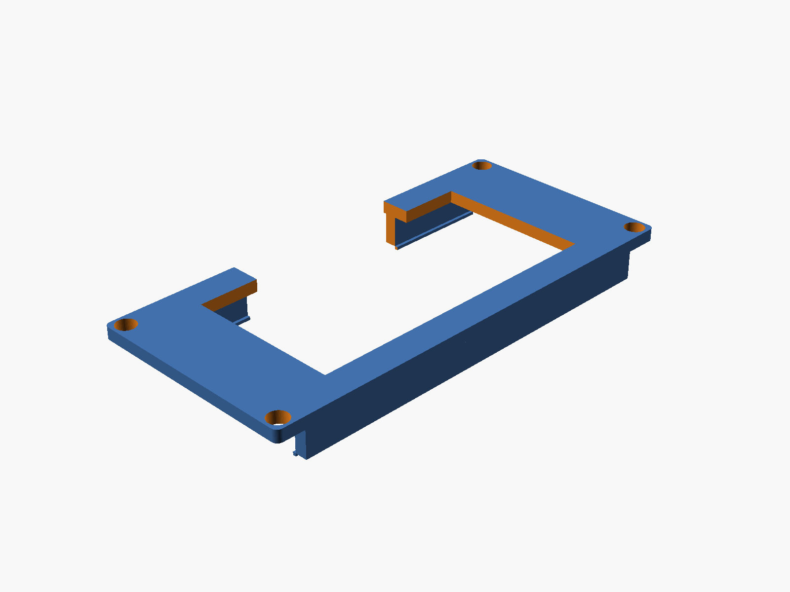
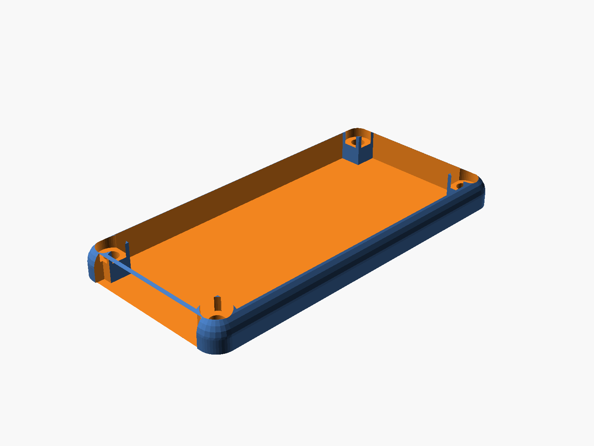
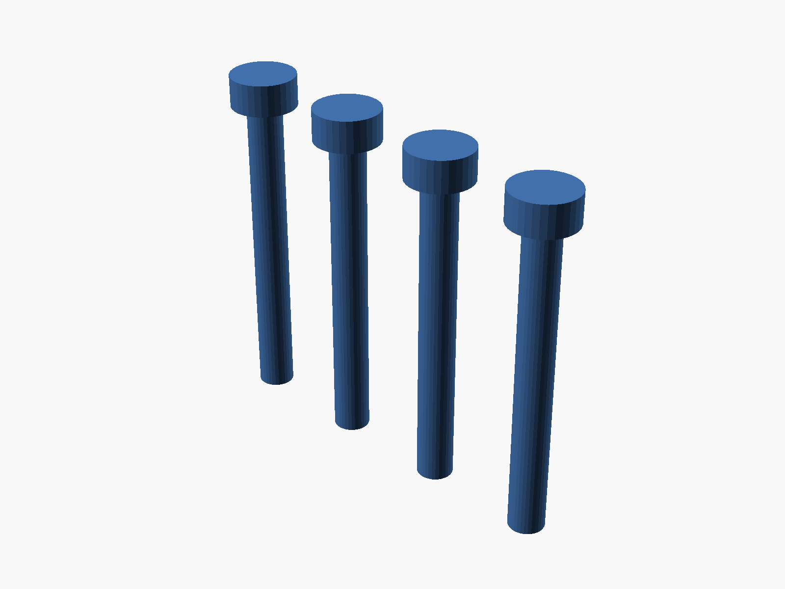

# Sandwich Enclosure — From a UEXT Question to a 5-Piece Parametric Case

Started as a quick question — "can I plug the Waveshare display into the pUEXT1 port on my Olimex ESP32-S3-DevKit-Lipo?" — and ended as a full parametric OpenSCAD case with five printable pieces: base, middle tray, top-mid display retainer, open-top cover, and four plastic weld-shut screws.

<!-- more -->

{ width="720" loading=lazy }

## How it started

The Olimex dev board has a `pUEXT1` connector on its silkscreen — a 10-pin UEXT10 header with 3.3V, GND, UART, I²C, and SPI all broken out. The Waveshare 2.13" e-paper needs SPI (MOSI, CLK, CS) plus three control lines (DC, RST, BUSY). That's 5 of the 8 signals present on UEXT1, so the answer was "yes, but you'll need to repurpose the MISO and UART pins as plain GPIO for DC/RST/BUSY, and you'll need a custom adapter since UEXT uses a BM10B-SRSS-TB plug, not the 8-pin JST-SH the display ships with."

The follow-up question ("can I wire it into the USB-OTG port?") was more clearly no — USB-OTG is a protocol port with 4 wires, none of which speak SPI, and VBUS is 5V which would fry the 3.3V display.

Then the project pivoted. "Let's make an SCAD script to plot out a 3D-printed sandwich mount."

## Iteration 1 — a literal sandwich

First pass was a minimal 3-plate clamp: 4 corner pillars, a plate under the board's header strips, a second plate 6mm below to clear the pin tips, and a top plate covering everything except a 20mm window for the WROOM module and antenna. Board floats in the middle, screws run the full height.

That got the geometry right but the moment I imported measurements for the battery (35 × 52 × 5mm) and display (30 × 65 × 5mm), the whole thing needed to grow into a real enclosure.

## Iteration 2 — the full stack

Battery → middle tray → board → display → top-mid plate → cover. Six levels, three printable pieces + cover.

{ width="540" loading=lazy }

The base is where most of the complexity landed. It has:

- A floor for the battery to sit on
- Walls with **only** the USB-C cutouts (after I removed the original display side-slots — more on that below)
- 4 corner pillars with M3 screw channels
- A lower shelf at z=8 for the middle plate to rest on
- An upper shelf at z=20.8 for the top-mid plate
- 4 internal corner posts at the display corners for lateral constraint

## Iteration 3 — printability

First print exports kept coming out non-manifold or with sketchy overhangs. Three fixes that took a while:

**Shelves that extend to the floor.** The initial shelves were thin ledges floating mid-cavity on a short-wall protrusion. Fine conceptually, ugly on the printer — a 2mm horizontal overhang on the underside of each ledge. Solution: for the lower shelf, extend the shelf material all the way down to the base floor, turning it into a vertical rib. Printable without any overhang.

**Curved bottom, upright-printable.** The cover already had rounded top corners (4 spheres at the top of the hull). The user asked for the base bottom to "taper the same way." That's spheres at the bottom — but a full-sphere taper ends in 4 points at z=0, which FDM can't start a print on. The fix was a sphere offset: put the sphere centers at `z = r - base_bot_cut` so that z=0 cross-section is non-zero. With `base_bot_cut = 2` and `r = 4`, the z=0 footprint has a 3.46mm corner radius and the bottom taper comes in at ~30° from vertical — well within FDM's 45° comfort zone. When the final version landed on `base_bot_cut = 0` to match the cover taper exactly, print orientation switched to flipped — print the cover-side face on the bed.

**Manifold snap rails.** Adding the display snap rails to the top-mid plate underside at first produced a non-manifold warning. The rail body and the bottom lip were sharing a single edge (1D), not a face (2D), so CGAL rejected the union. Fix: overlap the lip into the rail by 0.01mm so they share a real volume.

## Iteration 4 — flush alignment

{ width="540" loading=lazy }

Getting the top-mid plate flush with the base top took two passes. First attempt: raise the base walls to `z_disp_top + plate_thk` so the plate's top surface meets the base top. Worked, but the plate had 4 through-holes at the positions where the base display-rails poked through — visible gaps on an otherwise-clean top surface.

Second attempt: shorten the display rails to stop at the plate's bottom face (z=20.8). Now they support the plate from below without piercing it. The plate is solid on top, no holes, no gaps.

## Iteration 5 — snap fit for the display

{ width="540" loading=lazy }

The display side-slots came out of the base early — clean side walls with only USB-C cutouts look much better. But that meant the display lost its lateral rails. Adding them to the top-mid plate (which goes on *after* the display is placed) gave a natural snap mechanism:

Two long rails hang from the plate's underside, 2mm wide, 5mm tall, 65mm long. At the bottom of each rail is a 0.5mm inward lip. When the plate is pressed down over a pre-placed display, the rails flex outward just enough to let the lips pass the display's long edges, then snap back with the lips catching under the display bottom. The plate's own weight plus the cover screws pin everything in place.

## Iteration 6 — the cover takes two tries

The user's request: "the cover should not have a plastic plane on the base side." I read that as "remove the top plate" — the cover became an open frame with 4 corner posts and rounded top edges. Wrong interpretation. They actually meant the opposite: keep the curvy top, make sure the bottom is wide open.

Second attempt: restored the top plate with a 25×50mm viewing window aligned with the top-mid plate's opening. Bottom stays open (hollow cavity). Then the actual request landed — revert to open-top, and cut a 30×6mm notch at the bottom of the short wall for wires to route through externally. Third time's the charm.

## Iteration 7 — solder-weld screws

{ width="400" loading=lazy }

Last piece: "make me some screw hardware to fit in the screw holes so I can solder-meld it shut." Four plastic plugs printed in a row. 3.0mm shank (fits the 3.2mm clearance), 5.6×2.7mm head (seats in the 6mm counterbore), 26.8mm total length. Drop into the corner holes, heat the head with a soldering iron, the plastic fuses into the cover — permanent one-way seal for anyone who wants a truly closed build.

## The full bill of pieces

All five export cleanly from OpenSCAD as manifold 3MF files ready for Bambu Studio:

- `base.3mf` — walls, pillars, shelves, display rails, USB-C cutouts, curved bottom
- `middle.3mf` — board tray with pin slots and pillar notches
- `topmid.3mf` — display retainer with viewing window, snap rails, wire hole
- `cover.3mf` — open-top shell with rounded corners and wire notch
- `screws.3mf` — 4 weld-shut plastic plugs

Full documentation with parameters, assembly order, and print orientation notes: [ESP32-S3 Enclosure (SCAD)](../../docs/hardware/esp32s3-enclosure-scad.md). Source is at `hardware-design/esp32s3-enclosure.scad` on GitHub.

## What I learned

A few small things from this session worth writing down:

- **OpenSCAD hull + CGAL tolerates overlap but rejects bare edges.** If two cubes need to join at an edge, give them a 0.01mm volume overlap.
- **Sphere + offset = printable rounded bottom.** Don't try to start a print on sphere tips. Shift the sphere center up so the z=0 cross-section is a real circle.
- **Flush alignment comes from shortening the wrong thing.** Don't try to cut clearance holes through the plate — stop the post before the plate starts.
- **Snap rails like overlap for manifoldness.** 0.01mm shared volume between lip and rail body = clean CSG every time.
- **"Base side" means the bottom.** It took me two tries to interpret that one. User was asking me to remove the top plate's opposite, not the top plate itself.

One more prompt, one more commit, one step closer to a real thing in hand.
