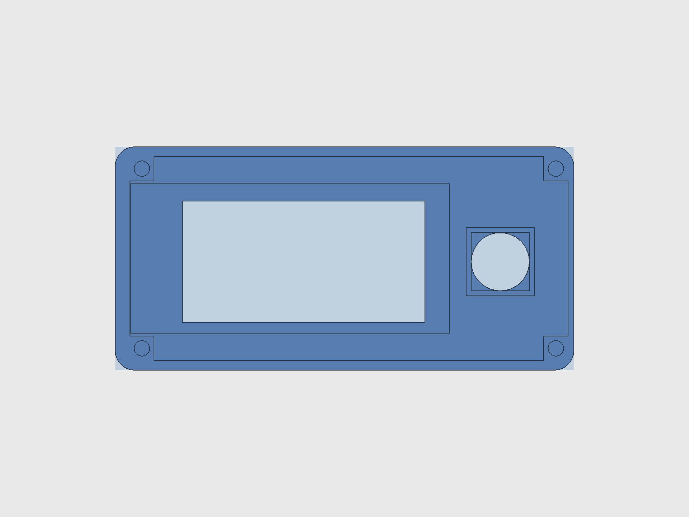

# The Dilder Gets a Speaker, a Motion Sensor, and a Better Joystick

Today's build session gave the Dilder three new tricks: it can make noise, sense when you tilt it, and the joystick finally sits exactly where it should. Here's what changed and why.

<!-- more -->

## The Joystick Was Off-Center (and Nobody Noticed)

You know that feeling when something looks *almost* right but you can't figure out what's bugging you? Turns out the joystick peg was sitting about 0.7 mm off-center in its hole. Not enough to see with your eyes, but enough that the thumbpiece wasn't swinging evenly in all directions.

The fix was embarrassingly simple — a number was being added twice where it should have been added once. One line changed, and now the peg sits dead-center. Sometimes the smallest bugs are the most satisfying to squash.

<figure markdown="span">
  { width="420" loading=lazy }
  <figcaption>The full assembly — everything visible through the translucent blue cover</figcaption>
</figure>

<figure markdown="span">
  { width="420" loading=lazy }
  <figcaption>The joystick thumbpiece and display window on the dome — both perfectly aligned now</figcaption>
</figure>

## A New Way to Hold the Joystick Switch

The old design used a bulky sleeve that wrapped around the entire joystick circuit board inside the cover. It worked, but it was overengineered — lots of material, tight tolerances, and it made the cover complicated to print.

The new approach is simpler: a square collar that wraps just around the switch body itself, extending down from the cover's face plate and stopping *exactly* at the top of the circuit board. Think of it as a guide rail — the switch body slides up through the collar, and the collar keeps it centered without touching the board underneath.

<figure markdown="span">
  { width="420" loading=lazy }
  <figcaption>The cover flipped upside-down — you can see the square anchor pad hanging from the face plate</figcaption>
</figure>

<figure markdown="span">
  { width="420" loading=lazy }
  <figcaption>Exploded view — base plate drops down, cover lifts up, you can see how everything stacks</figcaption>
</figure>

The slot in the cradle that holds the joystick board also got tighter. It used to have almost 2 mm of wiggle room on each side — now it's just 0.2 mm. The board slides in and stays put.

## It Has a Speaker Now

A tiny brass disc the size of a coin. That's the speaker — a 20 mm piezo element, thinner than a credit card (0.42 mm total). It sits in a circular ring printed right into the base plate, dead center between the battery slots.

The ring has a 1 mm wall around it that's just tall enough to hold the disc in place. You can slide the piezo in or glue it — either way it's not going anywhere.

<figure markdown="span">
  { width="500" loading=lazy }
  <figcaption>Base plate from above — the circular piezo ring in the center, rectangular IMU pocket on the left</figcaption>
</figure>

Will it be loud? No. Will it beep angrily when you forget to feed the octopus? Absolutely.

## It Can Feel You Move

Next to the speaker sits a tiny blue circuit board — an MPU-6500 accelerometer and gyroscope. Six axes of motion sensing in a package smaller than a postage stamp. It drops into its own rectangular pocket on the base plate, held in place by a printed retaining wall.

What's it for? The octopus will know when you pick it up, tilt it, shake it, or leave it sitting on your desk for too long. Motion-reactive emotions: shake it and it gets dizzy, leave it still and it gets bored, flip it upside-down and it panics.

Neither the speaker nor the motion sensor mess with the Pico's WiFi — they're low-frequency components in plastic housings, nowhere near the 2.4 GHz band.

## The Assembled Device

<figure markdown="span">
  { width="420" loading=lazy }
  <figcaption>What it looks like finished — opaque cover with the display window and joystick hole</figcaption>
</figure>

<figure markdown="span">
  { width="420" loading=lazy }
  <figcaption>Cover lifted off — batteries in their cradle, Pico board underneath, joystick PCB in its pit</figcaption>
</figure>

## What's Next

The hardware is getting close to feature-complete. The enclosure now has a display, joystick, speaker, motion sensor, solar panel, USB-C charging, and room for two AAA batteries. Next up: wiring everything together and getting the firmware to actually use these new sensors. The octopus has ears and balance now — time to teach it to react.

Source: [`hardware-design/freecad-mk2/dilder_rev2_mk2.FCMacro`](https://github.com/rompasaurus/dilder/blob/main/hardware-design/freecad-mk2/dilder_rev2_mk2.FCMacro)
