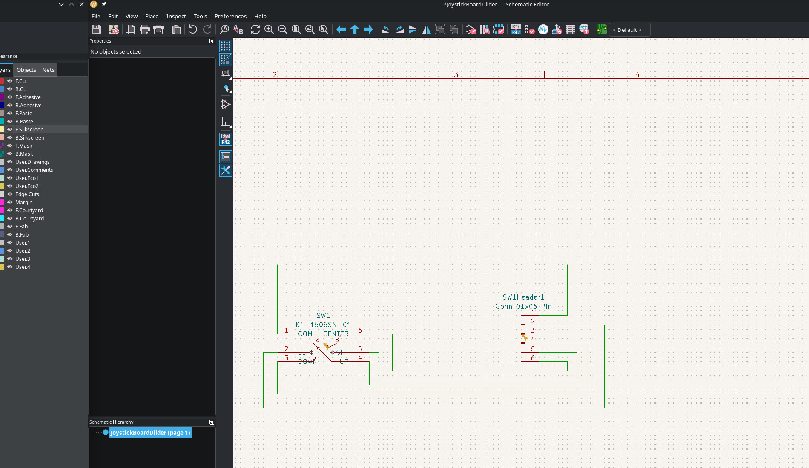

# Hand-Routed Joystick Breakout PCB — First Board From Scratch

Designed my first PCB from scratch in KiCad 10 — a hand-routed joystick breakout board for the Dilder's K1-1506SN-01 5-way navigation switch. No autorouter this time, just manual trace placement, silkscreen labels, and a ground plane. The board fits the 20x20mm pocket already milled into the Rev 2 top cover.

<!-- more -->

## Why a new board?

The previous joystick breakout (Rev 2.0) used the Alps SKRHABE010 switch and was autorouted via Freerouting. This board is a fresh design for the Korean Hroparts K1-1506SN-01 — a different 5-way switch sourced from JLCPCB (LCSC C145910). The goal was to learn the full KiCad workflow by hand: symbol import, schematic wiring, footprint assignment, manual routing, silkscreen labeling, and gerber export.

## The component

The K1-1506SN-01 is a 6-pin 5-way navigation switch (up/down/left/right/center press) with a common ground pin. Symbol and footprint were pulled from JLCPCB/LCSC using `easyeda2kicad` and imported as a project-local library.

## Full KiCad workspace

All three editors open side-by-side: PCB layout, schematic, and 3D viewer.

## PCB layout

The board is 19.6x19.6mm (0.2mm clearance per side in the 20mm pocket). The 5-way switch sits centered with a 6-pin solder-wire header along the bottom edge. Each pad is silkscreen-labeled: Com, L, D, UP, R, C (common/ground, left, down, up, right, center).

## Schematic

Simple 2-component schematic: the K1-1506SN-01 switch wired to a 6-pin connector header. Pin 1 (COM) goes to ground, pins 2-6 carry direction signals to the Pico W's GPIOs via internal pull-ups.

## 3D preview

The 3D model imported from LCSC shows the joystick knob sitting on the green PCB with the labeled solder pads along the bottom. Title block reads "dilder joystick board" — and yes, "this is my first board dont judge me."

## What's next

- Export gerbers and order from JLCPCB (BOM already generated with LCSC part number C145910)
- Solder the header wires to the Pico W's GPIO pins
- Test all 5 directions with the existing joystick input firmware
