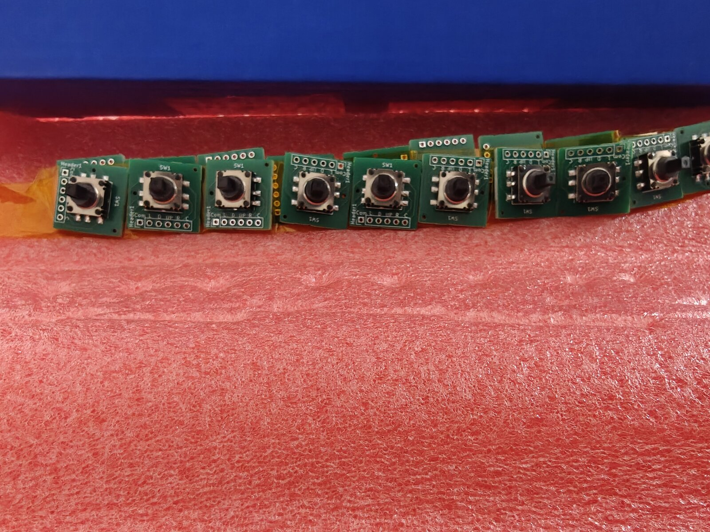
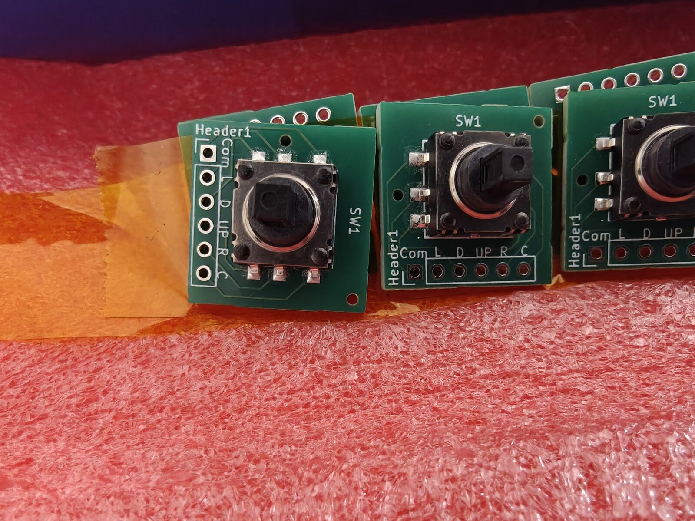

# Joystick PCB Arrives from JLCPCB — Pin Swap Discovery and V4 Display Driver Rewrite

Two big milestones today: the **hand-routed joystick breakout boards arrived from JLCPCB**, and the display driver was rewritten four times to solve the V4 partial refresh problem. Along the way, a pin assignment error in the KiCad symbol was discovered and fixed — a lesson in trusting community component libraries.

<!-- more -->

## JLCPCB Delivery — The Boards Look Great

The K1-1506SN-01 5-way navigation switch breakout boards arrived in the classic JLCPCB blue box, nestled in pink antistatic foam. The switches were pre-mounted via JLCPCB's PCBA service — no hand-soldering needed for the tiny 1.27mm-pitch SMD pads. The silkscreen labels (Com, L, D, UP, R, C) are crisp and readable.

<div class="grid" markdown>

<figure markdown="span">
  { width="420" loading=lazy }
  <figcaption>JLCPCB delivery — full panel on antistatic foam</figcaption>
</figure>

<figure markdown="span">
  { width="420" loading=lazy }
  <figcaption>Panel closeup — switches pre-mounted via PCBA</figcaption>
</figure>

</div>

<div class="grid" markdown>

<figure markdown="span">
  { width="420" loading=lazy }
  <figcaption>Macro — silkscreen labels match the schematic perfectly</figcaption>
</figure>

<figure markdown="span">
  { width="420" loading=lazy }
  <figcaption>Thumbpiece snap cap fitted — concave dish, socket grips the peg</figcaption>
</figure>

</div>

## The Pin Swap — COM and UP Are Backwards

The first test was promising: the board powered up, the thumbpiece fit, and... only UP registered. No Left, no Down, no Right, no Center. A multimeter check revealed the problem: the pad labeled "UP" was permanently shorted to GND, and the pad labeled "Com" was the actual UP signal.

**Pins 1 (COM) and 4 (UP) are swapped in the EasyEDA community library for part C145910.** The KiCad symbol was auto-generated via `easyeda2kicad.py`, which faithfully imported the wrong pin names. The footprint pad positions are correct — only the names assigned to pins 1 and 4 in the symbol were reversed.

Everything in KiCad was internally consistent: schematic, routing, silkscreen all matched each other. The error was upstream in the community component library. You can't catch this without a multimeter check against the physical datasheet.

**The fix:** Swap wires (COM→GP4, UP→GND) as an interim workaround, and correct the KiCad symbol for the Rev 2 PCB order. Pin-1 silkscreen dot added to the checklist for future orders.

### Lesson Learned

> Never trust EasyEDA community component pin names without verifying against the manufacturer's datasheet. The first board from any new component should always get a continuity check before wiring.

## V4 Display Driver — Four Iterations to Get It Right

The Waveshare 2.13" V4 display uses the SSD1680 controller with an internal LUT (lookup table) instead of the V3's custom waveform upload. This should be simpler, but the partial refresh behavior is completely different.

### The Problem

The V3 partial refresh worked perfectly because it:
1. Used a hardware reset (RST toggle) that preserved RAM
2. Uploaded a custom partial waveform LUT tuned for differential updates
3. Enabled RAM ping-pong (auto-swaps old/new buffers after each refresh)
4. Wrote only to the "new" buffer — the controller diffed against the "old" buffer

The V4's internal LUT doesn't support the same workflow. Four driver iterations were needed:

| Version | Approach | Result |
|---------|----------|--------|
| V1.0 | Called `Init_Fast()` (SWRESET) before each partial | Ghosting — SWRESET wiped both RAM buffers |
| V1.2 | Hardware reset + ping-pong + write 0x24 only | Ghosting — hardware reset makes RAM undefined on SSD1680 |
| V1.3 | No reset + write both buffers with same data | Washed out — controller saw zero diff, barely drove pixels |
| **V1.4** | **Two-pass diff: clear changed pixels, then draw new content** | **Clean updates, no ghosting** |

### The Solution — Two-Pass Partial Refresh

The V1.4 driver keeps a copy of the previous frame in RAM (~3.9KB). For each update:

**Pass 1 (Clear):** Build an intermediate frame where pixels that will change are set to white. Send `old=prev_frame, new=clear_frame` to the controller. It drives old-black pixels to white, erasing stale content.

**Pass 2 (Draw):** Send `old=clear_frame, new=actual_frame` to the controller. It drives white-to-black for new content on a clean white background. Crisp, no residue.

The clear pass uses the fast waveform (0xff) for speed. The draw pass uses the full internal LUT (0xf7) for solid blacks.

Total update time: ~0.8s (two partial refreshes). Zero ghosting, zero text overlap.

## Firmware Version System

All 20 dev-setup programs now include `version.h` and print version info at startup:

```
========================================
  DILDER — JOYSTICK MOOD SELECTOR
  Version:  0.5.4 (2026-05-04)
  Display:  V4
  Quotes:   196
  Built:    May  4 2026 14:32:00
========================================
```

A GPIO diagnostic also runs at startup, printing the raw state of all 5 joystick pins — invaluable for debugging wiring issues without a working display.

## DevTool Updates

- **Display variant default** changed from V3 to V4 across CMakeLists, Dockerfile, and DevTool dropdown
- **"Clean Build & Deploy" button** added to the Programs tab — nukes the build directory and forces a fresh Docker build
- Version confirmed in serial output so you always know which build is running

## What's Next

1. Swap COM/UP wires on the current board and test all 5 directions
2. Order corrected Rev 2 PCBs from JLCPCB
3. Continue tuning V4 partial refresh — blacks are slightly washed compared to V3
4. Wire up the piezo speaker
5. Implement menu system with joystick navigation
