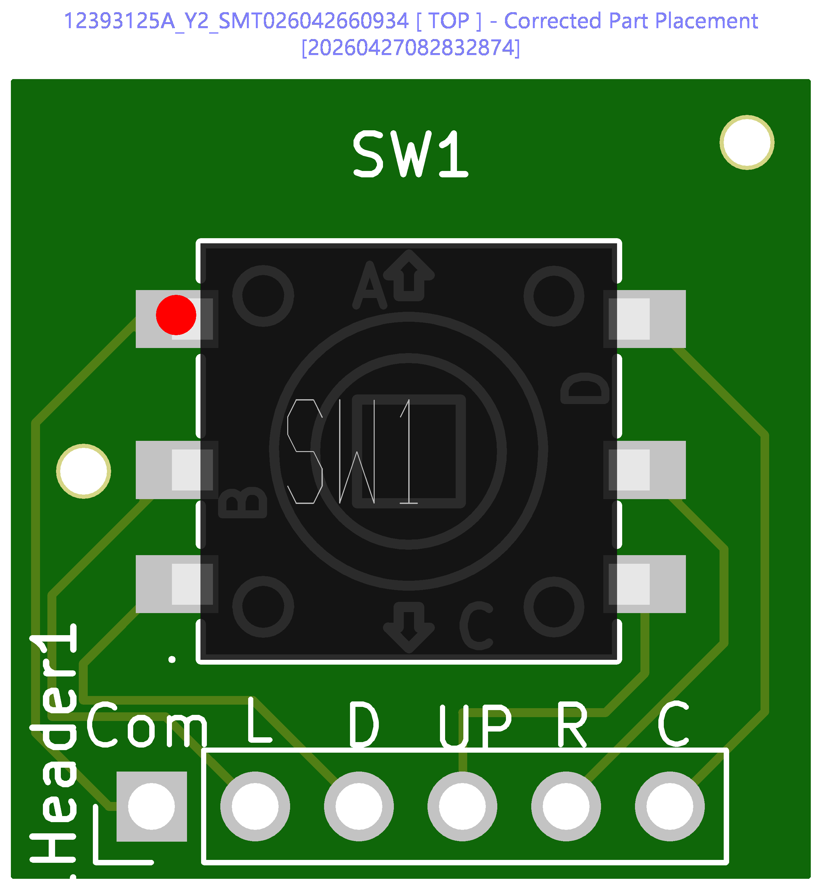

# Joystick PCB Sent to JLCPCB — First Custom Board in Production

The hand-routed joystick breakout PCB is now in production at JLCPCB. This is the first custom PCB for the Dilder project — a 19.6 x 19.6 mm board carrying a K1-1506SN-01 5-way navigation switch that drops into the top cover's joystick pocket.

<!-- more -->

## The order

Gerbers, BOM, and pick-and-place files exported from KiCad 10 and uploaded to JLCPCB for their Economic PCBA service. The switch (LCSC C145910) is soldered by their pick-and-place line; the 6-pin wire header is hand-soldered after the boards arrive.

## Placement verification

JLCPCB emailed a placement check before proceeding — they wanted to confirm the "polarity" (really the rotation) of SW1 was correct. This is standard for near-symmetric components like joystick switches where the automated system can't confidently determine orientation.

The image shows pin A (up arrow) pointing away from the header pins, which matches the intended wiring. Confirmed and approved.

**Lesson learned:** Add a pin 1 dot on the silkscreen next to pin A in future revisions. This gives the JLCPCB engineer a visual reference and skips the email round-trip.

## How we got here

The joystick PCB went through two complete design iterations:

1. **Rev 1 (autorouted, SKRHABE010)** — AI-generated schematic with a hand-drawn footprint that had incorrect pad geometry, an overlapping mounting hole, and wrong pin assignments. Attempted repair with a cloned footprint and Freerouting autorouter. Technically functional files but too patched to trust.

2. **Rev 2 (hand-routed, K1-1506SN-01)** — designed from scratch in KiCad 10. Switched to a different 5-way switch that was in stock on JLCPCB. Symbol and footprint imported via `easyeda2kicad`. All traces hand-routed. Silkscreen labels on every wire pad. Ground plane on back copper. This is the version in production.

## Current build status

| Component | Status |
|-----------|--------|
| **Joystick PCB** | In production at JLCPCB |
| **Enclosure top cover** | Printed, face plate curvature tuned |
| **Enclosure base plate** | Multiple variants: thinner, solar cutout with breakaway supports |
| **AAA cradle insert** | Battery clip slots added for Swpeet spring contacts |
| **Batteries** | PKCELL ICR10440 (3.7V raw Li-Ion AAA) selected for TP4056 charging |
| **Solar panel** | AK 62x36 mm, base plate pit designed, bonding adhesive researched |
| **Firmware** | Pico 2 W (RP2350) support added, Sassy Octopus running on e-ink display |

## Next steps

1. Wire batteries to Pico VSYS and TP4056 B+/B-
2. Test solar charging through TP4056 input
3. Assemble with joystick PCB when boards arrive from JLCPCB
4. First fully wired integration test

Source: [`hardware-design/jlcpcb-joystick-pcb-order-notes.md`](https://github.com/rompasaurus/dilder/blob/main/hardware-design/jlcpcb-joystick-pcb-order-notes.md)
