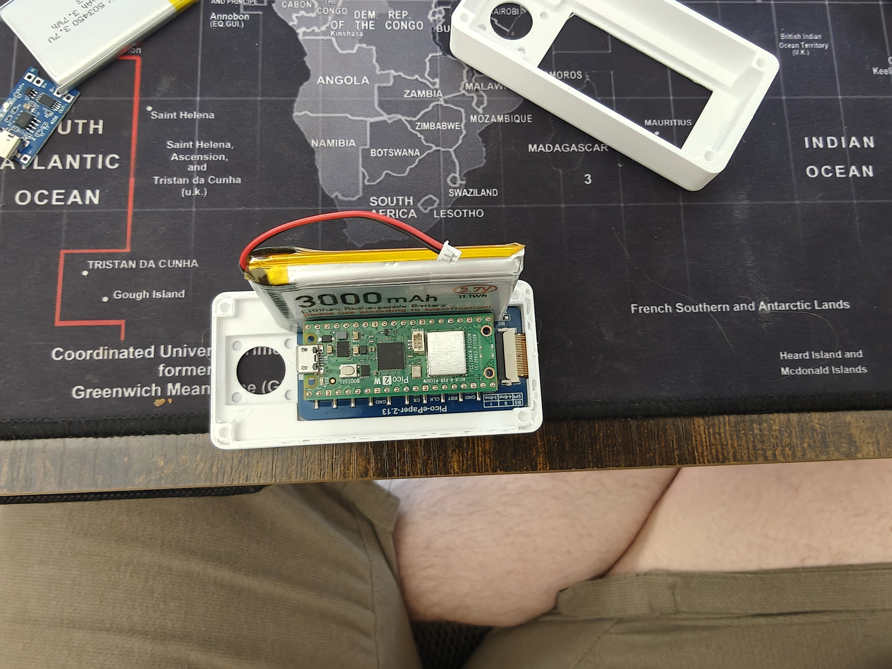
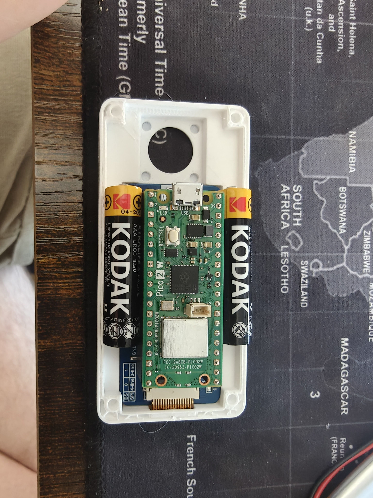
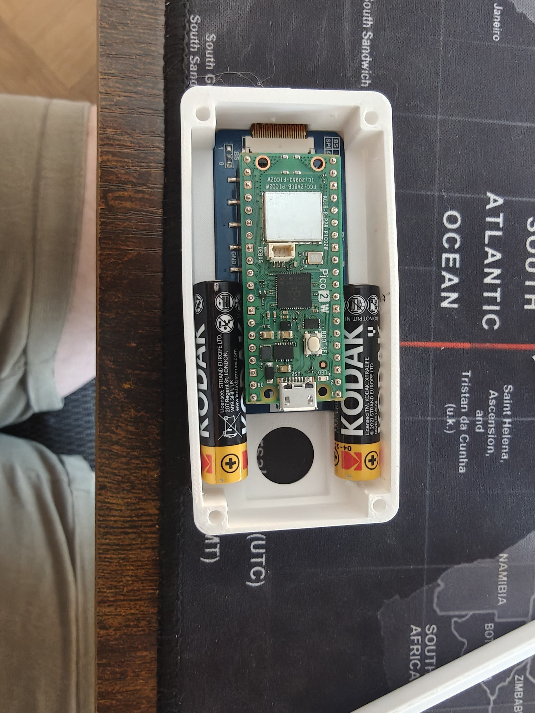
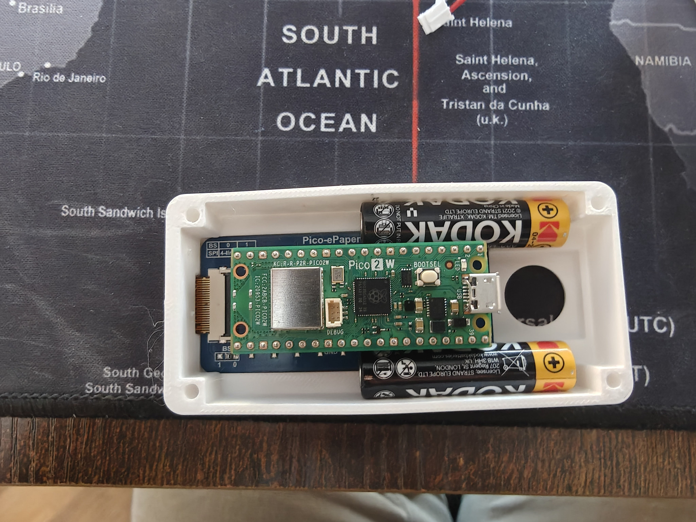

# Dual 10440 Cells, Case Redesign, and a 2-Piece Stack

The screen inlay was dialed in. Next problem: the 3000 mAh LiPo pouch the case was originally sized for doesn't actually fit in the Rev 2 cavity. A photo study, a chemistry comparison, four base variants, and a 2-piece restructure later, the stack is 11 mm thinner and the cells can be slid in from outside without popping the cover.

<!-- more -->

## The fit problem

{ width="720" loading=lazy }

The 3000 mAh pouch is roughly 60 × 35 × 10 mm. The Rev 2 base inner cavity is ~87 × 40 × stack. The cell **overhangs the ±Y long walls by ~5 mm**. It can't sit inside the case at all — it has to stack *above* the Pico W, which burns ~10 mm of stack height the enclosure doesn't have.

The fix: drop the one-big-cell strategy and go with **two thinner cells flanking the board**.

## Chemistry matters more than form factor

The initial photo fit-check used 2× Kodak Xtralife alkaline AAAs because they're what was on the desk:

{ width="640" loading=lazy }

The cells fit. But alkaline AAAs are a terrible choice here:

- **1.5 V per cell.** Two in series gives 3.0 V fresh, drops to ~2.0 V near end of life — brownouts against the Pico W's 1.8 V VSYS minimum. Two in parallel gives 1.5 V — doesn't meet VSYS at all.
- **Not rechargeable.** The existing TP4056 USB-C charge board is Li-ion only; alkaline chemistry would need to come out of the case and get thrown away.
- **High internal resistance.** Pico W's WiFi TX peaks (~250 mA bursts) sag alkaline pack voltage hard, especially as the cells age.

The drop-in fix is **10440 Li-ion** — same exterior dimensions as an AAA (Ø 10 × 44 mm), but 3.7 V per cell, same chemistry as the existing LiPo pouches, and ~350 mAh each. Two in **parallel** gives a ~700 mAh pack at 3.7 V, charges with the unchanged TP4056 (just swap R_prog from 1.2 kΩ → ~3.4 kΩ to derate the charge current to 350 mA CC), and feeds the Pico W's VSYS directly.

The wiring rule — and it's a real one: **same model, same batch, match voltages within 0.1 V before connecting + to + and − to −, each cell with its own PCM**. Mismatched parallel cells dump current into each other.

## Four base variants in one afternoon

All of these landed under `hardware-design/scad Parts/Rev 2 extended with joystick/04-24-designs-alterations/`:

### `base-v2-thin-dual-10440` — first cut

Minimum change to fit the new cell chemistry into the existing 3-piece stack: bump outer Y from 44 → 46 mm (so two Ø 10 mm cells + 21 mm Pico W + slop actually fits), drop total Z from 14 → 12 mm (cell fills the bay height exactly), thin the floor from 3 → 2 mm, collapse from two USB-C cutouts to one (Pico W has a single port), and add 4 generic contact-tab slots for stamped strip contacts at each cell bay's ±X ends.

Matching forks: `middle-platform-v2-46y` and `top-cover-windowed-screen-inlay-v2-46y` — same content as v1 but +2 mm Y so the full stack bolts up.

### `base-v3-2piece` — merge the middle platform into the base

Next ask: *"I don't want a middle platform, I want this done in 2 pieces — have the base extend up and inlay into the Pico and secure the back of the Waveshare."*

Done. The base now extends up to z=14 and absorbs the role the middle platform used to play. The Pico W drops into the centered chamber at Y=12.1–33.9 (the "inlay"), and the Waveshare display's ±Y edges overhang the 21.8 mm Pico chamber by ~4 mm on each side — those overhangs rest on the solid base rim at z=14. Top cover presses down from above. Display's trapped between.

Matching cover: `top-cover-windowed-screen-inlay-v3-2piece` drops the 5 mm middle-platform pedestal reservation that used to sit at the cover's bottom, going from 16.7 mm → 11.7 mm. **Stack total: 25.7 mm, down from 36.7 mm** — 11 mm thinner.

### `base-v4-2piece-open` — cells slide in from outside

v3's cells were trapped in sealed bays once the top cover was on. Fix: **two rectangular slots cut through the -X end wall**, one per cell bay, matching each bay's Y × Z cross-section. Cells slide in from outside before cover install; spring contacts at the -X end press them +X against the solid +X stop. (For a fully closed case, print a small battery-door clip that snaps onto the -X end over the slots.)

v4 also adds **raised ±Y lips** on the cell-bay ceiling at the Pico chamber boundary, protruding 1 mm above the case top into the cover's cavity on the non-battery edges. Stiffens the base-cover joint along the long edges without interfering with cell insertion.

### The final layout

{ width="720" loading=lazy }

Pico 2 W in the middle, two cells along ±Y, FPC ribbon exiting at -X toward the Waveshare display (shown separately below), joystick hat at the +X USB end.

{ width="720" loading=lazy }

## What didn't work

A `top-cover-v4-contoured-25mm.scad` experiment tried to sculpt the cover's underside with downward extensions that wrapped around the cell tops, the FPC fold, and the Pico chamber — hitting a 25 mm total stack by having the cover do more of the enclosing work. The user's response: *"this is batshit awful delete it."*

Fair. File's gone. The existing base-v4 + cover-v3-2piece combination hits 25.7 mm with a much simpler geometry.

## What's next

- Print `base-v4-2piece-open.scad` + `top-cover-windowed-screen-inlay-v3-2piece.scad` as the matched pair.
- Order 2× 10440 Li-ion protected cells (AliExpress, ~$3–6 each) and matching stamped-strip battery contacts.
- Derate TP4056 R_prog to ~3.4 kΩ.
- Test cell insertion and battery-door strategy — either a small printed clip over the -X slots, or rely on the spring contacts + gravity.

Research docs: [battery-redesign-shopping-list.md](https://github.com/rompasaurus/Dilder/blob/main/docs/battery-redesign-shopping-list.md), [solar-charging-research.md](https://github.com/rompasaurus/Dilder/blob/main/docs/solar-charging-research.md).
