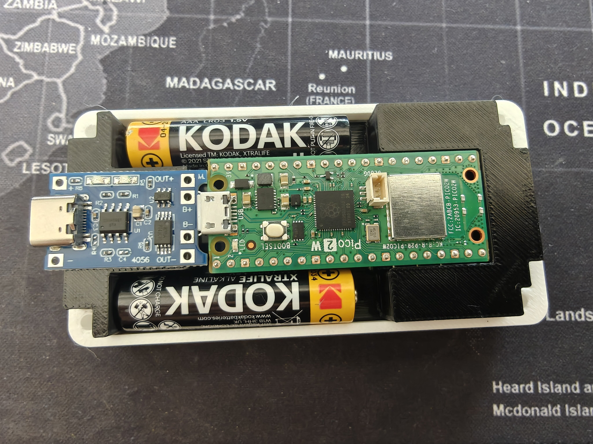
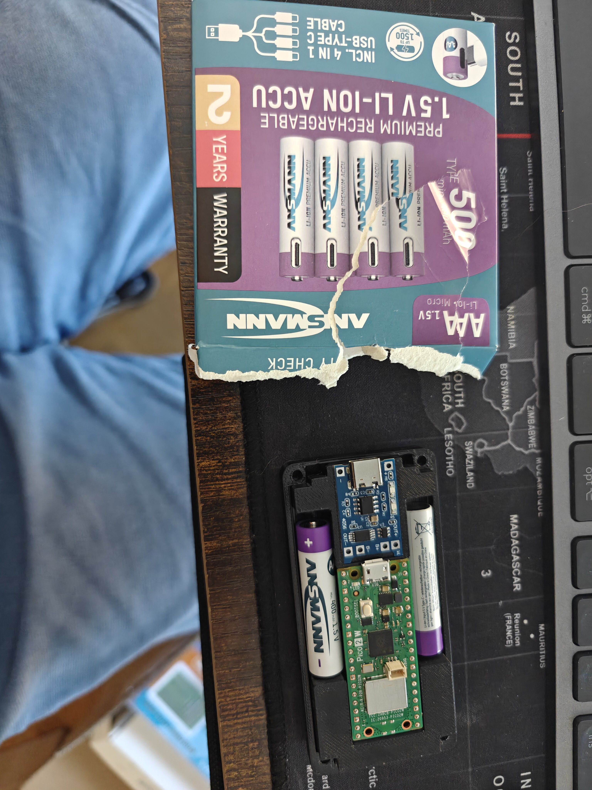
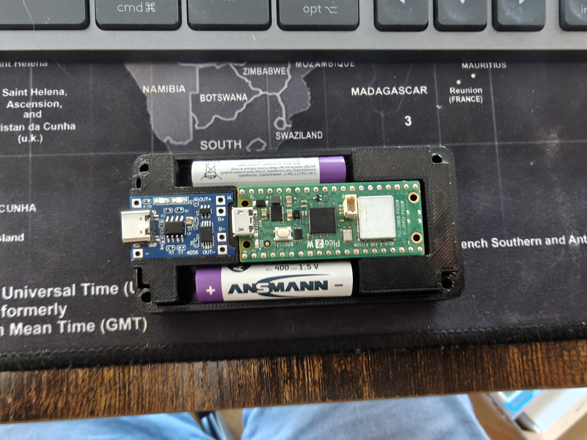
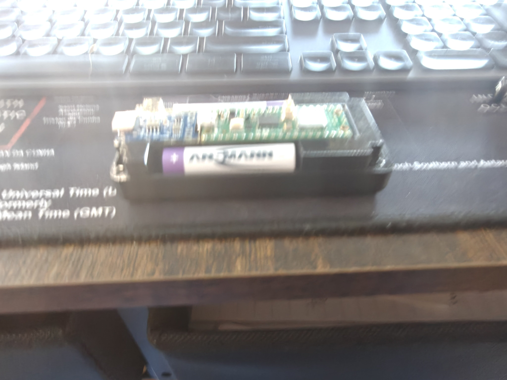

# TP4056 Charge Board Integration — Cradle v2, Base Plate v2, Cover Update

The AAA cradle insert and base plate from this morning's print session worked mechanically, but the TP4056 USB-C charge board had nowhere to live. This session extends the enclosure 3 mm on the -X side, redesigns the connecting block to hold the charge board, adds battery retention troughs to the base plate, and cuts a USB-C port hole through the cover.

<!-- more -->

## The problem

{ width="720" loading=lazy }

The TP4056 USB-C charge board (blue PCB, ~28 mm x 17 mm) needs to sit at the -X end of the cradle insert between the two AAA cells, with its USB-C port accessible from outside. The previous cradle's connecting block was only 9.5 mm in X and 3 mm shorter than full height — far too small for the charge board.

## What changed

### All three parts — 3 mm -X extension

`enclosure_outer_width_along_x_axis_mm` increased from 91.5 to **94.5 mm**. The -X wall thickness stays 3.0 mm, so all the extra space lands inside the cavity at the -X end. The joystick through-hole center was hardcoded at x=79.35 to prevent it from shifting.

### Cradle insert v2

{ width="720" loading=lazy }

{ width="720" loading=lazy }

- **Connecting block extended** to 29 mm in X (accommodates the 28 mm TP4056 board) and full plug height (z=-5.1 to 7.0, was 3 mm shorter).
- **Concave battery curves** on the connecting block's +/-Y faces — horizontal cylinder subtractions at each AAA bay center carve ~1.3 mm deep arcs that follow the battery profile.
- **1 mm TP4056 indent** on the connecting block's top face (28.4 x 17.4 mm recess, centered in Y).
- **USB-C port cutout** through the connecting block's -X face (10 x 5 mm slot).
- **AAA bay cuts restructured** — moved to an outer `difference()` so they cut through both the plug body and the connecting block, eliminating residual walls at the junction.
- **+X display connector cutout** — 3 mm pocket from the bottom face at the +X end for FPC connector/cable clearance.

### Base plate v2

{ width="720" loading=lazy }

{ width="720" loading=lazy }

- **Square pillar bases** (5 x 5 mm) replace bare cylindrical pegs. Pillars rise from pocket floor to plate top; 3 mm cylindrical pegs extend from the pillar tops into the cover's blind M3 bores.
- **Battery cradle troughs** — solid fills along the +/-Y sides of the pocket (connected to the enclosure walls), with the AAA cylinder subtracted downward. The cells drop into concave channels carved into the plate body.

### Top cover — USB-C cutout

{ width="720" loading=lazy }

- **USB-C port cutout** through the -X wall (10 x 5 mm, centered at y=23, z=5.5 cover-local) so the TP4056's charge port is accessible from outside.

## Files

All in `hardware-design/scad Parts/Rev 2 extended with joystick/04-25-design-alterations/`:

- `aaa-cradle-insert-v1.scad` — cradle insert v2 (TP4056 connecting block, battery curves, +X FPC cutout)
- `base-plate-v1.scad` — base plate v2 (square pillars, battery troughs, USB-C notch on +X wall)
- `top-cover-windowed-screen-inlay-v3-2piece.scad` — cover with 5 mm wall extension and hardcoded joystick position

## Second print + Ansmann batteries

The updated cradle and base plate printed while Ansmann 1.5V Li-Ion AAA batteries arrived. These cells have a built-in boost converter and USB-C charging port — they're self-contained 1.5V sources, not raw Li-Ion cells.

{ width="720" loading=lazy }

{ width="720" loading=lazy }

{ width="720" loading=lazy }

### Battery compatibility note

The Ansmann 1.5V Li-Ion AAAs **cannot** be charged by the TP4056 — the TP4056 expects raw 3.7V Li-Ion on its output, and the Ansmann's regulated 1.5V terminal would be damaged by 4.2V charge voltage. Instead, these cells wire in **series** (2 × 1.5V = 3.0V) directly to the Pico W's VSYS pin, and each cell charges individually via its built-in USB-C port.

Full wiring guide: [`ansmann-1.5v-aaa-series-wiring-guide.md`](https://github.com/rompasaurus/dilder/blob/main/hardware-design/ansmann-1.5v-aaa-series-wiring-guide.md).
