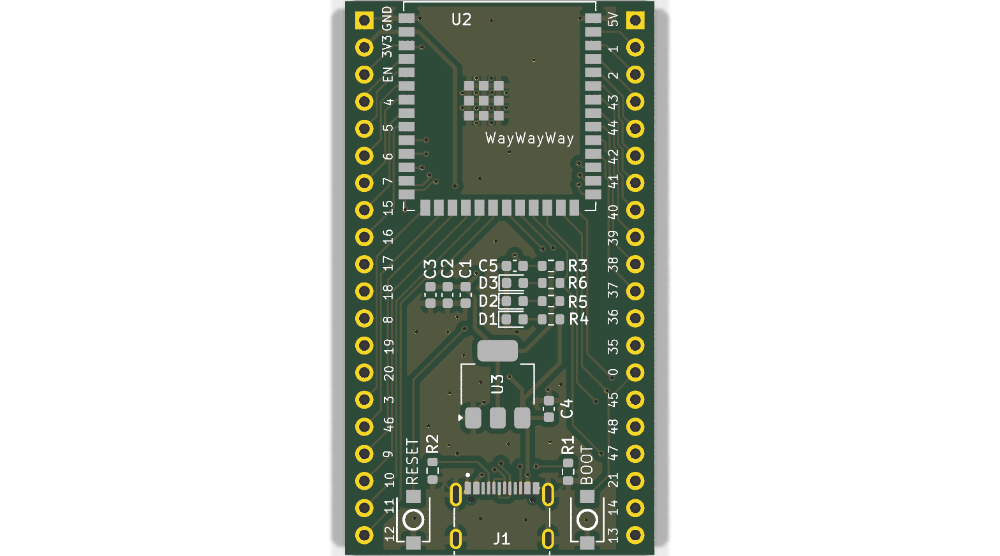
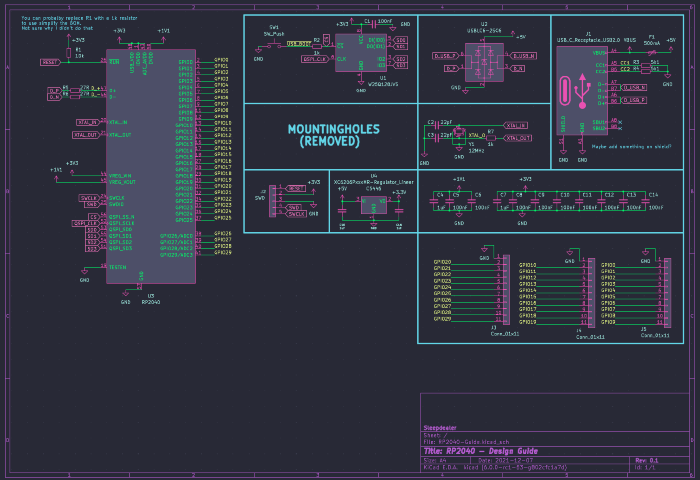
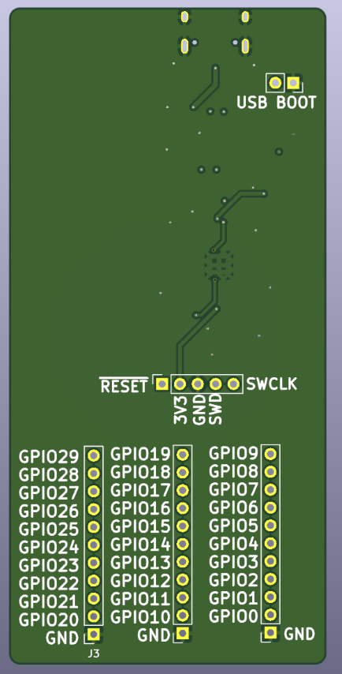
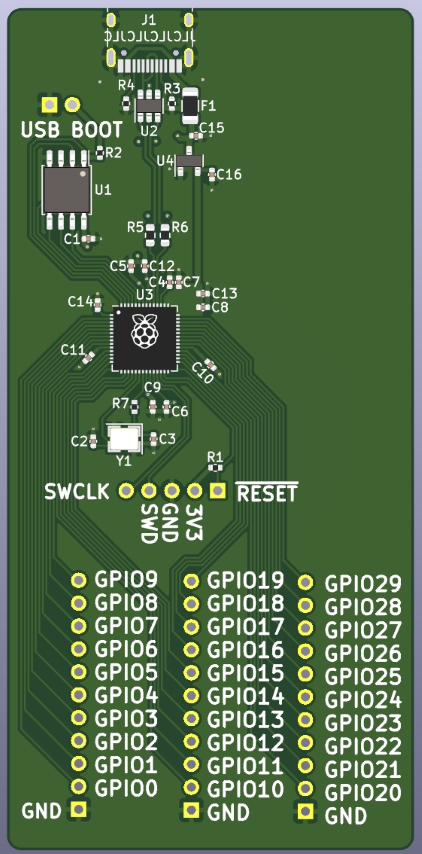
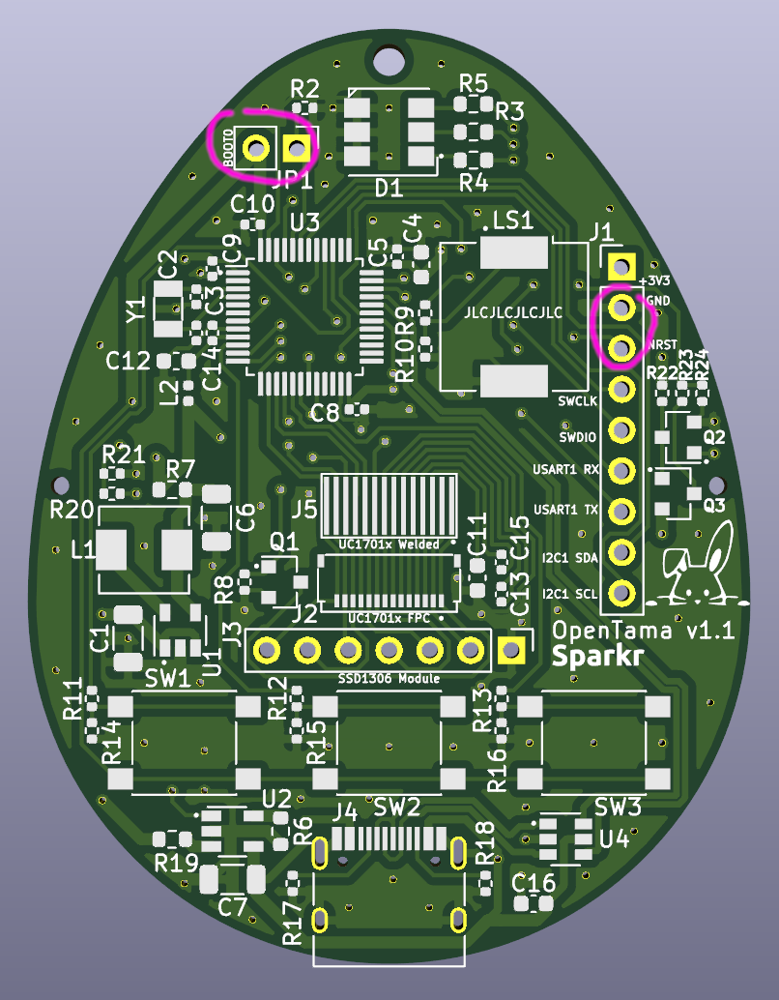

# Open-Source Board Design Research

A curated collection of open-source KiCad board designs that share components, circuits, or design goals with the Dilder custom PCB. Each project is analyzed for what we can learn from it, with images of the actual board layouts and schematics.

All designs have been cloned into the project's `hardware-design/reference-boards/` directory and can be opened directly in KiCad.

---

## Why Study Other Boards?

Designing a custom PCB from scratch is hard. Studying existing open-source boards lets us:

- **Validate our circuit design** against proven, manufactured boards
- **Learn routing techniques** for tricky components (USB differential pairs, antenna keep-out zones, ground planes)
- **Copy proven power management circuits** rather than designing from first principles
- **Verify component choices** against what others have successfully manufactured at JLCPCB/PCBWay
- **Avoid common mistakes** that others have already debugged

Each design below is analyzed for its relevance to the Dilder board (ESP32-S3, e-ink display, LiPo battery, joystick input, IMU sensor).

---

## ESP32-S3 Designs

### Ducky Board — ESP32-S3 + e-Paper + Battery Charger

!!! tip "Closest match to the Dilder board"

<figure markdown="span">
  { width="500" loading=lazy }
  <figcaption>Ducky Board assembled and running — ESP32-S3 module with 1.52" 3-color e-ink display, USB-C, and LiPo charging. Photo from the project repo.</figcaption>
</figure>

| Attribute | Details |
|-----------|---------|
| **MCU** | ESP32-S3 module |
| **Display** | GDEM0154Z91 (1.52" e-ink, 3-color, Good Display) |
| **Power** | USB-C input, integrated Li-Ion battery charger with status LEDs |
| **Design tool** | KiCad 9 |
| **License** | GPL-3.0 |
| **Source** | [MakersFunDuck/Ducky-board-ESP32-S3](https://github.com/MakersFunDuck/Ducky-board-ESP32-S3-with-1.52-inch-e-paper-display) |
| **Local path** | `hardware-design/reference-boards/esp32s3-ducky-epaper/` |
| **KiCad files** | `hardware.kicad_sch`, `hardware.kicad_pcb`, `hardware.kicad_pro` |

#### What to Study

- **Battery charging circuit** — The Ducky Board integrates a single-cell Li-Ion charger with charge status LEDs, the same architecture as the Dilder's TP4056 + DW01A design. Compare their component choices with ours.
- **ESP32-S3 power sequencing** — How the module's EN pin is handled, decoupling cap placement, and 3.3V regulation.
- **e-Paper display connector** — How the display is interfaced via SPI, including the DC/RST/BUSY control line routing.
- **USB-C implementation** — CC pull-down resistors, VBUS protection, and data line routing.
- **Board form factor** — Compact breakout form factor optimized for the e-ink display footprint.

#### Files Available

- `hardware.kicad_sch` — Full schematic with all component values
- `hardware.kicad_pcb` — Complete routed PCB layout
- `Schematic.pdf` — Exported schematic for quick viewing without KiCad
- `PCB.pdf` — PCB layout export

---

### Basic ESP32-S3 Dev Board — Minimal Reference Design

<figure markdown="span">
  { width="500" loading=lazy }
  <figcaption>3D render of the basic ESP32-S3 dev board — ESP32-S3-WROOM-1 module, USB-C, LDO regulator, reset/boot buttons, status LEDs, all GPIO broken out to castellated pads.</figcaption>
</figure>

<figure markdown="span">
  { width="500" loading=lazy }
  <figcaption>PCB layout — note the clean routing, USB-C at the bottom edge, ESP32-S3 module centered with antenna pointing off-board, decoupling caps close to power pins.</figcaption>
</figure>

| Attribute | Details |
|-----------|---------|
| **MCU** | ESP32-S3-WROOM-1 module |
| **Features** | USB-C (with 5.1k CC pull-downs, differential pair routing), 3.3V LDO, reset/boot buttons, 3 status LEDs (5V, 3.3V, GPIO blinker), all GPIO broken out |
| **Design tool** | KiCad |
| **License** | MIT |
| **Source** | [atomic14/basic-esp32s3-dev-board](https://github.com/atomic14/basic-esp32s3-dev-board) |
| **Local path** | `hardware-design/reference-boards/esp32s3-basic-devboard/` |

#### What to Study

- **USB-C done right** — This is the cleanest ESP32-S3 USB-C implementation in our reference collection. The 5.1k CC1/CC2 pull-downs, differential pair routing for D+/D-, and series resistors are all textbook. Compare directly with the Dilder's USB-C circuit.
- **LDO selection and placement** — Uses an LD117 with proper input/output decoupling. Shows recommended cap values and placement distance from the IC.
- **Antenna keep-out** — Note how the PCB copper is cleared around the ESP32-S3 antenna area (top-left of the module). The Dilder board must maintain this same keep-out zone.
- **GPIO breakout pattern** — Castellated edge pads with clear silkscreen labeling. Good reference for our e-Paper header connector placement.

#### Files Available

- `dev-board.kicad_sch` — Schematic (also exported as PDF)
- `dev-board.kicad_pcb` — PCB layout (also exported as SVG)
- `docs/dev-board.step` — 3D STEP model for mechanical integration
- `docs/schematic.pdf` — Printable schematic

---

### Official Espressif KiCad Libraries

| Attribute | Details |
|-----------|---------|
| **Contents** | Symbols, footprints, and 3D models for ALL Espressif chips and modules |
| **Includes** | ESP32, ESP32-S2, ESP32-S3, ESP32-C3, ESP32-C6, ESP32-H2 — bare chips, WROOM modules, MINI modules, and DevKit boards |
| **License** | Apache-2.0 |
| **Source** | [espressif/kicad-libraries](https://github.com/espressif/kicad-libraries) |
| **Local path** | `hardware-design/reference-boards/espressif-kicad-libs/` |

#### What to Study

- **Authoritative footprints** — These are the official pad dimensions, pin assignments, and courtyard sizes for the ESP32-S3-WROOM-1-N16R8. If our custom KiCad footprint differs from these, the official version is correct.
- **Antenna keep-out zones** — The footprint includes the manufacturer-specified copper keep-out for the PCB antenna.
- **3D models** — STEP files for mechanical clearance verification in the 3D-printed enclosure.

!!! tip "Installation"
    These libraries can be installed automatically via KiCad's Plugin and Content Manager (PCM). Search for "Espressif" in the PCM. The local copy in this repo is for offline reference.

---

## RP2040 / Pico Designs

### Reverse-Engineered Pico with USB-C

| Attribute | Details |
|-----------|---------|
| **MCU** | RP2040 (standard Pico), RP2040 + CYW43439 WiFi (Pico WH), RP2350 (Pico 2) |
| **Features** | Faithful reproduction of the official Raspberry Pi Pico circuit in KiCad, upgraded with USB-C |
| **License** | WTFPL (unrestricted — do anything you want) |
| **Source** | [sabogalc/project-piCo](https://github.com/sabogalc/project-piCo) |
| **Local path** | `hardware-design/reference-boards/rp2040-pico-usbc/` |

#### What to Study

- **Official Pico circuit** — This is the most faithful KiCad reproduction of the Raspberry Pi Pico. The original design files are in Cadence Allegro (proprietary); this project reverse-engineered them into KiCad. Use this to understand the RP2040's power path: how VSYS, VBUS, and the Schottky diode interact.
- **WiFi variant (Pico WH)** — The `Pico WH` sub-project includes the CYW43439 WiFi/BLE chip wiring — useful for understanding how the Pico W differs from the standard Pico at the circuit level.
- **USB-C upgrade** — Shows how to replace micro-USB with USB-C on an RP2040 board while maintaining the same power path.

#### Sub-Projects

| Folder | Board | Notes |
|--------|-------|-------|
| `KiCad Projects/Pico C/` | Standard Pico with USB-C | RP2040 + W25Q16 flash |
| `KiCad Projects/Pico WH - No License/` | Pico WH with USB-C | RP2040 + CYW43439 WiFi/BLE |
| `KiCad Projects/Pico 2 C/` | Pico 2 with USB-C | RP2350 (next-gen) |

Each sub-project contains exported schematic PDFs for quick viewing without opening KiCad.

---

### RP2040 Minimal Design (JLCPCB-Ready)

| Attribute | Details |
|-----------|---------|
| **MCU** | RP2040 (bare chip — not a module) |
| **Origin** | Raspberry Pi's official "Minimal Viable Board" example, ported to KiCad 7 with JLCPCB assembly files |
| **License** | BSD-3-Clause |
| **Source** | [tommy-gilligan/RP2040-minimal-design](https://github.com/tommy-gilligan/RP2040-minimal-design) |
| **Local path** | `hardware-design/reference-boards/rp2040-minimal-jlcpcb/` |

#### What to Study

- **Absolute minimum RP2040 circuit** — This is the smallest possible working RP2040 board: just the chip, a 12MHz crystal, a W25Q16 flash chip, decoupling caps, and USB. Nothing else. Use this to understand which components are *mandatory* for the RP2040 to boot.
- **JLCPCB compatibility** — Includes BOM and CPL files formatted for JLCPCB's assembly service. Good reference for how to export and format assembly files from KiCad.
- **Contrast with the Dilder's ESP32-S3 approach** — The bare RP2040 requires ~15 external components (crystal, flash, caps, resistors). The ESP32-S3-WROOM-1 module integrates all of this, which is why the Dilder switched MCUs.

---

### RP2040 Hardware Design Guide

<figure markdown="span">
  { width="600" loading=lazy }
  <figcaption>Full RP2040 schematic from the design guide — RP2040 chip, crystal, flash, voltage regulator, USB, and GPIO breakout. All component values and LCSC part numbers annotated.</figcaption>
</figure>

<figure markdown="span">
  { width="300" loading=lazy }
  <figcaption>Front side — RP2040 chip centered, USB at top, GPIO pins along both edges. Green solder mask with ENIG (gold) finish.</figcaption>
</figure>

<figure markdown="span">
  { width="300" loading=lazy }
  <figcaption>Back side — ground plane with thermal reliefs around component pads. Silkscreen shows pin labels and design info.</figcaption>
</figure>

| Attribute | Details |
|-----------|---------|
| **MCU** | RP2040 (bare chip) |
| **Features** | Complete design guide with component selection rationale, custom KiCad libraries, schematic PDF |
| **License** | MIT |
| **Source** | [Sleepdealr/RP2040-designguide](https://github.com/Sleepdealr/RP2040-designguide) |
| **Local path** | `hardware-design/reference-boards/rp2040-designguide/` |

#### What to Study

- **Component selection rationale** — The README explains *why* each component was chosen: XC6206 LDO for low quiescent current, specific 12MHz crystal for JLCPCB availability (C9002), flash chip options. This reasoning applies to any microcontroller board design.
- **Custom KiCad libraries** — Includes purpose-built symbols and footprints in `PCB/Libraries/`. Useful if you need to create custom footprints for components not in KiCad's default libraries.
- **Ground plane strategy** — The PCB renders show solid ground plane coverage with proper via stitching. Good reference for the Dilder's inner ground plane (In1.Cu).
- **Includes official Pico datasheets** — The `Pico-Resources/` folder contains the official Pico schematic PDF, RP2040 datasheet, and the hardware design guide PDF from Raspberry Pi.

---

## Virtual Pet Designs

### OpenTama — Tamagotchi Reference Board (JLCPCB-Ready)

!!! tip "Same product category as Dilder"

<figure markdown="span">
  { width="400" loading=lazy }
  <figcaption>OpenTama v1.1 PCB layout — egg-shaped board with STM32L072 MCU, SSD1306 OLED and UC1701x LCD connectors, 3 buttons, buzzer (LS1), battery connector, and SWD debug header. All components on one side for JLCPCB assembly. Note the Sparkr bunny logo in the silkscreen.</figcaption>
</figure>

| Attribute | Details |
|-----------|---------|
| **MCU** | STM32L072 (ARM Cortex-M0+, ultra-low-power) |
| **Display** | SPI SSD1306 OLED (128x64) or SPI UC1701x LCD |
| **Battery** | 1000mAh LiPo (40x30x12mm) — same capacity as Dilder |
| **Input** | 3 tactile buttons (SW1-SW3) |
| **Audio** | Piezo buzzer (LS1) |
| **Protection** | Battery over-discharge/charge protection circuit |
| **Design tool** | KiCad |
| **License** | CERN-OHL-S v2 (open hardware — permits derivative works) |
| **Source** | [Sparkr-tech/opentama](https://github.com/Sparkr-tech/opentama) |
| **Local path** | `hardware-design/reference-boards/opentama-virtual-pet/` |
| **Blog** | [Design notes](http://blog.rona.fr/post/2022/04/21/OpenTama-an-open-source-reference-design-for-MCUGotchi) |

#### What to Study

- **Battery protection circuit** — Uses **DW01A + FS8205A** — the exact same protection ICs as the Dilder board. Compare their schematic implementation with ours to verify our circuit is correct. This is the most directly applicable reference we have for the battery protection subsystem.
- **JLCPCB assembly optimization** — All components placed on the top side for single-side assembly. LCSC part numbers pre-assigned for every component. The designer notes that "JLCPCB references for all the components have been provided."
- **Single-side placement** — The egg-shaped PCB places everything on one side, matching JLCPCB's Economic PCBA service (which only supports single-side SMT). The Dilder board follows the same constraint.
- **Button debouncing** — Simple button input circuit with hardware debounce. Compare with the Dilder's software debounce approach (200ms in firmware).
- **Buzzer integration** — Shows how to wire a piezo buzzer to a GPIO pin with appropriate series resistor. Directly applicable to the Dilder's planned Phase 7 audio output.
- **Form factor** — The egg shape is creative but the component density and routing strategies work for any small board. Pay attention to how traces route around the button footprints.

#### Component Overlap with Dilder

| Component | OpenTama | Dilder | Same? |
|-----------|----------|--------|-------|
| Battery protection IC | DW01A | DW01A | Yes |
| Protection MOSFET | FS8205A | FS8205A | Yes |
| Battery capacity | 1000mAh | 1000mAh | Yes |
| Battery connector | JST PH 2.0mm | Molex 1.25mm | Different |
| MCU | STM32L072 | ESP32-S3 | Different |
| Display interface | SPI | SPI | Same protocol |

---

## Comparison Matrix

| Feature | Ducky Board | ESP32-S3 Basic | OpenTama | RP2040 Minimal | RP2040 Guide | Pico USB-C |
|---------|-------------|----------------|----------|----------------|--------------|------------|
| **MCU** | ESP32-S3 | ESP32-S3 | STM32L072 | RP2040 | RP2040 | RP2040 |
| **Display** | e-Paper | None | OLED/LCD | None | None | None |
| **Battery** | Li-Ion charger | None | LiPo + protection | None | None | VSYS input |
| **USB** | USB-C | USB-C | Micro-USB | USB | USB | USB-C |
| **Joystick/Input** | None | None | 3 buttons | None | None | None |
| **IMU** | None | None | None | None | None | None |
| **JLCPCB-ready** | Likely | No | Yes | Yes | No | No |
| **License** | GPL-3.0 | MIT | CERN-OHL-S | BSD-3 | MIT | WTFPL |

The Dilder board combines elements from multiple references: ESP32-S3 core from the Ducky/Basic boards, battery protection from OpenTama, USB-C from the Basic dev board, and JLCPCB manufacturing approach from both OpenTama and the RP2040 Minimal design.

---

## How to Open These Designs

1. **Install KiCad 7+** — all projects are KiCad 7 or later format
2. Navigate to `hardware-design/reference-boards/<project>/`
3. Open the `.kicad_pro` file — this loads both the schematic and PCB
4. **Schematic:** `Tools > Schematic Editor` to view the circuit
5. **PCB:** `Tools > PCB Editor` to view the board layout
6. **3D View:** In the PCB editor, press `Alt+3` to see a 3D render

!!! tip "Quick viewing without KiCad"
    Most projects include exported PDFs of schematics in their `docs/` folder. Open these for a quick look without launching KiCad.

---

## Sources

- [Ducky Board — ESP32-S3 + e-Paper (GPL-3.0)](https://github.com/MakersFunDuck/Ducky-board-ESP32-S3-with-1.52-inch-e-paper-display)
- [Basic ESP32-S3 Dev Board (MIT)](https://github.com/atomic14/basic-esp32s3-dev-board)
- [Official Espressif KiCad Libraries (Apache-2.0)](https://github.com/espressif/kicad-libraries)
- [Project piCo — Reverse-Engineered Pico (WTFPL)](https://github.com/sabogalc/project-piCo)
- [RP2040 Minimal Design for JLCPCB (BSD-3)](https://github.com/tommy-gilligan/RP2040-minimal-design)
- [RP2040 Hardware Design Guide (MIT)](https://github.com/Sleepdealr/RP2040-designguide)
- [OpenTama — Virtual Pet Reference Board (CERN-OHL-S v2)](https://github.com/Sparkr-tech/opentama)
- [OpenTama Design Blog Post](http://blog.rona.fr/post/2022/04/21/OpenTama-an-open-source-reference-design-for-MCUGotchi)
- [Espressif ESP32-S3 Hardware Design Guidelines](https://docs.espressif.com/projects/esp-hardware-design-guidelines/en/latest/esp32s3/schematic-checklist.html)
- [Raspberry Pi RP2040 Hardware Design Guide (PDF)](https://datasheets.raspberrypi.com/rp2040/hardware-design-with-rp2040.pdf)
