# Enclosure Design Evolution

A living record of the Dilder enclosure's parametric CAD design as it evolves through prototyping and print iterations. All parts are designed in OpenSCAD and exported to 3MF for slicing.

---

## Physical Prototype (First Print)

The first FDM prints of the ESP32-S3 enclosure, photographed during fit-check and assembly testing on 2026-04-22.

### Assembled enclosure — front view

The stacked shell with e-ink display visible through the viewing window. Four corner screw posts hold everything together. USB-C cable connected for power and programming.

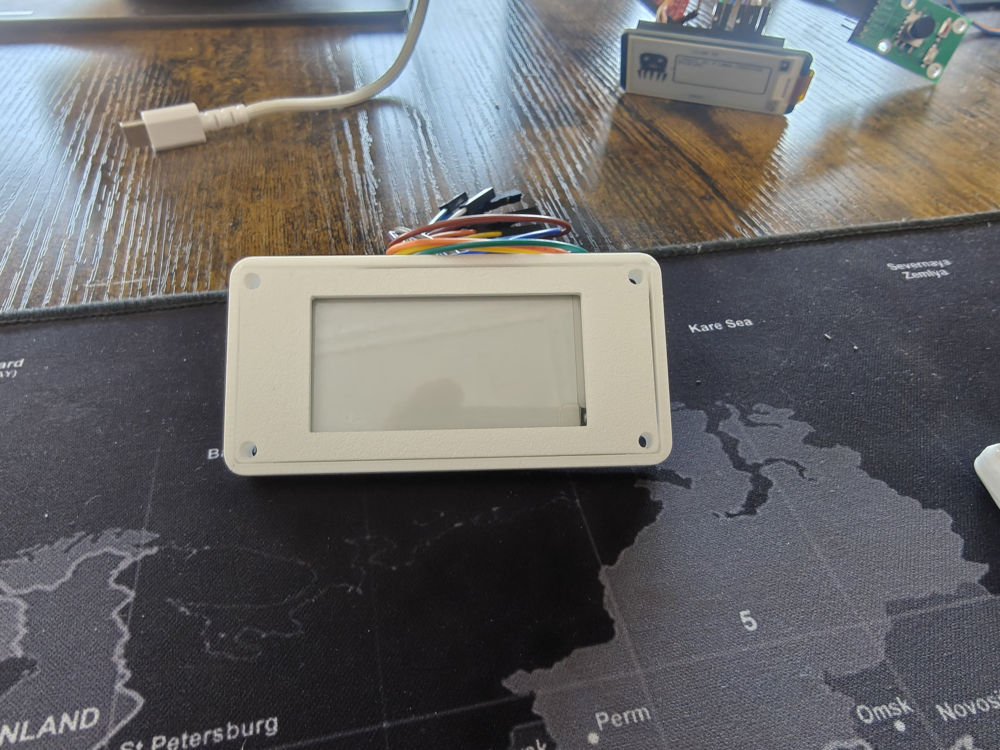

### Enclosure halves — base shell with LiPo battery

Side-by-side of the display top cover and base shell. The 1000mAh LiPo battery sits in the base chamber with the JST connector routed up through the middle plate.

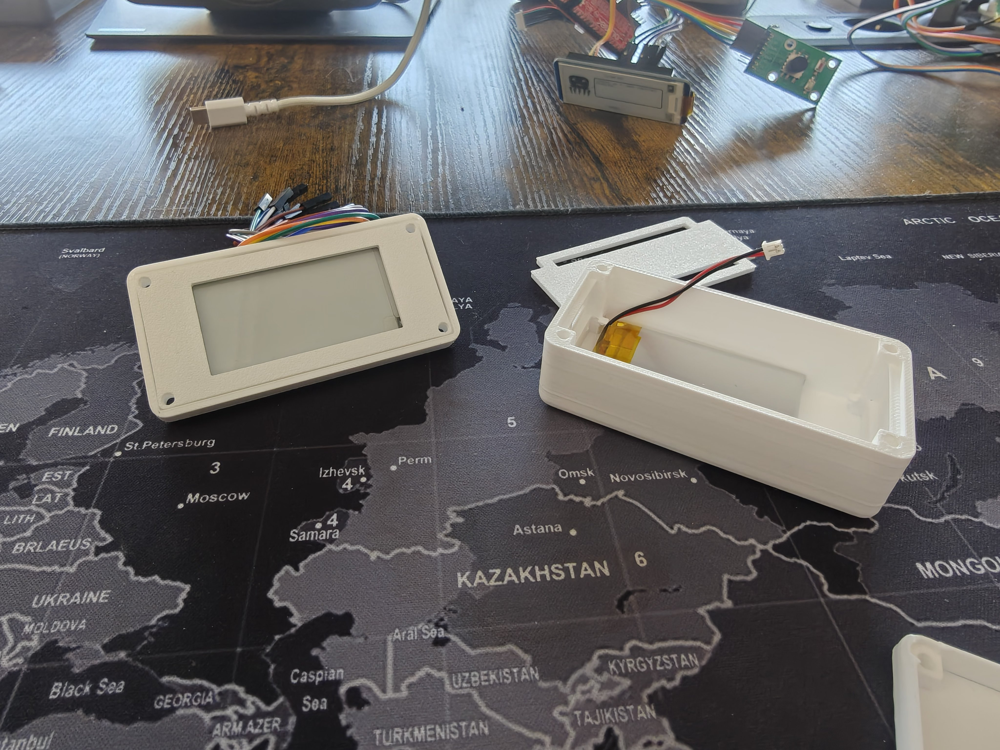

### Components layout

All printed parts and electronics laid out: middle plate (board tray) with header slots, assembled case, and joystick breakout board with labeled directional pins.

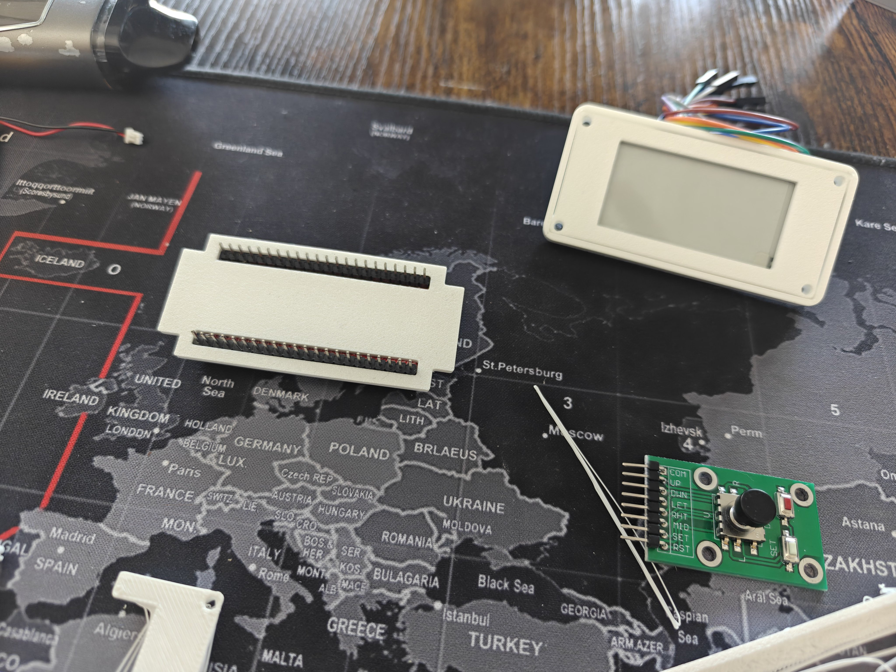

### ESP32-S3 board on printed parts

The Olimex ESP32-S3-DevKit-Lipo (red PCB) sitting on the middle plate and separator sheets. WROOM module, dual USB-C ports, and header pins visible.

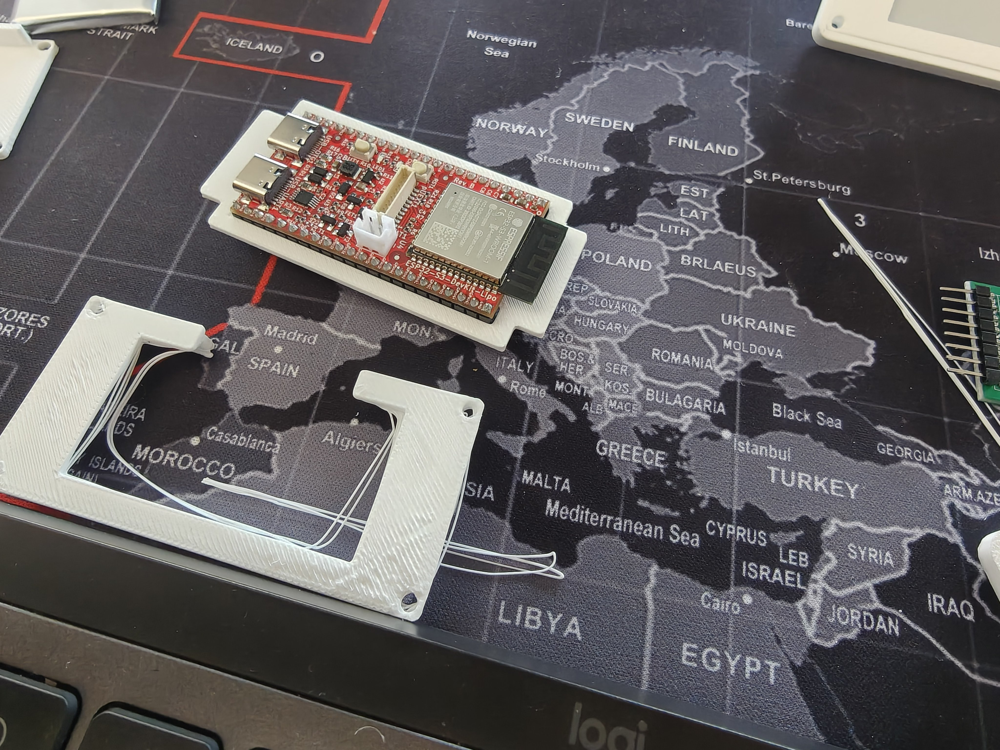

### Middle plate header slots — closeup

The two long rectangular clearance slots (56.5mm x 4mm) that allow the board's header pins to pass through the plate.

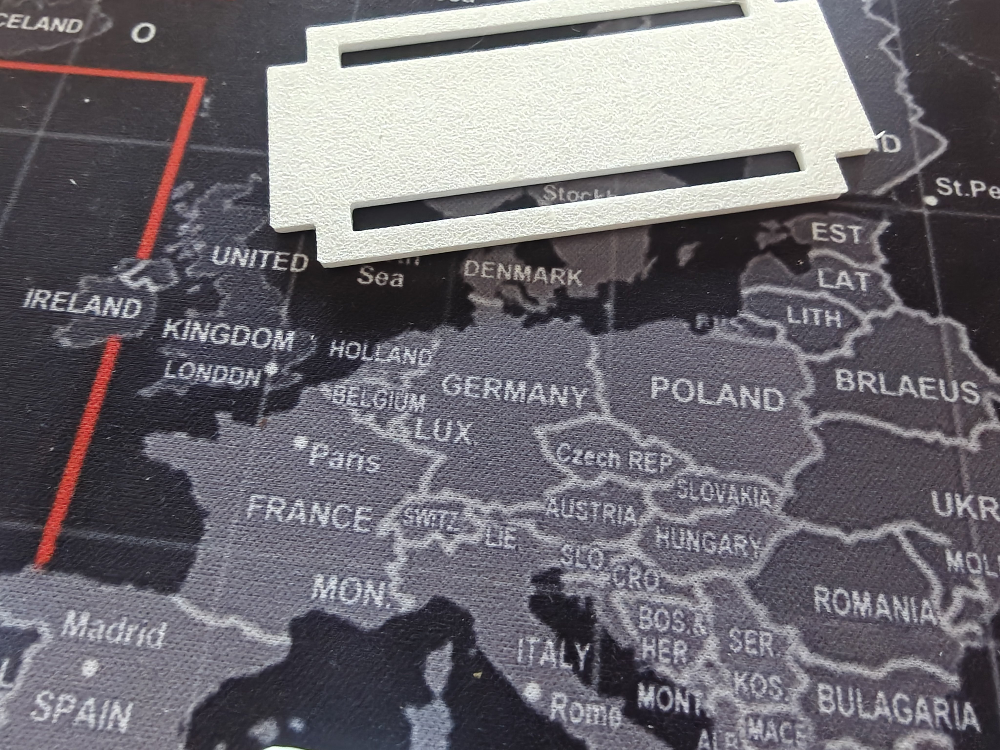

### Board fit-check closeup

The Olimex ESP32-S3-DevKit-Lipo sitting on a printed separator sheet. The WROOM-1 module and antenna are on the left, dual USB-C ports (OTG + programming) on the right, JST battery connector in the center. This photo drove the design of the board cradle separator.

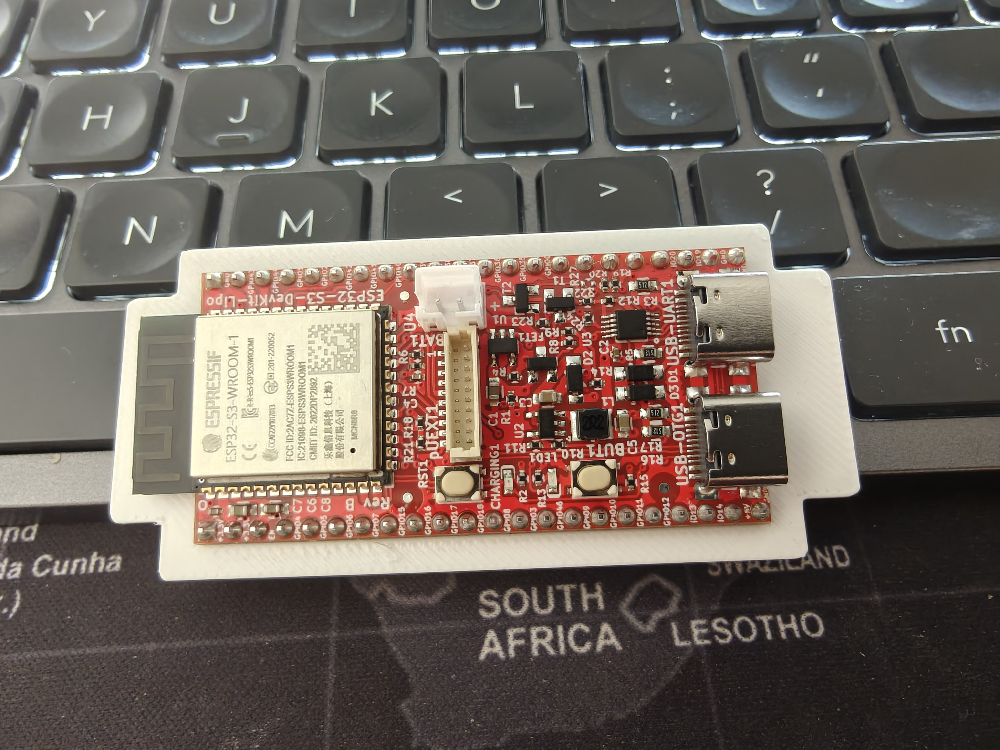

### Dev workstation

The full development setup with dual monitors, ESP32 prototype wired up with jumper cables, and joystick input board.

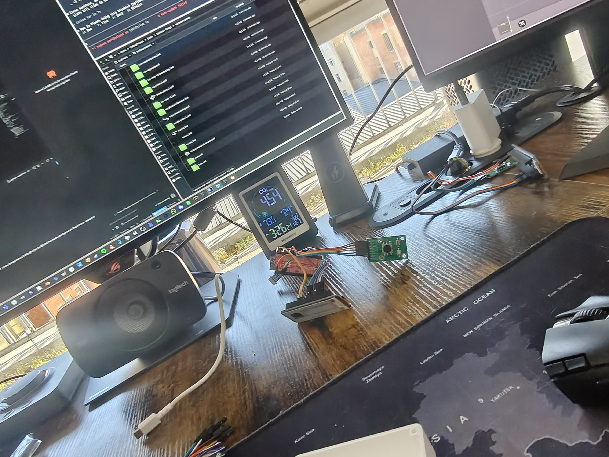

---

## Rev 2 "Extended with Joystick" — Base v1.4

A purpose-built base for the extended layout: battery on the left half, ESP32 stack on the right overhanging the battery top by 5mm, dual USB-C ports popping out the +X end wall, four M3 corner pillars, and two Ø1mm **vertical poke-through holes in the base floor** so a paperclip can reach BOOT/RESET on the upside-down-mounted ESP32 board. **Outer footprint 89.5 × 44 × 12mm** — v1.2 trimmed the battery end by 6.5mm, v1.3 raised the USB-C cutouts 2mm above the ESP32 shelf, v1.4 added the button access holes. 2mm bottom fillet, 4mm top-view corner radius.

Source: [`hardware-design/scad Parts/Rev 2 extended with joystick/base-v1.scad`](https://github.com/rompasaurus/dilder/blob/main/hardware-design/scad%20Parts/Rev%202%20extended%20with%20joystick/base-v1.scad).

### Hand-drawn design sketches

Initial concept sketches drawn on a tablet showing the Rev 2 extended layout dimensions and component placement.

**Dimensions sketch** — Side profile (22mm tall, 35mm deep) and top view (82mm x 44mm outer) with internal section measurements (56.7mm battery chamber, 26.8mm ESP32 section, 19mm display area), 4mm corner radii, and screw post locations.

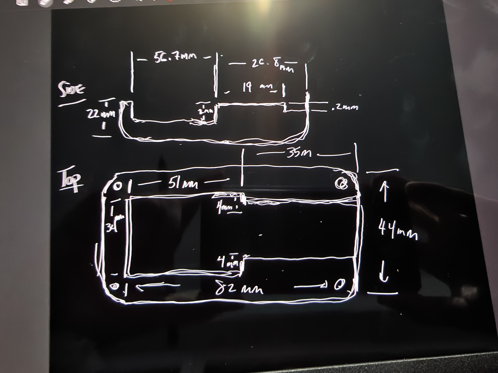

**Component layout sketch** — Same views annotated with component placement: battery in the left chamber, ESP32 in the right chamber with a 2mm divider between them. Shows how the board sits alongside the battery in the split-chamber layout.

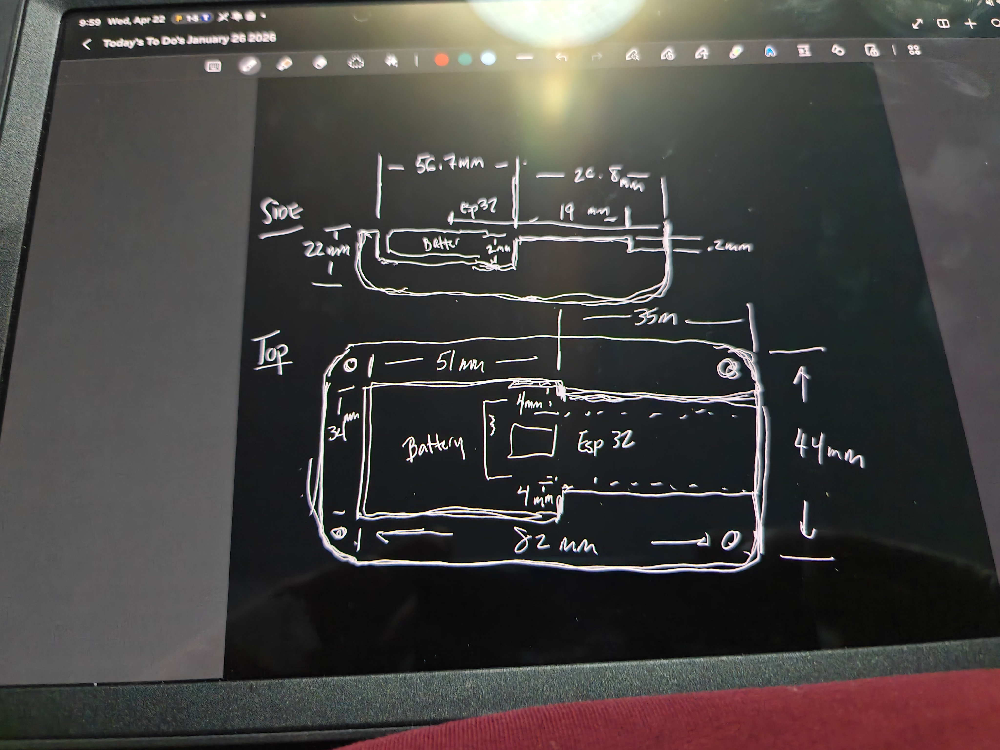

### Isometric render

Four-corner M3 pillars with rounded inner edges, internal Y-axis divider between the battery and ESP32 chambers, and the step-down ESP32 shelf (narrower in Y than the battery to match the real PCB footprint). The longer/flatter profile and the deeper step under the overhang are visible here. Pillars' outer bottom corners inherit the shell's 2mm fillet — no plane-popping off the front face.

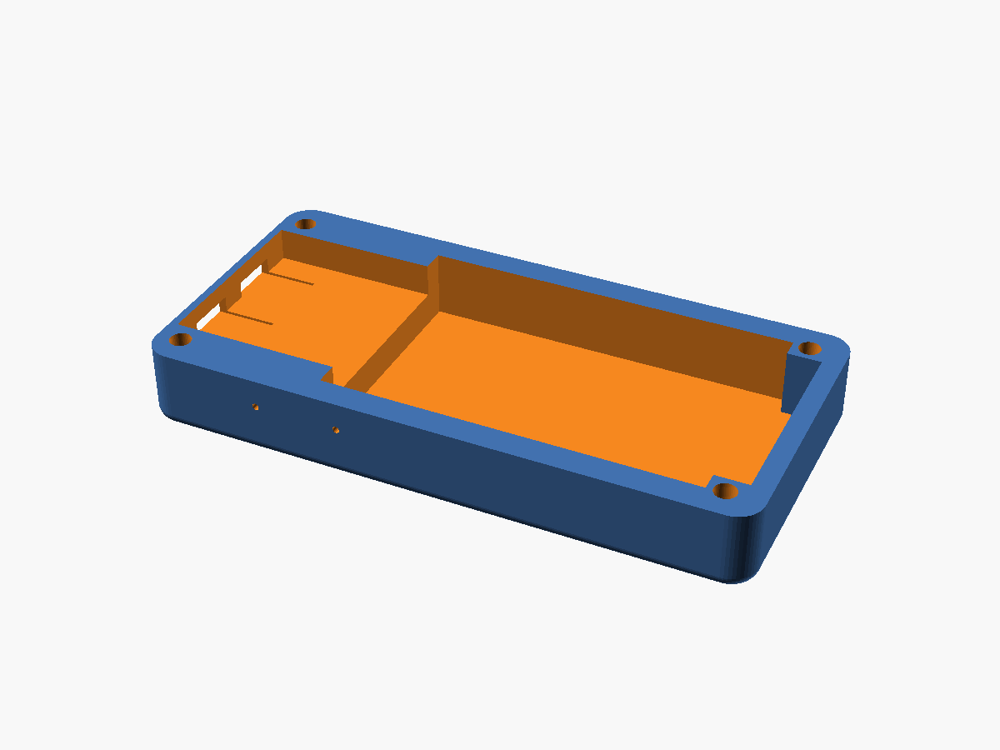

### Top view

Layout at a glance: battery chamber (60.3 × 35.8mm interior) on the left, ESP32 chamber (narrower Y, 28.8mm, 23mm X) on the right, 2mm divider rib between them, 4mm outer corner radius, four M3 through-holes visible in the corners.

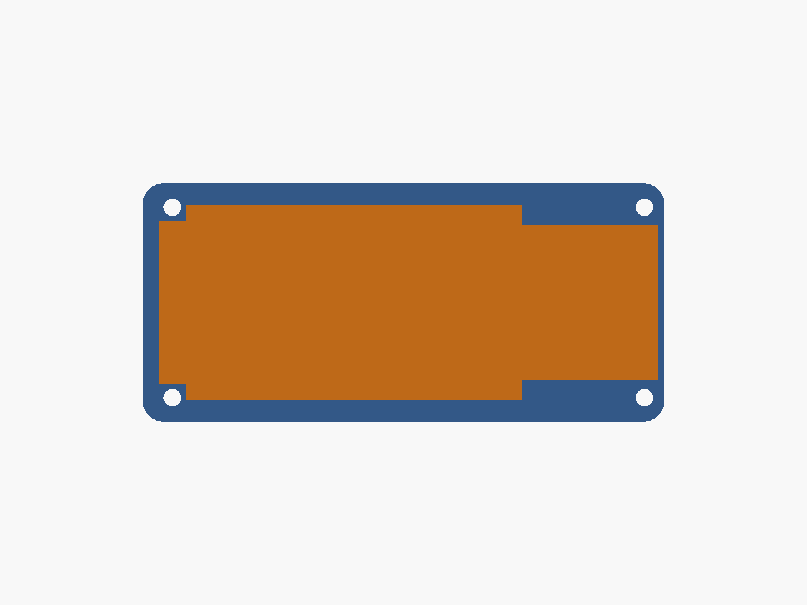

### +X end view — dual USB-C cutouts

The +X face with both USB-C cutouts (7.8 × 2.8mm each), centered on Y=16mm and Y=28mm. Wall is intentionally thin at 1.2mm on this end so the ports poke through cleanly. Cutout z-center now 8mm (raised +2mm in v1.3 so the cutouts clear the ESP32 shelf at z=7).


### Side view

Outer long-side profile — the long-axis walls are solid (all cutouts live on the ±X end walls or the bottom). The shorter, elongated profile is from the v1.1/v1.2 resize.

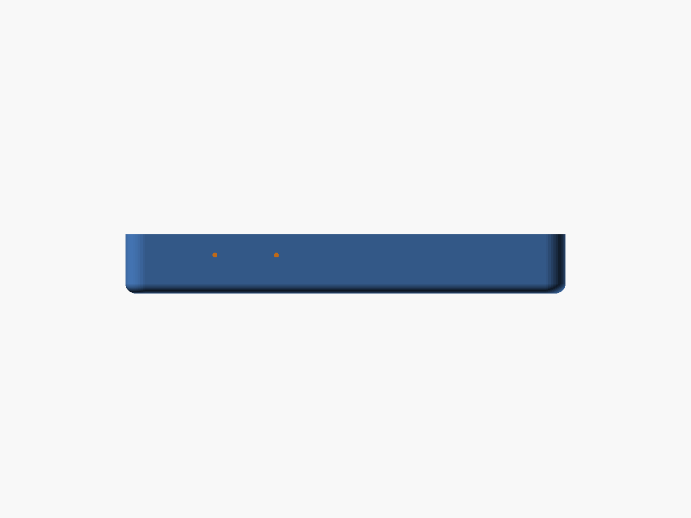

### Bottom view — BOOT/RESET paperclip poke-through holes

View of the underside. Four large circles are the corner pillar screw holes. The two small dots in the +X half are the Ø1mm vertical poke-through holes added in v1.4 — placed so a paperclip inserted from below the enclosure travels straight up through 2mm of base plate plus 5mm of shelf material and reaches the BOOT and RESET buttons on the ESP32 board (which is mounted **component-side down**, so the buttons face the floor).

Positions (bottom-face coordinates): hole 1 at (x=71.3, y=32.5), hole 2 at (x=58.8, y=32.5), both Ø1mm.

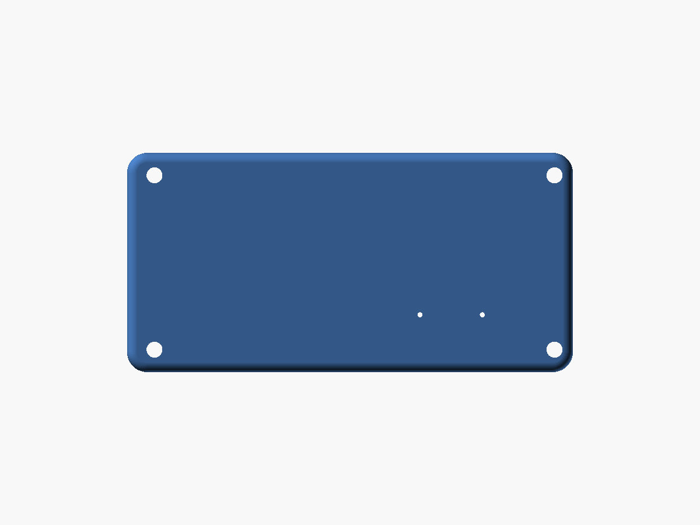

### USB-C closeup (looking from inside)

The two cutouts punched through the thin 1.2mm +X wall at z-center 8mm — fully above the ESP32 shelf (z=7) after the v1.3 bump, so the port recess lives entirely in clear chamber space rather than carving through the shelf.


### Shelf step closeup

Inside view showing the 5mm step from the battery floor (lower) up to the ESP32 overhang shelf (higher), the internal divider rib between chambers, and a corner pillar with its M3 through-hole. The 0.2mm shelf divets under each USB port sit at the +X end, out of frame in this angle.

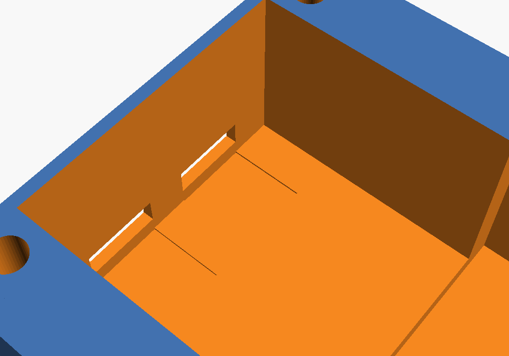

---

## Rev 2 "Extended with Joystick" — Top Cover (Windowed) v1

The top piece for the Rev 2 stack. Outer footprint `91.5 × 44mm` matches `base-v1` and `middle-platform-v1` so the M3 through-bolts line up through the entire sandwich. Combines two Rev 1 ideas — the curved bullnose top from `top-cover-v3-rounded-top` and the display slide-in housing with ±Y snap rails from `top-plate-windowed-v1` — plus a new tapered joystick through-hole on the +X half of the face plate.

Source: [`hardware-design/scad Parts/Rev 2 extended with joystick/top-cover-windowed-v1.scad`](https://github.com/rompasaurus/dilder/blob/main/hardware-design/scad%20Parts/Rev%202%20extended%20with%20joystick/top-cover-windowed-v1.scad).

### Isometric — cavity view

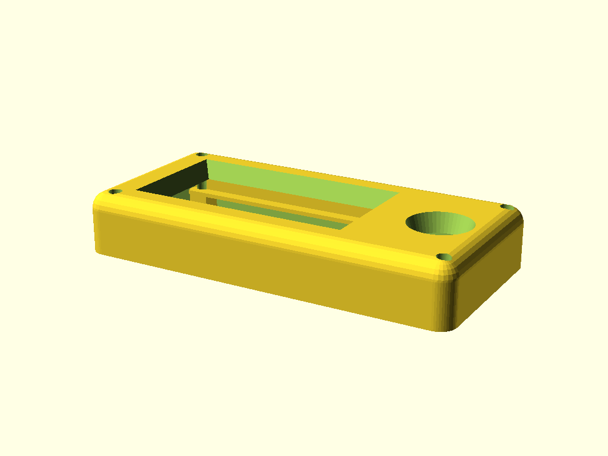

The bullnose radius is 4mm — big enough that the curve reads across the whole front face as a rolled edge rather than a small corner fillet. The face plate itself is only **0.5mm** thick (minimum printable for FDM); most of the visible "top-face taper" happens inside the bullnose above the face plate, via the tapered window and joystick cuts.

### Top view — tapered window + joystick hole

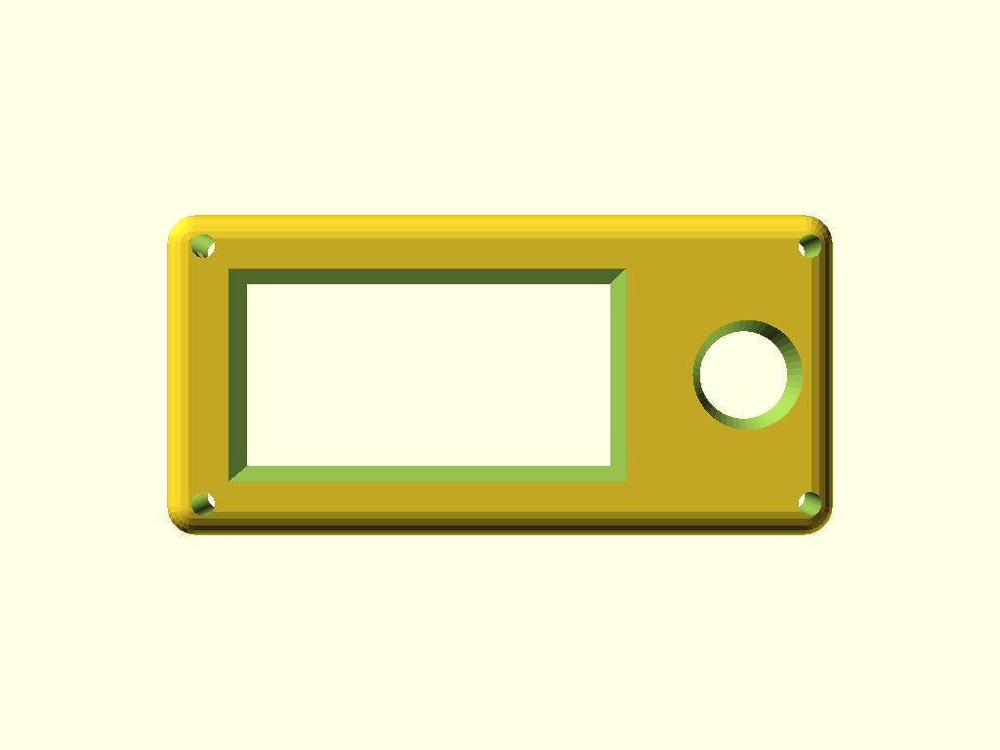

Both openings are cut as a `hull()` frustum — true size at the face-plate bottom and `(opening + 2·taper)` at the top of the cover — so the bullnose rolls into each opening as a shallow funnel instead of meeting it at a hard square edge. Window taper: 2mm per side. Joystick hole taper: 1.5mm on radius (12mm Ø at the face plate, 15mm Ø at the top).

### Side profile — bullnose


Side view showing the 4mm bullnose rolling the outer wall into the top face across the full long axis.

### Underside — rails, wire gap, -X pillar shortening

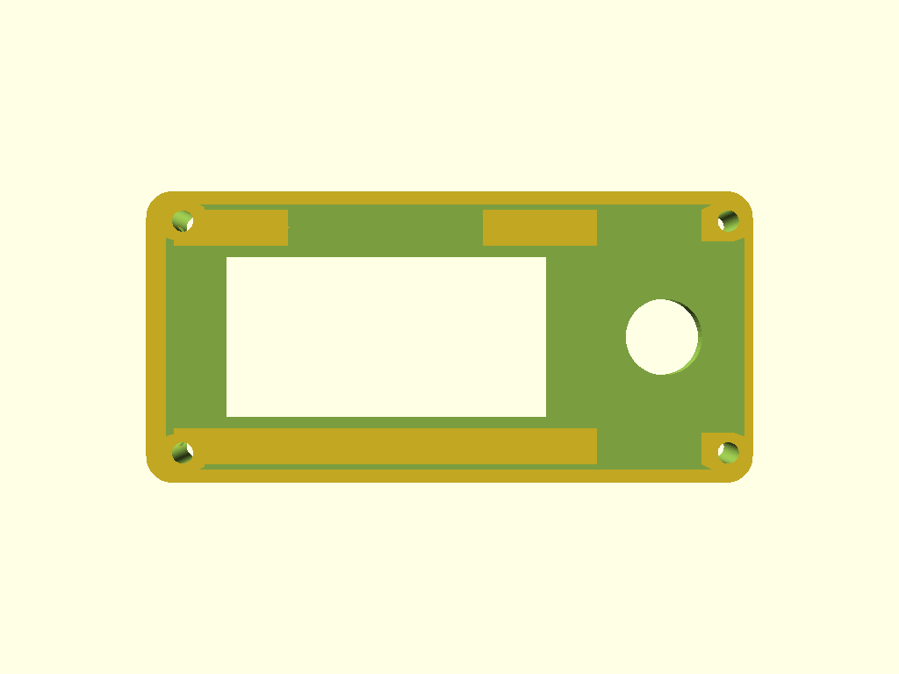

Two ±Y snap rails run along the display's long edges. Each rail is **2.5mm** wide in Y (matching Rev 1's `top-plate-windowed-v1`), with a 1mm-thick lip at the bottom that protrudes 1mm inward past the display's ±Y edge to catch the display from below. The open space between rail inner edge and display edge doubles as a wire-routing channel.

A **30 × 6mm wire pass-through gap** notches the middle of the -Y rail so wires can cross the rail boundary without fighting the snap — same pattern as Rev 1, rotated for the landscape display orientation.

The **-X corner pillars** show only the screw-clearance hole at this level — the full square pillar only exists at the base (z=0 → 5.5), where it mates with `middle-platform-v1`. Above the rail-bottom level, the -X pillars are omitted so the square-pillar edges don't clutter the cavity between the rail top and the face plate. The M3 bolt still has a continuous material path — pillar → rail → face plate → bullnose — but the visible pillar footprint only appears where it's structurally needed at the base. The +X pillars stay full-height (no rails reach them).

---

## Rev 2 Top Cover — Screen Inlay Variant (2026-04-24)

A second top-cover family, in parallel with the windowed-v1 above, that drops the snap rails entirely and replaces them with a **3 mm-deep inlay recess** carved up into the face plate from below. The raw Waveshare 2.13" module (glass + PCB, no carrier housing) rests *into* the recess, held flat against the face plate from the bottom by a separate retention plate bolting up through the 4 corner pillars.

Source: [`hardware-design/scad Parts/Rev 2 extended with joystick/top-cover-windowed-screen-inlay-v1.scad`](https://github.com/rompasaurus/dilder/blob/main/hardware-design/scad%20Parts/Rev%202%20extended%20with%20joystick/top-cover-windowed-screen-inlay-v1.scad) (3 mm FPC divet) and [`...-screen-inlay-v1-2mm.scad`](https://github.com/rompasaurus/dilder/blob/main/hardware-design/scad%20Parts/Rev%202%20extended%20with%20joystick/top-cover-windowed-screen-inlay-v1-2mm.scad) (2 mm FPC divet sibling).

### Isometric — cavity view

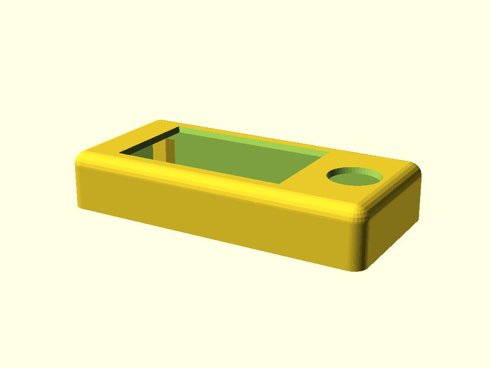

All four corner pillars run full-height to the face plate top. M3 corner bores are **blind from below** — they open at the cover's mating bottom and cap at `face_plate_bottom_z_mm` so no screw holes are visible on the front face. A retention plate (separate part) provides the load path — the cover just has the bolt receivers.

### The Waveshare module — raw form

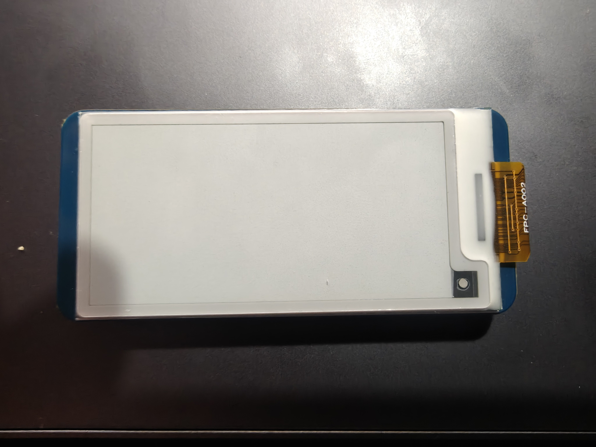

The inlay is sized around the raw display module (glass + FPC + no carrier). The 3 mm recess gives enough Z clearance for the glass plus the FPC fold-over behind it.

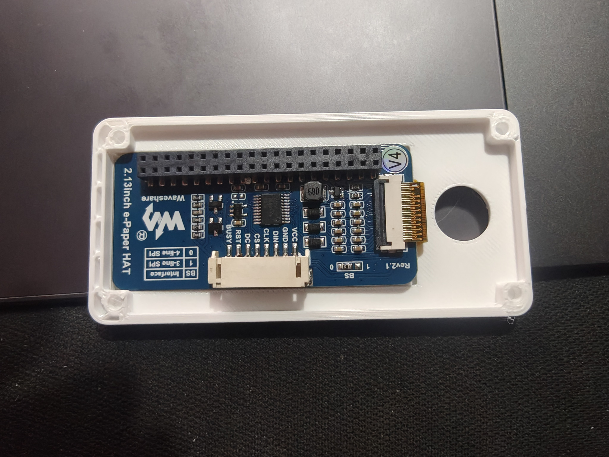

The FPC cable exits the +X end of the display through an FPC-ribbon divet cut into the -X end wall (thinning that wall from 3 mm to 1 mm over a 13 mm Y band, directly opposite the joystick hole).

### First print — what needed fixing

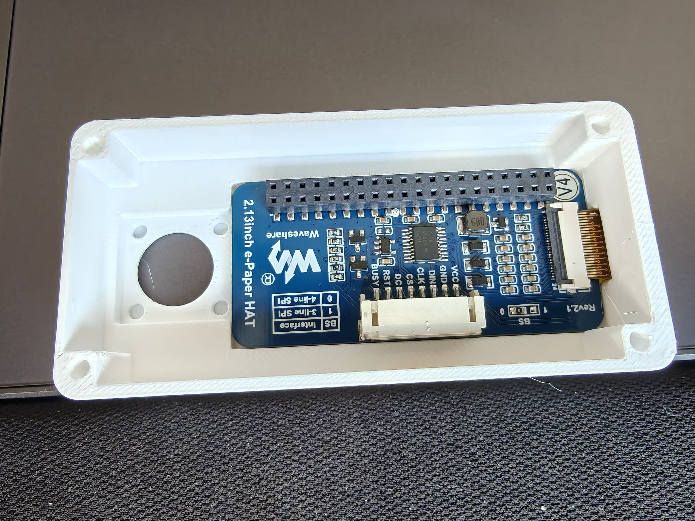

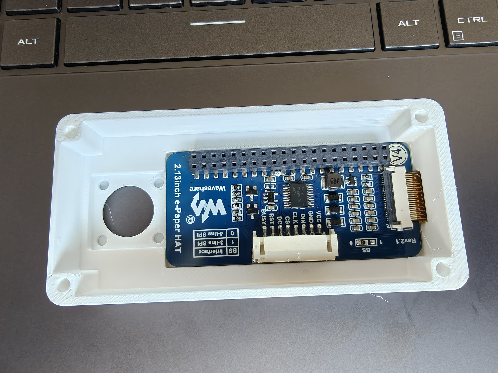

Three things showed up in the first print (0.5 mm face plate, 50 × 25 window, 4 joystick-PCB mount bores still present):

1. A hairline seam along the top edge of the inlay recess where the 0.5 mm face plate printed as a single perimeter + one thin top layer and didn't fully close. Fix: `face_plate_thickness_z_mm` bumped **0.5 → 0.7** to give the slicer enough material for a proper multi-layer top skin.
2. Four visible dimples arranged in a ring around the joystick cutout on the underside (the joystick-PCB mount bores). The retention strategy for the joystick PCB hasn't been decided yet (glue, press-fit, and heat-set inserts are all still on the table), so **the 4 bores were removed** from the inlay variants. The parameter definitions are kept in the SCAD so the geometry is one block away from returning.
3. The window was 2 mm too long in X on the -X end and 2 mm too short in Y overall, compared to the actual viewable pixel area of the Waveshare module.

### Window resize to match the viewable pixel area (2026-04-24)

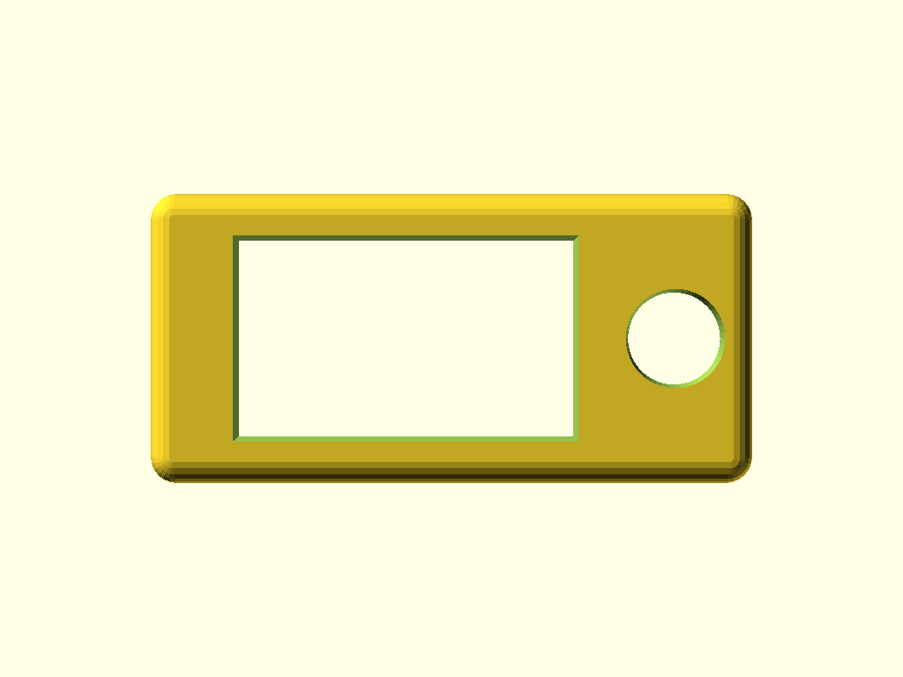

Window dimensions updated across all three cover variants (inlay + base):

| Dimension | First print | Post-2026-04-24 | Effect |
|---|---|---|---|
| `display_viewing_window_length_along_x_mm` | 50 | **48** | -X short side moves inward 2 mm |
| `display_viewing_window_depth_along_y_mm` | 25 | **27** | ±Y long sides each extend 1 mm outward |
| `display_window_shift_toward_joystick_x_mm` | 2 | **3** | compensates for the shorter length so only the -X edge moves — the +X edge stays at X=62.9 |

New window X range: 14.9 → 62.9 (was 12.9 → 62.9). New Y range: 8.5 → 35.5 (was 9.5 → 34.5).

### Underside — rails gone, bores blind, joystick pocket only

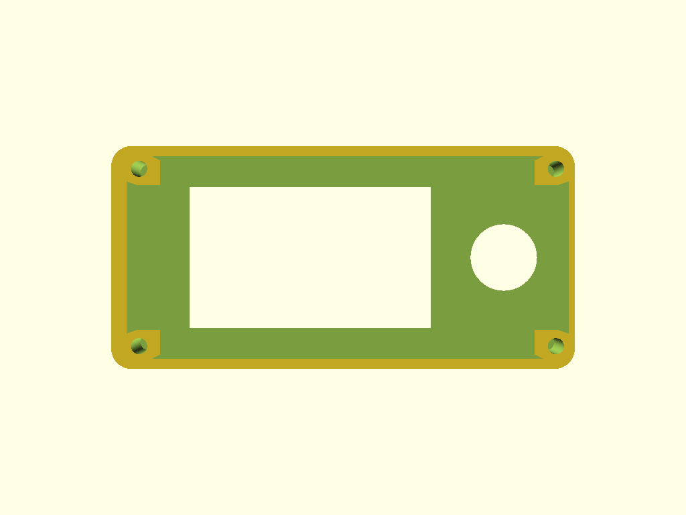

From below you see just the 4 M3 bores at the corners, the display inlay recess (large rectangle), the joystick through-hole, and the 20 × 20 mm joystick-PCB pocket adjacent to it. No rails, no lips — the retention plate handles display holding. No dimples around the joystick (mount bores removed).

### Side profile

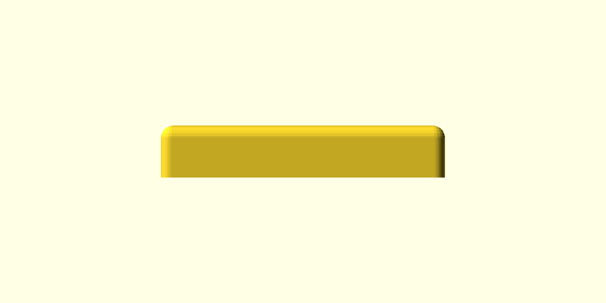

The inlay variant is 2 mm taller overall than the windowed-v1 above because the display envelope thickens from 5 mm to 7 mm (raw module + FPC fold-over wiggle room) and the face plate goes from 0.5 mm to 0.7 mm. Total cover height: **16.7 mm** (was 14.5 mm for windowed-v1).

---

## Rev 2 — Dual 10440 Battery Case Redesign (2026-04-24)

A fit study of the original 3000 mAh pouch cell against the Rev 2 base showed it overhangs the ±Y long walls by ~5 mm and is thicker than the cavity above the board — the pouch had to stack *above* the Pico W, adding ~10 mm to the stack. Rethinking the power path around a pair of slim cells flanking the Pico W instead.

**Chemistry decision.** The existing TP4056 USB-C charger and the Pico W's VSYS input (1.8–5.5 V) both want single-cell 3.7 V Li-ion. That rules out AAA alkaline (1.5 V series pair discharges into brownout territory and can't be recharged) and AAA NiMH (2.4 V works but needs a different charger). The drop-in fit is **10440 Li-ion** — same AAA form factor (Ø 10 × 44 mm), same chemistry as the LiPo pouches, ~350 mAh per cell. Two in parallel → ~700 mAh pack, TP4056 unchanged (just derate R_prog to ~3.4 kΩ for 350 mA CC).

**Three case variants** landed under `hardware-design/scad Parts/Rev 2 extended with joystick/04-24-designs-alterations/`:

| Variant | Outer | Notes |
|---|---|---|
| `base-v2-thin-dual-10440` | 91.5 × 46 × 12 mm | First cut. +2 mm Y to fit two Ø10 cells flanking a 21 mm Pico W with slop; -2 mm Z (thinner); 4 contact-tab slots; single USB-C on +X. Assumes 3-piece stack. |
| `base-v3-2piece` | 91.5 × 46 × 14 mm | Merged the middle platform into the base (per "I want this done in 2 pieces"). Pico inlay chamber at middle Y; display's ±Y overhang (4 mm/side) rests on the solid base rim at z=14. Stack total **25.7 mm** (was 36.7 mm). |
| `base-v4-2piece-open` | 91.5 × 46 × 14 mm | v3 + two rectangular slots through the -X end wall so 10440 cells slide in from outside without unbolting the cover. Raised Pico-chamber ±Y lips at z=14–15 for cover-base alignment on the non-battery edges. |

**Matching covers** for the Y=46 footprint:

| Variant | Purpose |
|---|---|
| `top-cover-windowed-screen-inlay-v2-46y` | 3-piece sibling with only the +2 mm Y bump (for anyone who wants to keep the middle platform). |
| `top-cover-windowed-screen-inlay-v3-2piece` | 2-piece sibling — drops the 5 mm middle-platform pedestal reservation; cover is 11.7 mm (was 16.7 mm). Mates with base-v3 / base-v4. |

A fit-check with 2× Kodak Xtralife alkaline AAAs proved the physical clearance works at Y=46 (pre-10440 arrival), and set up the cell-retention plan: stamped strip contacts press-fit into the 4 generic slots at ±X ends of each cell bay; wires route up through the Pico chamber (the cell bay ceiling at z=12 and the Pico chamber at z=8–14 are connected by the shared open cavity above z=12).

**Negative-space contour experiment** (`top-cover-v4-contoured-25mm.scad`) — a later attempt to sculpt the cover's underside around the cells, FPC fold, and Pico W for a 25 mm clamshell — was deleted after review. Kept here as a note: if the clamshell direction gets revisited, the parameter knobs are `cover_downward_extension_below_mating_mm`, a half-cylinder cutout per cell along X, and a 2 mm FPC pocket on the -X side of the display.

Research docs: [battery-redesign-shopping-list.md](https://github.com/rompasaurus/Dilder/blob/main/docs/battery-redesign-shopping-list.md), [solar-charging-research.md](https://github.com/rompasaurus/Dilder/blob/main/docs/solar-charging-research.md).

---

## Rev 2 — AAA Cradle Insert + Base Plate First Print (2026-04-25)

A fourth design path for the Rev 2 stack: a **drop-in AAA cradle** that lives in the cover's negative space, plus a **shallow base plate** that snaps into the cover via four corner pegs. The middle platform goes away entirely — what it carried now gets split between the cradle insert and the base plate.

### Cradle insert standalone

The cradle insert printed in dark PLA, shown with two Kodak Xtralife alkaline AAAs as stand-ins for the 10440 Li-ion cells on order. The two cell bays run along ±Y with the center Pico nest cutout open between them.

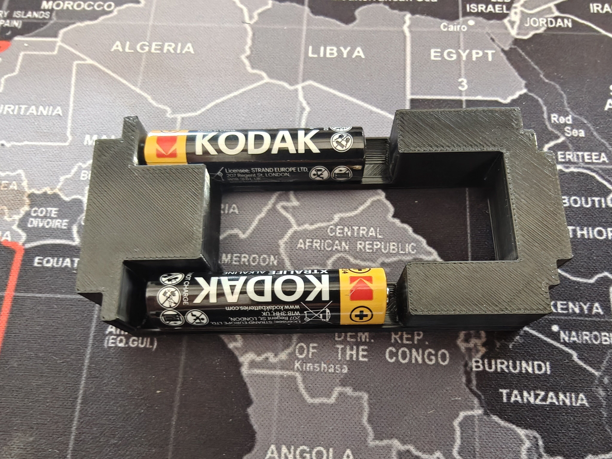

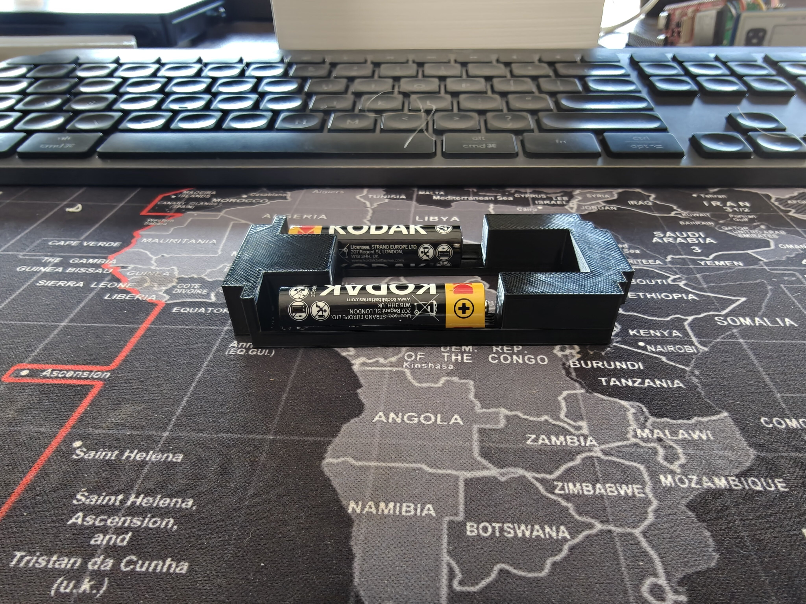

### Assembled stack — cradle + base plate + Pico 2 W

The cradle drops into the base plate's pocket, Pico 2 W nests into the center cutout between the two cells, and the base plate's four corner pegs engage the cover's blind M3 bores above.

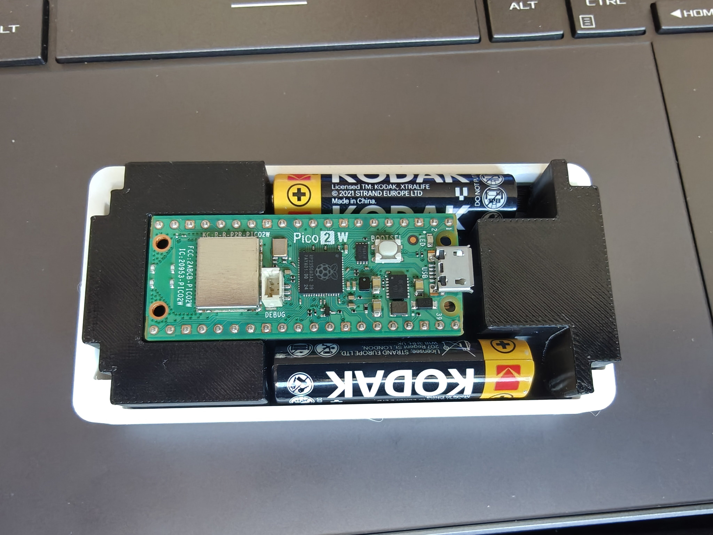

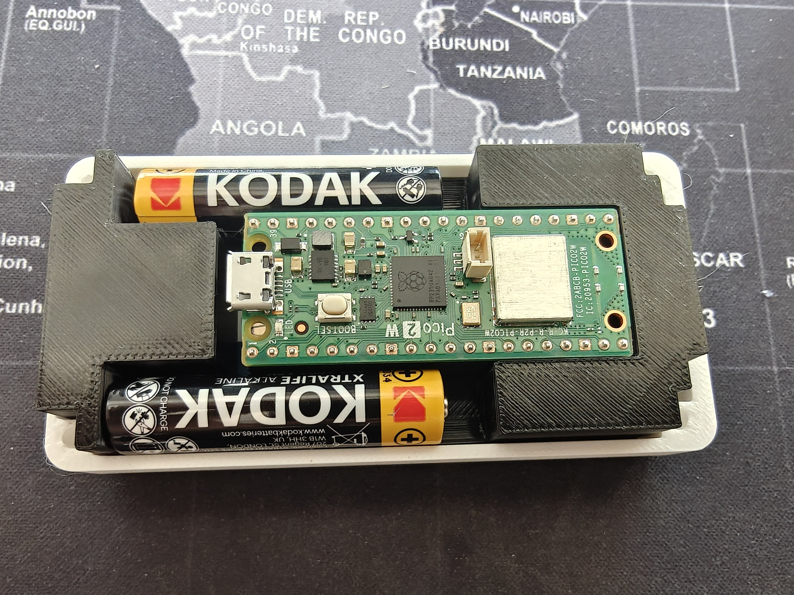

### Side profile

The assembled cradle + base plate stack showing the thin form factor. The base plate's 7 mm height plus the cradle's 5.1 mm plug below the cover mating plane gives a sub-cover height of just 12.1 mm.

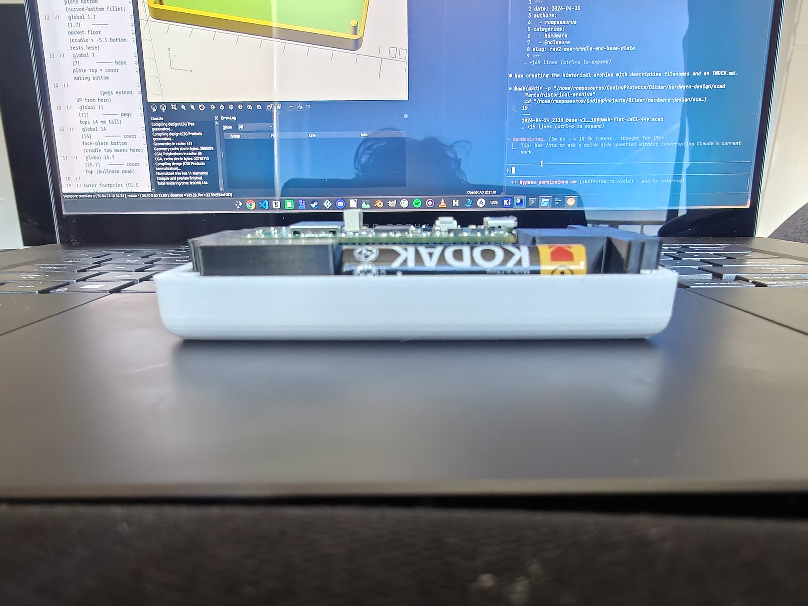

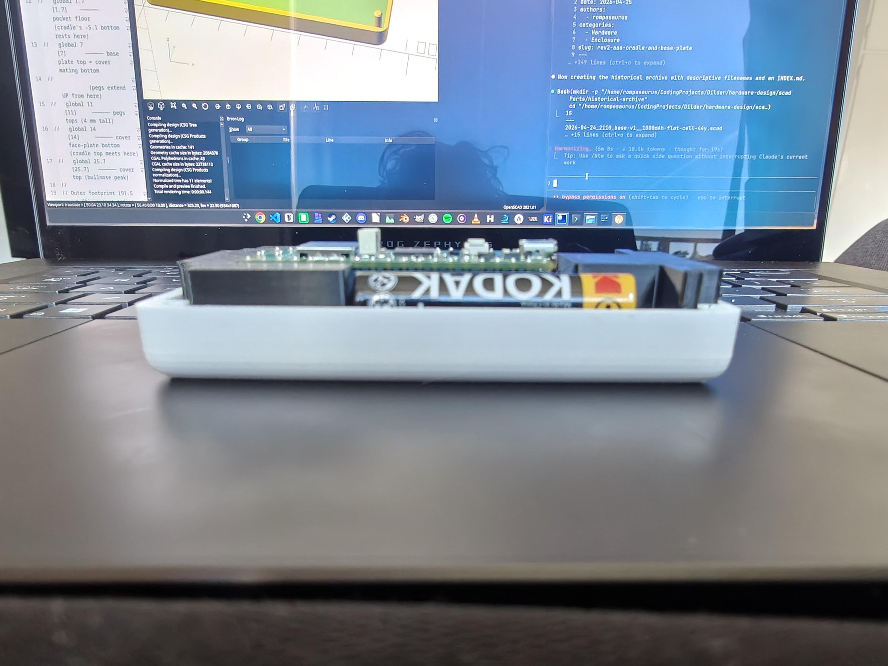

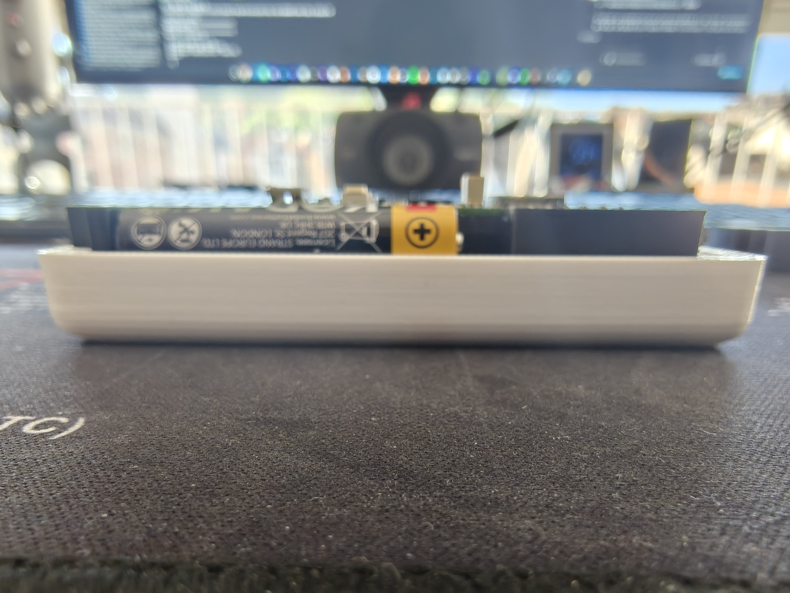

Source: [`04-24-designs-alterations/aaa-cradle-insert-v1.scad`](https://github.com/rompasaurus/dilder/blob/main/hardware-design/scad%20Parts/Rev%202%20extended%20with%20joystick/04-24-designs-alterations/aaa-cradle-insert-v1.scad), [`04-24-designs-alterations/base-plate-v1.scad`](https://github.com/rompasaurus/dilder/blob/main/hardware-design/scad%20Parts/Rev%202%20extended%20with%20joystick/04-24-designs-alterations/base-plate-v1.scad).

---

## Rev 2 — TP4056 Charge Board Integration (2026-04-25)

The cradle insert, base plate, and top cover redesigned to integrate the TP4056 USB-C charge board. The enclosure extends 3 mm on the -X side to accommodate the board, which sits in a 1 mm indent on the connecting block's top face with its USB-C port accessible through cutouts in the cradle and cover walls.

### Cradle insert v2

The connecting block extended to 29 mm in X and full plug height, with concave battery-following curves on the ±Y faces, a 1 mm TP4056 indent, and a USB-C port cutout through the -X face. AAA bay cuts restructured to an outer `difference()` so they pass cleanly through the connecting block with no residual walls. A 3 mm FPC connector cutout added on the bottom face at the +X end.

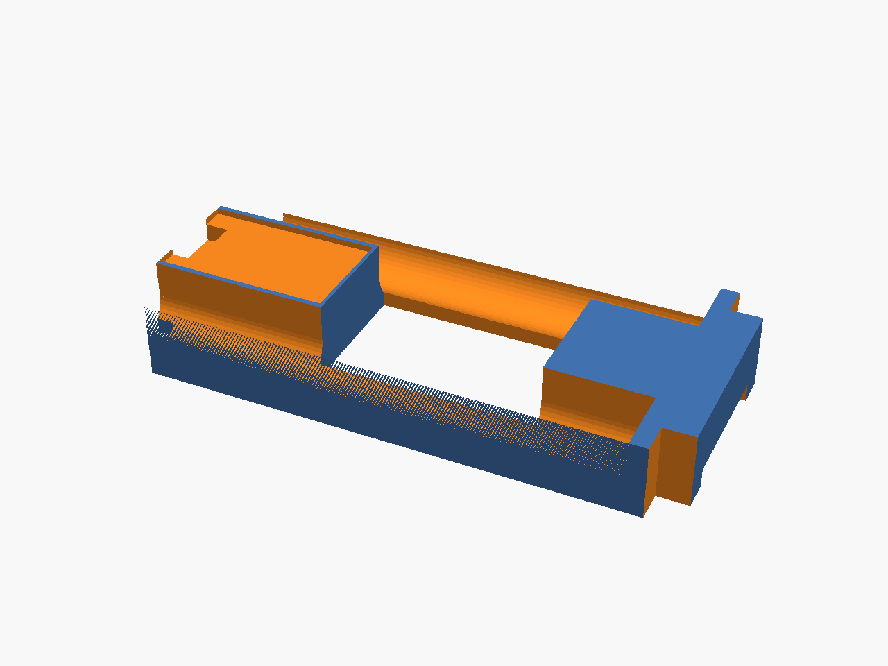

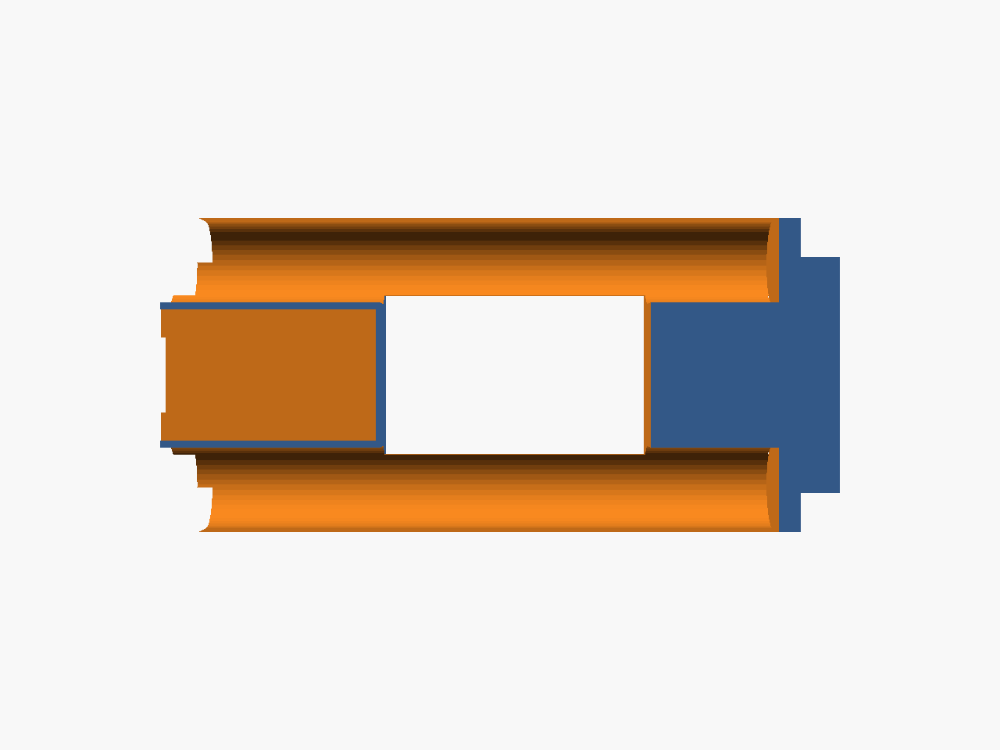

### Base plate v2

Square 5×5 mm pillar bases replace bare cylindrical pegs (pillars from pocket floor to plate top, 3 mm pegs on top). Battery cradle troughs carved into the ±Y pocket sides — solid fills connected to the enclosure walls with the AAA cylinder subtracted downward, creating concave channels the cells drop into.

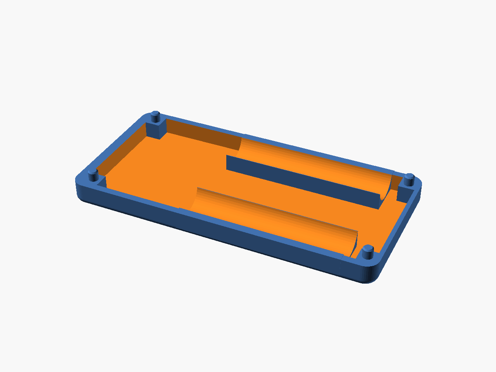

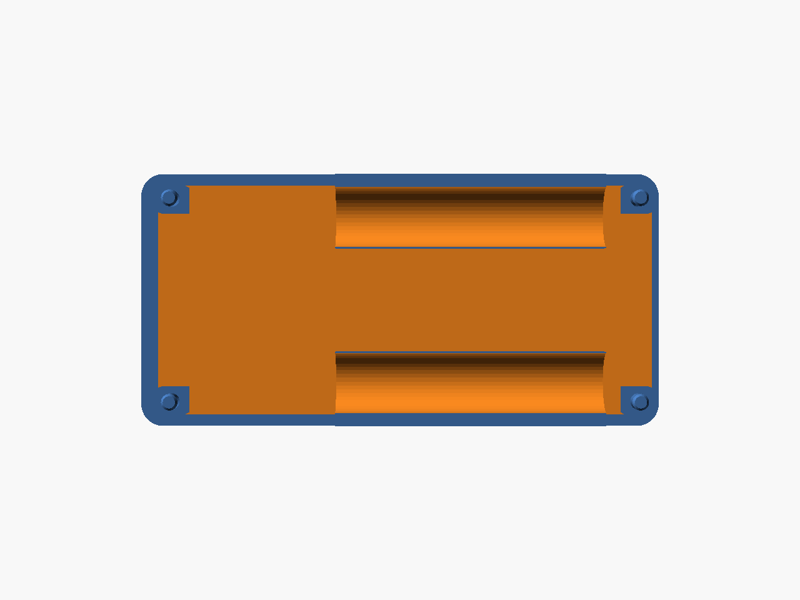

### Top cover — USB-C cutout

USB-C port cutout (10×5 mm) through the -X wall at y=23, z=5.5 (cover-local). Joystick through-hole position hardcoded at x=79.35 to prevent the 1.5 mm shift from the enclosure extension.

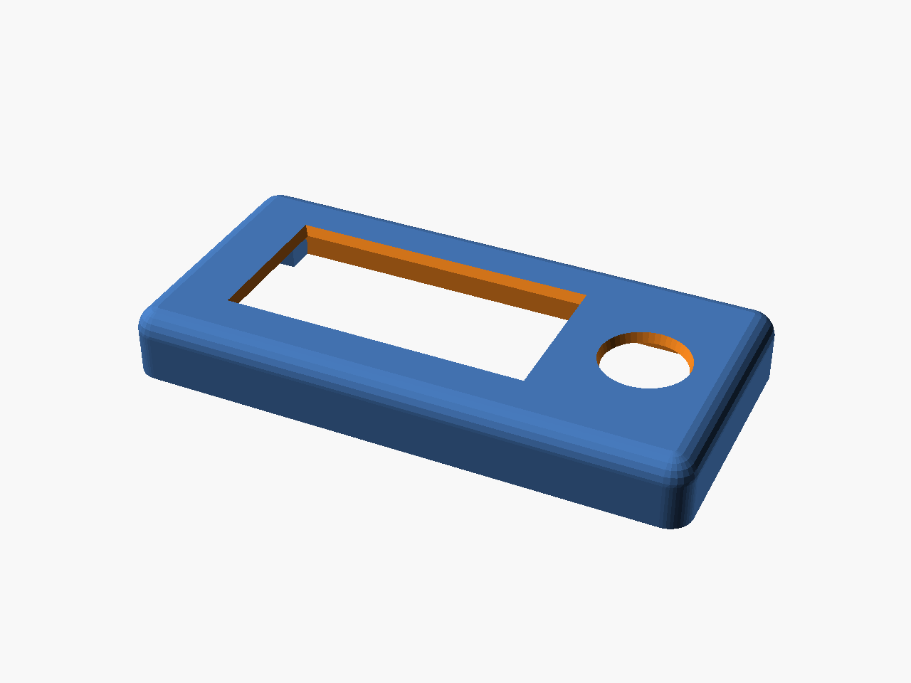

Source: [`04-25-design-alterations/aaa-cradle-insert-v1.scad`](https://github.com/rompasaurus/dilder/blob/main/hardware-design/scad%20Parts/Rev%202%20extended%20with%20joystick/04-25-design-alterations/aaa-cradle-insert-v1.scad), [`04-25-design-alterations/base-plate-v1.scad`](https://github.com/rompasaurus/dilder/blob/main/hardware-design/scad%20Parts/Rev%202%20extended%20with%20joystick/04-25-design-alterations/base-plate-v1.scad), [`04-25-design-alterations/top-cover-windowed-screen-inlay-v3-2piece.scad`](https://github.com/rompasaurus/dilder/blob/main/hardware-design/scad%20Parts/Rev%202%20extended%20with%20joystick/04-25-design-alterations/top-cover-windowed-screen-inlay-v3-2piece.scad).

---

## Rev 2 — Joystick Breakout PCB v2.0 + Headless Autoroute (2026-04-26)

The Rev 1 joystick PCB shipped with three serious bugs: a hand-drawn footprint with the wrong pad geometry, a wire pad that physically overlapped a mounting hole, and three pin assignments that didn't match the Alps datasheet. Rev 2.0 fixes all three by stealing real reference designs and runs the full autorouter pipeline headless from the CLI.

### What changed

- **Footprint**: cloned verbatim from `crides/kleeb`'s `SKRHA-boss` (a production-tested keyboard library), then mathematically rotated -45° so pads are axis-aligned on left/right faces of the body. Includes the two NPTH alignment-post holes and two SMD anchor pads from the source.
- **Pin names**: confirmed against the Alps SKRHABE010 datasheet circuit diagram. Pin 1=A, 2=Center (press), 3=C, 4=B, 5=Common (GND), 6=D. Three of these were wrong in Rev 1.
- **Wire pads**: now 1.8 mm pitch on the bottom edge between the lower M3 holes. Smaller 1.4 mm OD / 0.8 mm drill. All clearances verified with a Python script *before* drawing — 0.74 mm minimum drill-to-drill against M3 holes, 1.0 mm pad-to-pad, 2.30 mm to board edge.
- **Routing**: 2 layers, 23 segments + 1 via, 534 mm total length. **8 bends, all 45°. Zero 90° corners.**

### Renders

#### Isometric (3D)

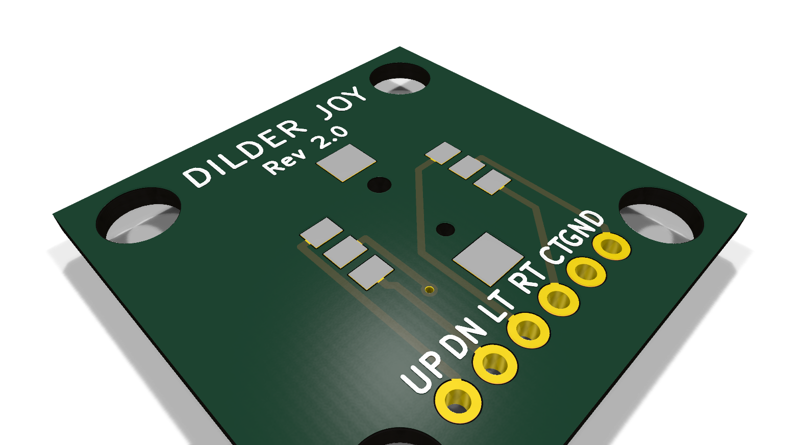

#### Top + bottom

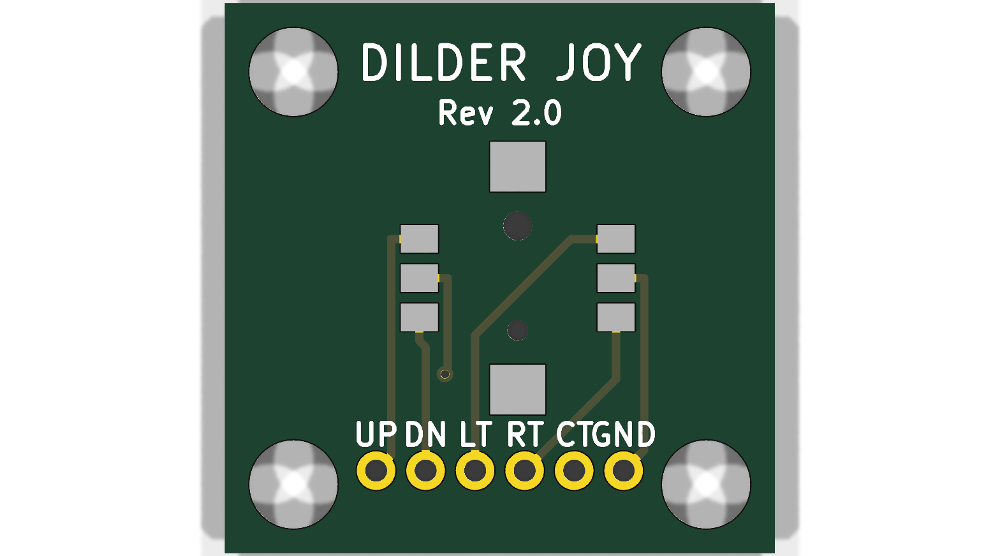

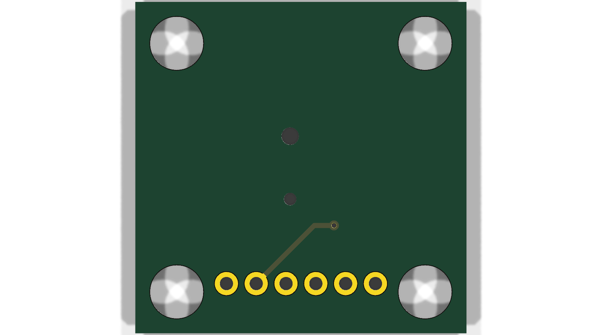

### Headless autoroute pipeline

```bash
# 1. Export Specctra DSN from KiCad
python3 -c "
import pcbnew
b = pcbnew.LoadBoard('joystick-pcb.kicad_pcb')
pcbnew.ExportSpecctraDSN(b, '/tmp/joystick.dsn')
"
# 2. Run Freerouting headless (Docker — no Java needed locally)
docker run --rm -v /tmp:/work \
  --entrypoint java ghcr.io/freerouting/freerouting:latest \
  -jar /app/freerouting-executable.jar \
  -de /work/joystick.dsn -do /work/joystick.ses -mp 100
# 3. Import session back
python3 -c "
import pcbnew
b = pcbnew.LoadBoard('joystick-pcb.kicad_pcb')
pcbnew.ImportSpecctraSES(b, '/tmp/joystick.ses')
b.Save('joystick-pcb.kicad_pcb')
"
# 4. DRC
kicad-cli pcb drc --output drc.json --format json joystick-pcb.kicad_pcb
```

KiCad DRC reports 0 copper, 0 unconnected, 0 schematic-parity issues.

Source: [`hardware-design/joystick-pcb/`](https://github.com/rompasaurus/dilder/tree/main/hardware-design/joystick-pcb), [`design-notes.md`](https://github.com/rompasaurus/dilder/blob/main/hardware-design/joystick-pcb/design-notes.md).

---

## Rev 2 — v3 Print Session Photos (2026-04-26)

Overnight print of the latest base plate v3 (with support blocks and raised battery rails) and updated cradle/top cover. All three parts photographed during fit-check with Pico 2 W, TP4056 charge board, Ansmann AAA batteries, and Waveshare e-ink display. Also pictured: a small 62x36mm solar panel (AK 62X36) for future solar charging integration.

### Full exploded layout — all three parts

Top cover (with Pico 2 W and Waveshare display), cradle insert (with TP4056 and AAA battery), and base plate v3 laid out side by side.

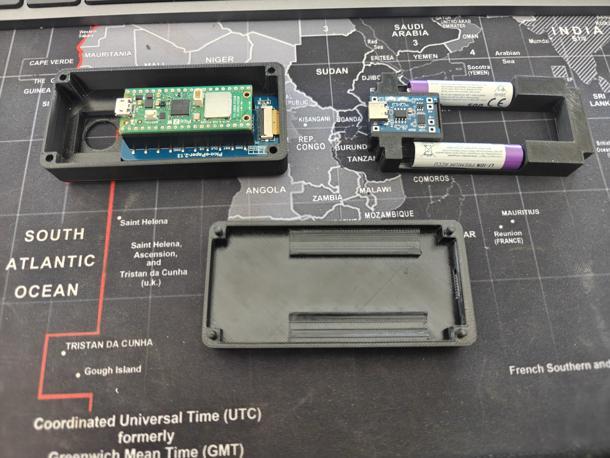

### Assembly exploded — top cover and base plate

Top cover with components installed next to the empty base plate, showing the two-piece stack before mating.

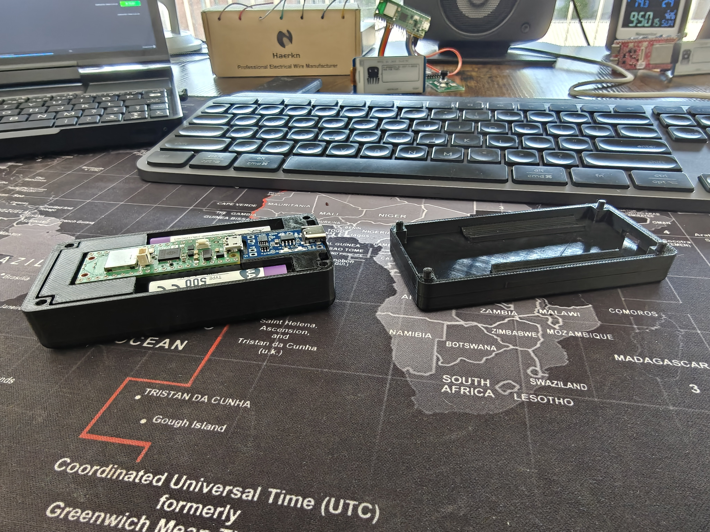

### Cradle insert — Pico 2 W, TP4056, and batteries top-down

All components seated in the cradle: Pico 2 W in the center nest, TP4056 charge board at the +X end, two Ansmann AAA Li-Ion batteries in the flanking bays.

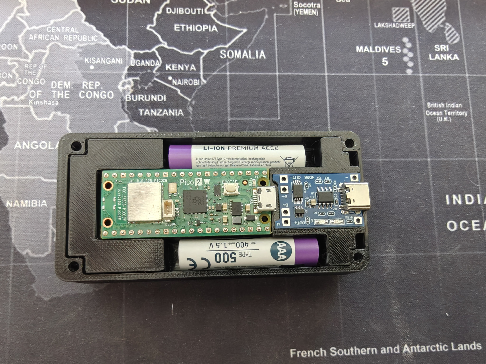

### Cradle insert — TP4056 and batteries close-up

Close-up of the TP4056 board seated on the connecting block with batteries in the troughs. USB-C port aligned with the +X wall cutout.

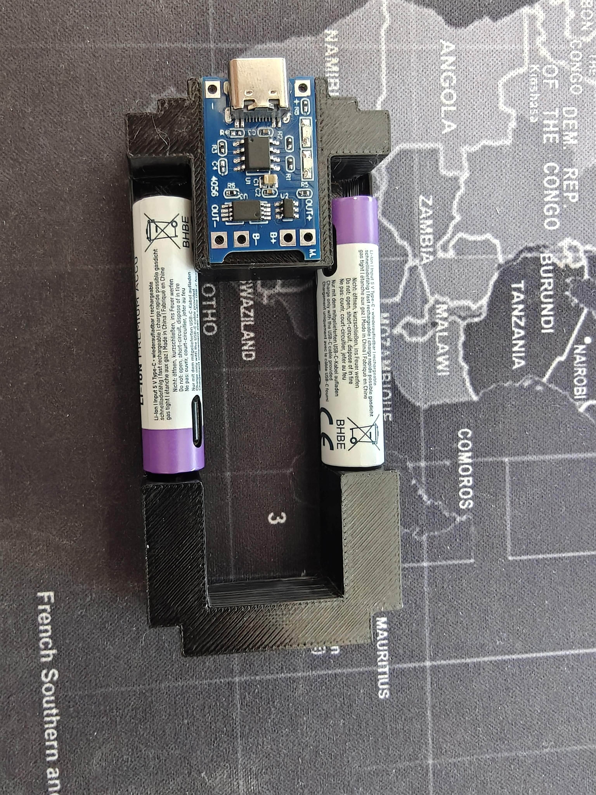

### Cradle insert — side profile

Side view showing the battery sitting in the concave trough, rail height, and TP4056 USB-C connector position.

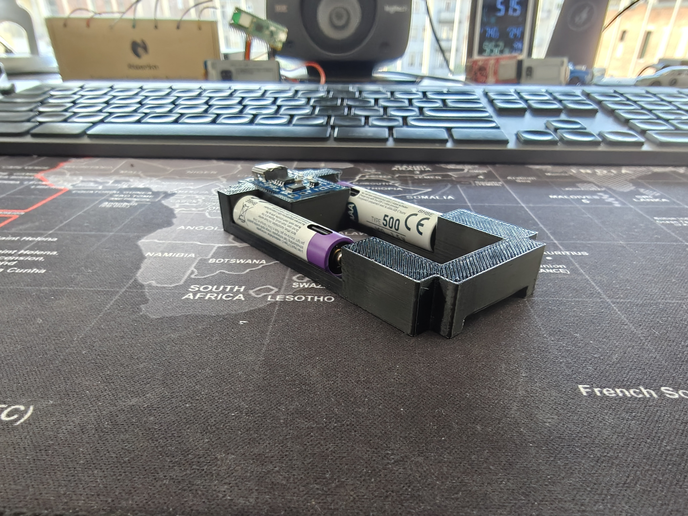

### Cradle insert — angled view of USB-C end

Angled shot of the TP4056 end showing the USB-C port, support blocks, and battery bay wall geometry.

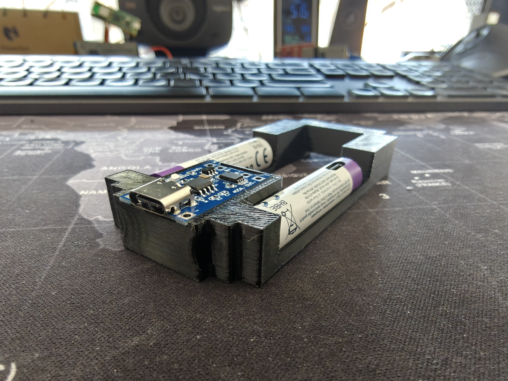

### Top cover interior — Pico 2 W seated

The Pico 2 W board sitting in the cover's nest cavity with the Waveshare FPC ribbon cable visible. Joystick hole on the left, display window in the center.

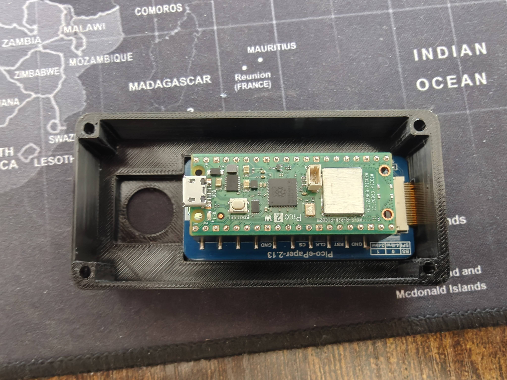

### Top cover interior — display inlay recess

The screen inlay recess and joystick PCB pocket visible from inside, showing the 3mm display cavity and tapered joystick through-hole.

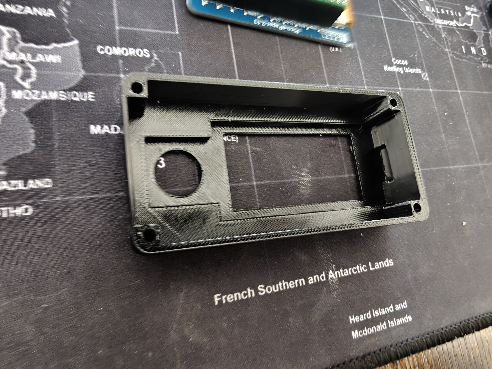

### Base plate v3 — top-down with support blocks

The v3 base plate showing the two support blocks (for TP4056 retention), battery troughs along the long sides, four corner peg pillars, and the USB-C stadium notch on the +X wall.

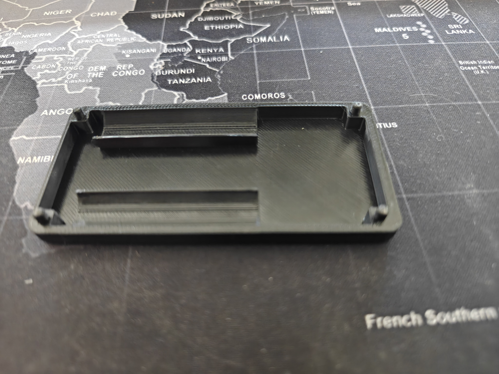

### Base plate v3 — side profile

Low-angle side view showing the curved bottom fillet, corner pegs extending above the plate top, and the slim profile.

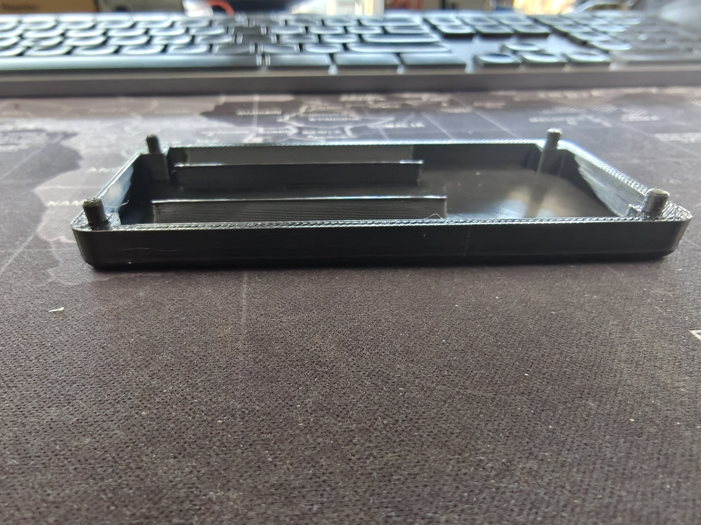

### Assembled stack — side profile

The two-piece stack mated together, side view. Pico 2 W board edge visible above the base plate rim.


### Solar panel — AK 62x36mm

A small 62x36mm solar panel (marked "AK 62X36") with pre-soldered red/black leads. Back side shows the PCB contact pads; front side shows the photovoltaic cells. Being evaluated for future solar charging via the TP4056's input.


Source: Photos from 2026-04-26 print session. Parts from [`04-25-design-alterations/`](https://github.com/rompasaurus/dilder/tree/main/hardware-design/scad%20Parts/Rev%202%20extended%20with%20joystick/04-25-design-alterations).

---

## Current Assembly (ESP32-S3 Enclosure)

The enclosure is a stacked shell design housing an Olimex ESP32-S3-DevKit-Lipo, Waveshare 2.13" e-ink display, and 1000mAh LiPo battery. Five parts print flat without supports and assemble with 4 corner screw posts.


| Dimension | Value |
|-----------|-------|
| Outer footprint | 39.8 x 79.8mm |
| Total height | 29.8mm |
| Wall thickness | 2mm |
| Corner radius | 4mm |

---

## Parts Breakdown

### Middle Plate (Board Tray) — v2

The board tray drops into the base shell at z=8mm, resting on the lower shelf. It holds the ESP32-S3 board with header pin clearance slots on both long edges.


**Key dimensions:**

| Feature | Value |
|---------|-------|
| Plate size | 35 x 75 x 2mm |
| Header slot length | 56.5mm (board length + 0.5mm clearance) |
| Header slot width | 4mm |
| Slots centered on plate length | Yes |
| Pillar cutout overshoot | 1mm on far edges for clean booleans |

**Design changes (v1 to v2):**

- v1: Header slots derived from board dimensions, 46mm long, 3mm wide
- v2: Independent slot parameters (56.5mm x 4mm), centered on plate, clean pillar cutouts

**Source:** `hardware-design/scad Parts/middle-plate.scad`

---

### Top Plate Windowed (Display Cover) — v1

The display cover plate sits inside the top cover frame. Solid face plate with a 25x50mm viewing window and snap-fit retaining rails on the underside that grip the display edges.


**Key dimensions:**

| Feature | Value |
|---------|-------|
| Plate size | 35 x 75 x 2mm |
| Viewing window | 25 x 50mm (centered) |
| Rail depth | 4.5mm |
| Rail width | Extended to plate edges (~2.5mm per side) |
| Lip protrusion | 1mm inward under display |
| Lip thickness | 1mm (full printable layer) |

**Design features:**

- Face plate is solid all around (no wire gap in face surface)
- Wire pass-through gap preserved in rails only (below face)
- Lips are full-width shelves attached to rail bottoms (printable, no floating geometry)
- Screw clearance holes at all 4 corners

**Source:** `hardware-design/scad Parts/top-plate-windowed-v1.scad`

---

### Top Cover Frame — v2

An open border frame with rounded vertical edges and 4 corner pillar posts. The windowed plate drops into countersunk pockets at the pillar tops and sits flush.


**Key dimensions:**

| Feature | Value |
|---------|-------|
| Outer footprint | 39.8 x 79.8mm |
| Height | 7mm |
| Wall thickness | 2mm |
| Corner radius | 4mm |
| Pillar size | 5 x 5mm |
| Countersink depth | 2mm (matches plate thickness) |

**Design changes (v1 to v2):**

- v1: Curved dome shell with wire notch, square pillars extending into dome causing artifacts
- v2: Flat-top open frame, solid border (no wire notch), countersunk pillars for flush plate seating

**Source:** `hardware-design/scad Parts/top-cover-v2.scad`

---

## SCAD Parts Library

All standalone parametric .scad files live in `hardware-design/scad Parts/`:

| File | Description |
|------|-------------|
| `middle-plate.scad` | Board tray (working copy) |
| `middle-plate-v1.scad` | Board tray v1 snapshot |
| `middle-plate-v2.scad` | Board tray v2 snapshot |
| `top-plate-windowed-v1.scad` | Display cover with viewing window |
| `top-plate-solid.scad` | Display cover without window |
| `top-cover.scad` | Original curved dome cover |
| `top-cover-v2.scad` | Open frame cover with countersunk pillars |
| `top-cover-v3.scad` | Rounded inner corners, single-corner-rounded pillars |
| `top-cover-v3-rounded-top.scad` | v3 with bullnose top edge |
| `top-cover-v3-{12,17,22}mm.scad` | v3 height variants (+5/10/15mm) |
| `top-cover-v3-rounded-top-{12,17,22}mm.scad` | Rounded-top height variants (+5/10/15mm) |
| `case-separator-inner.scad` | Thin divider, inner plate footprint |
| `case-separator-outer.scad` | Thin divider, outer base footprint |
| `case-separator-board-cradle.scad` | Outer separator with board-shaped cutout and raised cradle wall |
| `scad-export.py` | Interactive Python export tool (menu + file browser) |
| `scad-to-3mf-guide.md` | Export workflow guide |

---

## Export Workflow

### Quick export (command line)

```bash
openscad -o middle.3mf middle-plate.scad
```

### Batch export (all enclosure parts)

```bash
cd hardware-design
for part in base middle topmid cover screws; do
    openscad -D "part=\"$part\"" -o "enclosure-prints/$part.3mf" esp32s3-enclosure.scad
done
```

### Interactive export tool

```bash
python3 hardware-design/scad\ Parts/scad-export.py
```

Provides a menu to browse .scad files, pick export format (3MF/STL), set output path, and optionally override parameters.

---

## Print Settings

| Setting | Value |
|---------|-------|
| Layer height | 0.2mm (0.16mm for fine parts) |
| Infill | 20-30% |
| Walls/perimeters | 3 |
| Supports | None (all parts designed support-free) |
| Material | PLA or PETG |

---

## Hand-Routed Joystick Breakout PCB (K1-1506SN-01)

First PCB designed from scratch in KiCad 10, hand-routed. Uses the Korean Hroparts K1-1506SN-01 5-way navigation switch (LCSC C145910) on a 19.6x19.6mm board that drops into the Rev 2 top cover's 20x20mm joystick pocket.

### Full workspace — PCB, schematic, and 3D viewer

All three KiCad editors open: PCB layout with the joystick switch centered and 6-pin solder-wire header at the bottom edge, schematic showing the switch-to-header wiring, and 3D preview with the imported LCSC model.


### PCB layout — top copper

Switch footprint centered on the board, six labeled solder pads (Com, L, D, UP, R, C) along the bottom edge for wire connections to the Pico W. Ground plane on the back copper.


### 3D model preview

Imported 3D model from LCSC showing the joystick knob mounted on the green PCB. Header pads visible along the bottom edge.


---

## Version History

| Date | Part | Version | Changes |
|------|------|---------|---------|
| 2026-04-22 | Middle plate | v1 | Initial standalone extraction from main enclosure |
| 2026-04-22 | Middle plate | v2 | 56.5mm slots, centered, clean pillar cutouts |
| 2026-04-22 | Top plate windowed | v1 | Solid face, extended rails, printable lips, wire gap in rails only |
| 2026-04-22 | Top cover | v1 | Extracted dome cover from main enclosure |
| 2026-04-22 | Top cover | v2 | Open frame, solid border, countersunk pillar pockets |
| 2026-04-22 | Top cover | v3 | Rounded inner corners + single-corner-rounded pillars for flush plate insertion |
| 2026-04-22 | Top cover | v3-rounded-top | v3 with bullnose top edge (2mm radius) |
| 2026-04-22 | Case separator (inner) | v1 | Thin divider sheet matching inner plate footprint with header slots and screw holes |
| 2026-04-22 | Case separator (outer) | v1 | Thin divider sheet matching base outer footprint with header slots and screw holes |
| 2026-04-22 | Top cover v3 | height variants | 12mm, 17mm, 22mm versions (+5/10/15mm) for both flat-top and rounded-top |
| 2026-04-22 | Top plate windowed | v1 update | Outer edge expanded by 0.5mm per side for tighter fit |
| 2026-04-22 | Case separator (board cradle) | v1 | Outer footprint with board-shaped cutout and 2mm raised cradle wall |
| 2026-04-22 | Top plate windowed | v1 update | Rails trimmed 0.5mm from display side (flush with plate edges) |
| 2026-04-22 | Case separator (board cradle) | v1 update | Cutout widened 1mm per side for board clearance |
| 2026-04-22 | Rev 2 joystick base | v1 | Purpose-built base for the extended-with-joystick layout: split battery/ESP32 chambers, 2mm overhang shelf, dual USB-C cutouts, asymmetric end walls (1.2mm +X / 3mm -X), pillars clipped to bottom fillet |
| 2026-04-23 | Rev 2 joystick base | v1.1 | Resize pass: outer width 82→96mm (+14), total height 22→12mm (-10), battery cell length 52→66mm (+14), overhang shelf 2→5mm (battery pit 3mm deeper), USB-C z-center 7→6mm (1mm lower) |
| 2026-04-23 | Rev 2 joystick base | v1.2 | Battery section trimmed -6.5mm: outer width 96→89.5mm, battery cell length 66→59.5mm, ESP32 chamber unchanged |
| 2026-04-23 | Rev 2 joystick base | v1.3 | USB-C cutouts raised +2mm (z-center 6→8mm) so they clear the ESP32 shelf (z=7) and sit fully above it |
| 2026-04-23 | Rev 2 joystick base | v1.4 | Added two Ø1mm vertical BOOT/RESET paperclip poke-through holes in the base floor at (71.3, 32.5) and (58.8, 32.5); board is mounted component-side down so paperclip reaches buttons from below |
| 2026-04-23 | Rev 2 top cover (windowed) | v1 | Top piece for the Rev 2 stack: 4mm bullnose across the whole front face, 0.5mm face plate, tapered display window (50×25 → +2mm per side at the cover top) and tapered joystick hole (Ø12 → Ø15), 2.5mm ±Y snap rails with 1mm lips, 30×6mm wire pass-through gap in the -Y rail, -X pillars shortened to `rail_bottom_z` so the square pillar only exists where it meets the base |
| 2026-04-24 | Rev 2 top cover (windowed) | v1.1 | Rails + lips removed; full-height pillars; M3 bores blind from below (no holes on front face); window shifted +2mm toward the joystick for asymmetric bezel |
| 2026-04-24 | Rev 2 top cover (screen inlay) | v1 / v1-2mm | New sibling family: 3mm inlay recess carved up into the face plate for the raw Waveshare module + FPC fold-over; 20×20mm joystick-PCB pocket; FPC-ribbon divet cut into the -X wall (thins 3mm→1mm over a 13mm Y band). Two siblings: `-v1` (3mm FPC divet Z extension below inlay), `-v1-2mm` (2mm variant) for side-by-side fit testing |
| 2026-04-24 | Rev 2 top cover (screen inlay) | iteration | Post-first-print tweaks to both inlay variants: face plate 0.5→0.7mm (kills a hairline seam at the inlay top edge where the single thin top layer didn't close); removed 4 joystick-PCB mount bores (showed as dimples in a ring around the joystick cutout — retention strategy undecided); window resized 50×25→48×27 with shift 2→3 across all 3 cover variants to match the Waveshare's actual viewable pixel area |
| 2026-04-24 | Rev 2 top cover (screen inlay) | window refine | Second pass on the inlay window after dialing in the Pico 2 module: depth 27→24, shift 3→2.8. Applied to `-v1-2mm` and a new `-pico2-v2-2mm` sibling with +0.05 mm/edge Y slop on the screen inlay pocket for easier module drop-in |
| 2026-04-24 | Rev 2 base | v2 thin dual-10440 | New case family for 2× 10440 Li-ion in parallel (~700 mAh, 3.7 V, TP4056-compatible). Y 44→46mm (fit two Ø10 cells flanking 21 mm Pico W with slop); Z 14→12 mm (thinner); floor 3→2 mm; single USB-C on +X (Pico W has one port); 4 generic contact-tab slots at each cell bay end |
| 2026-04-24 | Rev 2 middle platform | v2-46y | +2 mm Y fork to match base-v2 (orphaned after 2-piece pivot, kept as 3-piece reference) |
| 2026-04-24 | Rev 2 top cover (screen inlay) | v2-46y | +2 mm Y fork of the pico2-v2 cover so it mates with base-v2 in the 3-piece stack |
| 2026-04-24 | Rev 2 base | v3 2-piece | Merged the middle platform into the base (14 mm tall). Pico W "inlay" chamber centered in Y; Waveshare display's ±Y edges rest on the solid base rim at z=14 (display overhangs the 21.8 mm Pico chamber by ~4 mm each side). Stack drops 36.7 → 25.7 mm |
| 2026-04-24 | Rev 2 top cover (screen inlay) | v3 2-piece | 2-piece sibling — removes the 5 mm middle-platform pedestal reservation; total cover height 16.7 → 11.7 mm |
| 2026-04-24 | Rev 2 base | v4 2-piece open | v3 + two rectangular insertion slots through the -X end wall so 10440 cells slide in from outside without unbolting the cover; raised ±Y lips on the cell-bay ceiling at z=14–15 for cover-base alignment on the non-battery long edges |
| 2026-04-25 | Rev 2 AAA cradle insert | v1 print | First print of the drop-in cradle insert — dual AAA bays along ±Y, center Pico nest cutout, connecting block at -X. Cells drop in from above, cradle plugs into the cover's negative space |
| 2026-04-25 | Rev 2 base plate | v1 print | First print of the shallow base plate with four corner pegs for cover retention and a pocket that receives the cradle's bottom 5.1 mm |
| 2026-04-25 | Rev 2 cradle insert | v2 | TP4056 integration: enclosure +3 mm on -X, connecting block extended to 29 mm X / full height, concave battery curves on ±Y faces, 1 mm TP4056 indent, USB-C cutout, AAA bay cuts restructured to outer difference, +X FPC connector cutout on bottom face |
| 2026-04-25 | Rev 2 base plate | v2 | Square 5×5 mm pillar bases with 3 mm pegs, battery cradle troughs carved into ±Y pocket sides (solid fill + cylinder subtraction), enclosure +3 mm on -X |
| 2026-04-25 | Rev 2 top cover (screen inlay) | v3-2piece ext | Enclosure +3 mm on -X, 5 mm wall extension below mating plane, joystick position hardcoded at x=79.35 |
| 2026-04-25 | Rev 2 cradle insert | v2 iteration | Battery bays shifted 20 mm toward -X, Pico nest extended to 55 mm clear length, stale comments fixed |
| 2026-04-25 | Rev 2 base plate | v2 iteration | USB-C rounded notch moved to +X wall, battery troughs aligned to cradle (x=15.4), 4 mm bottom fillet, 11.5 mm total height with 1.2 mm floor, rail depth reduced 2 mm/side |
| 2026-04-25 | Rev 2 base plate | v3 | Battery rails +5 mm height (extend 2 mm above plate top), two 5×15 mm support blocks centered on USB-C Y axis for TP4056 board retention |
| 2026-04-25 | Joystick breakout PCB | v1 | KiCad 8 project for 20×20 mm SKRHABE010 breakout board — fits top cover PCB pocket, 4× M3 mounting holes, 6-pin wire pads, JLCPCB BOM (LCSC C139794) |
| 2026-04-25 | Ansmann battery wiring | guide | Wiring guide for 2× Ansmann 1.5V Li-Ion AAA in series (3.0V → VSYS), battery contact recommendations, safety notes |
| 2026-04-26 | Joystick breakout PCB | v2.0 redesign | Replaced Rev 1's hand-drawn footprint and hallucinated pinout with: (a) `SKRHA-boss` footprint cloned verbatim from `crides/kleeb` (axis-aligned via -45° rotation), (b) pin names confirmed against the Alps SKRHABE010 datasheet circuit diagram (1=A, 2=Center, 3=C, 4=B, 5=Common, 6=D), (c) wire pads repositioned to 1.8 mm pitch on the bottom edge (clears all four M3 corner holes — Rev 1's GND pad overlapped a mounting hole). All clearances verified by Python script before placement (0.74 mm min pad↔hole, 2.07 mm min courtyard↔hole) |
| 2026-04-26 | Joystick breakout PCB | v2.0 autoroute | Routed headlessly via Freerouting v2 in Docker (`ghcr.io/freerouting/freerouting`) — DSN exported from KiCad via `pcbnew.ExportSpecctraDSN`, SES imported back via `pcbnew.ImportSpecctraSES`. Result: 23 trace segments + 1 through-hole via, 534 mm total length, **8 bends all at 45°** (zero 90° corners), 0 clearance violations, 0 unconnected, 0 schematic-parity issues. Full pipeline reproducible from a single bash script — see `joystick-pcb/design-notes.md` |
| 2026-04-26 | SCAD tooling | docs | New `hardware-design/scad Parts/README.md` documenting `scad-export.py` (interactive 3MF/STL exporter with date-sorted file browser), `bake-preset.py` (writes a customizer preset back into the SCAD source as the new default), and `export-preset.py` (renders a preset to 3MF without modifying the source — for A/B variant testing) |
| 2026-04-26 | Hardware process | doc | New `hardware-design/HARDWARE-DESIGN-PROCESS.md` — retrospective on the SCAD→print and PCB→fab loops with concrete improvements to cut wasted prints (calibration coupons, SVG cross-sections, presets-instead-of-prints, mandatory dimension comment blocks, machine-checkable clearance gates) |
| 2026-04-26 | Rev 2 v3 print session | photos | 17 photos from overnight print: assembled stack, exploded layout, cradle with Pico 2 W + TP4056 + AAA batteries, top cover interior (Pico seated, display inlay, joystick pocket), base plate v3 (support blocks, troughs, pegs, fillet), solar panel AK 62x36mm for future charging |
| 2026-04-26 | Joystick hand-routed PCB | v1 | First PCB designed from scratch in KiCad 10 — K1-1506SN-01 5-way switch (LCSC C145910) on 19.6x19.6mm board, hand-routed, 6-pin solder-wire header with silkscreen labels (Com/L/D/UP/R/C), ground plane, gerbers + JLCPCB BOM exported |
| 2026-04-26 | Rev 2 top cover (screen inlay) | v3-2piece curvature | New `face_plate_outer_edge_curve_radius_mm` parameter — ellipsoid sphere scaling in `shell_with_bullnose_top` to independently control face-to-wall rollover without bulging the sides. Customizer slider 0.5–12mm in 0.1mm steps |
| 2026-04-26 | Rev 2 base plate (thinner) | pillar tuning | `pillar_extension_z_above_plate_mm` (-10 to +10mm) — extension wings height adjustable independently of the 5x5 screw pillars. `peg_height_above_pillar_mm` slider added (0–10mm) |
| 2026-04-26 | Rev 2 base plate | solar cutout | New `base-plate-with-solar-cutout.scad` — fork of thinner with 62x36mm solar panel pit (AK 62X36), 2mm deep, centered on bottom face. Two 3mm wire pass-through holes at adjustable coordinates. Breakaway support ribs for FDM printing (0.4mm walls, 5mm spacing, 0.2mm Z gap) |
| 2026-04-26 | Pico 2 W board support | RP2350 | Third target board added. Same 40-pin header as Pico W (drop-in replacement), 4MB flash, RP2350 dual Cortex-M33 @ 150MHz. BOOTSEL drive shows as `RP2350` (not `RPI-RP2`). No hardware RTC — software fallback via `rtc_compat.h`. DevTool, setup CLI, Dockerfile, and all 18 firmware programs updated |
| 2026-04-26 | Rev 2 current design | photos | Four photos of the current Rev 2 build: assembled front view, three-quarter angle, display close-up with Sassy Octopus running, and disassembled case parts. Running on Pico 2 W with e-ink display, joystick, and 3D-printed enclosure |
| 2026-04-27 | Rev 2 base plate (solar) | thin-af-27-04 fork | New `base-plate-solar-thin-af-27-04.scad` — fork of `base-plate-with-solar-cutout` with the `with supports` preset values (17 deltas: solar pit/holes, AAA bay X range, battery rail lift, floor thickness, fillet radius, pico retention height, pillar Y/Z, USB sidewall block width, support flag) baked as defaults. Starting point for the thinner-pass refinement. JSON preset `thick floo reduce negative space` reduces total height 11.5 → 8 mm, floor 2.5 → 2.6 mm, pico retention 7 → 3 mm |
| 2026-04-27 | Rev 2 AAA cradle | with-batt-clips fork | New `aaa-cradle-with-batt-clips.scad` — fork of `aaa-cradle-insert-v1` adding 4 vertical drop-in slots (one at each X-end of each bay, 7.4 × 7.4 × 0.9 mm) sized for the smallest Swpeet 1.5V AAA battery-spring kit's unipolar plate (7 × 7 mm stamped sheet metal). Slots open upward to the plug top so plates drop in from above and wires exit through the same opening. Cells wire in **parallel** (not series — 2S 10440 exceeds Pico W's 5.5 V VSYS max) |
| 2026-04-27 | Battery procurement | research | Settled on **PKCELL ICR10440** (3.7 V raw Li-Ion, 350 mAh, AAA form factor, ~€16 for 4-pack) for the TP4056 + solar charging path. Distinct from the regulated 1.5 V Li-Ion AAA cells (Ansmann) which look identical but would be wrong for a TP4056 — that path requires raw 3.7 V cells |
| 2026-04-27 | Solar panel bonding | research | New `solar-panel-bonding-adhesives.md` — outdoor-adhesive option matrix for bonding the AK 62×36 solar panel to PETG base plate. Recommends Sikaflex 252 / 295 UV / DOWSIL 795 (15–20 yr outdoor life) or 3M VHB 4945 (10+ yr); avoids hot glue / CA / rigid epoxy (UV-embrittlement and thermal-cycling failures within a season) |
| 2026-04-27 | Rev 2 AAA cradle | retainer wall | `aaa-cradle-with-batt-clips.scad` gets a 1 mm retainer wall on the cell side of each of the 4 clip slots. Each slot is offset back from its bay end by `batt_clip_retainer_thickness_x_mm`, naturally leaving body material as the wall; a 5 × 5 mm contact window is cut through the wall (centered on the bay axis) so the spring/contact face passes through unobstructed while a 1 mm perimeter ring catches the 7 × 7 mm Swpeet plate's edges. 4 new parametric knobs (`batt_clip_retainer_enabled`, `_thickness_x_mm`, `_window_size_y_mm`, `_window_size_z_mm`). New customizer preset `battery clips forst print 04-27` for the first print pass with the retainer wall enabled |
