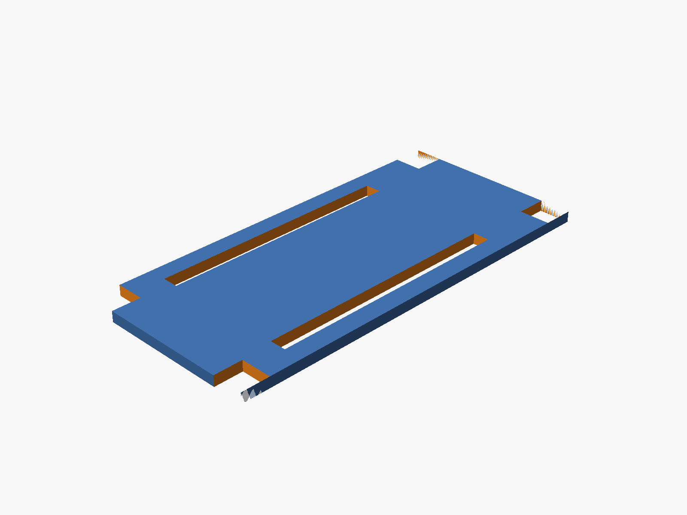

# ESP32-S3 Enclosure (SCAD)

A parametric 5-piece case for the Olimex ESP32-S3-DevKit-Lipo + Waveshare 2.13" e-paper + 1000mAh battery. Everything in one OpenSCAD file, exported as 3MF for Bambu Studio.

Source: [`hardware-design/esp32s3-enclosure.scad`](https://github.com/rompasaurus/dilder/blob/main/hardware-design/esp32s3-enclosure.scad) · Prints: [`hardware-design/enclosure-prints/`](https://github.com/rompasaurus/dilder/tree/main/hardware-design/enclosure-prints)

---

## Preview

{ width="720" loading=lazy }

The stack from bottom to top:

| Layer | Z range (mm) | Purpose |
|---|---|---|
| Base floor | 0 – 2 | Battery tray, curved bottom |
| Battery chamber | 2 – 8 | 1000mAh LiPo (35 × 52 × 5mm) sits here |
| Middle plate | 8 – 10 | Board tray; rests on shelf; header-pin slots |
| Board + WROOM | 10 – 14.8 | ESP32-S3 PCB (56 × 28mm) + module |
| Display | 15.8 – 20.8 | Waveshare 2.13" (30 × 65 × 5mm), snap-held |
| Top-mid plate | 20.8 – 22.8 | Flush with base top edge, has viewing window + wire hole |
| Cover | 22.8 – 29.8 | Open-top shell with corner posts + rounded walls |

Outer footprint **39.8 × 79.8 × 29.8 mm**.

---

## The five printable pieces

### Base

{ width="640" loading=lazy }

- Rounded outer shell with 4mm vertical-edge radius
- Curved bottom via sphere-offset trick (~30° overhang, FDM-printable upright)
- 4 corner pillars (5×5mm) with M3 screw channels floor-to-top
- 2 USB-C cutouts on the -Y short wall (9.5 × 4mm, centered on board's USB-C Z)
- **Lower shelf** at z=8 — 2mm inward ledges on the short walls + 4 pillar-corner tabs (all extended down to the floor as a rib, printable without overhangs)
- **Upper shelf** at z=20.8 — thin ledges only (tabs skipped; would have hit the display)
- 4 internal corner posts at the display corners for lateral display constraint

### Middle plate (board tray)

{ width="480" loading=lazy }

Drops in and rests on the lower shelf. 35 × 75 × 2mm with:

- 4 corner notches for the base pillars
- 2 header-pin slots along the long edges (3mm × 46mm)
- 4 M3 clearance holes at pillar centers

### Top-mid plate

{ width="560" loading=lazy }

Drops into the cavity and rests on the upper shelf, flush with the base top.

- **Display viewing window** — 25 × 50mm centered, opens the view from the cover down to the display
- **Wire pass-through** — 30 × 6mm hole on the -X long edge, cut through plate + snap rail + bottom lip, for fishing wires out to an external sensor or connector
- **Two long snap rails** on the underside — 2 × 5 × 65mm walls at each long edge with a 0.5mm inward lip at the bottom. When pressed down over a pre-placed display, the rails flex outward, the lips pass the display edges, then snap back with the lips engaging under the display's bottom face

### Cover

{ width="560" loading=lazy }

Open-top shell with same footprint as the base for fully flush outer edges.

- No top plate (view window is the entire open top)
- 4 corner posts preserved inside for screw material
- M3 clearance holes + counterbores for socket heads at each corner
- Rounded vertical edges (matches base)
- Rounded top corners (sphere hull) for the curvy top look
- **30 × 6mm wire notch** at the bottom of the -Y short wall for external pass-through

### Screws (plastic plugs)

{ width="400" loading=lazy }

Plastic-weldable plugs — 4 arranged in a row for efficient printing.

- Ø 3.0mm shank (fits the 3.2mm clearance holes)
- Ø 5.6 × 2.7mm head (seats in the 6mm counterbore)
- Total length 26.8mm — spans the full stack
- Print in the same material as the case. After assembly, heat the head with a soldering iron to fuse it into the cover — permanent one-way seal

---

## Assembly order

1. **Battery** drops into the base floor cavity
2. **Middle plate** drops in, rests on the lower shelf at z=8; board sits on it
3. **Display** drops in between the 4 corner posts at z=15.8–20.8
4. **Top-mid plate** presses down over the display — the long rails flex outward, the bottom lips pass the display edges, then snap back with the lips under the display. Plate top is flush with the base top
5. **Cover** drops over the stack (edges aligned with the base)
6. **4 screw plugs** insert through the counterbores, shank reaches the base floor
7. (Optional) heat each plug head to weld the case shut permanently

---

## Parameters (top of SCAD file)

All dimensions are parametric. Common tweaks:

```scad
// Rounding
case_corner_r  = 4;      // vertical edge radius on base + cover
plate_corner_r = 1;      // vertical edge radius on plates
base_bot_cut   = 0;      // 0 = bottom tapers to points (print flipped); 2 = upright-printable

// Display snap rails (underside of top-mid plate)
snap_rail_w    = 2;      // rail thickness
snap_lip_d     = 0.5;    // how far the bottom lip protrudes inward
snap_lip_h     = 0.5;    // lip thickness

// Viewing + wiring
topmid_window_w   = 25;  // display viewing window (width)
topmid_window_l   = 50;  // display viewing window (length)
wire_hole_len     = 30;  // wire pass-through (along Y)
wire_hole_depth   = 6;   // wire pass-through (depth from edge)

// Clearance
slop           = 0.4;    // tolerance around plates and the cover/base fit
```

---

## Exporting for your slicer

Each piece renders separately via the `part` variable. From the repo root:

```bash
mkdir -p hardware-design/enclosure-prints
cd hardware-design/enclosure-prints
for p in base middle topmid cover screws; do
  openscad -D "part=\"$p\"" -o $p.3mf ../esp32s3-enclosure.scad
done
```

All five exports come out as CGAL-simple (manifold) volumes — import straight into Bambu Studio or any FDM slicer.

---

## Print orientation notes

- **Base** — with `base_bot_cut = 0`, the bottom tapers to points at z=0. Print **flipped**: the flat top (where the cover sits) goes on the build plate, the curvy bottom points up. If you'd rather print upright, set `base_bot_cut = 2` for a gentler ~30° taper (still matches the cover's curve reasonably).
- **Cover** — prints upright as-is. Flat bottom on the bed, rounded top grows inward (no overhangs).
- **Middle, top-mid** — flat plates, print flat on the bed. The snap rails on the top-mid plate hang below the plate; print that one upside-down (rails pointing up) to avoid any supports.
- **Screws** — small plugs, print flat (head up) with a brim if you have any bed-adhesion issues on small parts.

---

## Why the stack looks the way it does

A few design decisions that took a few iterations to land on:

- **Flush top-mid plate** — the base walls rise to `z_disp_top + plate_thk` (22.8mm), so the plate's top surface is level with the base top edge. No lip sticking up, no gap around the plate.
- **Base display rails stop at the top-mid plate bottom** — the 4 corner posts end at z=20.8 instead of going through the top-mid plate. This leaves the plate solid on top (no through-holes / visible gaps).
- **Shelves extend to the floor** — the lower shelf is a full rib from z=2 to z=8 rather than a thin floating ledge. Cleaner FDM prints.
- **Cover wraps on the sides instead of overlapping** — cover outer matches base outer; the two meet edge-to-edge for a continuous curve down the side. Fastening happens through the 4 corner screws/plugs, not via a wrap-over fit.
- **Snap rails on the plate, not the base** — the rails belong to the top-mid plate so they descend onto the display during final assembly. The display goes in first, then the plate is pressed down and the lips snap under the display edges.

---

## Open questions / future tweaks

- USB-C cutout positions are centered pair with 13mm spacing — verify against your actual Olimex board and nudge if needed.
- Display window is sized for the visible e-paper area (25 × 50mm); if your Waveshare revision has a slightly different active area, adjust `topmid_window_w / topmid_window_l`.
- With the antenna now fully inside the case, Wi-Fi range may be slightly reduced. If you need to expose the antenna, cut a slot on the +Y short wall at the antenna's Z range (board top + 3.2mm); the SCAD has `antenna_wid` / `antenna_proj` parameters already defined.
