# FreeCAD Mk2 Enclosure Design

A component-by-component breakdown of the Dilder Rev 2 Mk2 enclosure — every body, every peripheral, every dimension choice and the trade-off behind it.

Everything is generated from a single parametric macro (`dilder_rev2_mk2.FCMacro`) with 100+ spreadsheet aliases. Change a cell, hit recompute, and the entire assembly updates.

---

## Table of Contents

1. [Base Plate](#base-plate)
2. [AAA Battery Cradle](#aaa-battery-cradle)
3. [Top Cover](#top-cover)
4. [Thumbpiece](#thumbpiece)
5. [Joystick PCB](#joystick-pcb)
6. [Pico 2 W Board](#pico-2-w-board)
7. [Piezo Speaker](#piezo-speaker)
8. [MPU-6500 IMU Accelerometer](#mpu-6500-imu-accelerometer)
9. [TP4056 Charger Module](#tp4056-charger-module)
10. [AAA Batteries and Clips](#aaa-batteries-and-clips)
11. [Waveshare E-Ink Display](#waveshare-e-ink-display)
12. [AK 62x36 Solar Panel](#ak-62x36-solar-panel)
13. [Full Assembly](#full-assembly)
14. [Pain Points and Lessons Learned](#pain-points-and-lessons-learned)

---

## Base Plate

<figure markdown="span">
  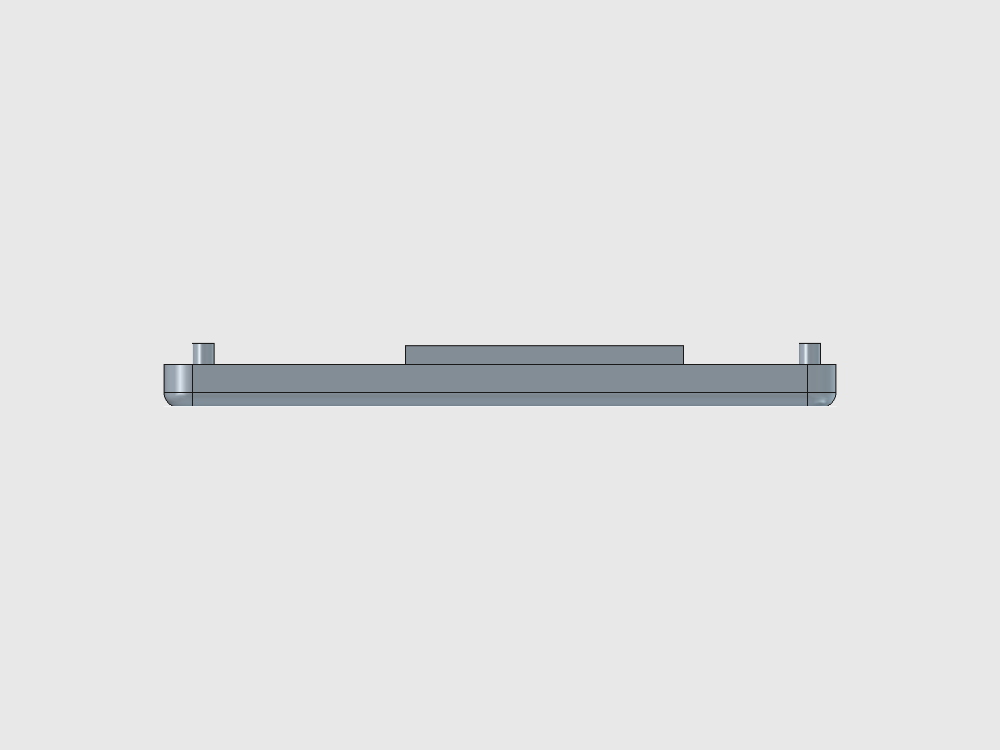{ width="420" loading=lazy }
  <figcaption>Isometric — pocket cavity, corner pillars with alignment pegs, battery rail supports, piezo ring, and IMU pocket</figcaption>
</figure>

<figure markdown="span">
  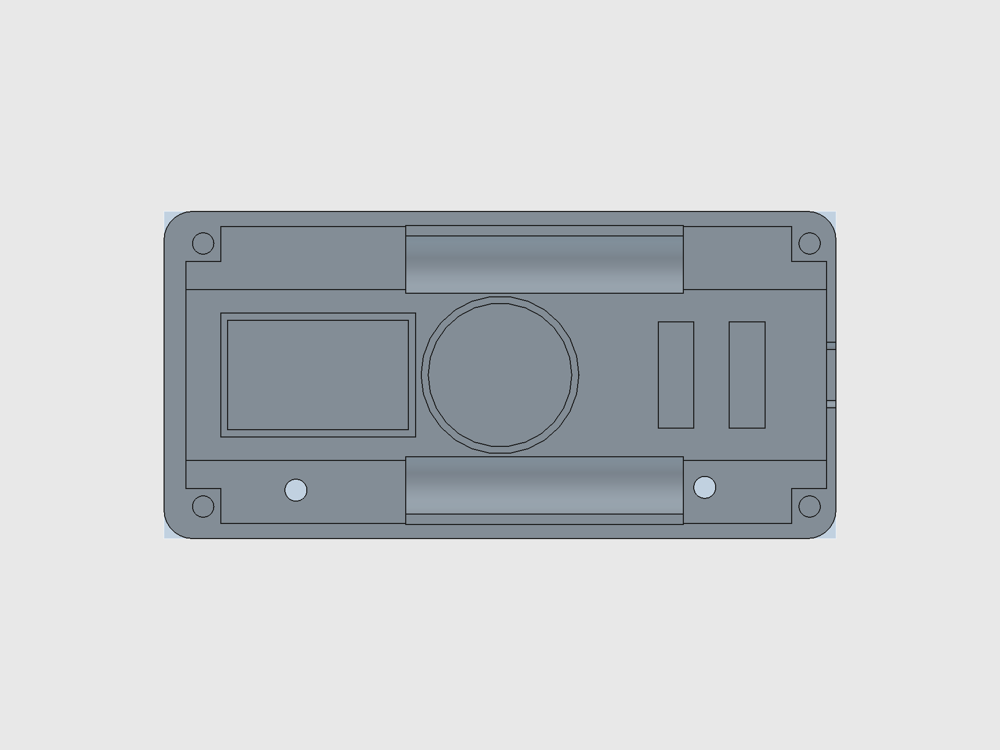{ width="420" loading=lazy }
  <figcaption>Top view — four 5 mm corner pillars with 3 mm pegs, USB-C cutout on +X wall, sensor mounts between rails</figcaption>
</figure>

**Dimensions:** 94.5 x 46.0 x 6.0 mm (post-shave; SCAD builds at 8 mm then removes a 2 mm band from Z=4..6)

**Pocket floor:** 2.6 mm thick — the thinnest printable floor that still survives M3 screw clamping without cracking.

### Key features

| Feature | Specs | Purpose |
|---------|-------|---------|
| Corner pillars (4x) | 5 x 5 mm, full height | Structural columns; cradle and cover stack on top |
| Alignment pegs (4x) | 3 mm dia, 3 mm tall, 0.4 mm chamfer | Locate cradle and cover; chamfer eases assembly |
| Extension wings (4x) | 30 x 4 mm shelves | Increase contact area between pillar and pocket floor |
| USB-C cutout | 9.2 x 4.45 mm, 1 mm corner radius | Pass-through for TP4056 charger connector; 0.2 mm tolerance over USB-C spec |
| Battery rail supports (2x) | 39 x 9.5 mm, 5 mm lift | Elevate AAA bays above pocket floor for component clearance |
| Battery cylinder cuts (2x) | 11.1 mm dia, 39 mm long | Cylindrical subtractions shaped to AAA cell profile |
| USB support blocks (2x) | 5 x 15 mm | Platform under the USB-C cutout so the TP4056 board doesn't sag |
| Solar pit | 62.4 x 36.4 x 2.0 mm | Recessed pocket on the bottom face for the AK 62x36 panel |
| Wire holes (2x) | 3.1 mm dia, through-all | Solar lead pass-through from bottom to cavity |
| Piezo ring | 22.2 mm OD, 20.2 mm ID, 1.5 mm wall | Circular retaining wall for the 20 mm piezo disc |
| IMU pocket | 27.4 x 17.4 mm outer, 25.4 x 15.4 mm inner | Rectangular retaining wall for the GY-6500 module |

### Design nuance

- The pocket floor was originally 1.6 mm ("thin floo" preset) but printed parts cracked under M3 torque. Bumped to 2.6 mm ("thick floo").
- USB-C cutout uses three primitives (main box + bottom strip + two arc cylinders) to approximate a rounded rectangle — FreeCAD PartDesign doesn't have a native rounded-rect pocket.
- Battery rails are lifted 5 mm above the pocket floor so the Pico board, wiring, and TP4056 fit underneath. The cylindrical bay cuts use a rotation placement to orient the cylinder axis along X.
- The piezo ring center (47.35, 23.0) and IMU pocket center (21.65, 23.0) share the same Y coordinate — both sit on the enclosure centerline between the two battery rail supports (23 mm gap).

---

## AAA Battery Cradle

<figure markdown="span">
  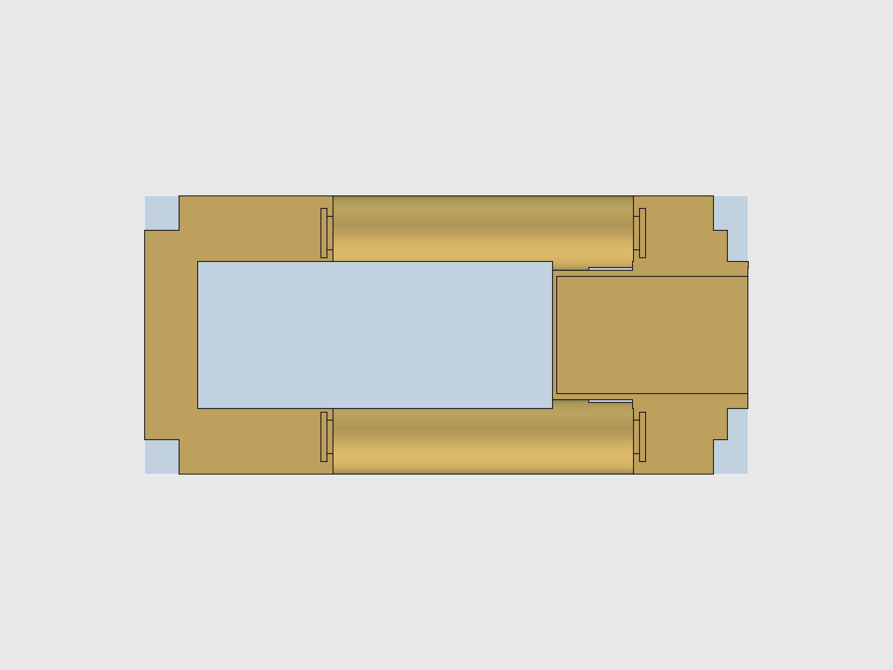{ width="420" loading=lazy }
  <figcaption>Isometric — plug body with battery bays, clip slots, connecting block, and joystick PCB pit</figcaption>
</figure>

<figure markdown="span">
  { width="420" loading=lazy }
  <figcaption>Bottom (global top) — the mating face that sits flush with the base plate top</figcaption>
</figure>

**Dimensions:** 89.91 x 41.4 x 12.1 mm plug body (plug_x0=3.1 to plug_x1=93.01, plug_y0=2.3 to plug_y1=43.7)

**Orientation:** Built upright in local coords, then flipped 180 degrees about Y and translated to (96.3, 0, 13.0) in global. Every local X value maps to `96.3 - local_x` in global.

### Key features

| Feature | Specs | Purpose |
|---------|-------|---------|
| Plug body | Sketch + pad, 12.1 mm thick | Main structural insert; drops into the base plate pocket |
| Pillar cutouts (4x) | 5.8 mm square (5 + 0.8 slop) | Clearance holes for the base plate's corner pillars |
| FPC gap | 3.0 mm wide, full Y | Cable routing channel for the display's FPC ribbon |
| Pico nest | 78 x 21 mm | Recessed pocket sized to the Pico 2 W board outline |
| -X inset + ConnBlock | 29 mm deep, refilled with solid block | Creates a ledge for the Pico to rest on while keeping the FPC gap open |
| Display connector cutout | Variable length | +X end clearance for the display's flex connector |
| AAA bays (2x) | 11.1 mm dia, 44.5 mm long | Cylindrical pockets sized to AAA cells + contact spring space |
| Bay top openings (2x) | Full-width cuts | Open the bay tops for cell insertion |
| TP4056 indent | 28 x 17 mm, 1 mm deep | Shallow pocket that locates the charger module PCB |
| Clip slots (4x) | 7.0 x 0.5 mm per slot | Thin slits for battery clip plates at each bay end |
| Clip retainer windows (4x) | 5 x 5 mm, extended 4 mm in Z | Relief cuts so clips can flex during insertion |
| Joystick PCB pit | 20 x 20 mm, 8.45 mm deep | Recessed pocket for the joystick breakout board |

### Design nuance

- The cradle is the most complex body (38 features). The 180-degree Y flip means every X coordinate is mirrored — mentally exhausting to debug.
- `plug_x0` shifted from 3.3 to 3.1 to give the Pico board 0.2 mm more clearance on the +X global side.
- The joystick PCB pit was tightened from 23 mm to 20 mm (board is 19.6 x 19.6 mm). At 23 mm the board rattled; at 20 mm it's a snug slide-fit with 0.2 mm per side.
- Pit Y center moved from 23.67 to 23.0 to match the corrected PCB bbox-center placement (see [Pain Points](#pain-points-and-lessons-learned)).
- The ConnBlock + battery arc re-cuts are the trickiest sequence: the block fills in the -X inset, then the arcs re-carve the battery profile through it, then bay re-cuts open the pockets from the clip area through the block.

---

## Top Cover

<figure markdown="span">
  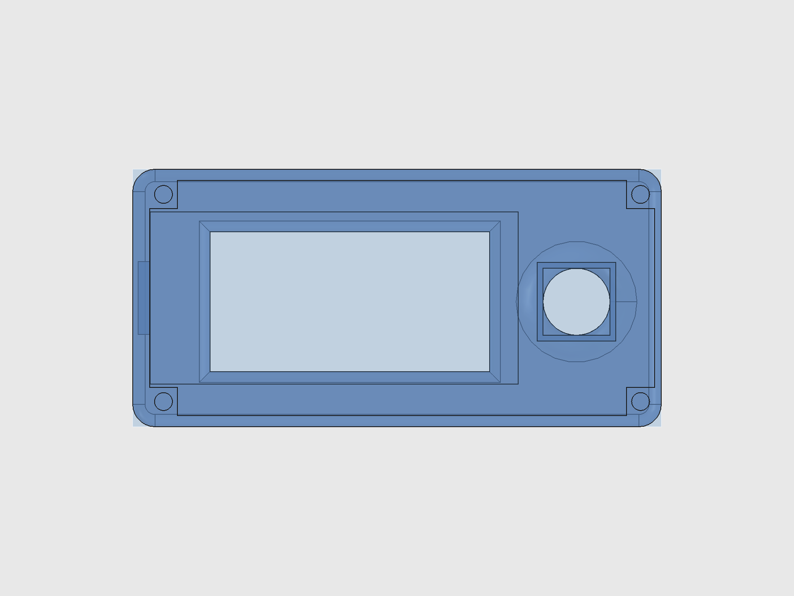{ width="420" loading=lazy }
  <figcaption>Isometric (40% transparent) — bullnose dome, display window, joystick hole, screen inlay pocket</figcaption>
</figure>

<figure markdown="span">
  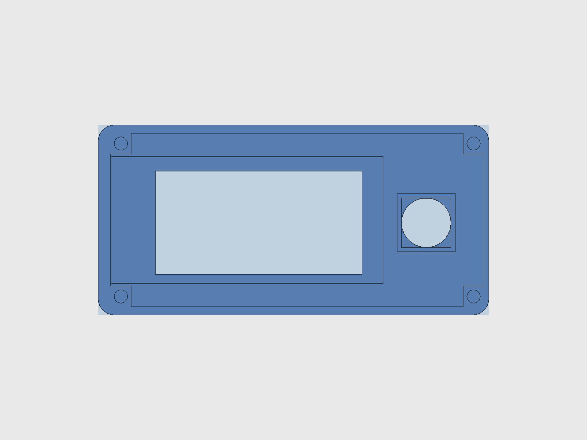{ width="420" loading=lazy }
  <figcaption>Bottom view — joystick anchor pad (14 x 14 mm), M3 bores, corner pillars, screen inlay cavity</figcaption>
</figure>

**Dimensions:** 94.5 x 46.0 mm footprint, 12.0 mm local height (face plate at Z=7, bullnose dome to Z=12), 5 mm wall extension below the mating face.

### Key features

| Feature | Specs | Purpose |
|---------|-------|---------|
| Outer shell | Sketch + pad, 17 mm total | Full-height box including 5 mm wall extension |
| Corner fillets | 4.0 mm radius on vertical edges | Rounded corners for comfort and aesthetics |
| Bullnose dome | 2.2 mm edge radius on top face | Smooth convex top surface (adjustable via `tc_edge_r`) |
| Interior cavity | 90.3 x 42.0 mm | Hollowed-out interior; floor at face_bot = 7.0 mm local |
| Corner pillars (4x) | 5 x 5 mm | Mirror the base plate pillars; M3 bores pass through |
| M3 bores (4x) | 3.2 mm dia | Screw holes for clamping the stack together |
| Screen inlay | 65.8 x 30.7 mm, 3.0 mm deep | Recessed pocket for the Waveshare display module |
| FPC divet | 13.0 mm wide, extends below inlay | Channel for the display's FPC cable to exit the inlay |
| Display window | 50.0 x 25.0 mm, shifted +2.8 mm in X | Through-cut exposing the e-ink active area |
| Joystick hole | 12.0 mm dia cylinder | Through-cut for the thumbpiece and actuator stick |
| Joystick anchor pad | 14 x 14 mm outer, 12 x 12 mm inner, 6.85 mm deep | Locating collar for the K1-1506SN-01 switch body |

### Design nuance

- The anchor pad depth (6.85 mm) is calculated to stop exactly at the PCB top surface: pit floor (9.65) + PCB thickness (1.5) = 11.15 global Z = 0.15 cover local Z. Depth = face_bot (7.0) - 0.15 = 6.85 mm. Going even 0.1 mm deeper causes the anchor to intersect the joystick PCB.
- The bullnose fillet radius controls how "domed" the top looks. At 4.0 mm (= `tc_bull`) the dome is pronounced; at 2.2 mm (`tc_edge_r`) the face plate edge is subtler. Both are spreadsheet params.
- The screen inlay `disp_xl` was widened from 65.0 to 65.2 mm (+0.2 mm on the +X side) to accommodate the Waveshare V3 board's actual PCB length, which was binding against the inlay wall.
- Window Y center is locked to the joystick Y center so they share a visual centerline.

---

## Thumbpiece

<figure markdown="span">
  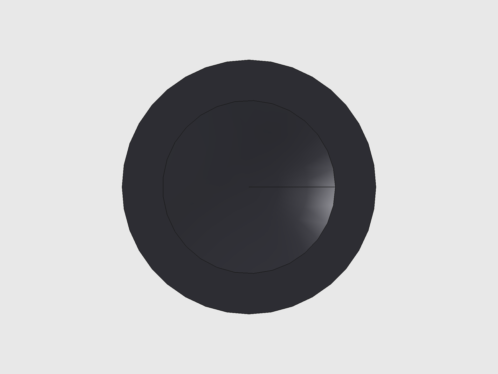{ width="300" loading=lazy }
  <figcaption>Snap cap — 11 mm disc with concave dish on top and rectangular snap socket on bottom</figcaption>
</figure>

**Dimensions:** 11.0 mm OD x 4.5 mm tall. Nests inside the cover's 12 mm joystick hole with 0.5 mm radial clearance all around.

### Key features

| Feature | Specs | Purpose |
|---------|-------|---------|
| Disc body | 11.0 mm OD, 4.5 mm tall | Main cylindrical body; OD = joy_d - 1.0 for swing clearance |
| Thumb dish | R=12 mm sphere, 0.6 mm deep | Concave landing pad for the thumb; shallow enough to leave 0.35 mm skin above the socket |
| Snap socket | 3.3 x 3.3 x 3.5 mm | Friction-fit rectangular pocket that grips the 3.2 mm actuator peg |

### Design nuance

- **Critical constraint:** `thumb_dish_d < thumb_h - thumb_top_clr - thumb_sock_d`. At 1.5 mm dish depth, the dish bottom punched through into the socket cavity, creating a hole straight through the cap. Fix: 0.6 mm depth, leaving 0.35 mm solid skin.
- The socket is centered on the disc axis, not the peg axis. The peg is offset +0.68 mm in Y from the hole center, but the 3.3 mm socket width absorbs this offset. After the PCB alignment fix, the peg is now only 0.01 mm off-center so this is no longer a concern.
- The thumbpiece is its own PartDesign Body (not part of the TopCover) so it can be printed separately in a different material or color.

---

## Joystick PCB

<figure markdown="span">
  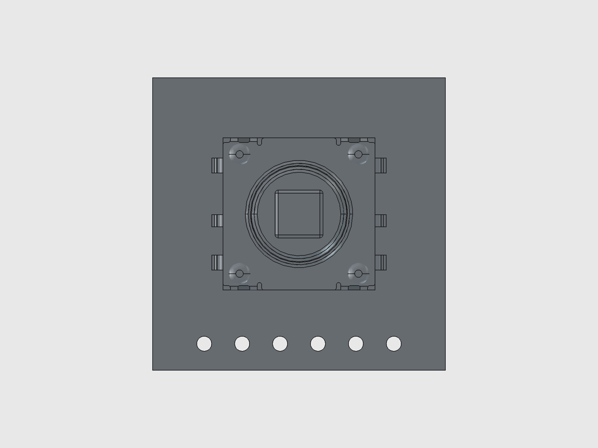{ width="350" loading=lazy }
  <figcaption>KiCad STEP import — K1-1506SN-01 5-way switch on a 19.6 x 19.6 mm hand-routed breakout board</figcaption>
</figure>

**Board:** 19.6 x 19.6 mm, hand-routed in KiCad 10 from scratch. STEP exported with `kicad-cli pcb export step --subst-models --include-tracks`.

**Switch:** K1-1506SN-01 — 10.2 x 10.2 x 10 mm body, 3.2 mm rectangular actuator peg, 5-way (up/down/left/right/push).

### Design nuance

- The STEP import filters out the switch pin-lead solid (80-180 mm^3 volume range) to keep the model clean while retaining the PCB, switch body, and actuator stick.
- PCB is placed bbox-centered at `enc_y/2 = 23.0` in global Y. The old code placed it at `enc_y/2 + 0.67` which double-applied the SW1 offset — the cover hole already shifts by `joy_pcb_y_offset` to land on the switch stick, so applying it again to the PCB moved the stick 0.68 mm off-center from the hole.
- The board drops into the cradle's 20 x 20 mm pit (pit floor at global Z=9.65). The anchor pad on the cover wraps around the switch body from above, stopping at the PCB top surface.

---

## Pico 2 W Board

<figure markdown="span">
  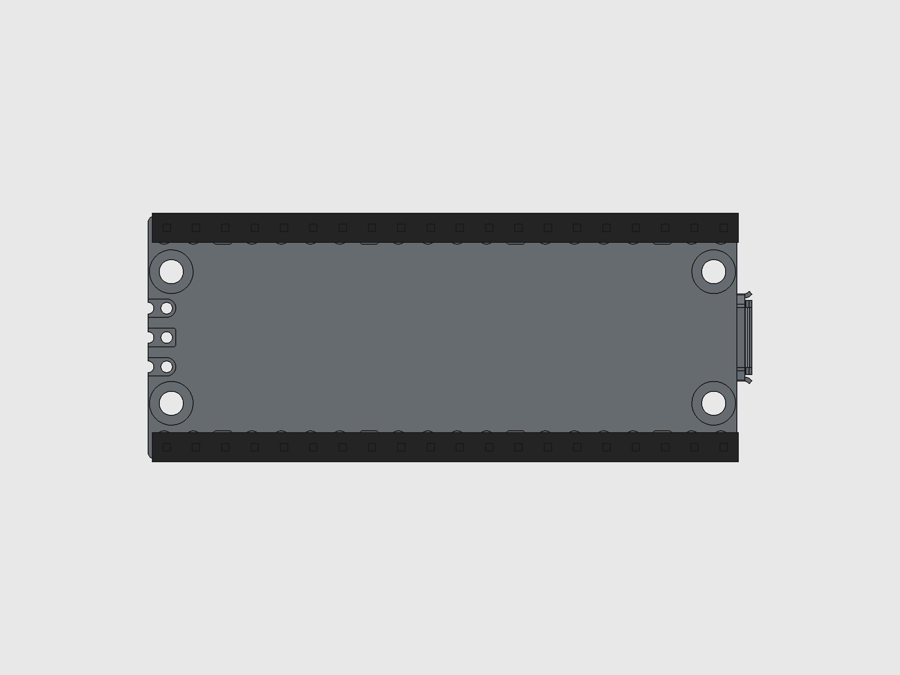{ width="350" loading=lazy }
  <figcaption>Official STEP import + procedural 2x20 pin headers — board sits inverted in the cradle's Pico nest</figcaption>
</figure>

**Board:** 51 x 21 mm, imported from the official Raspberry Pi STEP file. Headers are procedural (not in the STEP) — 2 rows of 20 pins at 2.54 mm pitch, 8.5 mm black housings with 3 mm gold pin protrusions.

**Orientation:** Flipped 180 degrees about Z so the USB-C connector points toward the +X wall (matching the base plate's USB-C cutout).

---

## Piezo Speaker

<figure markdown="span">
  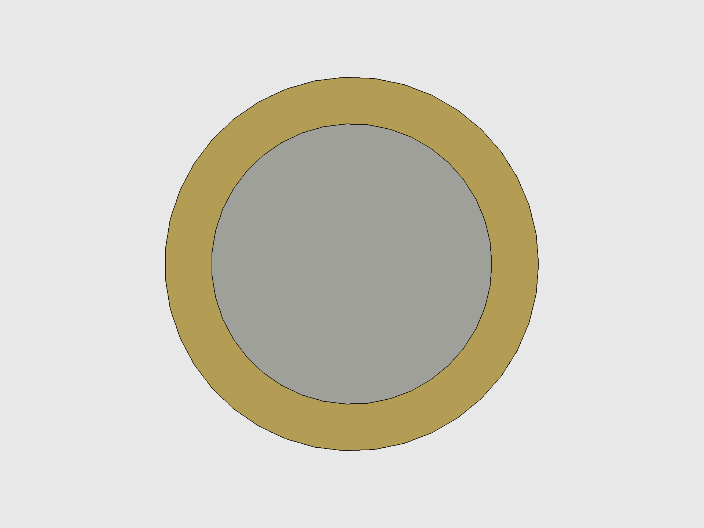{ width="300" loading=lazy }
  <figcaption>FT-20T / YOUMILE JK-YM-297A — 20 mm brass disc with 15 mm ceramic element</figcaption>
</figure>

**Specs:** 20 mm brass plate (0.20 mm) + 15 mm ceramic element (0.22 mm) = 0.42 mm total thickness. Resonant frequency 6.8 kHz.

**Mounting:** Slides into the PiezoRing on the base plate pocket floor. Ring ID = 20.2 mm (0.1 mm clearance per side), wall = 1.0 mm, height = 1.5 mm.

**Position:** Center (47.35, 23.0) — dead center of the base plate, in the 23 mm Y gap between battery rail supports.

---

## MPU-6500 IMU Accelerometer

<figure markdown="span">
  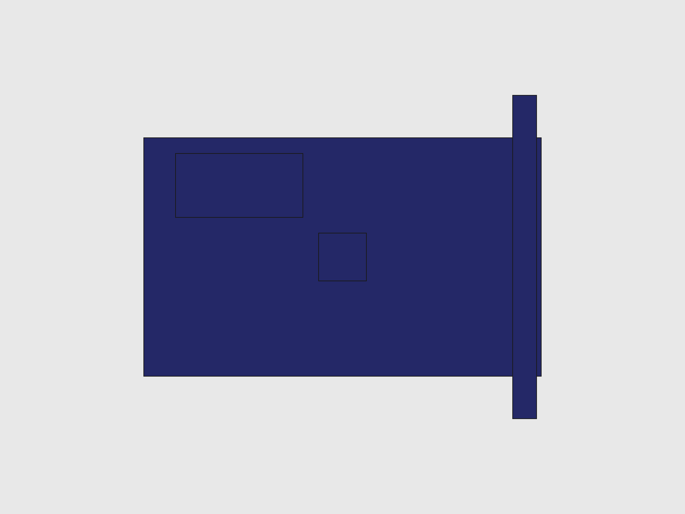{ width="300" loading=lazy }
  <figcaption>GY-6500 module — MPU-6500 6-axis gyro+accelerometer on a 25 x 15 mm breakout</figcaption>
</figure>

**Specs:** 25 x 15 x 1.0 mm PCB, MPU-6500 QFN (3 x 3 x 0.9 mm), 8-pin header on one short edge. I2C/SPI, 3-5V with onboard regulator.

**Mounting:** Drops into the IMU_Pocket on the base plate. Pocket inner cavity = 25.4 x 15.4 mm (0.2 mm clearance per side), retaining wall = 1.0 mm thick, 1.5 mm tall.

**Position:** Center (21.65, 23.0) — same Y as piezo, shifted 2 mm from the piezo ring's -X edge toward the origin. Oriented with 25 mm along X, 15 mm along Y.

**WiFi note:** Neither the IMU nor its plastic retaining wall interfere with the Pico W's 2.4 GHz WiFi. The MPU-6500 is an I2C/SPI sensor at low frequencies, and the retaining wall is printed plastic, not metal.

---

## TP4056 Charger Module

<figure markdown="span">
  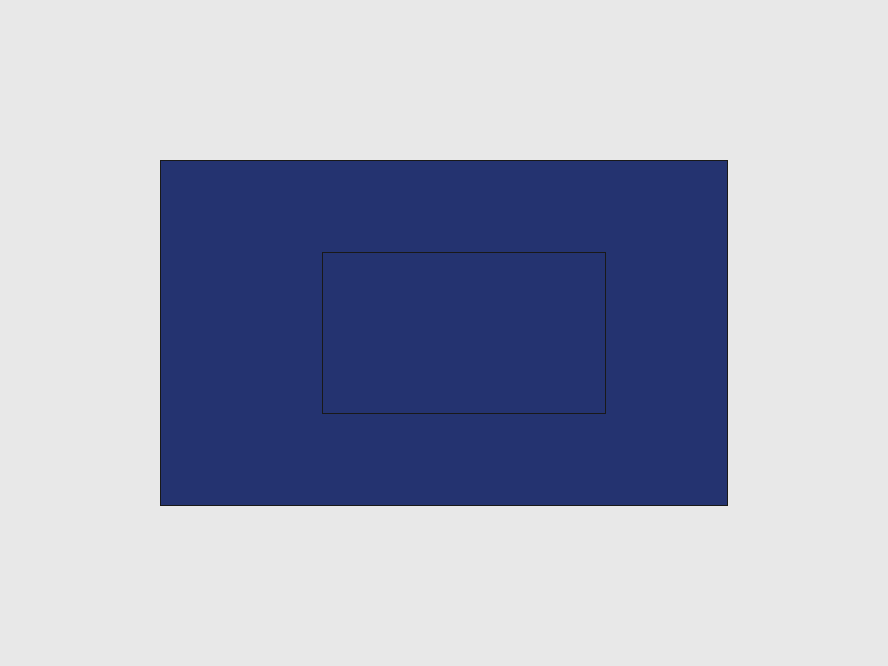{ width="300" loading=lazy }
  <figcaption>TP4056 USB-C charger module — 28 x 17 x 1.6 mm PCB with IC/cap lump</figcaption>
</figure>

**Specs:** 28 x 17 x 1.6 mm PCB. USB-C connector points +X toward the base plate cutout.

**Mounting:** Sits in the cradle's TP4056_Indent (1 mm deep pocket). Board top face is flush with the cradle mating face at global Z=6.0.

---

## AAA Batteries and Clips

<figure markdown="span">
  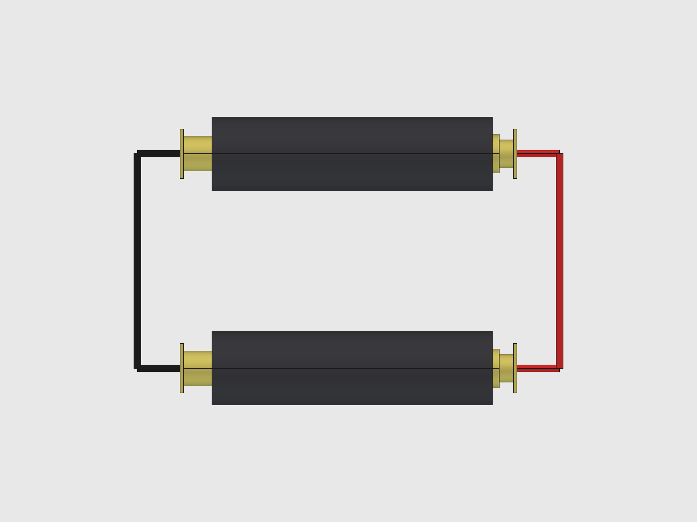{ width="420" loading=lazy }
  <figcaption>Two AAA Li-Ion cells (10.5 x 39.5 mm) with Swpeet 7x7 mm clip plates and wiring</figcaption>
</figure>

**Cells:** Two AAA Li-Ion (10440) cells, 10.5 mm dia x 39.5 mm long, with 5.5 mm brass positive terminal caps. Wired in **parallel only** (2S would exceed Pico VSYS 5.5V max).

**Clips:** Swpeet 7 x 7 mm sheet metal plates in the cradle's clip slots. Positive plates face the cell's nub end; negative plates with springs face the flat end.

---

## Waveshare E-Ink Display

<figure markdown="span">
  { width="350" loading=lazy }
  <figcaption>Waveshare 2.13" e-Paper V3 module — 65.2 x 30 x 3.0 mm carrier with 48 x 22 mm active panel</figcaption>
</figure>

**Specs:** 250 x 122 px, 65.2 x 30 x 3.0 mm module. Active e-paper area 48 x 22 mm, shifted +2.8 mm toward +X.

**Mounting:** Drops into the cover's screen inlay pocket (65.8 x 30.7 mm with slop, 3.0 mm deep). Module back at global Z=18.0, active panel visible through the display window.

---

## AK 62x36 Solar Panel

<figure markdown="span">
  { width="420" loading=lazy }
  <figcaption>AK 62x36 mm solar panel — frame + dark-blue cell layer, visible from the base plate bottom</figcaption>
</figure>

**Specs:** 62 x 36 x 2.0 mm. Cell layer inset 1.5 mm from frame edges. Red (+) and black (-) leads through the base plate wire holes.

**Mounting:** Sits flush in the 62.4 x 36.4 x 2.0 mm solar pit on the base plate bottom face.

---

## Full Assembly

<figure markdown="span">
  { width="420" loading=lazy }
  <figcaption>Hero shot — complete assembly with transparent cover showing all internal components</figcaption>
</figure>

<figure markdown="span">
  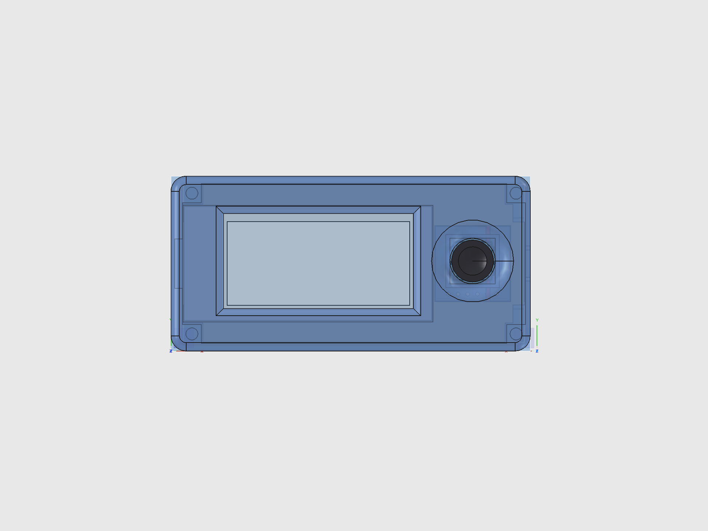{ width="420" loading=lazy }
  <figcaption>Exploded view — base plate drops 25 mm, cover lifts 30 mm, thumbpiece lifts 40 mm</figcaption>
</figure>

<figure markdown="span">
  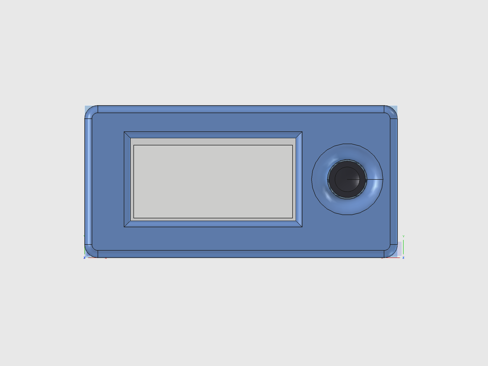{ width="420" loading=lazy }
  <figcaption>Assembled (opaque cover) — what it looks like as a finished device</figcaption>
</figure>

<figure markdown="span">
  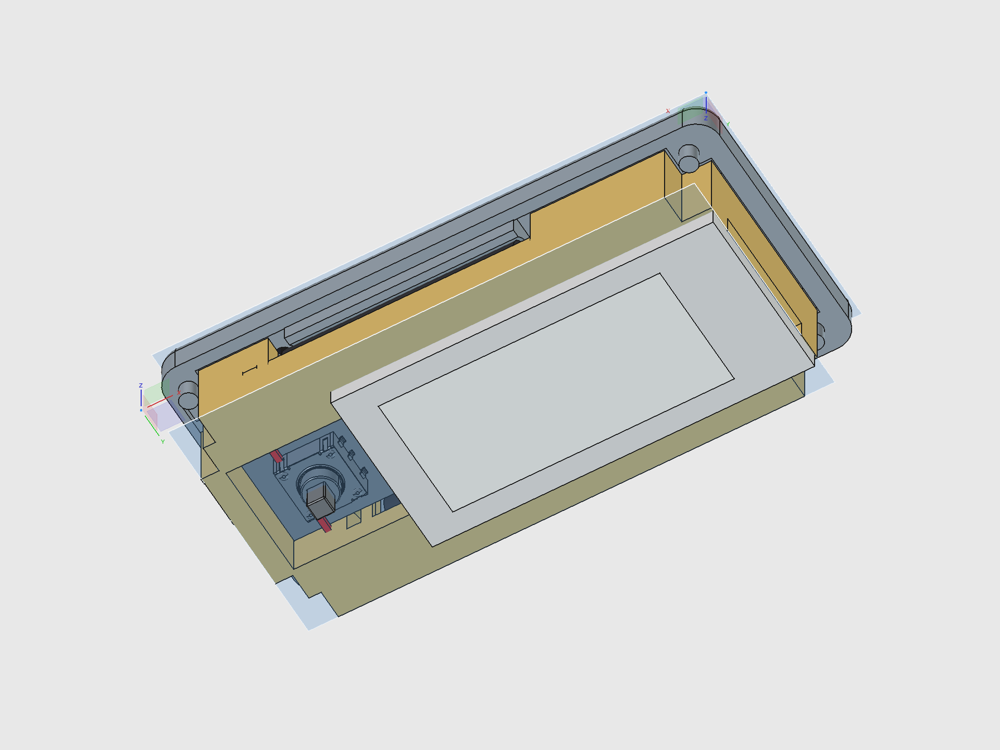{ width="420" loading=lazy }
  <figcaption>Cover removed — cradle with batteries, TP4056, Pico board, joystick PCB, and display visible</figcaption>
</figure>

### Assembly order

1. **Solar panel** glues into the base plate bottom pit
2. **Piezo disc** slides into the PiezoRing on the pocket floor
3. **IMU module** drops into the IMU_Pocket
4. **Cradle** drops onto the base plate — pillar cutouts align with the base plate pillars, pegs locate it
5. **AAA batteries** slide into the cradle bays from the top
6. **Battery clips** press into the clip slots at each bay end
7. **TP4056 module** seats into the TP4056_Indent, USB-C pointing +X
8. **Pico 2 W** sits inverted in the Pico nest, USB-C aligning with the base plate cutout
9. **Joystick PCB** drops into the cradle pit (20 x 20 mm snug fit)
10. **Display module** lays into the cover's screen inlay pocket
11. **Top cover** drops on — anchor pad guides the joystick switch body, pillar bores align with pegs
12. **Thumbpiece** snaps into the 12 mm joystick hole — socket friction-fits onto the actuator peg
13. **M3 screws** (4x) through the cover bores into the base plate pillars clamp the stack

---

## Pain Points and Lessons Learned

### The Y-offset double-application bug

The joystick switch (K1-1506SN-01) is placed +0.67 mm off-center on the PCB layout. The cover's joystick hole shifts by this offset so the hole lands on the stick. But the PCB placement code *also* applied the offset: `joy_cy_g = enc_y/2 + 0.67`. This meant the PCB shifted, which shifted the stick, which moved it 0.68 mm from the hole center. Fix: PCB at `enc_y/2` (bbox center only), hole at `enc_y/2 + 0.67`. Now the stick is 0.01 mm from dead center.

### Cradle 180-degree flip mental model

The cradle is built "right side up" in local coords then flipped 180 degrees about Y for assembly. Every local X maps to `96.3 - local_x` in global. This means "move the +X wall" requires changing `plug_x0` (the local *minimum*), not `plug_x1`. Every debuggging session involves mentally flipping coordinates. Comments are critical.

### The dish-through-socket failure

The thumbpiece's concave dish was initially 1.5 mm deep. The socket below is 3.5 mm deep starting from the bottom of a 4.5 mm disc. That leaves `4.5 - 0.1 (top clearance) - 3.5 (socket) = 0.9 mm` above the socket. A 1.5 mm dish punched right through. The constraint `dish_d < h - top_clr - sock_d` is now documented in the parameter description.

### Fillet edge selection in PartDesign

`find_edges(feature, "vertical")` returns ALL vertical edges in the cumulative body shape, not just the ones belonging to that feature. Early in the build (Pad_Shell has 4 vertical edges) this works. Late in the build (the anchor pad stage has hundreds of edges) it grabs pillars, cutouts, bores — everything. The fillet tries to round them all and the body breaks. Fix: filter by XY position, only selecting edges within the feature's footprint. Or just add fillets manually in the FreeCAD GUI after the macro runs.

### Pit wall fill pieces

When the joystick pit extends past the ConnBlock boundary, there's a gap in the cradle wall where the FPC gap meets the pit edge. This required 5 separate additive boxes to fill: PitWallFill_PY, PitWallFill_PY_Ceil, PitWallFill_PY_Wall, and the -Y equivalents. After tightening the pit from 23 to 20 mm, the +Y fills became unnecessary (pit edge is now inside the ConnBlock), so the code uses size guards (`if fill_y1 > fill_y0`) to skip them dynamically.

### Display inlay binding

The Waveshare V3 module's actual PCB length was 0.2 mm longer than the datasheet nominal. The display bound against the +X inlay wall and wouldn't seat flush. Fix: `disp_xl` increased from 65.0 to 65.2 mm. Total inlay with slop: 65.2 + 2 x 0.3 = 65.8 mm.

---

Source: [`hardware-design/freecad-mk2/dilder_rev2_mk2.FCMacro`](https://github.com/rompasaurus/dilder/blob/main/hardware-design/freecad-mk2/dilder_rev2_mk2.FCMacro)

Renders generated by: [`hardware-design/freecad-mk2/render_views.FCMacro`](https://github.com/rompasaurus/dilder/blob/main/hardware-design/freecad-mk2/render_views.FCMacro)
