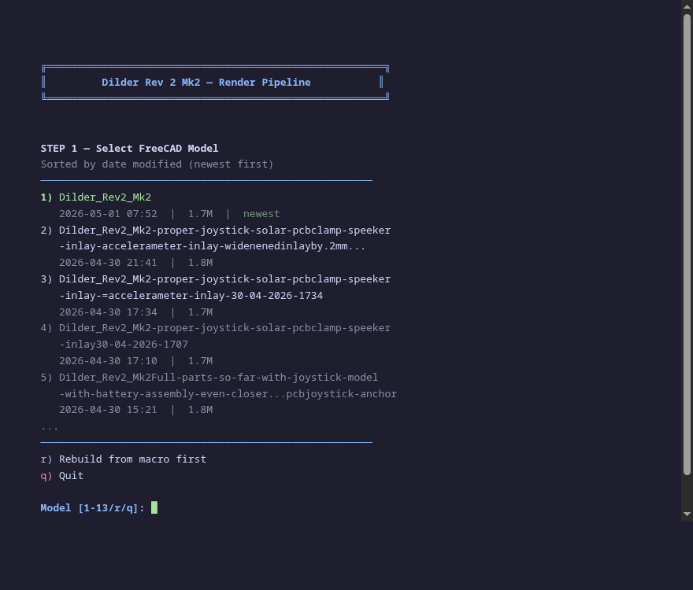
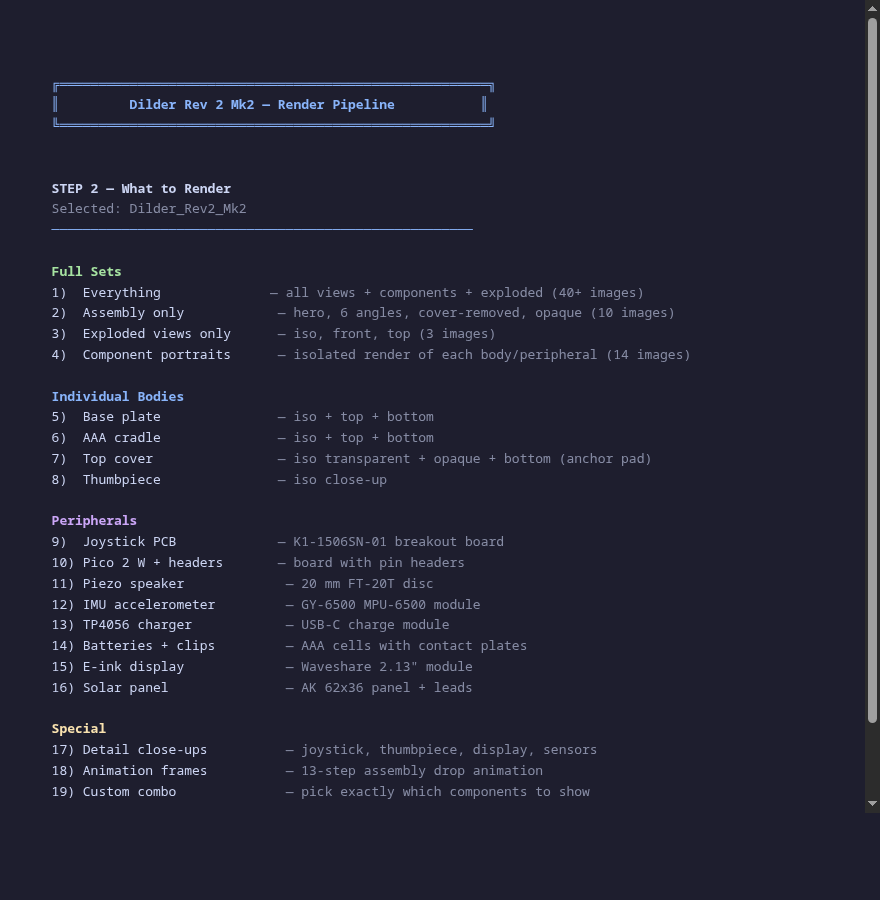
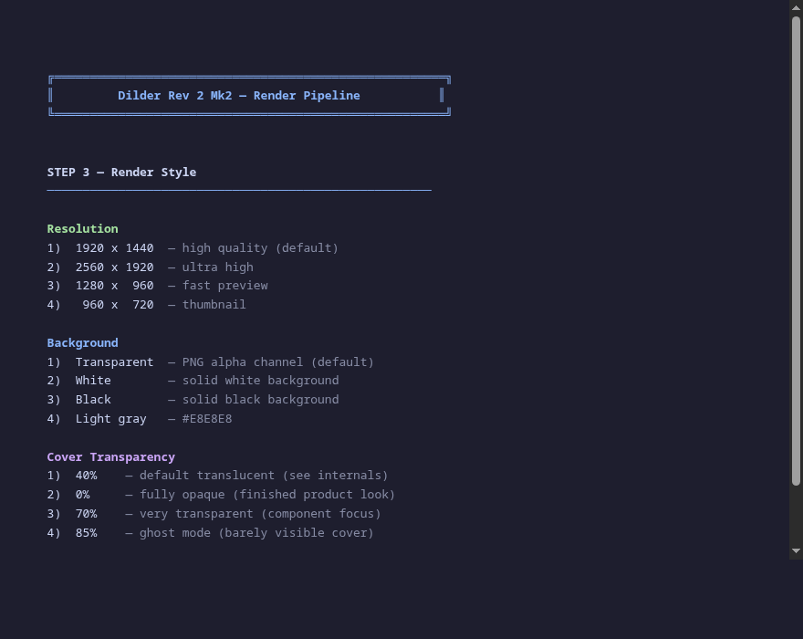
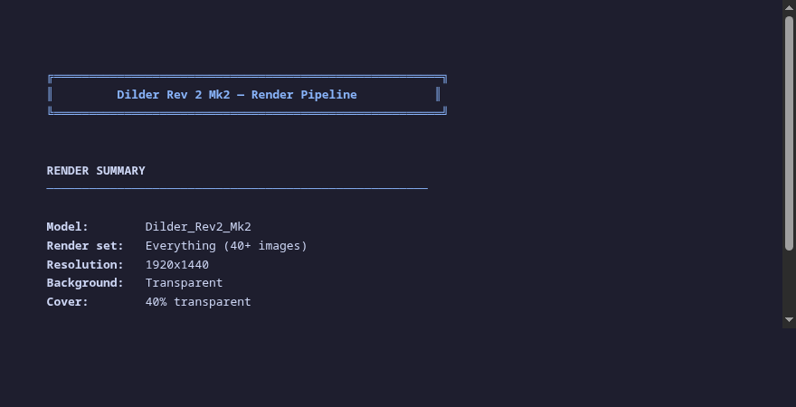

# Build & Render Tool

Interactive CLI for rendering Dilder FreeCAD models into publication-quality PNGs. Supports 19 render presets, 4 resolutions, custom component combos, and frame-by-frame assembly animations.

---

## Usage

```bash
./tools/build-render/build_and_render.sh
```

The tool walks through 4 interactive screens:

### Screen 1 — Model Picker

All `.FCStd` files sorted by date modified (newest first), with file sizes.

<figure markdown="span">
  { width="700" loading=lazy }
  <figcaption>Pick a model by number, or press r to rebuild from the parametric macro</figcaption>
</figure>

### Screen 2 — Render Set

19 options organized into full sets, individual bodies, peripherals, and special modes.

<figure markdown="span">
  { width="700" loading=lazy }
  <figcaption>Choose from "Everything" (40+ images) down to a single component portrait</figcaption>
</figure>

### Screen 3 — Render Style

Resolution, background, and cover transparency.

<figure markdown="span">
  { width="700" loading=lazy }
  <figcaption>Four resolutions, four backgrounds, four transparency levels</figcaption>
</figure>

### Screen 4 — Confirmation

Review all selections before rendering.

<figure markdown="span">
  { width="700" loading=lazy }
  <figcaption>Summary of model, render set, resolution, background, and cover transparency</figcaption>
</figure>

After confirmation, FreeCAD GUI opens, renders all views, and copies PNGs to the website assets directory.

## Render Sets

### Full Sets

| # | Set | Output |
|---|-----|--------|
| 1 | Everything | 40+ images: all angles, components, exploded, opaque |
| 2 | Assembly only | 10 images: hero, 6 orthographic, angled, cover-removed |
| 3 | Exploded views | 3 images: iso, front, top |
| 4 | Component portraits | 14 images: isolated render of every body and peripheral |

### Individual Bodies

| # | Body | Views |
|---|------|-------|
| 5 | Base plate | iso, top, bottom, front, sensors overlay |
| 6 | AAA cradle | iso, top, bottom, front |
| 7 | Top cover | transparent iso, opaque iso, bottom (anchor pad), top, front |
| 8 | Thumbpiece | iso close-up |

### Peripherals

| # | Component | Description |
|---|-----------|-------------|
| 9 | Joystick PCB | K1-1506SN-01 5-way switch breakout |
| 10 | Pico 2 W | Board with procedural 2x20 pin headers |
| 11 | Piezo speaker | 20 mm FT-20T brass + ceramic disc |
| 12 | IMU accelerometer | GY-6500 MPU-6500 module |
| 13 | TP4056 charger | USB-C charge module |
| 14 | Batteries + clips | AAA cells with Swpeet contact plates |
| 15 | E-ink display | Waveshare 2.13" module |
| 16 | Solar panel | AK 62x36 with wire leads |

### Special

| # | Mode | Description |
|---|------|-------------|
| 17 | Detail close-ups | Joystick, thumbpiece, sensor pockets |
| 18 | Animation | 13-step assembly with cosine ease-in-out drop |
| 19 | Custom combo | Pick exactly which components to include |

## Style Options

**Resolution:** 1920x1440 (default) | 2560x1920 | 1280x960 | 960x720

**Background:** Transparent | White | Black | Light gray

**Cover transparency:** 40% (default translucent) | 0% (opaque) | 70% | 85% (ghost)

## Animation

Option 18 generates numbered PNGs of each component dropping into place. If `ffmpeg` is installed, a GIF is assembled automatically:

```bash
ffmpeg -framerate 12 -i renders/anim/frame-%04d.png \
       -vf "scale=960:720" -loop 0 renders/assembly-animation.gif
```

## Technical Notes

- Requires FreeCAD **GUI** (not `freecadcmd`) — `saveImage` needs the live OpenGL viewport
- The render script uses `pivy` (Coin3D bindings) for custom camera angles
- Each screenshot pumps the Qt event loop 5 times with 300ms delays to ensure the viewport finishes drawing before capture
- Visibility toggling only affects top-level objects (Bodies and Part::Features), not internal PartDesign features — toggling those would make parent Bodies render blank

Source: [`tools/build-render/build_and_render.sh`](https://github.com/rompasaurus/dilder/blob/main/tools/build-render/build_and_render.sh)
