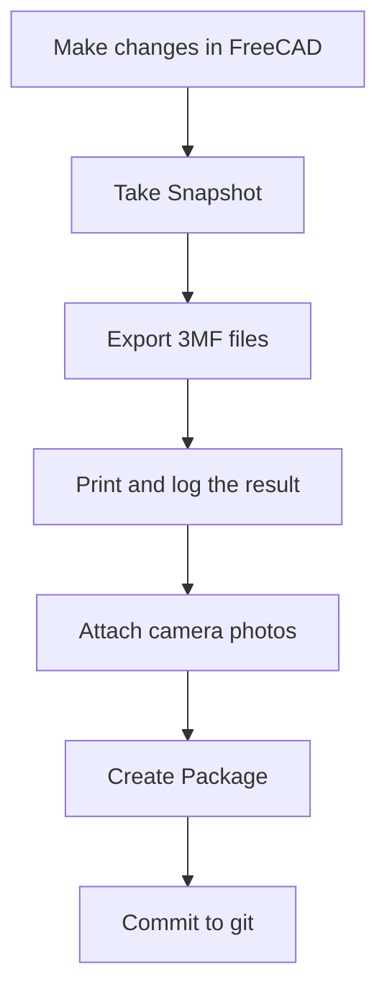

# Design Tracker v2.0 — GUI for CAD Version History, Print Logs, and Packages

A Tkinter GUI (and CLI) for tracking the evolution of FreeCAD hardware designs. Take snapshots, log prints, browse renders, attach camera photos of physical prints, and bundle everything into tracked packages.

---

## The Problem

After a few days of iterating on a 3D model, you end up with a dozen FCStd files with names like `Dilder_Rev2_Mk2Full parts so far with joystick model with battery assembly even closer joystick and pit refined and cradle curvature fixed pcbjoystick anchor.FCStd`. Which one was the one you actually printed? What changed between the version from Tuesday and the one from Thursday? Did you ever try that wider inlay, and did it work?

The Design Tracker solves this by giving you a structured way to bookmark your progress, log your prints, browse renders, attach photos of physical parts, and package everything together for easy reference.

---

## Quick Start

```bash
# Launch the GUI (default)
python3 tools/design-tracker/design-tracker.py

# Or use the CLI
python3 tools/design-tracker/design-tracker.py --cli
```

---

## Dashboard

<figure markdown="span">
  { loading=lazy }
  <figcaption>Dashboard — live stats, timeline of snapshots/prints/packages, action buttons</figcaption>
</figure>

The Dashboard shows a live summary of your design state:

- **Git Hash** — current commit of the repository
- **FCStd Files** — number of FreeCAD model files in `freecad-mk2/`
- **3MF Exports** — number of sliceable 3MF exports
- **Renders** — number of PNG renders in `hardware-design/renders/`
- **Snapshots** — number of saved design snapshots
- **Prints** — number of logged 3D prints

**Timeline** merges all snapshots, prints, and packages into a single chronological view with color coding: green for snapshots, magenta for prints, orange for packages.

**Actions:**

- **Take Snapshot** — saves file counts, hashes, git ref, and backs up the newest FCStd to `.design-tracker/snapshots/`
- **Refresh** — re-scans all directories for changes
- **Compare Snapshots** — diff two snapshots side-by-side showing count deltas, hash changes, added/removed renders

---

## Models & Exports

<figure markdown="span">
  { loading=lazy }
  <figcaption>Side-by-side tables of FCStd models and 3MF exports</figcaption>
</figure>

Two side-by-side tables:

**FreeCAD Models (.FCStd):**

- File name, modification date, file size, and MD5 hash
- Newest files appear first
- Hashes let you detect changes even when filenames are the same

**3MF Exports:**

- All 3MF files from `freecad-mk2/` and the packages directory
- Date and size for each export
- Select files here when logging a print or creating a package

---

## Prints

Track every 3D print attempt with full context.

**Log New Print:**

1. Enter a description of what you printed
2. Select the result: `success`, `partial`, or `failed`
3. Add any notes about print settings or issues
4. Select which 3MF files were used from the scan
5. Optionally attach camera photos of the printout

**Attach Photo to Print:**

- Select a print entry in the table
- Click "Attach Photo" to add camera pictures (PNG/JPG)
- Photos are tracked by file path in the print record

**Print Detail Panel:**

- Click any print entry to see full details: files, notes, git hash, and attached photo paths

---

## Renders

<figure markdown="span">
  { loading=lazy }
  <figcaption>Render gallery with live image preview</figcaption>
</figure>

A gallery view of all render images in `hardware-design/renders/`:

- **Left panel** — list of all render PNGs sorted by modification date
- **Right panel** — live image preview of the selected render (requires Pillow)
- **Open Renders Folder** — launches your system file manager

These renders are generated by the [Build & Render Tool](build-render-tool.md) which creates publication-quality orthographic and isometric views from the FreeCAD assembly.

---

## Packages

Bundle related files into tracked folders for easy archival.

**Creating a Package:**

1. Enter a descriptive name (e.g., "Rev2 Mk2 — widened USB cutout")
2. Optionally link to a snapshot and/or print entry
3. Select a FreeCAD model file to include
4. Select 3MF export files to include
5. Add render images from the renders folder
6. Add camera photos of physical prints
7. Write a changelog describing what changed

Each package creates a folder in `.design-tracker/packages/` containing:

- The FCStd model file (frozen copy)
- Selected 3MF exports
- `renders/` subfolder with selected render images
- `photos/` subfolder with camera pictures
- `CHANGES.md` with your changelog, metadata, git hash, and file manifest

---

## Guide

<figure markdown="span">
  { loading=lazy }
  <figcaption>Built-in guide with walkthrough, workflow, naming conventions, and CLI reference</figcaption>
</figure>

The built-in Guide tab covers every feature, the recommended design-print-review workflow, naming conventions, and CLI command reference — so you never have to leave the app to look things up.

---

## Workflow: Design-Print-Review Cycle



1. **Make changes** in FreeCAD (edit the macro, rebuild the model)
2. **Take a Snapshot** (Dashboard tab) to record the current state
3. **Export 3MF files** for printing
4. **Log the Print** (Prints tab) with result and notes
5. **Take camera photos** of the physical print
6. **Attach Photos** to the print entry
7. **Create a Package** linking the snapshot, print, renders, and photos
8. **Commit to git** when satisfied

---

## Naming Convention

**Pattern:** `Dilder_Rev2_Mk2-<changes>-<DD-MM-YYYY-HHMM>.FCStd`

**Rules:**

1. Start with `Dilder_Rev2_Mk2-`
2. List key changes in 2-4 words separated by hyphens
3. End with date and time
4. Lowercase with hyphens (no spaces)
5. Take a snapshot after each significant change

**Good:** `Dilder_Rev2_Mk2-joystick-anchor-piezo-30-04-2026-1617.FCStd`

**Avoid:** `Dilder_Rev2_Mk2Full parts so far with joystick model with battery assembly even closer joystick and pit refined and cradle curvature fixed pcbjoystick anchor.FCStd`

---

## CLI Commands

```bash
python3 design-tracker.py               # launch GUI (default)
python3 design-tracker.py --cli         # interactive terminal menu
python3 design-tracker.py snap "msg"    # quick snapshot
python3 design-tracker.py log           # show timeline
python3 design-tracker.py status        # current design state
python3 design-tracker.py diff 1 2      # compare snapshots 1 and 2
python3 design-tracker.py naming        # naming convention guide
```

---

## Data Storage

```
tools/design-tracker/
  design-tracker.py          # main script (GUI + CLI)
  screenshots/               # GUI screenshots for docs
  .design-tracker/
    history.json             # all snapshots, prints, packages
    snapshots/
      snap-0001/             # FCStd backup from snapshot 1
      snap-0002/
    packages/
      pkg-0001_2026-05-01_1430_widened-usb/
        Dilder_Rev2_Mk2.FCStd
        *.3mf
        renders/             # selected render PNGs
        photos/              # camera pictures of prints
        CHANGES.md           # changelog + file manifest
```

---

## Dependencies

- Python 3.8+
- tkinter (standard library)
- Pillow (`pip install Pillow`) — for render image previews in the gallery

Source: [`tools/design-tracker/design-tracker.py`](https://github.com/rompasaurus/dilder/blob/main/tools/design-tracker/design-tracker.py)
