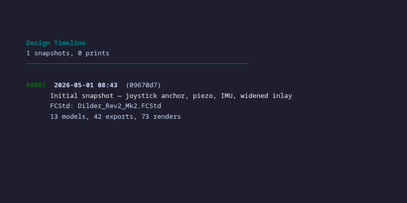
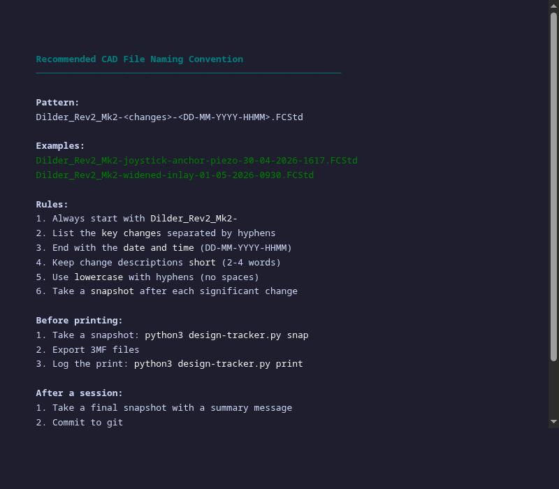

# Design Tracker — CAD Version History and Print Log

A CLI tool for tracking the evolution of FreeCAD hardware designs. Take snapshots, log prints, compare iterations, and maintain a complete audit trail of every design change.

---

## The Problem

After a few days of iterating on a 3D model, you end up with a dozen FCStd files with names like `Dilder_Rev2_Mk2Full parts so far with joystick model with battery assembly even closer joystick and pit refined and cradle curvature fixed pcbjoystick anchor.FCStd`. Which one was the one you actually printed? What changed between the version from Tuesday and the one from Thursday? Did you ever try that wider inlay, and did it work?

The Design Tracker solves this by giving you a structured way to bookmark your progress, log your prints, and compare any two points in your design history.

---

## Usage

```bash
cd hardware-design
python3 design-tracker.py           # interactive menu
python3 design-tracker.py status    # quick state check
python3 design-tracker.py snap "widened inlay by 0.2mm"   # bookmark
python3 design-tracker.py log       # full timeline
python3 design-tracker.py diff 3 7  # compare two bookmarks
```

---

## Interactive Menu

<figure markdown="span">
  { width="600" loading=lazy }
  <figcaption>Main menu — 6 commands for managing your design history</figcaption>
</figure>

---

## Status

Shows your current design state at a glance: how many models, exports, renders, and snapshots you have, plus the newest FCStd file and any uncommitted changes.

<figure markdown="span">
  { width="600" loading=lazy }
  <figcaption>Quick status — git hash, file counts, newest model details</figcaption>
</figure>

---

## Snapshots

A snapshot captures the current state of your design: which FCStd files exist, their hashes, how many 3MFs and renders are present, and a copy of the newest FCStd file backed up to `.design-tracker/snapshots/`.

Every snapshot gets a sequential ID, timestamp, git hash, and your description. You can compare any two snapshots later to see exactly what changed.

**When to snapshot:**

- Before starting a new feature
- After getting a design to a "good" state
- Before exporting for printing
- At the end of a work session

---

## Timeline

The full chronological history of snapshots and prints.

<figure markdown="span">
  { width="600" loading=lazy }
  <figcaption>Timeline — every snapshot and print in chronological order</figcaption>
</figure>

---

## Print Log

When you print something, log it: what files you sent to the printer, whether it succeeded, and any notes about fit, quality, or issues. This builds a record of which designs actually made it to physical plastic — invaluable when you're trying to remember "which version was that print from last week?"

---

## Compare (Diff)

Compare any two snapshots side by side. See what changed: file counts, FCStd hashes, macro changes, and which renders were added or removed.

```bash
python3 design-tracker.py diff 1 5
```

Shows:
- File count changes (FCStd, 3MF, renders)
- Whether the FCStd or macro hash changed
- New and removed render images

---

## Naming Convention

<figure markdown="span">
  { width="600" loading=lazy }
  <figcaption>Recommended naming pattern for consistent, sortable filenames</figcaption>
</figure>

**Pattern:** `Dilder_Rev2_Mk2-<changes>-<DD-MM-YYYY-HHMM>.FCStd`

**Rules:**

1. Start with `Dilder_Rev2_Mk2-`
2. List key changes in 2-4 words separated by hyphens
3. End with date and time
4. Lowercase with hyphens (no spaces)
5. Take a snapshot after each significant change

**Good:** `Dilder_Rev2_Mk2-joystick-anchor-piezo-30-04-2026-1617.FCStd`

**Avoid:** `Dilder_Rev2_Mk2Full parts so far with joystick model with battery assembly even closer joystick and pit refined and cradle curvature fixed pcbjoystick anchor.FCStd`

---

## Workflow

```
  Design change in FreeCAD
         │
         ▼
  Save FCStd with descriptive name + timestamp
         │
         ▼
  python3 design-tracker.py snap "description"
         │
         ▼
  Run build_and_render.sh to generate renders
         │
         ▼
  Ready to print? → Export 3MF
         │
         ▼
  python3 design-tracker.py print → log the result
         │
         ▼
  git commit + push
```

---

## Data Storage

```
hardware-design/.design-tracker/
├── history.json              ← all snapshots + prints
└── snapshots/
    ├── snap-0001/            ← backup of newest FCStd at snapshot time
    ├── snap-0002/
    └── ...
```

Source: [`hardware-design/design-tracker.py`](https://github.com/rompasaurus/dilder/blob/main/hardware-design/design-tracker.py)
