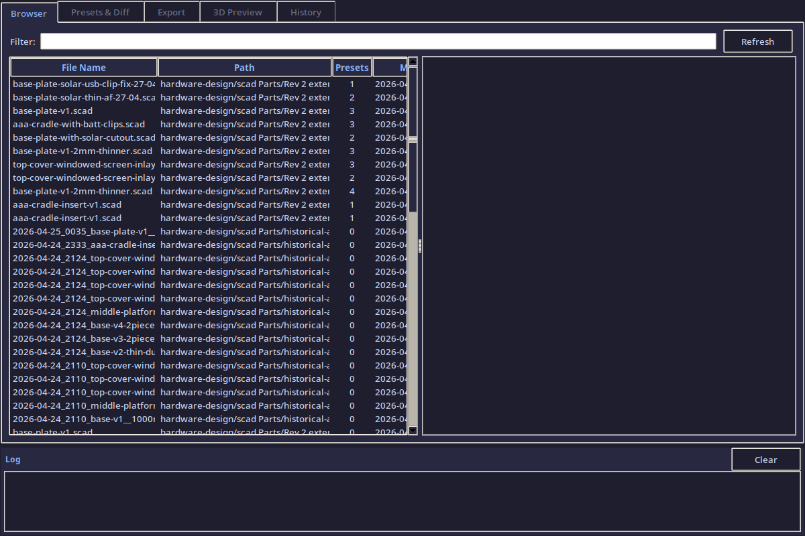
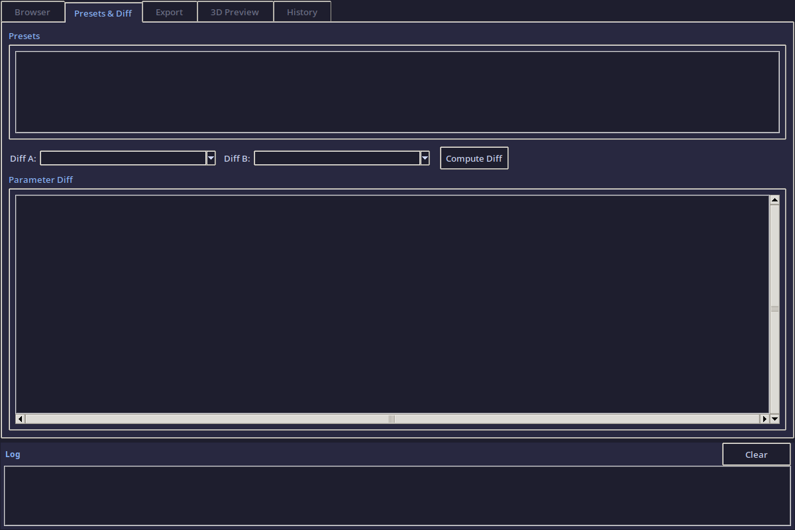
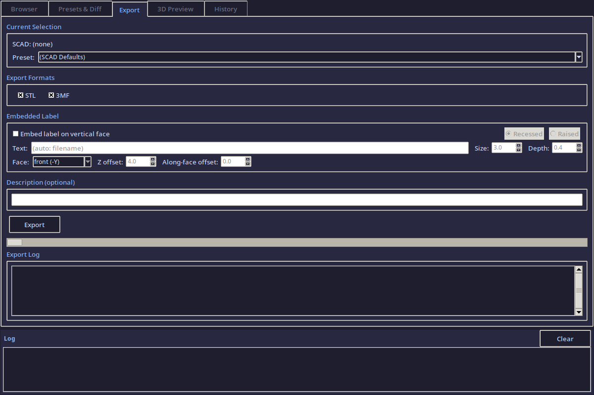
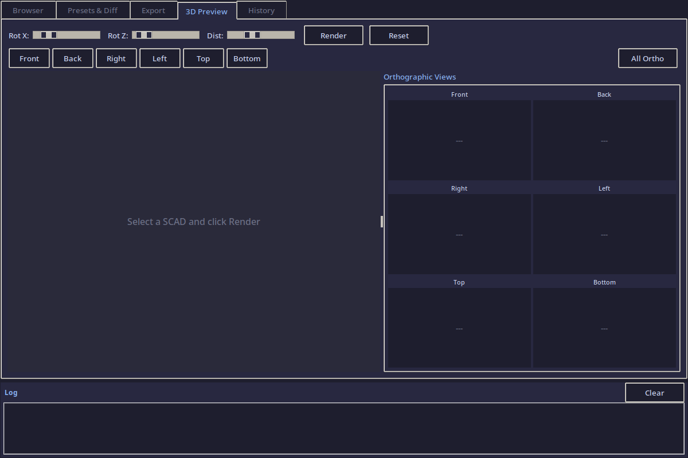
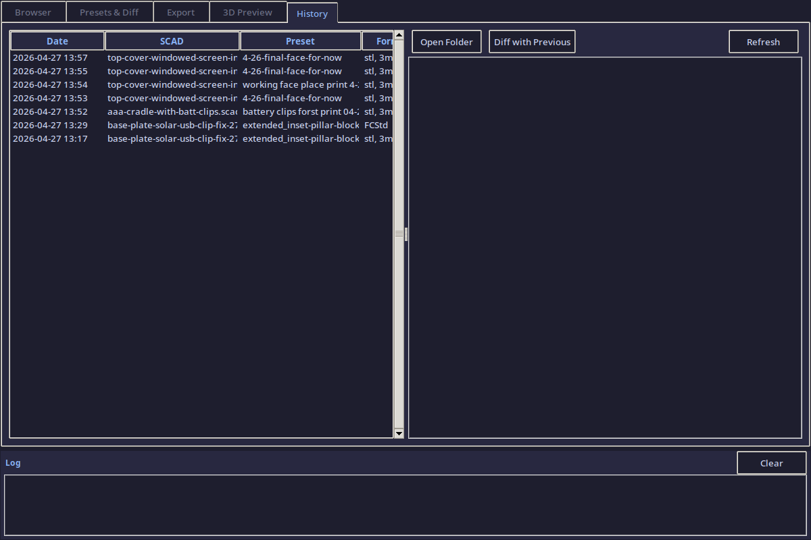

# DesignTool — SCAD Design Management Companion

A Tkinter GUI for managing OpenSCAD hardware design files: browsing SCAD files and presets, diffing parameters, exporting to STL/3MF, 3D preview with orthographic views, and tracking the full export history.

---

## Usage

```bash
python3 hardware-design/DesignTool/designtool.py
```

---

## Tab 1 — Browser

Browse all `.scad` files in the `hardware-design/scad Parts/` directory. Select a file to see its parameters, presets, and source code preview.

<figure markdown="span">
  { width="700" loading=lazy }
  <figcaption>SCAD file browser with search, parameter listing, and file details panel</figcaption>
</figure>

### Features

- **Search bar** filters files by name in real time
- **File tree** lists all `.scad` files found recursively
- **Detail panel** shows file path, parameter count, preset count, and file size
- **Parameter table** displays all top-level SCAD variables with their default values
- Selecting a file auto-loads its companion `.json` preset file (if present)

---

## Tab 2 — Presets & Diff

Compare any two presets side-by-side to see exactly which parameters changed between design iterations.

<figure markdown="span">
  { width="700" loading=lazy }
  <figcaption>Preset list with parameter diff — changed values highlighted, unchanged dimmed</figcaption>
</figure>

### Features

- **Preset list** loads from the SCAD file's companion JSON
- **Diff view** compares two presets (or a preset against the SCAD defaults)
- Color-coded diff: **changed** (yellow), **added** (green), **removed** (red), **unchanged** (dim)
- Diff export to markdown for documentation

---

## Tab 3 — Export

Export a SCAD file with a specific preset to STL, 3MF, or both. Includes embedded labeling and automatic description generation.

<figure markdown="span">
  { width="700" loading=lazy }
  <figcaption>Export panel with format selection, embedded label configuration, and export log</figcaption>
</figure>

### Features

- **Format selection**: STL, 3MF, or both
- **Embedded label**: optional text/date stamp baked into the export filename
- **Description**: auto-generated markdown documenting the export parameters vs defaults
- **Export log**: real-time output from the OpenSCAD CLI (`openscad` or `openscad-nightly`)
- All exports saved to `hardware-design/DesignTool/exports/` with timestamped filenames

---

## Tab 4 — 3D Preview

Render a live 3D preview of the selected SCAD file + preset using the OpenSCAD CLI.

<figure markdown="span">
  { width="700" loading=lazy }
  <figcaption>3D preview with isometric and 6 orthographic quick-view buttons</figcaption>
</figure>

### Features

- **Live preview**: renders the current SCAD + preset to a PNG via `openscad --render --camera`
- **Orthographic views**: one-click buttons for Front, Back, Right, Left, Top, Bottom
- **Default isometric**: 55/0/25 degree camera angle at distance 200
- **Quick render**: low-res preview for fast iteration
- **Full render**: high-res output for documentation

---

## Tab 5 — History

Full audit trail of every export — what was exported, when, with which parameters, and where the files went.

<figure markdown="span">
  { width="700" loading=lazy }
  <figcaption>Export history with details panel showing file paths, formats, and parameter snapshots</figcaption>
</figure>

### Features

- **History list**: every export logged to `history.json` with timestamp
- **Detail panel**: shows the SCAD file, preset name, exported formats, and output paths
- **Parameter snapshot**: the exact parameter values used for each export (for reproducibility)
- **Re-export**: one-click to re-run a previous export with the same settings

---

## Architecture

```
hardware-design/DesignTool/
├── designtool.py         ← main application (1500+ lines)
├── exports/              ← exported STL/3MF files + descriptions
└── history.json          ← full export audit trail
```

### Class structure

| Class | Purpose |
|-------|---------|
| `DilderDesignTool` | Main Tk window, theme, notebook, log panel |
| `ScadBrowserTab` | SCAD file discovery + parameter parsing |
| `PresetManagerTab` | Preset loading + parameter diffing |
| `ExportTab` | OpenSCAD CLI export with labeling |
| `PreviewTab` | 3D render via OpenSCAD `--camera` |
| `HistoryTab` | Export audit trail viewer |

### Theme

Catppuccin Mocha color scheme — matches the DevTool for visual consistency.

| Element | Color |
|---------|-------|
| Background | `#1e1e2e` |
| Panel | `#282840` |
| Text | `#cdd6f4` |
| Accent | `#89b4fa` |
| Green | `#a6e3a1` |
| Yellow | `#f9e2af` |
| Red | `#f38ba8` |

## Requirements

- Python 3.9+ with Tkinter
- OpenSCAD (for preview and export)

Source: [`hardware-design/DesignTool/designtool.py`](https://github.com/rompasaurus/dilder/blob/main/hardware-design/DesignTool/designtool.py)
