# DevTool — Pico W Development Companion

A Tkinter GUI application for developing on the Raspberry Pi Pico W with the Waveshare 2.13" e-ink display. Provides a display emulator, serial monitor, firmware flash utility, asset manager, GPIO reference, USB/Wi-Fi connection walkthrough, and built-in documentation — all in one window.

---

## Requirements

| Requirement | Notes |
|-------------|-------|
| Python 3.9+ | Comes with most Linux distributions |
| Tkinter | Usually included with Python. On Arch: `sudo pacman -S tk` |
| pyserial | For USB serial communication with the Pico W |
| Pillow (optional) | For PNG export/import and better text rendering |

---

## Installation

### Install System Dependencies

Tkinter is a Python binding to Tcl/Tk. It's usually bundled with Python, but some distros package it separately.

=== "Arch / CachyOS"

    ```bash
    sudo pacman -S tk python
    ```

=== "Ubuntu / Debian"

    ```bash
    sudo apt install python3-tk
    ```

### Install Python Dependencies

```bash
cd DevTool/
pip install -r requirements.txt
```

This installs:

- `pyserial` — required for the serial monitor and image upload
- `Pillow` — optional but recommended for PNG support and better text rendering

### Verify

```bash
python3 -c "import tkinter; import serial; print('OK')"
```

If this prints `OK`, you're ready to go.

!!! tip "Automatic dependency gate"
    When you run `python3 DevTool/devtool.py` directly, the DevTool automatically detects missing dependencies and offers to install them for your distro. You don't need to install manually if you prefer.

---

## Launching the DevTool

From the project root:

```bash
python3 DevTool/devtool.py
```

The application opens with eight tabs across the top:

| Tab | Purpose |
|-----|---------|
| **Display Emulator** | Draw and design 250x122 e-ink images |
| **Serial Monitor** | View live printf output from the Pico W |
| **Flash Firmware** | Flash .uf2 files to the Pico W |
| **Assets** | Browse and manage saved display images |
| **Programs** | Preview, stream, or deploy animated programs to the display |
| **GPIO Pins** | Visual pin assignment reference |
| **Connect** | Step-by-step USB serial and Wi-Fi connection walkthrough |
| **Docs** | Searchable built-in documentation for the entire application |

A log bar at the bottom shows status messages and timestamps. At startup, the DevTool runs a Docker health check in the background and reports the status of the build toolchain.

---

## Tab 1 — Display Emulator

The display emulator is a 250x122 pixel canvas (scaled 3x for visibility) that exactly matches the Waveshare 2.13" V3 e-ink display. Everything you draw here is a 1-bit monochrome image — black or white only, just like the real display.


### Drawing Tools

The toolbar at the top provides six tools:

| Tool | Description | Shortcut |
|------|-------------|----------|
| **Pencil** | Freehand draw in black. Click or drag. | Default |
| **Eraser** | Freehand erase to white. Click or drag. | |
| **Line** | Click start point, drag to end point, release. | |
| **Rect** | Draw a rectangle outline. Click one corner, drag to opposite. | |
| **Fill Rect** | Draw a filled black rectangle. Same interaction as Rect. | |
| **Text** | Click a position, type text in the dialog. Renders to pixels. | |

**Size** controls the brush width (pencil/eraser) and line thickness (line/rect).

**Clear** resets the canvas to all white.

**Invert** flips every pixel (black becomes white, white becomes black). Useful for creating white-on-black designs.

#### Pencil Tool


#### Eraser Tool


#### Line Tool


#### Rectangle Tool
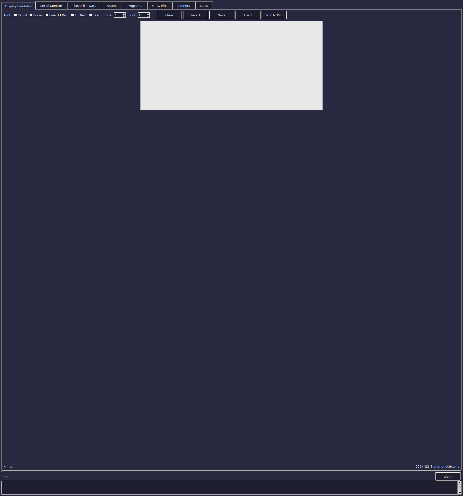

#### Filled Rectangle Tool
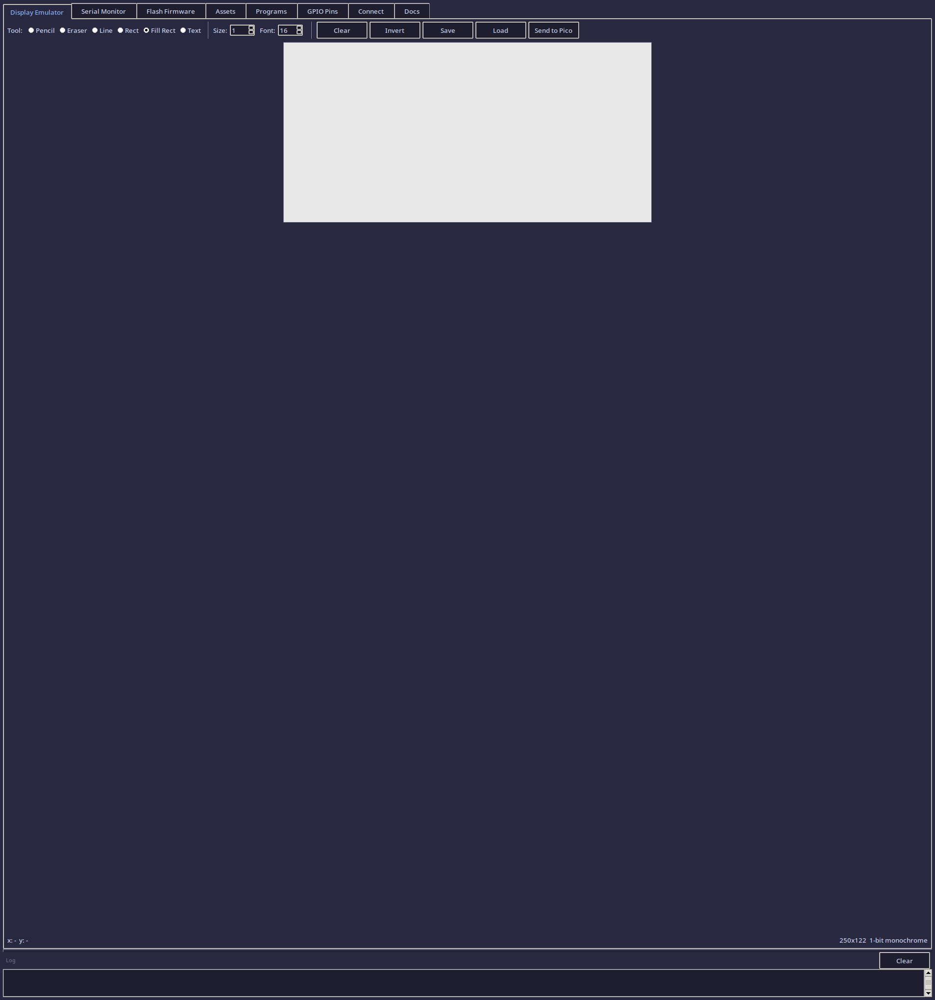

#### Text Tool


### Drawing Demo

Here's an example using the line, rectangle, and filled rectangle tools together:

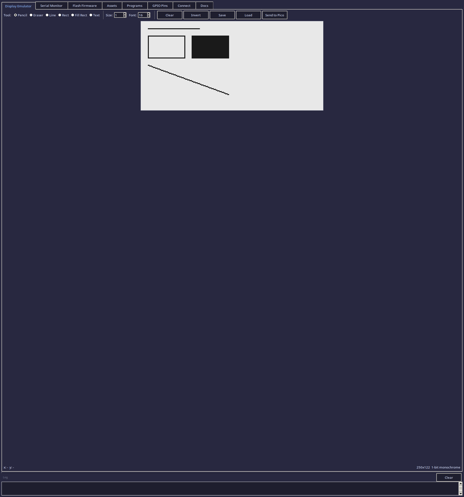

### Invert Function

The invert function flips all pixels — useful for creating white-on-black designs:

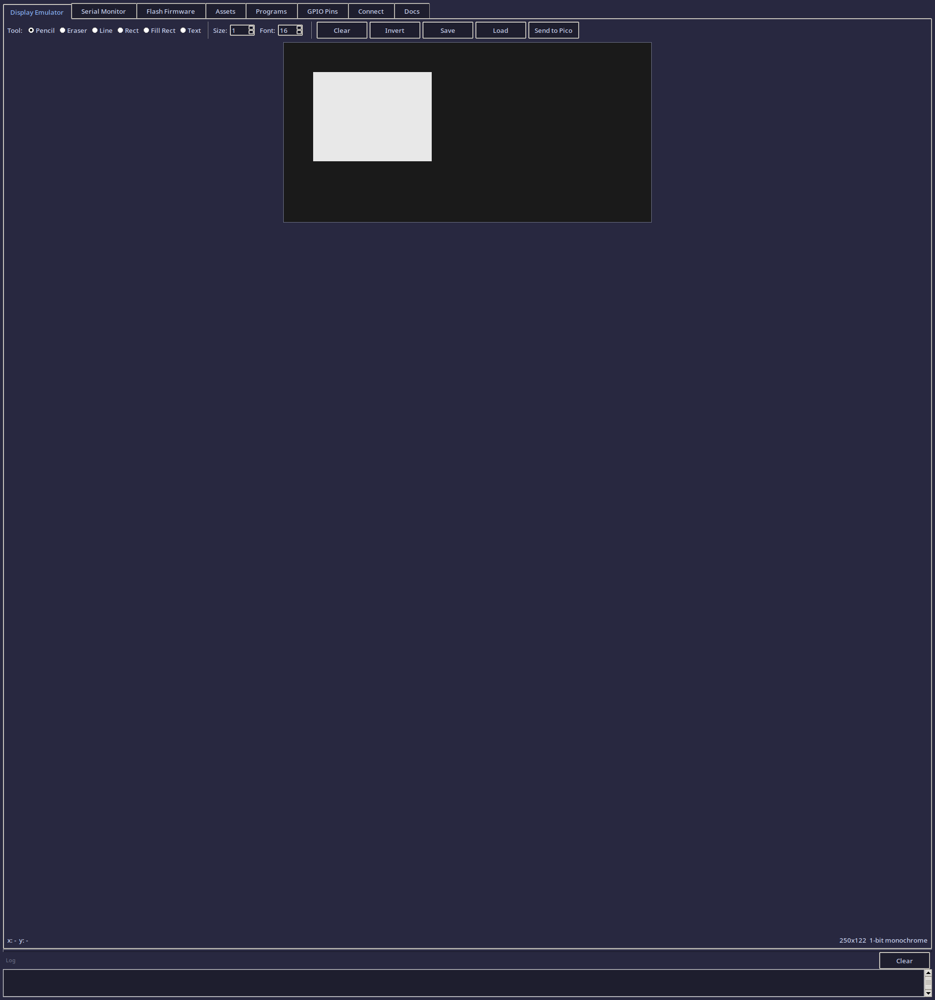

### Text Tool

1. Select **Text** from the toolbar.
2. Set the **Font** size (8–48 px).
3. Click anywhere on the canvas.
4. A dialog appears — type your text and press OK.
5. The text is rasterized into the pixel buffer.

If Pillow is installed, text renders using the DejaVu Sans Mono font at the exact pixel size. Without Pillow, text renders as filled blocks (approximate).

### Saving Images

Click **Save** in the toolbar. Enter a name (no extension). Three files are created in the `assets/` directory:

| File | Format | Purpose |
|------|--------|---------|
| `name.pbm` | PBM binary (P4) | Standard 1-bit image format, viewable in any image viewer |
| `name.bin` | Raw packed bytes | Direct upload format for the Pico W display buffer |
| `name.png` | PNG (if Pillow installed) | Easy to view and share |

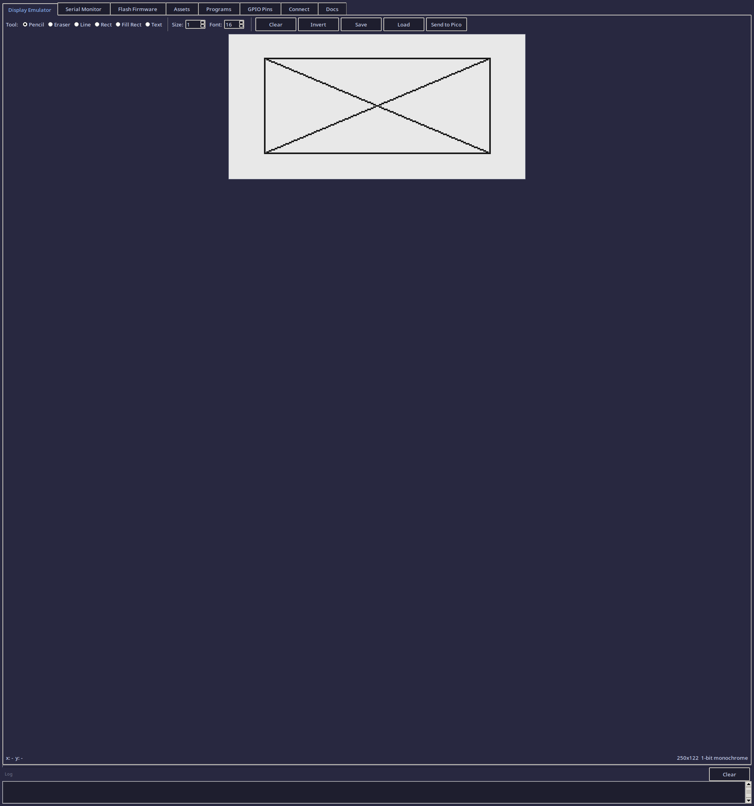

**PBM** is the primary format — it's a standard image format that needs no dependencies to read or write.

**BIN** is the raw display buffer in the same byte layout the Waveshare driver uses: each byte holds 8 horizontal pixels, MSB first, row by row. This can be loaded directly into the display framebuffer in C code.

### Loading Images

Click **Load** to open any `.pbm`, `.bin`, or `.png` file. The image is loaded into the canvas and can be further edited.

### Send to Pico

Click **Send to Pico** to transmit the current canvas image to the Pico W over USB serial. This sends a raw byte stream with an `IMG:` header followed by the width, height, and pixel data.

!!! note
    This requires firmware on the Pico W that listens for the `IMG:` protocol. The hello world examples don't include this — it's for future firmware development.

---

## Tab 2 — Serial Monitor

A full-featured serial terminal for communicating with the Pico W over USB.

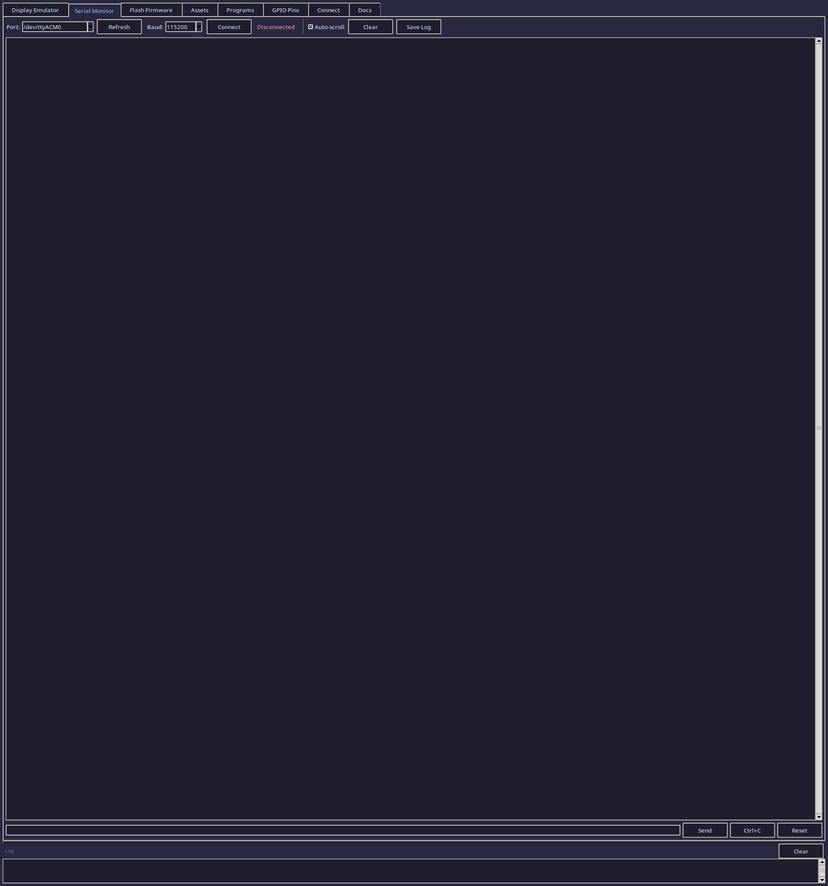

### Connecting

1. The **Port** dropdown auto-detects available serial devices. The Pico W typically appears as `/dev/ttyACM0`.
2. **Baud rate** defaults to 115200 (matching the Pico W's USB serial configuration).
3. Click **Connect** to open the connection.
4. The status indicator turns green when connected.

If no ports appear, click **Refresh**. Make sure the Pico W is plugged in and running firmware (not in BOOTSEL mode).


### Viewing Output

Serial data from the Pico W appears in the output area in real time. This is where you see `printf()` output from your C programs.

- **Auto-scroll** keeps the view at the bottom as new lines arrive. Uncheck to freeze the view for reading.
- **Clear** empties the output area.

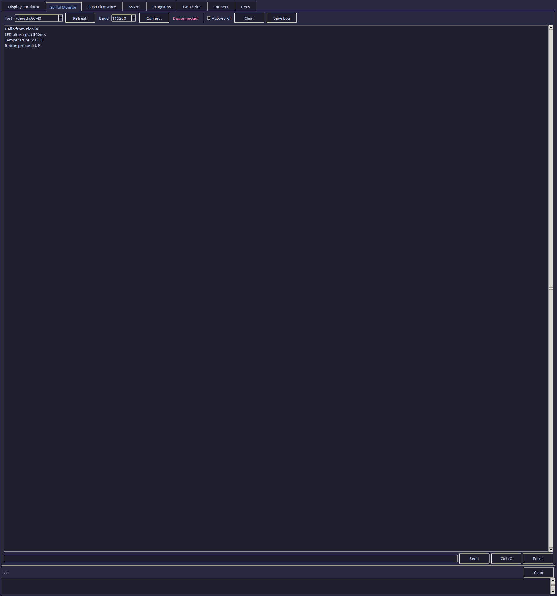

### Sending Commands

Type in the input bar at the bottom and press **Enter** or click **Send**. The text is sent to the Pico W followed by `\r\n`.

Special buttons:

- **Ctrl+C** — sends an interrupt signal (useful for stopping running code)
- **Reset** — sends a soft-reset signal (Ctrl+D)

### Saving Logs

Click **Save Log** to save the entire output history to a text file with a timestamped filename.

---

## Tab 3 — Flash Firmware

A visual interface for flashing `.uf2` firmware files to the Pico W.


### Selecting a UF2 File

- **Browse** — open a file picker to select any `.uf2` file.
- **Quick Flash** buttons — one-click selection of the pre-built hello world programs (if they've been built):
    - **Hello Serial** — `dev-setup/hello-world-serial/build/hello_serial.uf2`
    - **Hello Display** — `dev-setup/hello-world/build/hello_dilder.uf2`

### Flashing

1. Put the Pico W in **BOOTSEL mode** (unplug, hold BOOTSEL, plug in, release).
2. Click **Detect RPI-RP2** — the tool searches for the mounted USB drive.
3. Click **Flash** — the `.uf2` file is copied to the drive.
4. The Pico W reboots automatically.

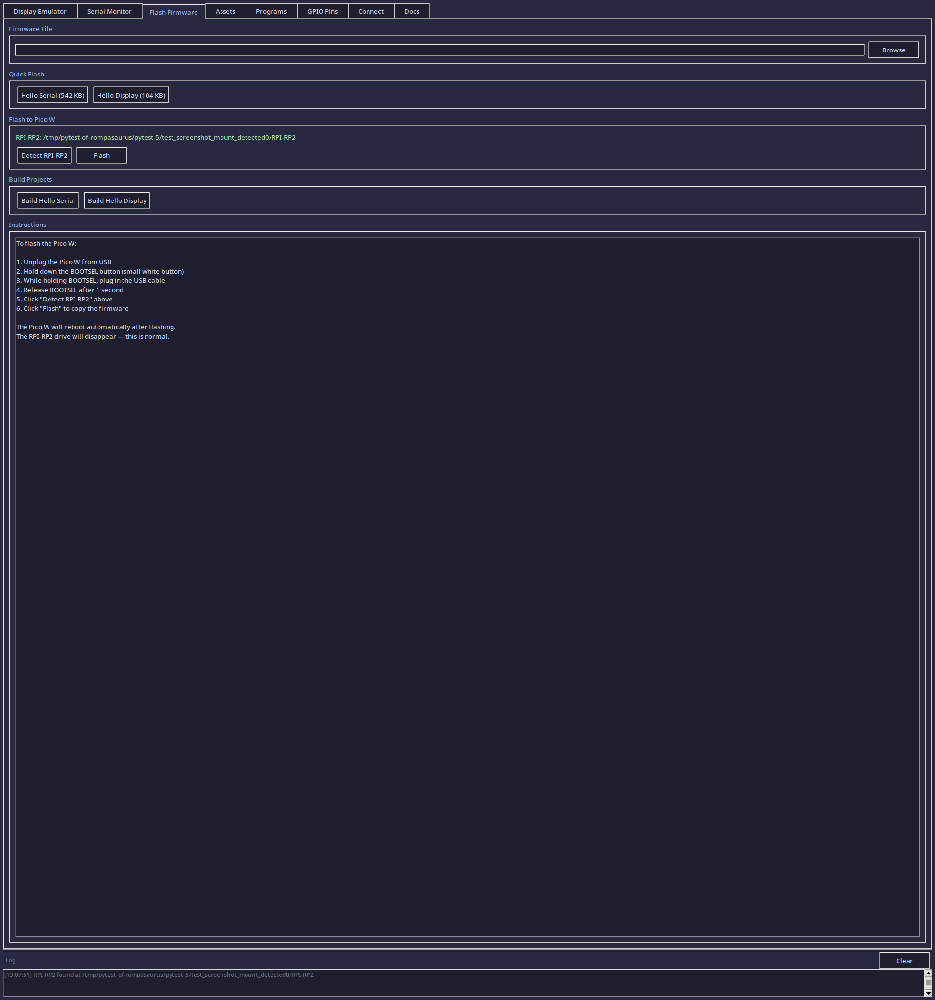

### Building from Source

The **Build Projects** section has buttons to compile each hello world project directly from the DevTool:

- **Build Hello Serial** — runs CMake + Ninja in `dev-setup/hello-world-serial/`
- **Build Hello Display** — runs CMake + Ninja in `dev-setup/hello-world/`

Build output appears in the log bar at the bottom. The buttons handle copying `pico_sdk_import.cmake` and creating the build directory automatically.

---

## Tab 4 — Asset Manager

Browse and manage the 1-bit display images saved in the `assets/` directory.


### Browsing Assets

The file list on the left shows all `.pbm`, `.bin`, and `.png` files in `assets/`. Click **Refresh** to reload the list.

### Previewing

Click any file to see a 2x scaled preview on the right. The preview shows the image as it would appear on the e-ink display.

File info (name, size, dimensions) is shown below the preview.


### Deleting

Select a file and click **Delete** to remove it. A confirmation dialog appears first.

**Open Folder** opens the `assets/` directory in your system file manager.

---

## Tab 5 — Programs

Preview, stream, or permanently deploy animated programs to the Pico W display.


### Program List

Select a program from the list on the left. The preview canvas on the right shows a static frame.

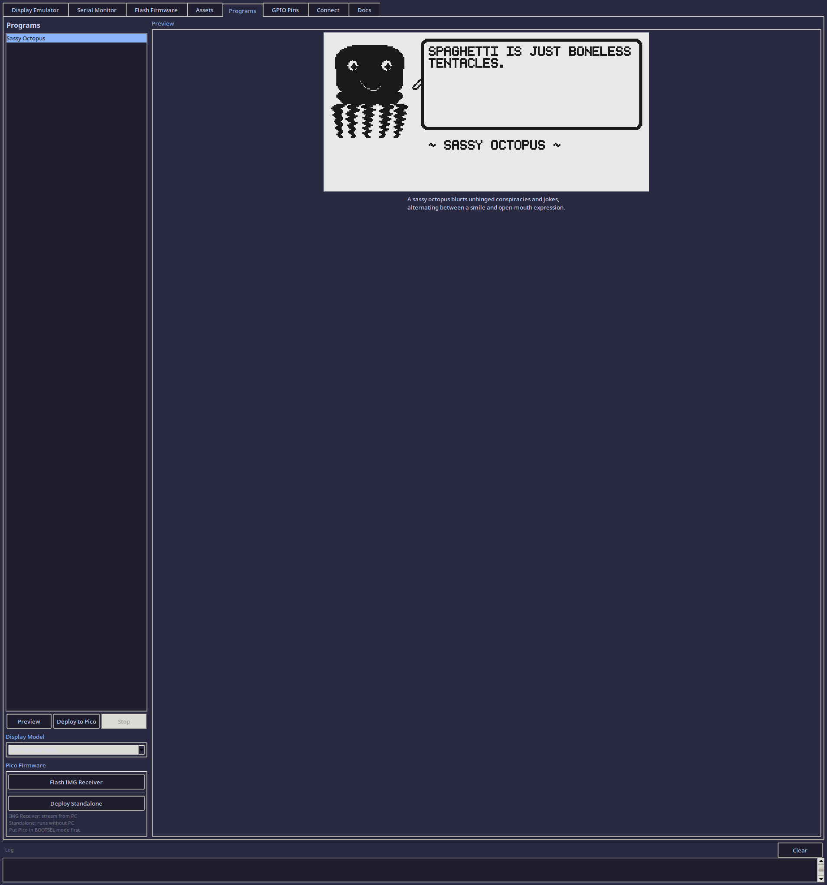

### Previewing

Click **Preview** to run the animation in the emulator. Click **Stop** to halt.


### Deploy to Pico (Streaming)

Click **Deploy to Pico** to stream frames over USB serial. Requires IMG-receiver firmware — use **Flash IMG Receiver** to build and flash it via Docker.

### Deploy Standalone

Click **Deploy Standalone** to bake the animation into standalone firmware:

1. Pre-renders all frames in Python
2. Writes `frames.h` C header with pixel data
3. Builds firmware via Docker ARM cross-compiler
4. Flashes `.uf2` to Pico BOOTSEL mount

After flashing, the Pico runs independently — no PC needed.

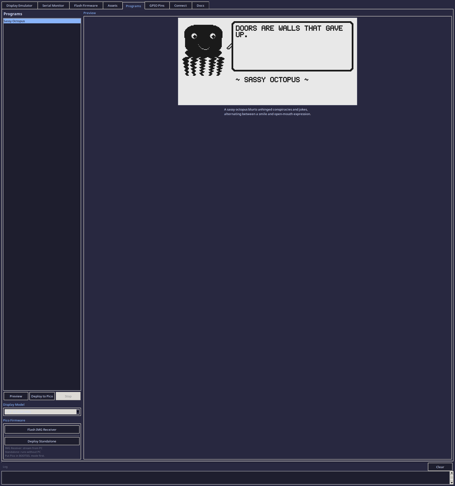

### Sassy Octopus

Built-in program featuring:

- Pixel-art octopus with 3 mouth expressions (smirk, open mouth, big smile)
- 30 random quotes in a speech bubble (conspiracies, jokes, meme statements)
- Built-in 5x7 bitmap font with word wrapping
- Cycles: smirk -> open (new quote) -> smile -> open (new quote)

---

## Tab 6 — GPIO Pin Reference

A read-only visual reference showing the Pico W's 40-pin header with all Dilder project assignments highlighted:

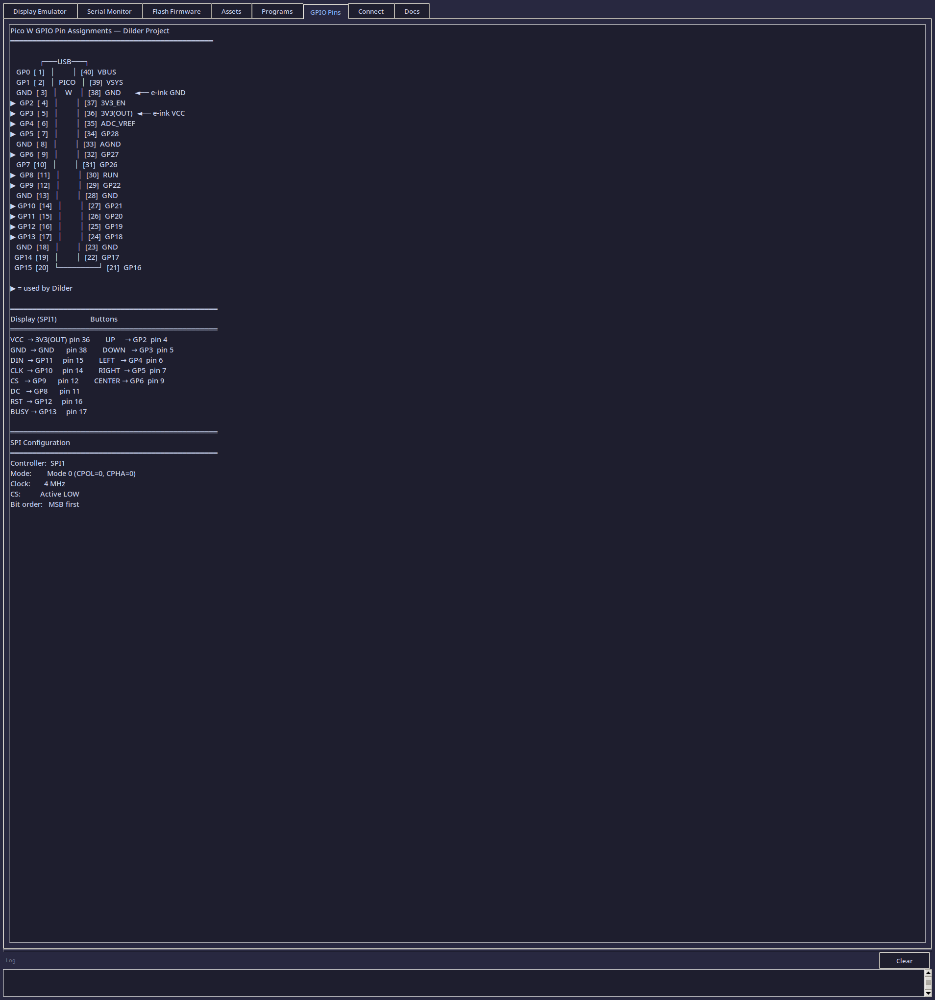

- **Display pins** (SPI1): GP8–GP13
- **Button pins**: GP2–GP6
- **Power**: 3V3(OUT), GND
- **SPI configuration**: Mode 0, 4 MHz, MSB first


This tab is a quick reference so you don't need to switch to the documentation while developing.

---

## Tab 7 — Connection Utility

A guided walkthrough for connecting the Pico W to your computer. Switch between USB Serial and Wi-Fi modes using the radio buttons at the top.

### USB Serial Walkthrough


Four steps, each with a live **Check** button that verifies the current state:

| Step | What it checks |
|------|----------------|
| **Step 1 — Plug in the Pico W** | Runs `lsusb` to detect the Pico W USB device (vendor ID `2e8a`). Confirms the cable is a data cable. |
| **Step 2 — Verify serial port** | Checks if `/dev/ttyACM0` exists. If not, explains why (BOOTSEL mode, charge-only cable, no firmware). |
| **Step 3 — Check permissions** | Verifies your user is in the `uucp` (Arch) or `dialout` (Debian) group. Shows the fix command if not. |
| **Step 4 — Open Serial Monitor** | Links directly to the Serial Monitor tab. One click to switch over and connect. |

Each check button gives a green checkmark, yellow warning, or red error with a specific explanation.


The **"Fix: Add me to serial group"** button auto-detects the correct group, tries `pkexec` for a graphical sudo prompt first, falls back to opening a terminal emulator with the command, and shows a confirmation dialog before running.

### Wi-Fi Walkthrough

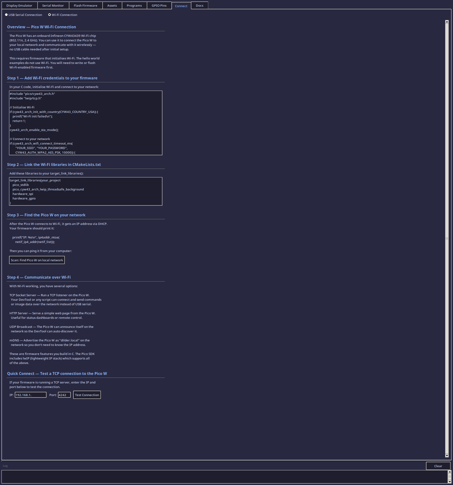

Guides you through adding Wi-Fi support to your Pico W firmware:

| Step | What it covers |
|------|----------------|
| **Overview** | Explains the CYW43439 Wi-Fi chip, 802.11n 2.4 GHz capability. |
| **Step 1 — Add Wi-Fi credentials** | Provides the exact C code to initialise Wi-Fi and connect to a network. Copy-paste ready. |
| **Step 2 — CMake configuration** | Shows which library to link: `pico_cyw43_arch_lwip_threadsafe_background`. |
| **Step 3 — Find Pico on network** | Network scan button that checks the ARP table for reachable devices. Shows how to print the IP from firmware. |
| **Step 4 — Communication options** | Explains TCP sockets, HTTP server, UDP broadcast, and mDNS discovery. |
| **Quick Connect** | Enter an IP and port to test a live TCP connection to the Pico W. Shows success, timeout, or connection refused. |

---

## Tab 8 — Documentation

Built-in searchable documentation for the entire DevTool application.


**Layout:**

- **Left sidebar** — Table of contents. Click any section to jump to it.
- **Right panel** — Full documentation text with syntax-highlighted headings and code blocks.
- **Search bar** — Type a keyword and press Find. All matches are highlighted in yellow. Click Clear to reset.


**Sections covered:**

- Display Emulator (all tools, saving, loading, send to Pico)
- Serial Monitor (connecting, sending, special buttons, log saving)
- Flash Firmware (BOOTSEL steps, build buttons)
- Assets (browse, preview, delete)
- GPIO Pins (pin assignments)
- Connection Utility (USB and Wi-Fi)
- Keyboard Shortcuts
- File Formats (PBM, BIN, PNG with byte layout)
- Troubleshooting (common errors and fixes)

This tab means you never need to leave the DevTool to look up how something works.

---

## File Formats

### PBM (Portable Bitmap — P4 Binary)

Standard 1-bit image format. Header followed by packed binary data.

```
P4
250 122
<binary data: ceil(250/8) * 122 = 3904 bytes>
```

Each byte holds 8 pixels, MSB = leftmost pixel. `1` = black, `0` = white.

### BIN (Raw Display Buffer)

No header — just the raw packed bytes in the same format the Waveshare display driver uses.

- Byte width: `ceil(250/8)` = 32 bytes per row
- Total: 32 x 122 = 3,904 bytes
- Bit order: MSB first within each byte
- `1` = black pixel, `0` = white pixel

To use in C code on the Pico W:

```c
// Load from filesystem or embed as a const array
const uint8_t image_data[3904] = { /* bin file contents */ };
EPD_2in13_V3_Display(image_data);
```

### PNG (Portable Network Graphics)

Standard PNG format, 250x122 pixels, 1-bit depth. Requires Pillow to export. Can be opened in any image viewer or editor.

---

## Architecture Overview

```
DevTool/
    devtool.py          # Single-file application (~3400 lines)
    requirements.txt    # Python dependencies
    README.md           # Full documentation

assets/                 # Saved display images (created automatically)
    *.pbm               # PBM binary 1-bit images
    *.bin               # Raw display buffer bytes
    *.png               # PNG exports (if Pillow available)
```

### Class Structure

| Class | Parent | Purpose |
|-------|--------|---------|
| `DilderDevTool` | `tk.Tk` | Main application window, notebook tabs, log bar, Docker health check |
| `DisplayEmulator` | `ttk.Frame` | E-ink canvas, drawing tools, save/load/send |
| `SerialMonitor` | `ttk.Frame` | Serial connection, read thread, output display |
| `FlashUtility` | `ttk.Frame` | UF2 selection, BOOTSEL detection, flash copy |
| `AssetManager` | `ttk.Frame` | File list, preview canvas, delete/open |
| `ProgramsTab` | `ttk.Frame` | Animated programs, Docker builds, deploy buttons |
| `PinViewer` | `ttk.Frame` | Static GPIO reference text |
| `ConnectionUtility` | `ttk.Frame` | USB/Wi-Fi setup walkthrough with live checks |
| `DocumentationTab` | `ttk.Frame` | Searchable built-in documentation with TOC sidebar |

### Startup Behavior

At launch, the DevTool:

1. Checks for missing dependencies (Tkinter, pyserial) and offers to install them
2. Creates the 8-tab UI with a resizable log bar
3. Runs a background Docker health check (500ms after UI ready) that verifies:
    - Docker binary exists
    - Docker daemon is running
    - docker-compose is available
    - Build files exist (docker-compose.yml, Dockerfile)
    - Shared display library directory exists

Results appear in the log bar as `[startup] Docker toolchain ready.` or with specific issues listed.

### Threading

The serial monitor runs a background daemon thread (`_read_loop`) that continuously reads from the serial port. All UI updates from the thread go through `winfo_toplevel().after(0, callback)` to stay on the Tkinter main thread.

Build operations in the flash utility, Docker image builds, and serial send also run in background threads. All build output is now logged directly without keyword filtering — every line from Docker and Ninja appears in the log bar for full transparency.

---

## Troubleshooting

| Problem | Solution |
|---------|----------|
| `ModuleNotFoundError: No module named 'tkinter'` | Install Tk: `sudo pacman -S tk` (Arch) or `sudo apt install python3-tk` (Debian) |
| `ModuleNotFoundError: No module named 'serial'` | `pip install pyserial` (not `serial` — that's a different package) |
| Text tool renders blocks instead of letters | Install Pillow: `pip install Pillow` |
| Serial monitor can't connect | Check that the Pico W is plugged in and running firmware. Verify with `ls /dev/ttyACM*`. Check serial group membership. |
| No serial ports in dropdown | Click Refresh. If still empty, the Pico W may be in BOOTSEL mode or not connected. |
| Flash button says "not detected" | Put the Pico W in BOOTSEL mode: unplug, hold BOOTSEL, plug in, release. Then click Detect. |
| Build buttons fail | Verify `PICO_SDK_PATH` is set and `arm-none-eabi-gcc` is installed. Run `python3 setup.py --status` to check. |
| Docker builds fail | Check `[startup]` messages in the log bar. Run `python3 setup.py --step 15` to set up Docker. |
| Canvas drawing is slow | The canvas uses individual rectangles per pixel at 3x scale. For large fills, there may be brief lag — this is a Tkinter limitation, not a bug. |
| PNG save/load not working | Install Pillow: `pip install Pillow`. PBM and BIN formats work without it. |
