# Setup CLI — Pico W & Display First-Time Setup

An interactive Python CLI that walks through the entire Pico W development environment setup — from installing the C/C++ ARM toolchain to flashing your first Hello World onto the e-ink display.

> **This project runs entirely in C** — no MicroPython, no CircuitPython. C gives us direct hardware control, deterministic timing, and the full performance of the RP2040's dual Cortex-M0+ cores.

**Target audience:** Someone with the hardware in hand and zero prior embedded development experience.

**Platform:** Linux (Arch/CachyOS — Debian/Ubuntu alternatives noted where they differ).

---

## Usage

```bash
python3 setup.py              # interactive step-by-step walkthrough
python3 setup.py --status     # show current setup state
python3 setup.py --step N     # jump to step N
python3 setup.py --list       # list all steps
python3 setup.py --test-setup # install testing dependencies (tk, pytest, Playwright)
```

No external dependencies required — runs on Python 3.9+ with only the standard library.

### Help Output


### Step List

Use `--list` to see all 15 steps and their completion status:


---

## What Each Step Does

The script walks through 15 steps, split into three checkpoints.

### Checkpoint 1 — Serial Hello World (Steps 1–9)

Verifies your toolchain works end-to-end without any display wiring.

| Step | Name | Automated? | Description |
|------|------|-----------|-------------|
| 1 | Check Prerequisites | Yes | Detects your Linux distro, verifies git, cmake, Python, Tkinter, pyserial |
| 2 | Install ARM Toolchain | Yes | Runs the correct `pacman`/`apt`/`dnf` command for your distro to install `arm-none-eabi-gcc`, cmake, ninja |
| 3 | Clone Pico SDK | Yes | Clones the official `pico-sdk` with submodules to `~/pico/pico-sdk` |
| 4 | Set PICO_SDK_PATH | Yes | Appends `export PICO_SDK_PATH=...` to your `.zshrc` or `.bashrc` |
| 5 | Serial Port Permissions | Yes | Adds your user to the correct serial group (`uucp` on Arch/CachyOS, `dialout` on Debian/Ubuntu) |
| 6 | Install VSCode Extensions | Yes | Installs C/C++, CMake Tools, Serial Monitor, and Cortex-Debug extensions |
| 7 | Build Hello Serial | Yes | Copies SDK helper, runs CMake configure + Ninja build for `hello-world-serial` |
| 8 | Flash Hello Serial | Semi | Guides you through BOOTSEL mode, auto-detects the RPI-RP2 mount, copies the `.uf2` |
| 9 | Verify Serial Output | Manual | Shows how to open a serial monitor, what output to expect, confirms Checkpoint 1 |

### Checkpoint 2 — Display Hello World (Steps 10–14)

Connects the Waveshare display and gets pixels on screen.

| Step | Name | Automated? | Description |
|------|------|-----------|-------------|
| 10 | Connect the Display | Manual | Step-by-step instructions for sliding the Waveshare HAT onto the Pico W headers |
| 11 | Get Waveshare Library | Yes | Clones the Waveshare repo, copies the C driver and font files into the project |
| 12 | Build Hello Display | Yes | CMake configure + Ninja build for `hello-world` (the display version) |
| 13 | Flash Hello Display | Semi | Same BOOTSEL flow, auto-detects mount, copies `hello_dilder.uf2` |
| 14 | Verify Display Output | Manual | Shows expected display text, confirms Checkpoint 2, prints completion banner |

### Checkpoint 3 — Docker Toolchain (Step 15)

Sets up Docker for building standalone firmware from the DevTool.

| Step | Name | Automated? | Description |
|------|------|-----------|-------------|
| 15 | Docker Build Toolchain | Yes | Installs Docker, verifies daemon + compose, pre-builds the ARM cross-compilation container |

---

## Step-by-Step Walkthrough

### Step 1 — Check Prerequisites

Detects your Linux distribution and verifies that all required tools are installed: git, cmake, Python, Tkinter (for DevTool), and pyserial (for serial communication).

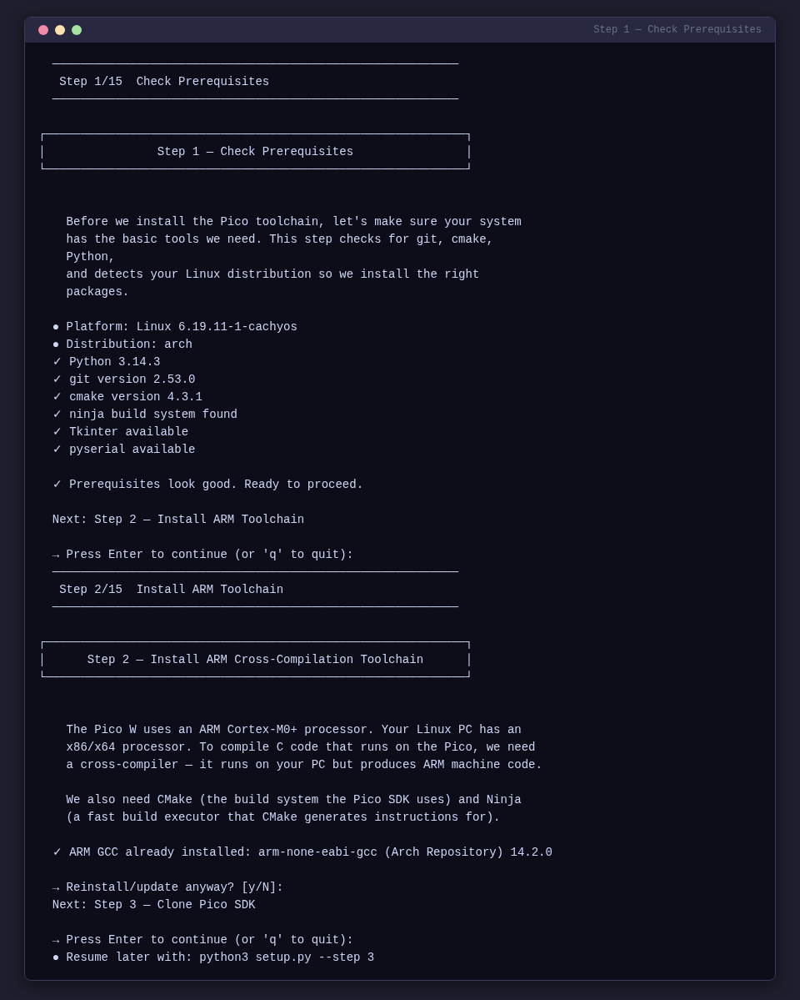

### Step 2 — Install ARM Toolchain

Installs the ARM cross-compiler (`arm-none-eabi-gcc`), CMake, and Ninja build system using your distro's package manager.


### Step 3 — Clone Pico SDK

Downloads the official Raspberry Pi Pico C/C++ SDK with all submodules to `~/pico/pico-sdk`.

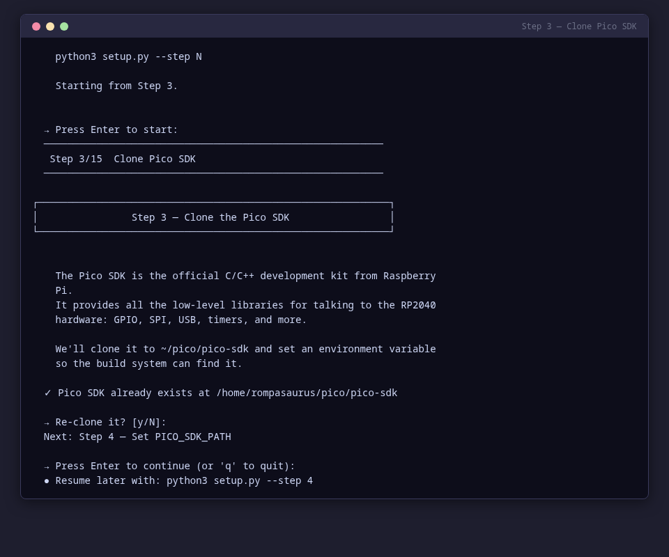

### Step 4 — Set PICO_SDK_PATH

Configures your shell to find the Pico SDK by appending `export PICO_SDK_PATH=...` to your `.zshrc` or `.bashrc`.

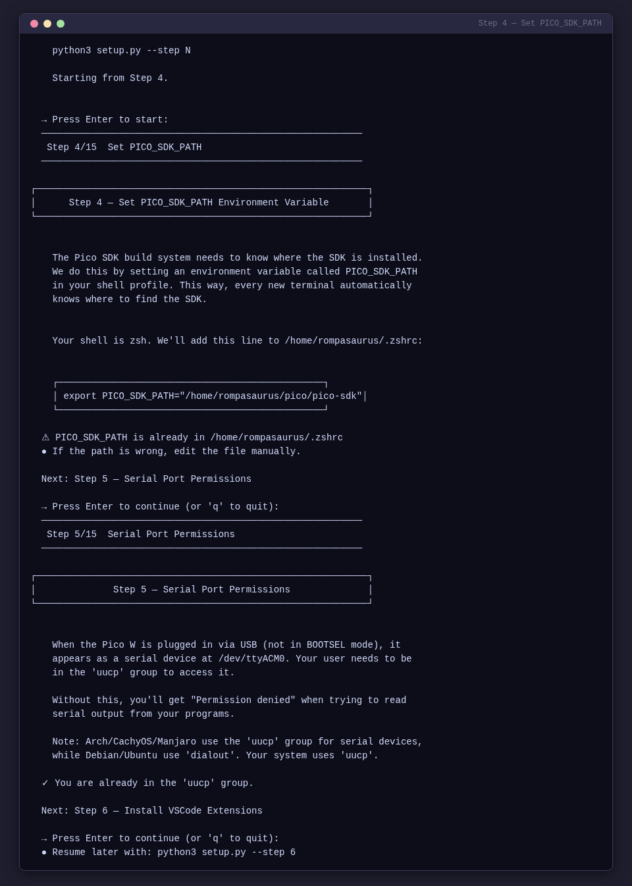

### Step 5 — Serial Port Permissions

Adds your user to the correct serial group (`uucp` on Arch/CachyOS, `dialout` on Debian/Ubuntu) so you can access `/dev/ttyACM0` without sudo.


### Step 6 — Install VSCode Extensions

Installs development extensions for VSCode. Automatically detects Code OSS (Open VSX marketplace) vs proprietary VSCode (Microsoft marketplace) and installs the appropriate extensions.

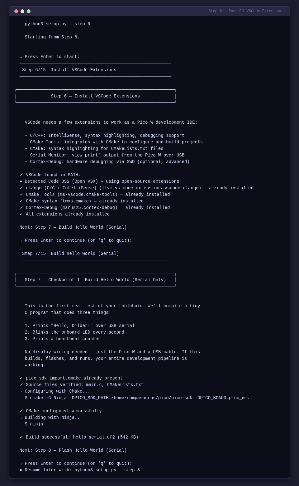

### Step 7 — Build Hello World (Serial)

Compiles the serial-only test firmware. No display wiring needed — this verifies your toolchain end-to-end.


### Step 8 — Flash Hello World (Serial)

Guides you through putting the Pico W in BOOTSEL mode, auto-detects the RPI-RP2 mount point, and copies the `.uf2` firmware file.

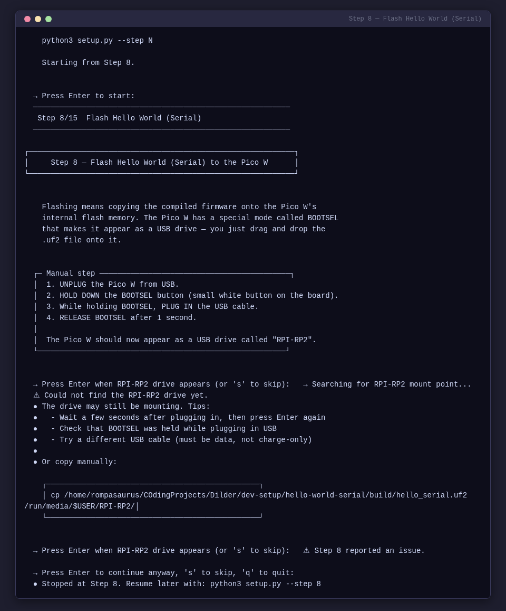

### Step 9 — Verify Serial Output

Opens a serial monitor and shows you what to expect. Confirms Checkpoint 1 is complete.

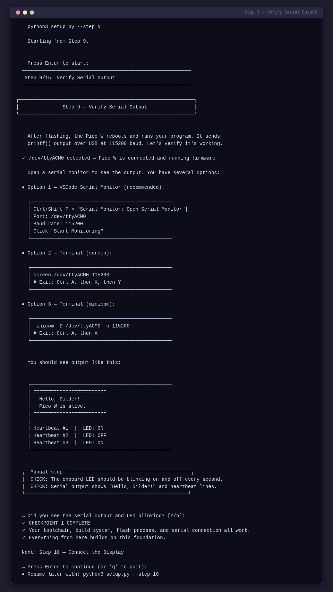

---

!!! success "Checkpoint 1 — Serial Hello World"
    At this point your toolchain, build system, flash workflow, and serial communication are all verified. The Pico W is running your firmware and talking back over USB.

---

### Step 10 — Connect the Display

Step-by-step instructions with ASCII diagrams for sliding the Waveshare e-Paper HAT onto the Pico W headers. Includes alignment guides and pin verification.


### Step 11 — Get Waveshare Library

Downloads the Waveshare C display driver and font files, copies them into the project's shared library directory.

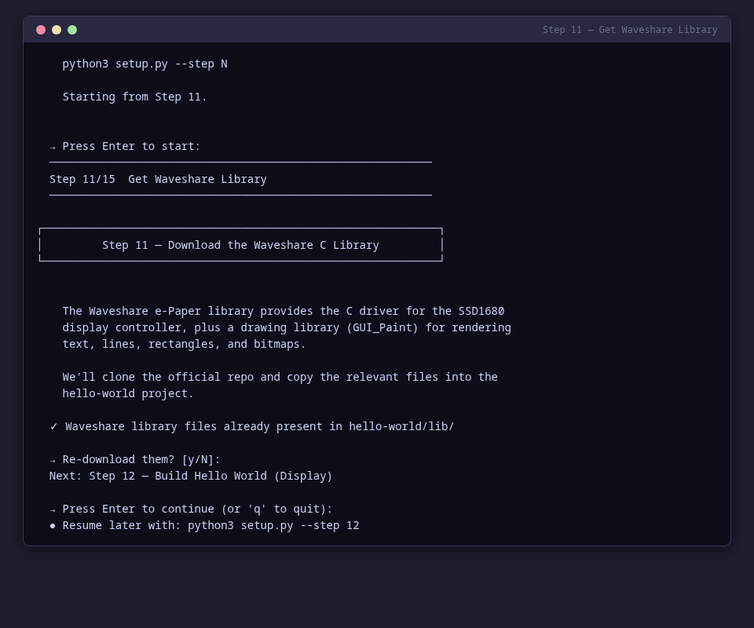

### Step 12 — Build Hello World (Display)

Compiles the display test firmware using CMake + Ninja with the Waveshare library linked in.


### Step 13 — Flash Hello World (Display)

Same BOOTSEL flow as Step 8, but flashes the display firmware (`hello_dilder.uf2`).

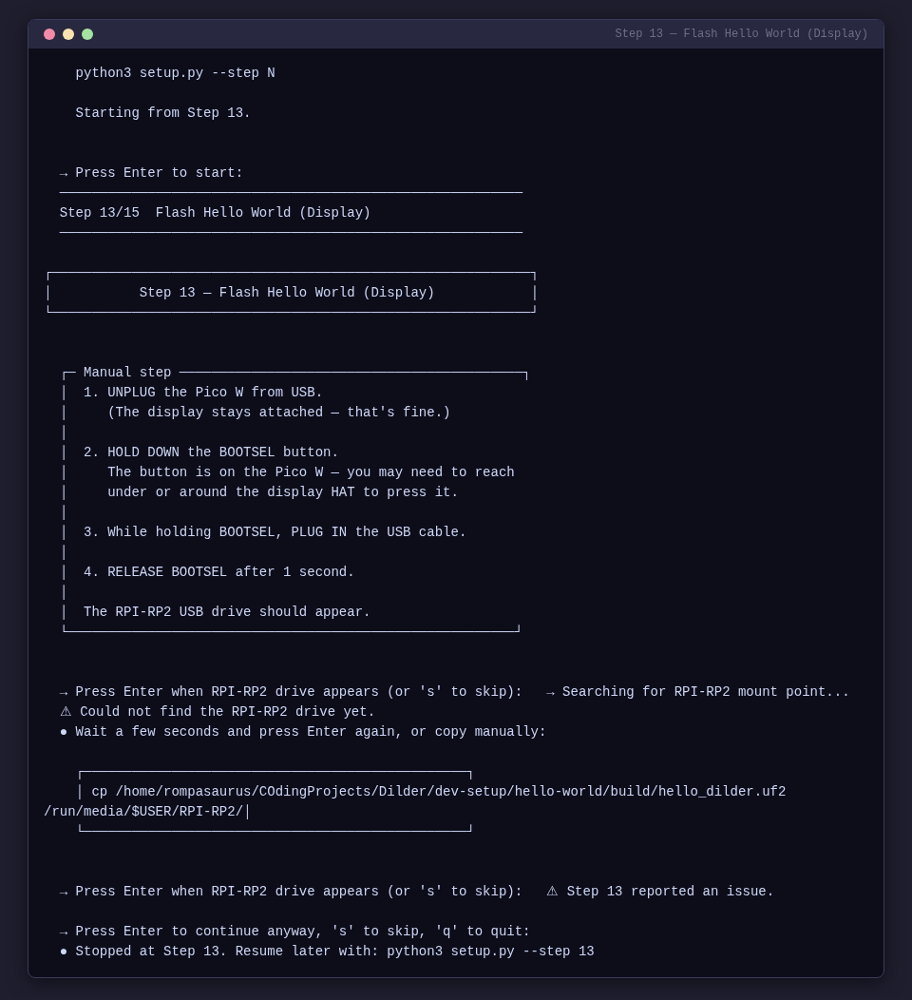

### Step 14 — Verify Display Output

Confirms text appears on the e-ink display. Shows the expected output and prints the Checkpoint 2 completion banner.

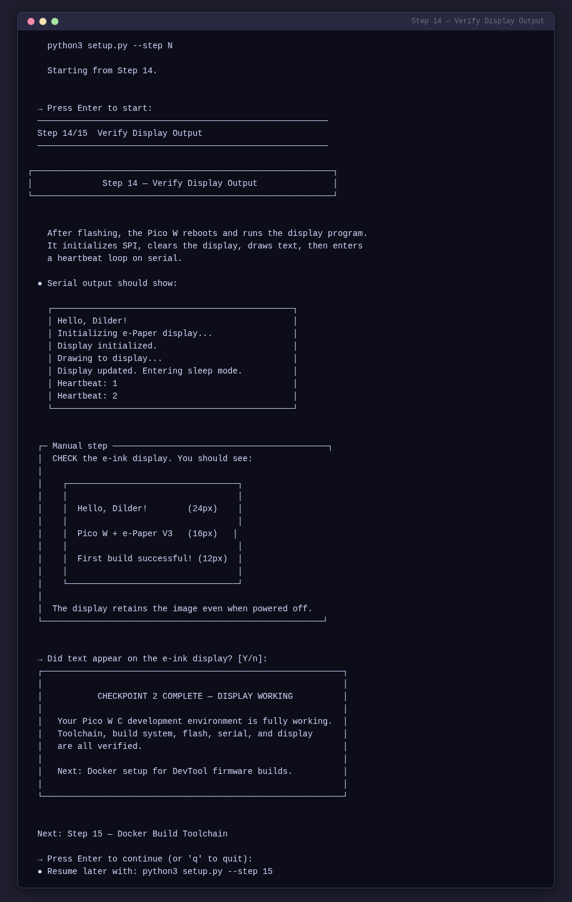

---

!!! success "Checkpoint 2 — Display Working"
    Your Pico W C development environment is fully working. Toolchain, build system, flash, serial, and display are all verified.

---

### Step 15 — Docker Build Toolchain

Installs Docker, verifies the daemon and docker-compose are available, checks for project build files, and pre-builds the ARM cross-compilation container image.

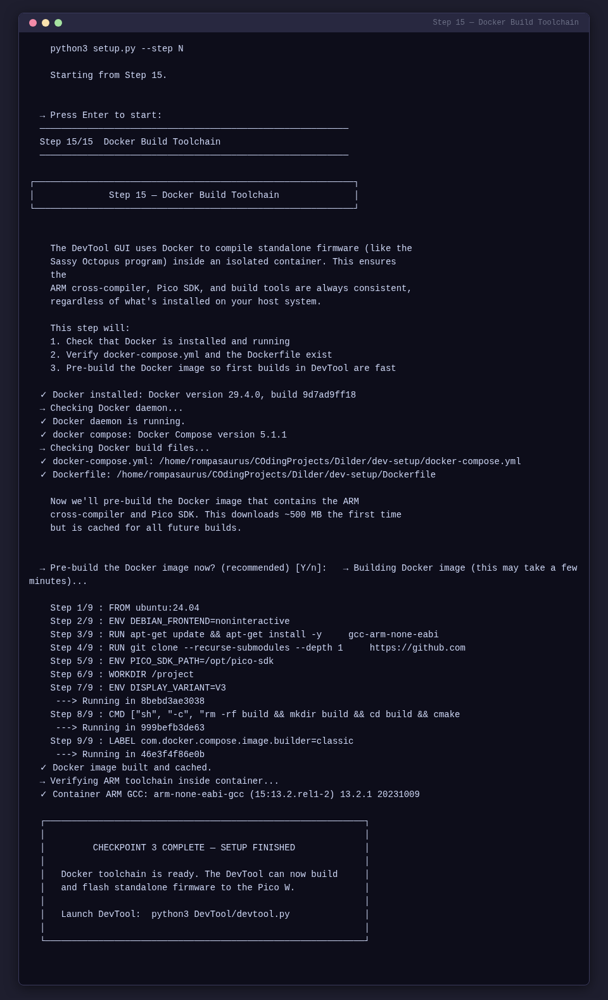

---

!!! success "Checkpoint 3 — Setup Finished"
    Docker toolchain is ready. The DevTool can now build and flash standalone firmware to the Pico W. Launch it with `python3 DevTool/devtool.py`.

---

## Features

- **Distro detection** — automatically detects Arch/CachyOS vs Ubuntu/Debian for package manager commands and serial group names
- **Resume support** — tracks which steps are complete; use `--step N` to jump to any step
- **BOOTSEL detection** — scans for the `RPI-RP2` mount point using `findmnt`/`lsblk` with retry for automount delays
- **Build error reporting** — captures both stdout and stderr from CMake/Ninja for clear error output
- **ANSI terminal UI** — colored output with spinners, boxed explanations, and step-by-step progress indicators
- **Code OSS detection** — detects Code OSS (Open VSX) vs proprietary VSCode and installs the correct extensions
- **Testing setup** — `--test-setup` installs the full test suite dependencies (Tkinter, pytest, Playwright, MkDocs)

---

## Status Dashboard

Run `python3 setup.py --status` to see a snapshot of your entire environment — toolchain, SDK, permissions, VSCode, builds, Docker, and testing framework:

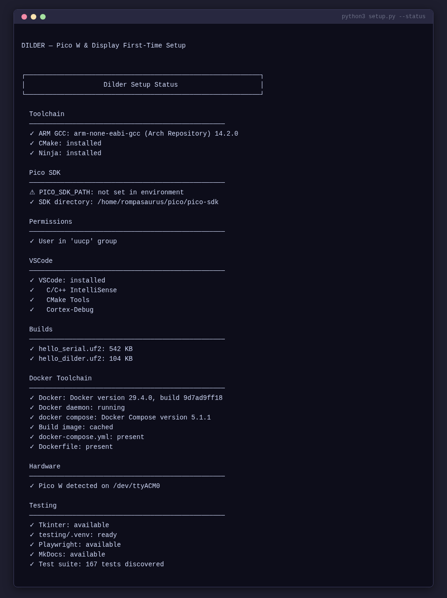

If any step fails, the script explains the issue and lets you retry or skip. You can quit at any time with `q` or `Ctrl+C` and resume later with `--step N`.

---

## Testing Setup

Run `python3 setup.py --test-setup` to install everything needed for the test suite:


This installs:

- **Tkinter** (system package) — for DevTool GUI tests
- **Python venv** with test dependencies — pytest, Playwright, Pillow, pyserial
- **Playwright Chromium** — for website screenshot tests
- **MkDocs Material** — for the documentation site dev server

---

## Hardware Requirements

| Item | Notes |
|------|-------|
| Raspberry Pi Pico W | **With male headers soldered on** |
| Waveshare 2.13" e-Paper HAT V3 | SSD1680 driver — check the PCB silkscreen on the back |
| Micro-USB data cable | **Must be a data cable, not charge-only** — this is the #1 gotcha |
| Linux PC | Arch/CachyOS, Ubuntu, Debian, or Fedora |

!!! warning "No breadboard needed"
    The Waveshare HAT has a female header socket that slides directly onto the Pico W's male header pins. No jumper wires required.

---

## Software Installed by the Script

| Tool | Purpose |
|------|---------|
| `arm-none-eabi-gcc` | ARM cross-compiler for the RP2040 |
| `cmake` + `ninja` | Build system used by the Pico SDK |
| `pico-sdk` | Official Raspberry Pi Pico C/C++ SDK |
| VSCode extensions | C/C++ (or clangd for Code OSS), CMake Tools, Cortex-Debug |
| Docker + compose | Container-based ARM cross-compilation for standalone firmware |

---

## Understanding the Hardware

### The Pico W

- **Chip:** RP2040 — dual-core ARM Cortex-M0+ at 133 MHz
- **RAM:** 264 KB SRAM
- **Flash:** 2 MB onboard QSPI
- **GPIO:** 26 multi-function pins (3.3V logic — **NOT 5V tolerant**)
- **USB:** Micro-USB 1.1 — used for flashing and serial output
- **Wi-Fi:** 802.11n 2.4 GHz (Infineon CYW43439)

### The Waveshare 2.13" e-Paper V3

- **Resolution:** 250 × 122 pixels, black and white
- **Driver IC:** SSD1680
- **Interface:** SPI (4-wire, Mode 0)
- **Refresh:** Full refresh ~2 sec, partial ~0.3 sec
- **Minimum refresh interval:** 180 seconds between operations
- **Standby current:** < 0.01 uA (practically zero)

### Why C Instead of MicroPython

| | C (Pico SDK) | MicroPython |
|---|---|---|
| **Speed** | Native machine code, 133 MHz both cores | Interpreted, ~100× slower for compute |
| **Flash usage** | Your code only | ~700 KB for the interpreter alone |
| **RAM** | Full 264 KB available | ~180 KB after interpreter overhead |
| **Timing** | Deterministic, microsecond precision | GC pauses, non-deterministic |
| **Debugging** | SWD breakpoints, printf, full GDB | REPL print statements only |
| **Libraries** | Pico SDK, direct register access | Limited to what's been ported |

For a real-time pet with animations, input handling, and tight display refresh timing, C is the right choice.

---

## Manual Setup Reference

If you prefer to run each command yourself instead of using the automated script, the full manual guide is available at [`dev-setup/pico-and-display-first-time-setup.md`](https://github.com/rompasaurus/dilder/blob/main/dev-setup/pico-and-display-first-time-setup.md). It covers:

1. Installing the C/C++ SDK toolchain (with distro-specific instructions)
2. Docker build environment (optional)
3. Configuring VSCode for Pico cross-compilation
4. Building and flashing the serial Hello World
5. Connecting the display (header-on-header, pin mapping)
6. Building and flashing the display Hello World
7. Printf debugging and SWD hardware debugging
8. Comprehensive troubleshooting tables

---

## Connecting the Display

The Pico W has **male header pins soldered on**. The Waveshare HAT has a **female header socket** that slides directly onto the Pico W headers.

### Alignment

1. Hold the Pico W with the **USB port facing you**.
2. Hold the Waveshare HAT with its **display face up** and the 40-pin socket facing down.
3. Align **pin 1** on both boards.
4. Press down firmly and evenly until the HAT is fully seated.

```
    Side view (seated correctly):

    ┌─────────────────────────┐  Waveshare HAT (display face up)
    │  ▓▓▓ e-ink display ▓▓▓ │
    ├─────────────────────────┤
    │ female socket ▼▼▼▼▼▼▼▼ │
    ├═════════════════════════┤  <-- flush, no gap
    │ male headers ▲▲▲▲▲▲▲▲  │
    ├─────────────────────────┤
    │    Raspberry Pi Pico W  │
    └────────[USB]────────────┘
```

!!! danger "Disconnect USB first"
    Always disconnect the Pico W from USB before attaching or removing the display. Voltage spikes can damage the e-ink panel.

### Pin Mapping

The HAT routes these signals through its PCB from the 40-pin socket to the display:

| e-Paper Signal | Function | Pico W GPIO | Pico W Pin # |
|---|---|---|---|
| VCC | 3.3V power | 3V3(OUT) | 36 |
| GND | Ground | GND | 38 |
| DIN | SPI MOSI | GP11 (SPI1 TX) | 15 |
| CLK | SPI clock | GP10 (SPI1 SCK) | 14 |
| CS | Chip select | GP9 (SPI1 CSn) | 12 |
| DC | Data/Command | GP8 | 11 |
| RST | Reset | GP12 | 16 |
| BUSY | Busy flag | GP13 | 17 |

---

## Troubleshooting

### Build Issues

| Problem | Solution |
|---------|----------|
| `arm-none-eabi-gcc: command not found` | Toolchain not installed. Re-run Step 2 |
| `PICO_SDK_PATH is not defined` | Set the environment variable (Step 4). Restart your terminal |
| `Could not find pico_sdk_import.cmake` | Copy it from the SDK (done automatically by the script in Step 7) |
| CMake error about missing submodules | Run `cd $PICO_SDK_PATH && git submodule update --init` |

### Flashing Issues

| Problem | Solution |
|---------|----------|
| RPI-RP2 drive doesn't appear | Hold BOOTSEL **before** plugging in USB. Try a different cable — **charge-only cables won't work** |
| Drive appears but copy fails | Try `picotool load` instead. Check if the `.uf2` file is 0 bytes (build failed) |

### Serial Issues

| Problem | Solution |
|---------|----------|
| `/dev/ttyACM0` doesn't exist | Pico not connected, charge-only cable, or firmware crashed before USB init |
| Permission denied on `/dev/ttyACM0` | Add yourself to the serial group — `uucp` on Arch, `dialout` on Debian (Step 5), then **log out and back in** |
| Serial monitor shows nothing | Baud rate must be 115200. Check that `stdio_init_all()` is in your code |

### Display Issues

| Problem | Solution |
|---------|----------|
| Display completely blank | Check VCC is on 3V3(OUT) pin 36, not VBUS pin 40 |
| Display flickers then goes blank | RST or BUSY wires swapped. Compare against the pin mapping table |
| Garbage/random pixels | Wrong driver version — confirm V3 on PCB silkscreen |
| `BUSY` pin always high | Display stuck mid-refresh. Disconnect power, wait 10 sec, reconnect, run Clear |

---

## Quick Reference Card

| Action | Command |
|--------|---------|
| Build (serial) | `cd dev-setup/hello-world-serial/build && ninja` |
| Build (display) | `cd dev-setup/hello-world/build && ninja` |
| Flash | Hold BOOTSEL + plug USB, then `cp build/<name>.uf2 /run/media/$USER/RPI-RP2/` |
| Flash (picotool) | `picotool load build/<name>.uf2 && picotool reboot` |
| Serial monitor | `screen /dev/ttyACM0 115200` |
| Serial monitor (VSCode) | `Ctrl+Shift+P` > "Serial Monitor: Open Serial Monitor" |
| Clean rebuild | `rm -rf build && mkdir build && cd build && cmake -G Ninja -DPICO_SDK_PATH=$PICO_SDK_PATH -DPICO_BOARD=pico_w .. && ninja` |
| Build with Docker | `cd dev-setup && docker compose run --rm build` |
