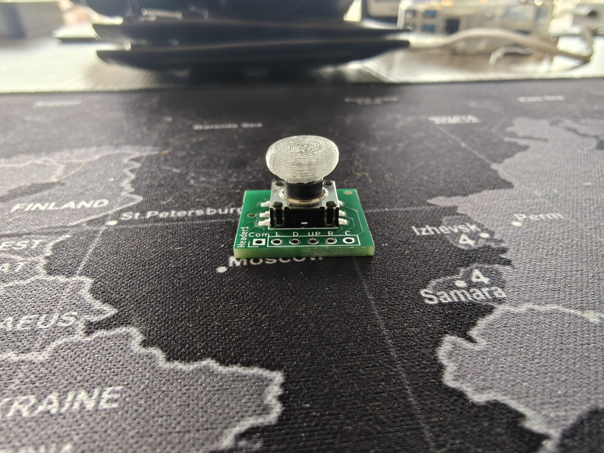
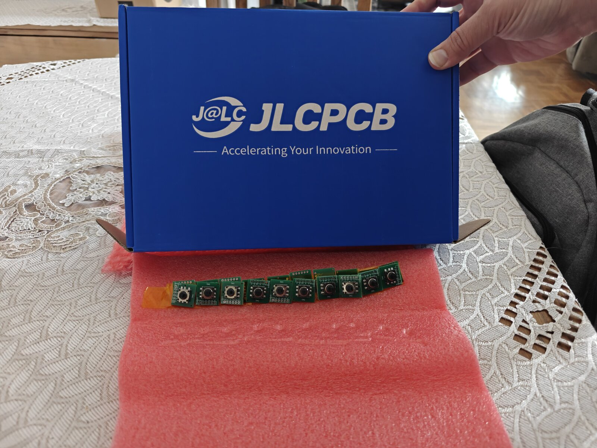
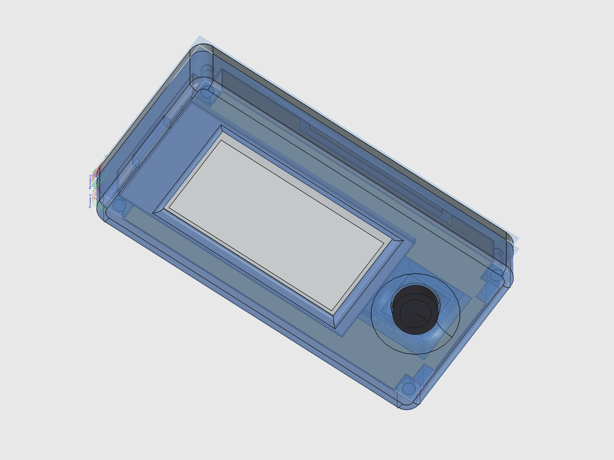
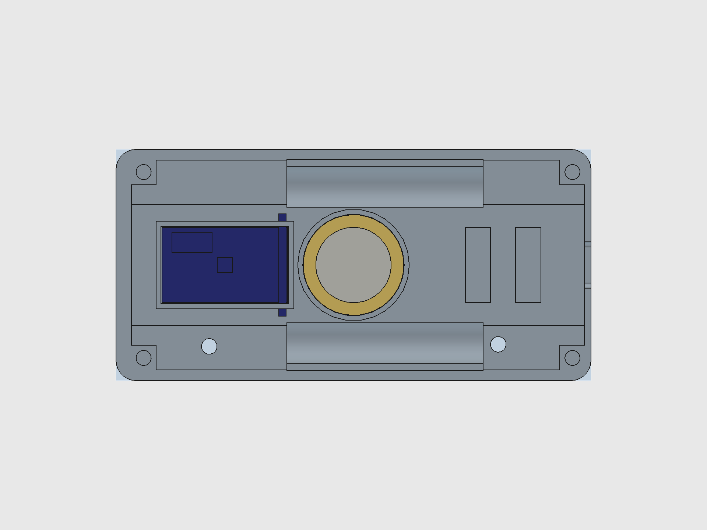

# Dilder

**A real-time build journal for an open-source AI-assisted virtual pet.**

Dilder is a Tamagotchi-style device built on a Raspberry Pi Pico W, a Waveshare 2.13" e-ink display, and a 3D-printed case — developed entirely in the open, one phase at a time.

---

## The Origin Story — How Jamal Was Found

<figure markdown="span">
  { width="420" loading=lazy }
  <figcaption>Jamal. Chair thief. Hat enthusiast. The one who started it all.</figcaption>
</figure>

It started with a trip to TEDi — a German dollar store where the shelves are chaos and the deals are questionable. My wife Emma and I were browsing the bins, not looking for anything in particular, when we spotted him: a massive plush octopus, soft as a cloud, grinning up at us from a pile of discount stuffed animals like he'd been waiting.

We bought him. Obviously.

On the walk home, something happened. We started talking *to* him. Then *about* him — as if he had opinions, preferences, a whole inner life. By the time we got back to the apartment, he had a name: **Jamal**. He had a personality: laid-back but opinionated, a little sassy, suspiciously wise for a creature with no skeleton. He claimed the armchair immediately. He looked... comfortable. *Too* comfortable. Like he'd always lived there and we were the guests.

And then the question asked itself:

> *What if we could actually bring him to life?*

Not literally — we're not mad scientists (yet). But what if we could build a tiny digital version of Jamal? A pocket-sized octopus with moods, opinions, and an attitude problem? Something that lives on a screen, reacts to the world, and roasts you when you forget to feed it?

That's how Dilder was born. Not from a grand engineering vision or a product roadmap — from a plush octopus in a discount bin and two people who couldn't stop giving him a backstory on the walk home.

Jamal still sits in the armchair. He still wears the hat. He watches us build his digital self from across the room, and honestly? He looks unimpressed. Which tracks.

---

## The Current Build — Mk2 Translucent Prototype

The latest revision: printed in **natural/clear PETG** so every internal component is visible through the case walls. Running the Conspiratorial Octopus personality on battery power.

<figure markdown="span">
  { width="420" loading=lazy }
  <figcaption>"THE PYRAMIDS WERE BUILT BY CATS. EGYPTIANS JUST TOOK CREDIT." — e-ink perfectly readable in sunlight</figcaption>
</figure>

<figure markdown="span">
  { width="420" loading=lazy }
  <figcaption>"THE MOON LANDING WAS REAL BUT THE MOON IS FAKE." — front view, display sharp, joystick dome on right</figcaption>
</figure>

<figure markdown="span">
  { width="420" loading=lazy }
  <figcaption>"DEJA VU IS THE SIMULATION BUFFERING." — translucent walls reveal battery, board, and wiring</figcaption>
</figure>

<figure markdown="span">
  { width="420" loading=lazy }
  <figcaption>Back view — TP4056, 10440 battery, and piezo speaker ring all visible through the case</figcaption>
</figure>

<figure markdown="span">
  { width="420" loading=lazy }
  <figcaption>Joystick breakout PCB from JLCPCB — K1-1506SN-01 switch with 3D-printed thumbpiece snap cap</figcaption>
</figure>

<figure markdown="span">
  { width="420" loading=lazy }
  <figcaption>JLCPCB delivery — full panel of hand-routed joystick breakout boards, switches pre-mounted</figcaption>
</figure>

<figure markdown="span">
  { width="420" loading=lazy }
  <figcaption>NoSolar variant (black PLA) — same internals, different look</figcaption>
</figure>

<figure markdown="span">
  { width="420" loading=lazy }
  <figcaption>NoSolar internals — Pico W, 10440 battery, TP4056 charger (red LED = charging)</figcaption>
</figure>

[Read the full Mk2 build post :material-arrow-right:](blog/posts/mk2-translucent-prototype-running.md){ .md-button }

[View the design evolution timeline :material-arrow-right:](docs/hardware/design-evolution.md){ .md-button }

[See the progress report :material-arrow-right:](docs/progress.md){ .md-button }

---

## Latest Prototype — Sensors, Speaker, and Joystick Anchor

The parametric FreeCAD macro gained three new systems: a **20 mm piezo speaker** in a circular retaining ring, an **MPU-6500 6-axis accelerometer** in a recessed pocket, and a precision **joystick anchor pad** that replaces the old well/sleeve design. The joystick PCB alignment was fixed (stick now dead-center in the hole), and the cradle pit tightened from 23 mm to 20 mm for a snug board fit.

<figure markdown="span">
  { width="420" loading=lazy }
  <figcaption>Hero shot — full assembly with all components visible through the translucent cover</figcaption>
</figure>

<figure markdown="span">
  { width="420" loading=lazy }
  <figcaption>3/4 angle — joystick thumbpiece and display window on the bullnose dome</figcaption>
</figure>

<figure markdown="span">
  { width="420" loading=lazy }
  <figcaption>Exploded view — base plate, cradle with batteries, cover with anchor pad, and thumbpiece</figcaption>
</figure>

<figure markdown="span">
  { width="420" loading=lazy }
  <figcaption>Assembled (opaque cover) — the finished device with display window and joystick</figcaption>
</figure>

<figure markdown="span">
  { width="420" loading=lazy }
  <figcaption>Cover removed — cradle with batteries, Pico board, TP4056 charger, and joystick PCB</figcaption>
</figure>

<figure markdown="span">
  { width="420" loading=lazy }
  <figcaption>Base plate — piezo speaker ring (center) and IMU pocket (left) between battery rails</figcaption>
</figure>

[Read the full build write-up :material-arrow-right:](blog/posts/joystick-anchor-piezo-imu-sensors.md){ .md-button }

[View the complete design breakdown :material-arrow-right:](docs/hardware/freecad-mk2-design.md){ .md-button }

---

## Dilder Encounters, Riddle Hunts & Collectibles

The Dilder isn't just a desk pet — it's a device that comes alive when it meets other Dilders in the real world.

### Proximity Encounters

Every Dilder broadcasts a BLE beacon. When two devices come within range (~10-30m), both react automatically — a **unique 3-note chime** plays through the piezo speaker, the e-ink display shows the other pet's name and personality, and both players earn XP and collectibles. No buttons to press. The chime is generated from the device's unique ID, so every Dilder sounds different — and you play *the other one's* chime, not your own.

### Riddle Hunts — Geocaching with Physical Prizes

The device presents riddles hinting at real-world locations where **physical electronic prizes** are hidden in waterproof capsules:

> *"Where iron horses once drank and the clock tower still watches, look beneath the bench that faces west."*

Find the capsule, tap the NFC tag against your Dilder, and collect both a **digital unlock** (cosmetics, sounds, lore fragments) and a **physical electronic component** — anything from an LED pack to a full sensor breakout board. Legendary capsules might contain an actual Pico W or a pre-assembled Dilder unit.

Community members become **Cache Keepers** — writing their own riddles, hiding capsules, and maintaining caches worldwide.

### The Network Effect

More Dilders = more encounters = more fun. The chime creates curiosity in public. Bystanders ask what the device is. Every encounter is a natural demonstration — and the device is free to build from GitHub or available as a kit on Patreon.

[Read the full design doc :material-arrow-right:](blog/posts/encounters-geocaching-collectibles.md){ .md-button }

---

## Meet the Octopus

A tiny octopus lives on a 250x122 pixel e-ink display. It has **16 emotional states**, each with unique eyes, mouth expressions, body animations, and themed quotes. It's sassy. It's opinionated. It runs on 100KB of firmware and a coin cell's worth of ambition.

Pick a personality, flash it to the board, and you've got a desk companion that judges your life choices in ALL CAPS.

---

## The Hardware

Three supported boards. Same firmware. Under $25 to get started.

| Component | Price | Why |
|-----------|-------|-----|
| Raspberry Pi Pico 2 W | ~$7 | 4MB flash, WiFi + BLE, RP2350 dual Cortex-M33, current default |
| Raspberry Pi Pico W | ~$6 | 2MB flash, WiFi + BLE, RP2040, original dev board |
| Waveshare 2.13" e-Paper V3 | ~$15 | 250x122px, paper-like readability, near-zero standby current |
| 3D-printed enclosure | ~$2 filament | Two-piece snap-fit case, SCAD source files included |

---

## 16 Emotions, One Octopus

Every mood changes the face, the body, and the attitude.

{ width="220" }
{ width="220" }
{ width="220" }

{ width="220" }
{ width="220" }
{ width="220" }

Normal. Angry. Sad. Excited. Lazy (tentacles draped to the right, naturally). Fat (thicc dome, no waist, proud of it). Plus Weird, Unhinged, Chaotic, Hungry, Tired, Slap Happy, Chill, Creepy, Nostalgic, and Homesick.

Each personality has 30-196 themed quotes, a 4-frame mouth animation cycle, and per-mood body movement — breathing bobs, angry trembles, chaotic distortion, lazy lounging.

[See all 16 emotion states :material-arrow-right:](docs/software/emotion-states.md){ .md-button }

---

## The DevTool

A custom Tkinter GUI for designing, previewing, and deploying octopus firmware — without touching a terminal.

<figure markdown="span">
  { width="700" loading=lazy }
  <figcaption>Programs tab — pick a personality, preview it, flash it to the Pico</figcaption>
</figure>

**7 tabs:** Display Emulator (pixel art tools) | Serial Monitor | Flash Firmware | Asset Manager | Programs (17 octopus personalities) | GPIO Pin Reference | Connection Utility

Select a program and you get a live preview, estimated firmware size (~100KB), how much of the Pico's 2MB flash you'll use (~5%), and one-click deploy.

[DevTool docs :material-arrow-right:](docs/tools/devtool.md){ .md-button }

---

## First PCB from Scratch — Joystick Breakout Board

Before the Dilder, the closest I'd come to PCB design was staring at someone else's Gerber files and thinking "that looks complicated." This board changed that.

The joystick needed a breakout board — the K1-1506SN-01 5-way switch is a tiny surface-mount component with six pins spaced 1.27 mm apart. You can't hand-solder wires to that. So instead of buying a pre-made breakout (they don't exist for this switch), I designed one from scratch in KiCad 10.

<figure markdown="span">
  { width="420" loading=lazy }
  <figcaption>The schematic — five direction pins (Up, Down, Left, Right, Push) plus a common ground, all routed through the switch to header pads</figcaption>
</figure>

<figure markdown="span">
  { width="420" loading=lazy }
  <figcaption>The PCB layout — every trace hand-routed on a 19.6 x 19.6 mm board. No autorouter, no templates, just dragging copper one track at a time</figcaption>
</figure>

### What's on the board

The switch sits in the center. Six pads radiate out to header holes along one edge — 2.54 mm pitch so you can solder standard pin headers and plug it straight into a breadboard or the Dilder's cradle pit. The whole thing is smaller than a postage stamp.

The routing was the fun part. KiCad shows you the "ratsnest" — a web of thin lines showing which pads need to connect — and you trace actual copper paths between them. It's like a puzzle where the pieces are wires and the constraint is "don't let them cross." Six signals on a single-layer board means some creative curving, but the K1-1506SN-01 has a clean enough pinout that everything routes without vias.

<figure markdown="span">
  { width="420" loading=lazy }
  <figcaption>KiCad's 3D viewer — the finished board with the switch model placed. You can see the gold traces, the header pads, and the silkscreen labels</figcaption>
</figure>

<figure markdown="span">
  { width="420" loading=lazy }
  <figcaption>The full workspace — schematic, layout, and 3D preview side by side during the design session</figcaption>
</figure>

### From screen to factory

The board went from KiCad to JLCPCB-ready in one session. Gerbers exported, BOM generated, pick-and-place file formatted. Five boards for a few dollars, shipped from Shenzhen. The switch gets placed by machine — I just solder the header pins when they arrive.

The STEP model of the finished board is imported directly into the FreeCAD assembly, where it sits in the cradle's 20 x 20 mm joystick pit with the switch body poking up through the cover's anchor pad into the thumbpiece.

<figure markdown="span">
  { width="400" loading=lazy }
  <figcaption>The board as it appears in the 3D model — imported from the KiCad STEP export, positioned in the cradle pit</figcaption>
</figure>

[Joystick wiring guide :material-arrow-right:](docs/hardware/joystick-wiring.md){ .md-button }

---

## Current Phase

!!! info "Phase 2 — Firmware Foundation (C on Pico W)"
    Phase 1 (hardware + tooling) is complete. The unit is **fully soldered and battery-powered** — running off a 10440 Li-ion cell with USB-C charging via TP4056 confirmed working. Two enclosure variants available: **Solar** (with AK 62x36mm panel) and **NoSolar** (slimmer, USB-only).

    **Done:** Runtime rendering engine | 16 emotions | Body animations | Custom fat/lazy bodies | 823 quotes | C-faithful preview renderer | DevTool with firmware size estimation | **GPIO joystick input** | On-screen input indicator | **Soldered unit** | **Battery power** | **USB-C charging** | **NoSolar variant** | **Mk2 translucent case** | **Joystick PCB from JLCPCB** | **V4 display driver (two-pass partial refresh)** | **Firmware version system (v0.5.4)** | **KiCad pin swap fix**

    **In Progress:** V4 partial refresh tuning (blacks slightly washed vs V3). Custom PCB design — **ESP32-S3-WROOM-1-N16R8** (WiFi+BLE, 16MB flash, 8MB PSRAM), 4-layer board in KiCad. **Full Board** all-in-one PCB design.

    **Next:** Swap COM/UP wires and test all 5 joystick directions | Wire up piezo speaker | Implement menu system | Order corrected Rev 2 joystick PCB | Battery life benchmarks

---

## Quick Links

-   :material-book-open-variant: **Docs**

    ---

    Hardware specs, wiring diagrams, setup guides, and code reference.

    [:octicons-arrow-right-24: Browse Docs](docs/index.md)

-   :material-post: **Blog**

    ---

    Build journal posts — from planning to a soldered, battery-powered unit.

    [:octicons-arrow-right-24: Read the Blog](blog/index.md)

-   :fontawesome-brands-discord: **Discord**

    ---

    Join the community server to ask questions and share your own build.

    [:octicons-arrow-right-24: Join Discord](community/discord.md)

-   :material-tools: **Dev Tools**

    ---

    DevTool GUI, setup CLI, and website dev CLI — built to support the workflow.

    [:octicons-arrow-right-24: Browse Tools](docs/tools/devtool.md)

-   :fontawesome-brands-patreon: **Patreon**

    ---

    Support the project and get early access to content and files.

    [:octicons-arrow-right-24: Support on Patreon](community/support.md)

-   :fontawesome-brands-github: **Source**

    ---

    All firmware, tools, and docs. 270+ AI prompts logged.

    [:octicons-arrow-right-24: GitHub Repo](https://github.com/rompasaurus/dilder)

---

## How This Project Works

The entire development process is public:

- **Every prompt** submitted to the AI assistant is logged in the [Prompt Log](prompts/index.md) — 270+ and counting
- **Every hardware decision** is documented in the [Docs](docs/index.md)
- **Every build step** is written up in the [Blog](blog/index.md)
- **Every drawing function** is verified pixel-by-pixel between C firmware and Python DevTool
- **All source files** are on [GitHub](https://github.com/rompasaurus/dilder)

This is learn-in-public taken to its logical extreme. No hidden steps, no "just trust me" — if it happened, it's documented.

---

Built with patience, a Pico W, and an unreasonable fondness for a plush octopus named Jamal.

