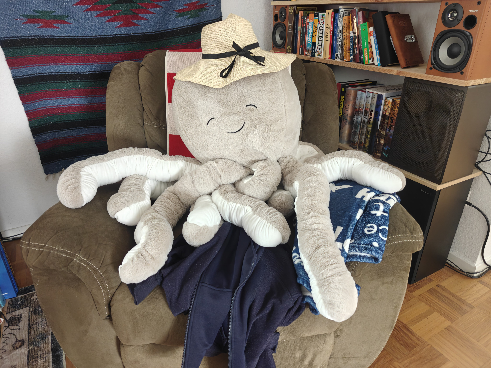
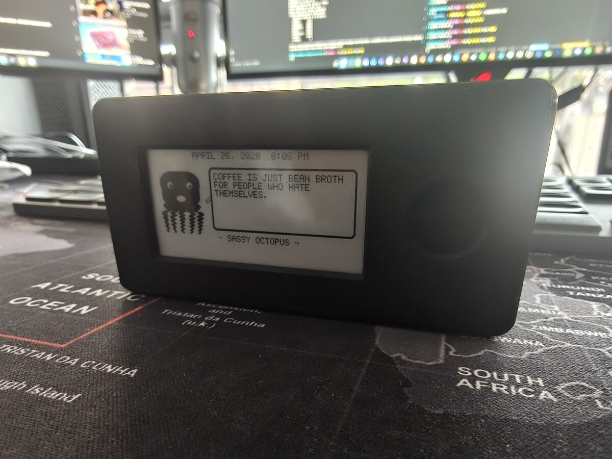
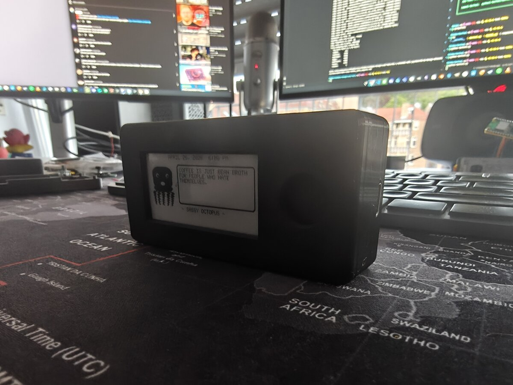
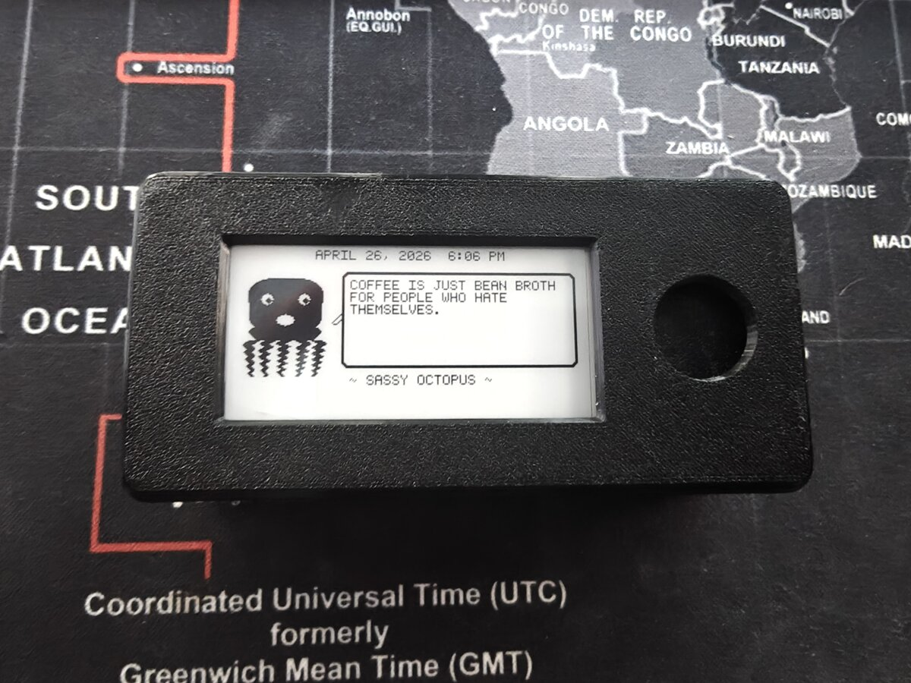
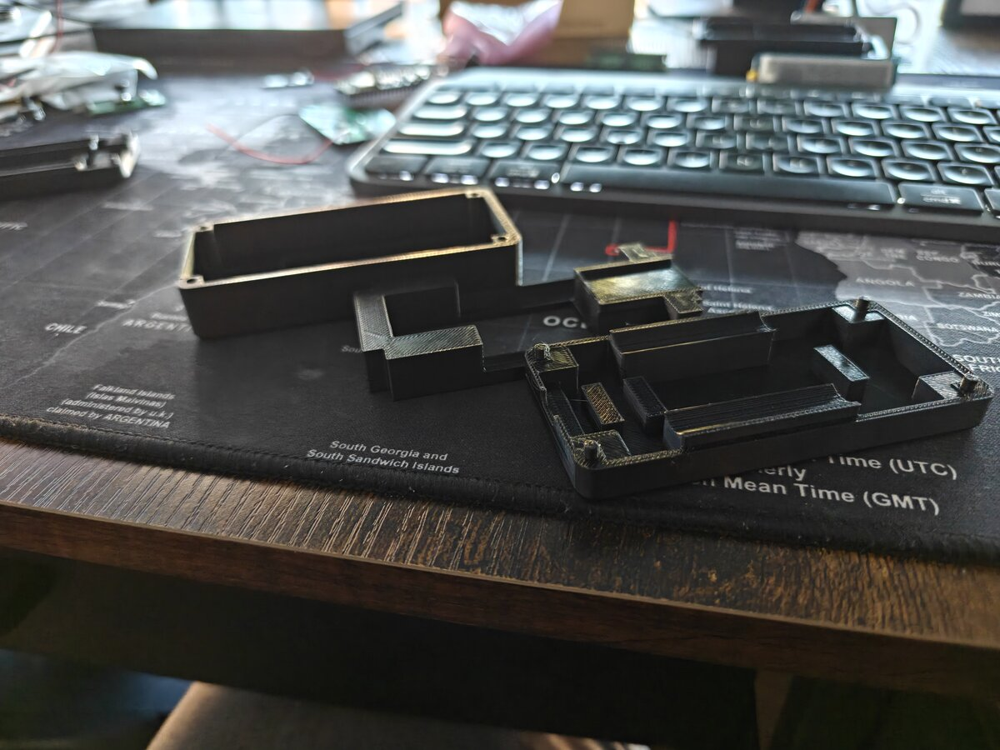
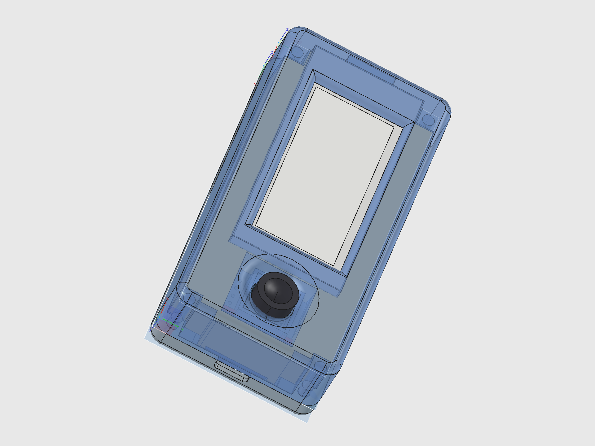
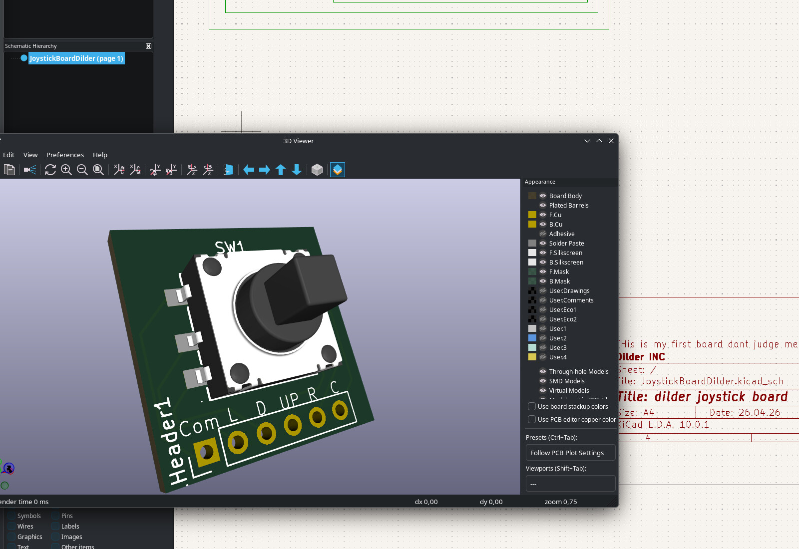

# Dilder

**A real-time build journal for an open-source AI-assisted virtual pet.**

Dilder is a Tamagotchi-style device built on a Raspberry Pi Pico W, a Waveshare 2.13" e-ink display, and a 3D-printed case — developed entirely in the open, one phase at a time.

---

## The Origin Story — How Jamal Was Found

<figure markdown="span">
  { width="420" loading=lazy }
  <figcaption>Jamal. Chair thief. Hat enthusiast. The one who started it all.</figcaption>
</figure>

It started with a trip to TEDi — a German dollar store where the shelves are chaos and the deals are questionable. My wife Emma and I were browsing the bins, not looking for anything in particular, when we spotted him: a massive plush octopus, soft as a cloud, grinning up at us from a pile of discount stuffed animals like he'd been waiting.

We bought him. Obviously.

On the walk home, something happened. We started talking *to* him. Then *about* him — as if he had opinions, preferences, a whole inner life. By the time we got back to the apartment, he had a name: **Jamal**. He had a personality: laid-back but opinionated, a little sassy, suspiciously wise for a creature with no skeleton. He claimed the armchair immediately. He looked... comfortable. *Too* comfortable. Like he'd always lived there and we were the guests.

And then the question asked itself:

> *What if we could actually bring him to life?*

Not literally — we're not mad scientists (yet). But what if we could build a tiny digital version of Jamal? A pocket-sized octopus with moods, opinions, and an attitude problem? Something that lives on a screen, reacts to the world, and roasts you when you forget to feed it?

That's how Dilder was born. Not from a grand engineering vision or a product roadmap — from a plush octopus in a discount bin and two people who couldn't stop giving him a backstory on the walk home.

Jamal still sits in the armchair. He still wears the hat. He watches us build his digital self from across the room, and honestly? He looks unimpressed. Which tracks.

---

## The Current Build

<figure markdown="span">
  { width="420" loading=lazy }
  <figcaption>"COFFEE IS JUST BEAN BROTH FOR PEOPLE WHO HATE THEMSELVES." — Sassy Octopus, running on Pico 2 W</figcaption>
</figure>

<figure markdown="span">
  { width="420" loading=lazy }
  <figcaption>Rev 2 enclosure — 3D-printed case with bullnose top edge, joystick port, and display window inlay</figcaption>
</figure>

<figure markdown="span">
  { width="420" loading=lazy }
  <figcaption>Close-up — 250x122 e-ink display with RTC clock header, animated octopus, and speech bubble</figcaption>
</figure>

<figure markdown="span">
  { width="420" loading=lazy }
  <figcaption>Disassembled — top cover with display inlay, base plate with solar cutout, battery cradle insert</figcaption>
</figure>

---

## Latest Prototype — Sensors, Speaker, and Joystick Anchor

The parametric FreeCAD macro gained three new systems in today's build: a **20 mm piezo speaker** in a circular retaining ring, an **MPU-6500 6-axis accelerometer** in a recessed pocket, and a precision **joystick anchor pad** that replaces the old well/sleeve design. The joystick PCB alignment was fixed (stick now dead-center in the hole), and the cradle pit tightened from 23 mm to 20 mm for a snug board fit.

<figure markdown="span">
  { width="420" loading=lazy }
  <figcaption>Hero shot — full assembly with piezo speaker ring and IMU pocket visible through the translucent cover</figcaption>
</figure>

<figure markdown="span">
  { width="420" loading=lazy }
  <figcaption>Base plate top — piezo disc in circular ring (center), IMU module in rectangular pocket (left)</figcaption>
</figure>

<figure markdown="span">
  { width="420" loading=lazy }
  <figcaption>Isometric — retaining walls for the piezo (22.2 mm OD) and IMU (27.4 x 17.4 mm) between the battery rails</figcaption>
</figure>

<figure markdown="span">
  { width="420" loading=lazy }
  <figcaption>Cover bottom — 14 x 14 mm joystick anchor pad with 12 mm square inner hole, stops at PCB top surface</figcaption>
</figure>

[Read the full build write-up :material-arrow-right:](blog/posts/joystick-anchor-piezo-imu-sensors.md){ .md-button }

---

## Meet the Octopus

A tiny octopus lives on a 250x122 pixel e-ink display. It has **16 emotional states**, each with unique eyes, mouth expressions, body animations, and themed quotes. It's sassy. It's opinionated. It runs on 100KB of firmware and a coin cell's worth of ambition.

Pick a personality, flash it to the board, and you've got a desk companion that judges your life choices in ALL CAPS.

---

## The Hardware

Three supported boards. Same firmware. Under $25 to get started.

| Component | Price | Why |
|-----------|-------|-----|
| Raspberry Pi Pico 2 W | ~$7 | 4MB flash, WiFi + BLE, RP2350 dual Cortex-M33, current default |
| Raspberry Pi Pico W | ~$6 | 2MB flash, WiFi + BLE, RP2040, original dev board |
| Waveshare 2.13" e-Paper V3 | ~$15 | 250x122px, paper-like readability, near-zero standby current |
| 3D-printed enclosure | ~$2 filament | Two-piece snap-fit case, SCAD source files included |

---

## 16 Emotions, One Octopus

Every mood changes the face, the body, and the attitude.

{ width="220" }
{ width="220" }
{ width="220" }

{ width="220" }
{ width="220" }
{ width="220" }

Normal. Angry. Sad. Excited. Lazy (tentacles draped to the right, naturally). Fat (thicc dome, no waist, proud of it). Plus Weird, Unhinged, Chaotic, Hungry, Tired, Slap Happy, Chill, Creepy, Nostalgic, and Homesick.

Each personality has 30-196 themed quotes, a 4-frame mouth animation cycle, and per-mood body movement — breathing bobs, angry trembles, chaotic distortion, lazy lounging.

[See all 16 emotion states :material-arrow-right:](docs/software/emotion-states.md){ .md-button }

---

## The DevTool

A custom Tkinter GUI for designing, previewing, and deploying octopus firmware — without touching a terminal.

<figure markdown="span">
  { width="700" loading=lazy }
  <figcaption>Programs tab — pick a personality, preview it, flash it to the Pico</figcaption>
</figure>

**7 tabs:** Display Emulator (pixel art tools) | Serial Monitor | Flash Firmware | Asset Manager | Programs (17 octopus personalities) | GPIO Pin Reference | Connection Utility

Select a program and you get a live preview, estimated firmware size (~100KB), how much of the Pico's 2MB flash you'll use (~5%), and one-click deploy.

[DevTool docs :material-arrow-right:](docs/tools/devtool.md){ .md-button }

---

## Current Phase

!!! info "Phase 2 — Firmware Foundation (C on Pico W)"
    Phase 1 (hardware + tooling) is complete. The octopus has 16 emotional states, 18 standalone firmware programs, custom body shapes, and runtime math-based rendering — all in ~100KB. GPIO joystick input is now live.

    **Done:** Runtime rendering engine | 16 emotions | Body animations | Custom fat/lazy bodies | 823 quotes | C-faithful preview renderer | DevTool with firmware size estimation | **GPIO joystick input** | On-screen input indicator

    **In Progress:** Custom PCB design — switched from RP2040 to **ESP32-S3-WROOM-1-N16R8** (WiFi+BLE, 16MB flash, 8MB PSRAM). 4-layer board (45x80mm, 27 components) designed in KiCad, ready for interactive routing and JLCPCB fabrication. **Hand-routed joystick breakout PCB** (K1-1506SN-01, 19.6x19.6mm) designed from scratch in KiCad 10 with gerbers and BOM ready for JLCPCB.

    **Next:** Order joystick PCB from JLCPCB | Complete ESP32 PCB routing and order boards | Wire batteries to board | Game loop with state machine

<figure markdown="span">
  { width="500" loading=lazy }
  <figcaption>First PCB from scratch — hand-routed K1-1506SN-01 joystick breakout board in KiCad 10</figcaption>
</figure>

---

## Quick Links

-   :material-book-open-variant: **Docs**

    ---

    Hardware specs, wiring diagrams, setup guides, and code reference.

    [:octicons-arrow-right-24: Browse Docs](docs/index.md)

-   :material-post: **Blog**

    ---

    9 build journal posts — from planning to body animations.

    [:octicons-arrow-right-24: Read the Blog](blog/index.md)

-   :fontawesome-brands-discord: **Discord**

    ---

    Join the community server to ask questions and share your own build.

    [:octicons-arrow-right-24: Join Discord](community/discord.md)

-   :material-tools: **Dev Tools**

    ---

    DevTool GUI, setup CLI, and website dev CLI — built to support the workflow.

    [:octicons-arrow-right-24: Browse Tools](docs/tools/devtool.md)

-   :fontawesome-brands-patreon: **Patreon**

    ---

    Support the project and get early access to content and files.

    [:octicons-arrow-right-24: Support on Patreon](community/support.md)

-   :fontawesome-brands-github: **Source**

    ---

    All firmware, tools, and docs. 104+ AI prompts logged.

    [:octicons-arrow-right-24: GitHub Repo](https://github.com/rompasaurus/dilder)

---

## How This Project Works

The entire development process is public:

- **Every prompt** submitted to the AI assistant is logged in the [Prompt Log](prompts/index.md) — 150 and counting
- **Every hardware decision** is documented in the [Docs](docs/index.md)
- **Every build step** is written up in the [Blog](blog/index.md) — 17 posts so far
- **Every drawing function** is verified pixel-by-pixel between C firmware and Python DevTool
- **All source files** are on [GitHub](https://github.com/rompasaurus/dilder)

This is learn-in-public taken to its logical extreme. No hidden steps, no "just trust me" — if it happened, it's documented.

---

Built with patience, a Pico W, and an unreasonable fondness for a plush octopus named Jamal.

